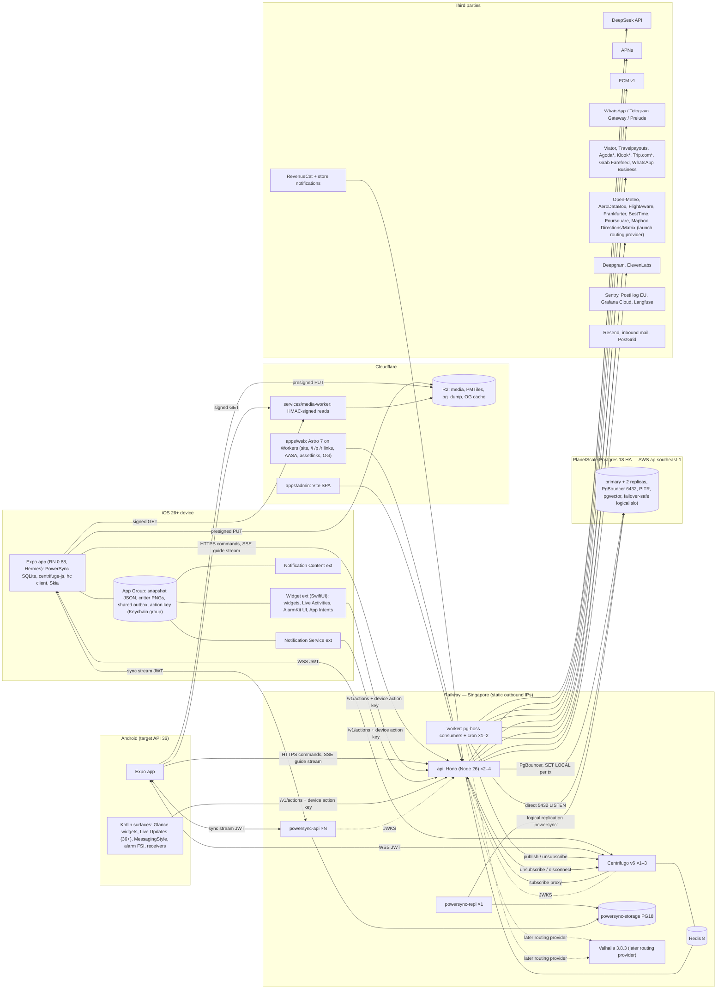
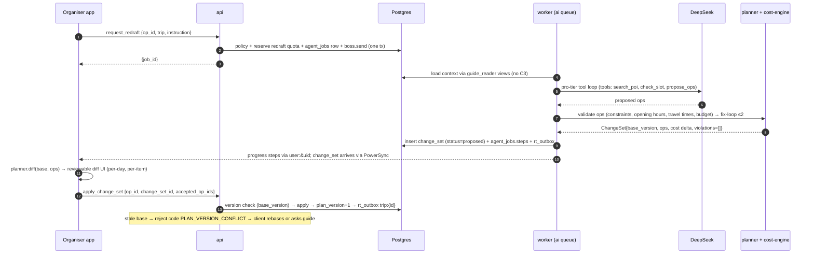
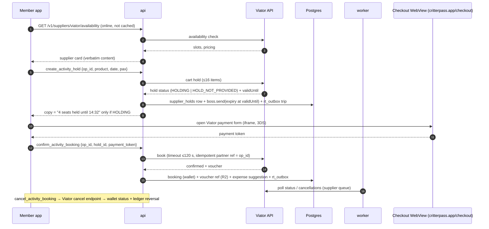

# Critterpass — System Architecture

Status: authoritative for all build phases · Updated 2026-09-26 · Owner: founder
Companion: [code-standards.md](./code-standards.md) (how to write code) · Sources: `plans/reports/researcher-260926-1649-custom-hono-backend-report.md` (backend authority), `plans/reports/researcher-260926-1649-travel-supplier-apis-report.md` (supplier authority), tech-stack brief §1–3, mobile / native / web research + fact-checks, render-engine §5, master synthesis §1/§5/§6/§7/§10.

> Backend is **our own stack** (Hono + PlanetScale Postgres + Better Auth + Centrifugo + self-hosted PowerSync + pg-boss + R2). Any Supabase mechanism named in older reports is translated per §15. Never reintroduce Supabase.

---

## 1. Overview

Critterpass = mobile group-travel planner. A crew votes on a destination, an AI guide (6 live guides + guest, generated on DeepSeek) drafts a trip, members review personalised proposals, then travel together with a local-first trip hub, money ledger, bookings wallet, crew live map, Live Activities and collectible critters (150 locals × 4 forms, 61 places).

| Principle | Consequence |
|---|---|
| Local-first | All crew/trip data is read from on-device SQLite (PowerSync); writes are queued commands that work offline |
| One write path | Every mutation = idempotent command (`op_id` UUIDv7) through one handler registry, whichever door it enters (app HTTP, sync upload, extension action, worker) |
| DB is truth, realtime is a nudge | Durable state lives in Postgres and syncs via PowerSync; Centrifugo carries ephemeral traffic + change hints |
| Defence in depth | App-layer policy in handlers **and** RLS backstop per transaction; private (C3) data never leaves Postgres except to its owner |
| Guide proposes, code decides | LLM never writes; it emits proposals/ChangeSets that deterministic code validates; all numbers/times/prices come from code |
| Truthful copy | UI claims only what a supplier/platform actually did (no fake holds, no fake drivers) |
| Never merchant of record | Stays = affiliate links; activities = Viator Full + Booking (Viator is MoR); flights = estimates only |
| Full scope, agent-built | Every designed feature ships at launch; work is split into single-session agent tasks |

---

## 2. Runtime topology


`*` = adapter built behind a server flag; switches on when the partner approves.

| Service | Runs | Scale (1k → 100k MAU) | Public host |
|---|---|---|---|
| api | `services/api`, Hono on Node 26 | 2 → 4 replicas, stateless | `api.critterpass.app` |
| worker | `services/worker`, same toolchain | 1 → 2, pg-boss singleton-safe | – |
| realtime | Centrifugo v6 OSS | 1 → 3 | `rt.critterpass.app` (WSS) |
| redis | Redis 8 (→ Sentinel HA) | 1 → 3 | – |
| powersync-repl | PowerSync Service `-r sync` | exactly 1 | – |
| powersync-api | PowerSync Service `-r api` | 1 → 25–50 (≤200 conns each, target ≤100) | `sync.critterpass.app` |
| powersync-storage | Railway Postgres 18 (rebuildable) | 1 | – |
| valhalla (later) | Valhalla 3.8.3 + OSM tiles volume; replaces Mapbox behind the routing provider when adopted. Launch routing is Mapbox Directions/Matrix from api | 1 → 2 | – |
| media-worker | Cloudflare Worker | edge | `media.critterpass.app` |
| web | Astro 7 on Workers | edge | `critterpass.app`, `go.critterpass.app` |
| admin | Vite SPA on Cloudflare | edge | `admin.critterpass.app` (Better Auth admin role) |

Migrations run in the api **pre-deploy command** (private network; failure blocks deploy).

---

## 3. Repo layout & allowed import directions

| Path | Responsibility | May import |
|---|---|---|
| `apps/mobile/src/app/` | expo-router file routes, one folder per area; thin screens | features, ui, motion, data, lib, domain, i18n |
| `apps/mobile/src/features/<area>/` | area screens' logic, hooks, components (areas: onboarding, crew, home, vote, explore, setup, plan, proposal, guide, bookings, money, trip, safety, critters, recap, album, you, community, help, monetize) | ui, motion, data, lib, domain, cost-engine, planner, entitlements, critter-art, design-tokens, i18n. **Not another feature's internals** (only its `index.ts` public API) |
| `apps/mobile/src/ui/` | component library (tokens-based, a11y) | motion, design-tokens, critter-art, lib, i18n |
| `apps/mobile/src/motion/` | motion runtime, feedback bus (haptics + sound + animation), gesture kit | design-tokens, lib |
| `apps/mobile/src/data/` | PowerSync client + schema, command client (hc), Centrifugo client, query hooks, shared money formatter, entitlements/quota gating | domain, cost-engine, entitlements, lib |
| `apps/mobile/src/lib/` | pure helpers (dates, formatting, logging) | domain |
| `apps/mobile/modules/cp-*/` | Expo native modules (Swift + Kotlin) | platform SDKs only |
| `apps/mobile/targets/<name>/` | SwiftUI extensions; shared Swift in `targets/_shared/` | `_shared`, generated tokens Swift, OpenAPI Swift client |
| `apps/web/` | Astro site, link routes, OG, AASA/assetlinks | domain, design-tokens, critter-art, i18n, content |
| `apps/admin/` | back-office SPA | domain, design-tokens, i18n (via api only — never DB) |
| `services/api/` | Hono app: Better Auth, `/v1/cmd/*`, `/sync/upload`, `/v1/actions`, AI SSE, webhooks, link resolver, Centrifugo proxy | domain, db, cost-engine, planner, entitlements, ai, suppliers, content, i18n |
| `services/worker/` | pg-boss consumers + cron, push router, rt_outbox relay, AI jobs, parsers, recap, content jobs, supplier polling | same as api (shares command registry via `packages/*`, **never imports `services/api`**) |
| `services/media-worker/` | HMAC verify → R2 read | nothing internal except a tiny HMAC helper in `packages/domain` |
| `packages/domain` | types, zod schemas, command/event contracts, UUIDv7, error codes, privacy classes | zod only (leaf) |
| `packages/db` | Drizzle schema, SQL migrations, roles/RLS SQL, PowerSync publication + sync streams SQL, seed, Testcontainers helpers, `withUser`/`withSystem` | domain |
| `packages/design-tokens` | DTCG source → TS/Swift/Kotlin/CSS, motion tokens | – (leaf) |
| `packages/critter-art` | renderer core (display list) + canvas2d/skia backends + critter data & forms | design-tokens, for guide accents only (`src/guides`, the `@cp/critter-art/guides` entry: guide slug, dex facts and accent, no renderer code). The renderer imports none: tier colours live in `src/forms/tier-palette.ts` and a mobile-side test asserts equality with design-tokens |
| `packages/critter-bake` | Node bake CLI → xcassets, drawables, webp, OG atlas | critter-art, design-tokens |
| `packages/cost-engine` | quotes, splits, FX, budgets (pure) | domain |
| `packages/planner` | scheduler, constraint checker, ChangeSet ops + diff (pure) | domain, cost-engine |
| `packages/entitlements` | entitlement rules, quotas, fair-use caps (pure, shared) | domain |
| `packages/ai` | prompts, persona loader, tool schemas, model routing, eval suites | domain, planner, cost-engine, content, critter-art (`@cp/critter-art/guides` only, for guide facts) (server-only) |
| `packages/suppliers` | server-only adapters (Travelpayouts, Viator, Agoda, Klook, Trip.com, Grab, WhatsApp Business) | domain |
| `packages/i18n` | Lingui catalogs per area + `.xcstrings`/`strings.xml` generators | – |
| `packages/content` | generated content (JSON/MDX) + zod schemas | domain |
| `infra/` | railway, centrifugo, powersync (config + sync streams), cloudflare, monitoring, docker-compose | – |
| `tools/` | content-factory, design-renders, scripts | any package |
| `e2e/` | Maestro flows per area | – |

**Direction rule:** `apps/* → services contracts (HTTP only) → packages/*`; packages never import apps/services; pure packages (`cost-engine`, `planner`, `entitlements`, `critter-art`, `domain`) have no I/O. `packages/db`, `packages/ai`, `packages/suppliers` are **server-only** (lint-blocked in `apps/mobile`, `apps/web`, `apps/admin`). Enforced with `eslint-plugin-boundaries` + Turborepo `dependsOn`.

---

## 4. Core patterns

### 4.1 Commands (the only write path)

| Element | Rule |
|---|---|
| Shape | `POST /v1/cmd/{name}` body `{op_id, ...input}`; `op_id` = client UUIDv7; contract in `packages/domain/commands/<name>.ts` (zod input, result, error codes, event list) |
| Doors | `/v1/cmd/*` (app online), `/sync/upload` (PowerSync queue batch), `/v1/actions` (extensions, device action key, narrow command allow-list), worker `dispatchSystem()` — **one registry** |
| Pipeline | zod parse → auth context → **policy** (`can(actor, cmd, resource)`) → `withUser(uid)` tx → idempotency check (`cmd_log` PK `op_id`; replay returns stored result) → domain logic (pure packages) → writes → `domain_events` + `rt_outbox` + pg-boss `send()` **in the same tx** → commit → result |
| Validation reject | app door: 4xx with `{code, message_key, details}`; sync door: **2xx** + `cmd_results` row (synced to owner) so the queue never blocks; 5xx only for transient errors |
| Domain events | `domain_events` (columns: data-model §3.18); consumers are pg-boss jobs (push, recap, quests, analytics) |
| Hot invariants | may be SQL functions called from handlers (e.g. redraft reservation, seat cap) — still invoked through a command |
| Idempotency TTL | `cmd_log` kept 30 d, then purged by cron |

### 4.2 Reads

| Data | Path |
|---|---|
| Crew/trip/user data (non-C3) | PowerSync **Sync Streams** (`infra/powersync/streams/*.yaml`, parameterised by `auth.user_id()` and membership) → local SQLite → `useQuery` live queries (Drizzle driver) |
| Own C3 data (budget max, dietary, payout, private guide threads) | Not in publication. Fetched via `GET /v1/me/private/{kind}` (owner only) into the PowerSync local-only `local_private` table (SQLCipher DB; data-model-sync §1) |
| Online-only data (supplier cards, fares search, place live checks, AI stream) | Typed `hc` client via TanStack Query (no persistence for supplier content) |
| Aggregates across privacy boundary | SECURITY DEFINER functions (e.g. budget band, k ≥ 4) exposed via command/query endpoints |

### 4.3 Realtime (Centrifugo)

Canonical namespace catalogue (ACL, payloads, history, presence, owning phase): **api-contracts-async.md §1.2**. Summary:

| Group | Namespaces | Client publish |
|---|---|---|
| User | `user:#{uid}` (inbox, job progress, entitlement/usage change, `cmd.result`, session revoked) | no |
| Crew | `crew:{crew_id}`, `crew_chat:{crew_id}`, `crew_money:{crew_id}`, `crew_bookings:{crew_id}`, `crew_collection:{crew_id}` | typing on `crew_chat` only (publish proxy, ≤1/3 s) |
| Trip | `trip:{trip_id}`, `trip_setup:`, `trip_draft:`, `trip_plan:`, `trip_dayof:`, `trip_watch:`, `trip_quests:`, `trip_album:`, `trip_copresence:` | no |
| Trip ephemeral | `trip_presence:{trip_id}` (cursors ≤5 Hz, here, typing) | yes (publish proxy) |
| Location | `trip_locations:{trip_id}` (fixes, ETAs, meet-up; share window or Help/SOS session only) | **no** (server only, from `POST /v1/loc`) |
| Objects | `poll:`, `swipe:{session_id}`, `proposal:`, `guide_thread:`, `disruption:`, `sos:`, `recap:`, `memory:` | `swipe` presence ping only |

- Connection JWT: Better Auth `jwt` plugin, EdDSA, 15 min, fetched from `/api/auth/token` with `aud: rt` (PowerSync uses `aud: sync`); Centrifugo verifies via JWKS.
- **Subscribe proxy** → `POST /internal/rt/subscribe` in api (private network) runs the same policy functions.
- **Revocation:** membership-change command writes `rt_outbox(kind='unsubscribe'|'disconnect')` in the same tx; worker `rt.relay` calls the server API; short token `exp` bounds any miss.
- **rt_outbox:** rows written in the command tx; worker queue `rt.relay` (`LISTEN` wake + 1 s sweep) publishes with idempotency key `outbox.id`, marks sent. Server never publishes before commit; only client presence/typing uses the publish proxy.
- Payloads are **hints** (ids, counts, small deltas); durable state arrives via PowerSync. Clients recover history on reconnect.

### 4.4 Jobs (pg-boss)

Queues are named `<domain>.<action>`; full catalogue (triggers, retries, singleton keys, owning phase): **api-contracts-async.md §2**.

| Domain prefix | Examples |
|---|---|
| `rt.` / `notify.` / `push.` / `inbox.` | `rt.relay`, `notify.route`, `push.send`, `push.la`, `push.widget`, `inbox.fanout` |
| `ai.` | `ai.draft`, `ai.redraft`, `ai.proposal_versions`, `ai.receipt`, `ai.disruption`, `ai.curate_album` |
| `eta.` | `eta.meetups`, `eta.running_late` (60 s self-rescheduling loops) |
| `supplier.` / `flight.` / `fares.` / `vendor.` | `supplier.hold_expiry`, `flight.event`, `fares.refresh`, `vendor.reply_parse` |
| `maint.` / `ops.` | `maint.purge`, `maint.anon_gc`, `maint.tokens`, `account.purge`, `export.build`, `ops.backup` |
| `content.` / `og.` | `content.publish`, `og.render` |

- `scheduled_events.due_at` computed from local time + tz; cron `* * * * *` → `enqueue_due`.
- Enqueue in the command tx (pg-boss Drizzle adapter) → exactly-once handoff; handlers idempotent by job key.
- Retries: default `retryLimit 3` exponential (per-queue overrides in async doc §2.2, max 5); DLQ `<queue>.dlq` with admin redrive; singleton keys for per-object jobs.
- AI job progress: `agent_jobs.steps` updated per step + `job.progress` published to `user:#uid` / `trip_draft:{id}`.

### 4.5 Push routing

| Stage | Rule |
|---|---|
| Ping ledger | Every notification (remote or LOCAL) recorded in `ping_ledger(user, class, key, collapse_id, sent_at, suppressed_reason)` |
| Classes | ALWAYS (bypass budget & quiet hours), BUDGET (user budget default 10/day, 1–10; crew chat is not counted: product-decisions Q-85a), ROUNDUP (evening roundup, default 20:00 local, ≤5 items), SILENT (data/LA/widget), LOCAL (device-scheduled, mirrored) |
| Router | domain event → `push.route` job → resolve audience → per-user class/budget/quiet-hours/paywall-governor (≤1/day) → collapse → channel (APNs alert / liveactivity / broadcast / widgets; FCM v1) |
| Localisation | Push text rendered server-side from Lingui catalogs in user locale |
| Rich | NSE attaches guide avatar (communication notification) from App Group; NCE renders poster + actions |
| Failure | invalid tokens pruned; LA budget: priority 5 routine, 10 for arrival/late/SOS |

### 4.6 AI

| Layer | Design |
|---|---|
| Gateway | `packages/ai` + api/worker: one provider seam (`src/client.ts`) calling DeepSeek through its Anthropic-format Messages API (`https://api.deepseek.com/anthropic`, key in `ANTHROPIC_API_KEY`); explicit model ids: fast tier `deepseek-flash` (chat, voice, quests, parsing, receipts, menus, photos: the vision model) · pro tier `deepseek-v4-pro` (planning: day drafts, redrafts, proposals, disruption plan B, recap, content libraries, guest guide, itinerary skeleton). Nothing depends on Claude-only features: structured replies are a schema instruction plus one repair and caller validation, refusals are a decline marker mapped to `AI_REFUSED`, bulk jobs are direct calls with bounded concurrency (no batch API), web search is our own tool. A second provider (Gemini) would plug in at the same seam |
| Web search | `web_search` tool in `packages/ai/src/tools/web-search.ts` behind a `SearchProvider` (`src/search/`, Tavily first, Brave next): query screened for contact details, codes and crew names; supplier/OTA/map blocklist sent as `exclude_domains` and every URL screened again across country domains; results reach the model as untrusted data with URL, title and fetch time; answers carry their source links; web numbers are cite-only (never plan changes, costs or structured output) |
| Decisions | `packages/ai/src/decide/` beside the generation client: typed Choice/Noul/Score questions to TypeSafe `jev-1.13.0` (pinned origin and model, 800 ms, fast-tier twin fallback of the same answer shape); routes marked `provider: 'jev'` in the routing table; never generation ([decision](decisions/20260927-jev-decision-model.md)) |
| Personas | persona files in `packages/content` (voice, lexicon, colour per C5), loaded by `packages/ai/persona` |
| Context | read via `guide_reader` role views only (no C3, no supplier content); curated POI DB + planner outputs |
| Tools | allow-listed tool schemas; read tools query deterministic services; **write tools produce proposals** (`ChangeSet`, `GuideAction` draft) validated by `planner`/`cost-engine`; user or crew approval then a normal command applies it |
| Streaming | chat: SSE from api (`/v1/guide/stream`); long jobs: pg-boss with step progress on Centrifugo |
| Metering | quota reserved in the command tx (`entitlements`), released on failure; free = 30 questions/day, reset 00:00 device tz; silent fair-use cap on unlimited tiers |
| Evals & traces | promptfoo suites per prompt in `packages/ai/evals` (CI gate on change); Langfuse traces with PII-redacted payloads |
| Voice | on-device SpeechAnalyzer / Android SpeechRecognizer (Deepgram fallback) → fast tier → ElevenLabs Flash (one owned voice per guide) |
| Vision | on-device OCR boxes (cp-ocr) → fast-tier structured output keyed by OCR line id → deterministic amount parsing |

### 4.7 Critter art pipeline

```
packages/critter-art (TS core: build(spec) → Model; frame(model,p) → Cmd[])
   ├─ skia backend  → apps/mobile runtime (hero draw-on ≤2 concurrent; cached SkImage per spec×bucket; LRU 25 MB mem / 60 MB disk)
   │                  └─ on-device snapshot → App Group PNGs (widgets, LA, NSE, share cards)
   ├─ canvas2d backend → apps/web (IO-lazy draw-on) + OG atlas
   └─ packages/critter-bake (Node @napi-rs/canvas) → xcassets (targets + app icons), Android drawables/adaptive icons, web webp, OG atlas
CI golden: Chromium render of untouched design scripts vs core output (mean abs <0.5/255; >8/255 px <1%)
```
Tier A bundled (~6–10 MB): 6 guides × 4 forms × {idle,cheer,sleep} × {48,96 pt} color+mask, 150 silhouettes, notification avatars, app icon sets.

### 4.8 Extension architecture (iOS; Android mirrors in Kotlin)

| Concern | Design |
|---|---|
| Shared state | App Group container: `snapshot.json` (per widget kind, versioned schema from `packages/domain`), critter PNGs, pending shared outbox (SQLite/JSON) |
| Writes from extensions | App Intent / LiveActivityIntent → append to **shared outbox** (op_id UUIDv7) → `POST /v1/actions` with **device action key**; on failure the app drains the shared outbox into the normal command client |
| Device action key | Per-device, scoped (scopes: `ballot`, `readiness`, `trip_day`, `sos`, `money_nudge`, … — api-contracts-async §5), revocable, stored in shared Keychain group; server row `device_action_keys` (data-model §3); HMAC-signed requests + timestamp |
| Live Activities | start local or push-to-start; crew-wide updates via **APNs broadcast channels** (one per trip leave-by / meet-up / vote); content-state ≤4 KB, ETA only, never coordinates; 8 h cap → end & restart at landing |
| Widgets | app writes snapshot + `WidgetCenter.reloadTimelines`; server sends **WidgetKit push** (iOS 26) for crew changes; budget ~40–70/day |
| Alarm | AlarmKit (system UI) scheduled from app via `cp-alarm`; re-synced by silent push on plan change |
| Notifications | NSE: communication notification (INSendMessageIntent + guide avatar); NCE: animated poster + actions |
| Android | Glance widgets (`actionRunCallback` → WorkManager → action key), Live Updates ProgressStyle (API 36+), MetricStyle (37+), `setAlarmClock` + FSI, MessagingStyle + Person |
| Contracts | extensions call `/v1/actions` via Swift/Kotlin clients generated from `/openapi.json` (≤ ~10 endpoints; hand-written wrappers allowed) |

### 4.9 Supplier layer

| Category | Mechanism | Merchant | Wallet entry |
|---|---|---|---|
| Stays | Affiliate deep links (Agoda Asia; Trip.com / Booking.com via CJ) through Travelpayouts; click-out via `/r/{id}` with sub-id | supplier | forward/paste confirmation → parser → booking with **real cancellation deadline** |
| Activities | **Viator Full + Booking**: availability → cart hold (≤16 items) → Viator payment form (iframe on `critterpass.app/checkout` in a WebView, 3DS) → book → voucher; cancel endpoint | Viator | voucher + status polled |
| Activities (links) | Klook (Bali/Kyoto/Vietnam), GetYourGuide fallback | supplier | forward/paste |
| Flagged adapters | Agoda Demand (Fulfill Assisted), Klook Activity API, Trip.com Attractions & Tours — built behind `supplier_flags`; copy switches with the flag | supplier | adapter-specific |
| Transfers | pre-trip affiliate links (Klook, Trip.com, Kiwitaxi, GetTransfer); in-trip Grab Farefeed fare + ETA + deep link, Gojek deep link fallback | supplier | manual expense |
| Flights | Travelpayouts fare calendars (estimates); AeroDataBox + FlightAware alerts; no booking | – | forward/paste |
| Vendor messages | WhatsApp Business only after user approves draft (ops desk in admin) | – | – |
| Place details | Foursquare Places API: one live Place Details call per place-detail open (`GET /v1/places/{id}/live`), passed through with "Powered by Foursquare" and never stored; curated POIs get their Foursquare id from `places.fsq_match`; one monthly call cap shared by api and worker (D24) | – | – |
| Social link readers | Add from a link (`POST /v1/trips/{id}/imports`, `packages/suppliers/src/social`): TikTok oEmbed (caption, author, thumbnail); YouTube oEmbed plus Data API `videos.list` (title, description) with `YOUTUBE_API_KEY`; Instagram oEmbed only with an app token, else the app asks for a screenshot; Google Maps full URLs parsed with no request, short links resolved by one request reading only the `Location` header (no Google API, D6); Apple Maps `q`/`ll` parsed. Screenshots are read on the phone (`cp-ocr`) and only their text is sent. The model reads post text as untrusted input (`links.extract_places`); matching to POIs is code. Nothing from a post is stored but the URL on the idea; platforms switch with `imports.platforms` | – | – |

Rules: supplier content (titles, photos, reviews, prices) rendered **verbatim only inside supplier cards**, never cached beyond the request/TTL the supplier allows, never stored in `guide_reader` views, never sent to the LLM. Foursquare Places API content (hours, rating, price, photos, tips, contact) is supplier content under this rule: its Pay as You Go terms allow no caching of any attribute but the place id and photo ids, so it is served live per request (`no-store`), kept out of `pois`, `poi_live_checks`, `guide_reader` views, the LLM and the app's persisted caches (D24). The guide reasons over our curated POI DB and links a supplier card by `poi_id ↔ supplier_product_ref`. Ranking is commission-neutral; affiliate disclosure on every card. Hold copy only when the supplier returns a hold (`HOLDING`); otherwise "free cancellation until {date}" / "book here".

---

## 5. Authorisation model

| Layer | Mechanism |
|---|---|
| Identity | Better Auth session (30 d sliding) for api; 15 min EdDSA JWT for PowerSync + Centrifugo; device action keys for extensions; admin role for back-office |
| App policy | `services/api/src/policy/*` — `can(actor, action, resource)` per command; business rules (roles organiser/member/guest, seat cap, entitlements, state machine) |
| RLS backstop | Every user-data table `ENABLE` + `FORCE ROW LEVEL SECURITY`; `withUser(uid)` = `BEGIN; SET LOCAL ROLE app_user; SELECT set_config('app.uid',$1,true)`; helpers `app.is_crew_member()`, `app.is_trip_participant()`, `app.can_see_location()` (STABLE SECURITY DEFINER) |
| Privacy classes | C0 public · C1 crew-visible · C2 trip-participant · C3 owner-only (budget max, dietary, payout, private guide threads, location fixes, calendar days, user_private) · C4 system/secret · C5 derived aggregates |
| C3 guarantees | owner-only RLS; excluded from `powersync` publication; no grant to `guide_reader`; aggregates only via SECURITY DEFINER with k-anonymity; field encryption (AES-GCM) for payout, postal address, phone (hash for lookup) |

| DB role | Used by | Grants |
|---|---|---|
| `app_owner` | migrations | DDL |
| `app_user` | api request tx | RLS forced, no BYPASSRLS, DML on user tables |
| `app_system` | worker system jobs | explicit grants; cross-user writes via SECURITY DEFINER only |
| `guide_reader` | AI context reads | SELECT on `guide_*` views (non-C3, no supplier content) |
| `powersync_repl` | PowerSync | REPLICATION + SELECT on published tables |
| `auth` | Better Auth | owns `auth` schema |

Permission contract suite (Vitest + Testcontainers, PR-blocking): fixture actors (outsider, ex-member, member, organiser, guest) × every command × RLS × sync stream × Centrifugo proxy decision × guide_reader view.

---

## 6. Environments & secrets

| Env | Where | Data | Notes |
|---|---|---|---|
| local | `infra/docker-compose.yml`: Postgres 18 (wal_level=logical, pgvector, PostGIS), Redis 8, Centrifugo, PowerSync; routing calls Mapbox when `MAPBOX_TOKEN` is set, otherwise returns flagged straight-line estimates; media uses a real R2 dev bucket | seed from `packages/db/seed` | api/worker via `pnpm dev`; app via dev client |
| preview | Railway PR environment (optional per PR touching services) + PlanetScale branch | seed | EAS Update channel `preview` |
| staging | Railway `staging` + PlanetScale staging branch | seed + anonymised fixtures | EAS channel `staging`, TestFlight / Play internal |
| prod | Railway `production` + PlanetScale production (HA) | real | EAS channel `production` |

| Secret | Store | Rotation |
|---|---|---|
| DB URLs, Redis, Centrifugo API key, HMAC keys, Better Auth secret, JWT keys | Railway variables (reference vars) | quarterly (JWT via `rotationInterval`) |
| APNs .p8, FCM service account, RevenueCat, Anthropic, supplier keys, Telegram Gateway/Prelude, WhatsApp | Railway variables | quarterly / on staff change |
| Cloudflare (R2, Workers) | Wrangler secrets + GitHub Actions secrets | quarterly |
| EAS / store credentials | EAS secrets | yearly |
| Firebase `google-services.json` (Android FCM) | EAS file variable `GOOGLE_SERVICES_JSON` (development, preview, production); local git-ignored copy at `apps/mobile/google-services.json` | on Firebase app change |
| Field-encryption key | Railway variable (key id versioned) | yearly |

Only `.env.example` files are committed. `pnpm env:check` validates required vars at boot (zod).

**Native fingerprint and the Firebase file.** The runtime version is the native fingerprint, which hashes the `android.googleServicesFile` contents. On EAS, `app.config.ts` points at the `GOOGLE_SERVICES_JSON` file; on a Mac, where eas-cli does not download file variables, it falls back to `apps/mobile/google-services.json`. Before running `eas build` (which computes the runtime version locally at upload) or `eas update` from a checkout, copy the file there: `cp certs/google-services.json apps/mobile/google-services.json`. Without the copy, Android builds fail at "Configure expo-updates" with a runtime version mismatch, and Android updates are published under a runtime version no build has. The ignore rule sits in the root `.gitignore`, because `apps/mobile/.gitignore` is itself a fingerprint input.

---

## 7. Sequence diagrams

### 7.a Crew live map + group Live Activity + "I'M UP" from lock screen

```mermaid
sequenceDiagram
  autonumber
  participant M as Member app (sharing)
  participant API as api
  participant PG as Postgres
  participant WK as worker
  participant RT as Centrifugo
  participant C as Crew apps (map)
  participant APNs
  participant LA as Crew Live Activities
  participant WX as Widget ext (locked phone)
  M->>API: POST /v1/loc {share_id, fixes[]} (own share open; ≤ 1 / 5 s, SOS exempt)
  API->>PG: withUser: insert location_fixes (C3, TTL 15 min; mock flags stored)
  API->>RT: publish trip_locations:{trip} directly (latency path, not the outbox)
  RT-->>C: fix → map marker animates
  loop every 60 s (eta queue)
    WK->>PG: read latest fixes + meet-up (app_system)
    WK->>WK: ETA via routing provider (Mapbox Directions/Matrix, driving-traffic at launch)
    WK->>APNs: broadcast channel update (content-state: ETAs, ready pips; p5, p10 on late/arrive)
    APNs-->>LA: update all subscribed crew LAs
  end
  WX->>WX: LiveActivityIntent "I'M UP" (after Face ID unlock) → append shared outbox
  WX->>API: POST /v1/actions set_readiness {op_id, up} + device action key (HMAC)
  API->>PG: same handler: readiness row + rt_outbox + domain_event
  WK->>RT: publish trip_dayof:{trip} readiness
  WK->>APNs: broadcast update (pip turns ready)
  APNs-->>LA: crew LAs show "Rin is up"
  Note over WX,API: offline → outbox entry stays; app drains it on next launch with same op_id
```

### 7.b Guide redraft → reviewable diff



### 7.c Offline outbox + reconciliation

```mermaid
sequenceDiagram
  autonumber
  participant UI as App UI
  participant L as Local SQLite (PowerSync)
  participant Q as Upload queue
  participant API as api /sync/upload
  participant PG as Postgres
  participant PS as PowerSync service
  UI->>L: add_expense → insert cmd_add_expense {op_id, payload} + optimistic local row
  L-->>UI: live query shows pending (clock badge)
  Note over Q: offline — queue persists across app restarts
  Q->>API: reconnect → uploadData batch [ops…] (JWT)
  loop each op in order
    API->>PG: withUser: cmd_log(op_id)? replay stored : run handler
    alt valid
      PG-->>API: committed (+ events, rt_outbox)
    else rejected (e.g. poll closed)
      API->>PG: insert cmd_results {op_id, code, message_key}
    end
  end
  API-->>Q: 2xx (5xx only transient → retry with backoff)
  PG-->>PS: WAL via logical slot
  PS-->>L: checkpoint: authoritative rows + cmd_results
  L-->>UI: pending cleared; rejects shown as "didn't go through" list with fix actions
```

### 7.d Trip Boost purchase → crew entitlement → IOUs

```mermaid
sequenceDiagram
  autonumber
  participant B as Buyer app
  participant RC as RevenueCat / StoreKit / Play
  participant API as api
  participant PG as Postgres
  participant WK as worker
  participant CR as Crew apps
  B->>API: begin_boost {op_id, trip} → intent lock (15 min, "someone is boosting")
  B->>RC: purchase consumable trip_boost (appAccountToken = uid, trip ref)
  RC-->>B: transaction
  B->>API: confirm_purchase {op_id, transaction_id}
  RC->>API: webhook (signed) — whichever arrives first wins; both idempotent on transaction_id
  API->>RC: verify transaction (REST)
  API->>PG: entitlement service: trip_boost grant (crew scope) + purchase row + release lock
  API->>PG: ledger: IOU entries per member (split rule from buyer; never gates perks) + domain_event
  API->>PG: rt_outbox crew:{id} + boss.send push N-34
  PG-->>CR: PowerSync: entitlement + IOUs sync
  WK-->>CR: push "Maya boosted the trip"
  Note over PG: perks read entitlement only; IOU settlement is plain money ledger
```

### 7.e Viator activity hold → booking → wallet



---

## 8. Pinned versions

| Layer | Package / service | Pin |
|---|---|---|
| Runtime (server) | Node.js | 26 LTS (CI matrix 24 + 26 until 26 LTS on 2026-10-28) |
| Language | TypeScript (strict) | 7.0.x (native compiler); RN/Metro toolchain uses the version Expo SDK 58 supports |
| Monorepo | pnpm / Turborepo | 10.x / 2.11 |
| Mobile | expo / react-native / react | 58.x / 0.88 / 19.3 |
| | expo-router | ~58.0 |
| | react-native-reanimated / worklets | 4.7 / 0.13 |
| | react-native-gesture-handler | 3.x |
| | @shopify/react-native-skia | 2.13 |
| | react-native-vision-camera | 5.x |
| | @maplibre/maplibre-react-native | 11.x |
| | @powersync/react-native (+ drizzle driver) | 2.3.x |
| | centrifuge (JS) | 5.7.x |
| | react-native-mmkv | 4.3 |
| | @shopify/flash-list | 2.0.x |
| | react-native-purchases | 10.10 |
| | zustand / @tanstack/react-query | 5.x / 5.x |
| | @sentry/react-native / posthog-react-native | 8.28 / 4.78 |
| | @lingui/core | 6.8 |
| Apple | Xcode / iOS min | 27 / 26.0 |
| Android | targetSdk / compileSdk / Glance | 36 / 36 (37 for MetricStyle gate) / 1.2 |
| API | hono / @hono/node-server | 4.13 / 2.1 |
| | @hono/zod-openapi / zod | 1.6 / 4.x |
| | better-auth / @better-auth/expo | 1.7.x |
| DB | PostgreSQL / pgvector / PostGIS | 18 / 0.8.x / 3.6.x |
| | drizzle-orm / drizzle-kit / pg | 0.45 / 0.31 / 8.23 |
| Jobs | pg-boss | 12.x |
| Realtime | Centrifugo / Redis | v6.9 / 8.x |
| Sync | PowerSync Service (Open Edition) | 1.26.x |
| Push | @parse/node-apn / firebase-admin | 8.1 / 14.x |
| AI | @anthropic-ai/sdk | latest minor at bootstrap, pinned |
| Media | @aws-sdk/client-s3 + presigner / sharp | 3.x / 0.35 |
| Routing | Mapbox Directions v5 / Matrix v1 at launch; Valhalla later | Valhalla 3.8.3 |
| Web | Astro / Takumi / @astrojs/mdx | 7 / 2.14 / 8 |
| Tests | Vitest / Jest / RNTL / Maestro / Playwright / Testcontainers | 5 / 30 / 14 / 2.10 / 1.63 / 12 |
| Obs | @sentry/node / @opentelemetry/sdk-node | 10.x / 0.222 |

Exact patch versions live in `pnpm-lock.yaml`; bumps go through Renovate weekly grouped PRs.

---

## 9. Performance budgets

| Metric | Budget |
|---|---|
| Cold start (mid Android, release) | ≤1.2 s to first interactive; iOS ≤0.8 s |
| iOS download size before content | ≤40 MB |
| Frame rate | 120 fps iOS ProMotion interactions; ≥55 fps mid Android; ≤2 concurrent critter draw-ons; ≤30 animated views/screen low-tier |
| Local query | live query p95 ≤16 ms for any screen's primary list |
| Command RTT (online) | p95 ≤300 ms api (excl. LLM/supplier) |
| Chat round-trip (sender → other member) | p95 <1 s |
| Realtime revocation | removal → unsubscribe <1 s |
| Guide first token | p95 ≤1.5 s (fast tier), ≤3 s (pro tier) |
| Draft job | visible step progress every ≤5 s; skeleton + days ≤90 s p95 |
| API → DB | p50 <3 ms (S-DB gate) |
| Widget ext memory | <20 MB peak (limit ~30 MB) |
| Background location | <3 %/h battery during an active encounter |
| Web | LCP ≤2.0 s on 4G; JS ≤100 KB on invite landing |

---

## 10. Observability & operations

| Area | Setup |
|---|---|
| SLO | 99.5 % monthly availability (api, sync, realtime), best effort |
| Errors | Sentry (app, api, worker, web, extensions via Sentry Cocoa/Android) |
| Traces/metrics/logs | OpenTelemetry → Grafana Cloud; Railway OTLP; PowerSync Prometheus; `pg_stat_statements` |
| Product analytics | PostHog EU (events from `packages/domain/analytics` catalog; flags; experiments) |
| LLM | Langfuse traces (redacted), cost per crew-trip dashboard |
| Uptime | external monitor on `/health`, `sync.../probes/liveness`, Centrifugo health, web |
| Alerts | phone alerts 07:00–23:00 SGT (P1: API down, sync lag >60 s, DLQ growth, auth error spike, SMS spend spike, payment webhook failures); outside hours → queued |
| Backups | PlanetScale PITR (extend to 14–30 d); nightly off-provider `pg_dump` → R2 (35 d); PowerSync storage rebuildable |
| Drills | monthly restore into a fork + contract suite (record RTO); failover/switchover drill in S-SYNC and quarterly (slot survives) |
| Targets | RPO ≤5 min, RTO ≤2 h |
| Egress | fixed outbound IPs (partner whitelists, DB allow-list); outbound timeouts up to 120 s for supplier booking calls |
| Security | Better Auth advisories patched within 48 h; Renovate + OSV in CI; external auth/permission review before launch |
| Runbooks | `docs/runbooks/*.md` (one per alert) |
| Ops console access | **Onboard**: add `email:role[+role]` to `ADMIN_ALLOWLIST` (Railway api variable, redeploy) and add the e-mail to the Cloudflare Access policy for `admin.`; the first Google sign-in creates the account with those roles, later changes go through `set_admin_role` (owner, audited). **Offboard**: remove the allow-list entry (locks the account on its next request) and the Access policy entry; clear roles with `set_admin_role` so the audit log records it. **Console down**: `railway run --service api -- pnpm --filter @cp/admin admin:cmd <command> '<json>'` with `ADMIN_API_ORIGIN`, `ADMIN_CLI_EMAIL` (an owner) and, where Access guards the api, `CF_ACCESS_TOKEN` from `cloudflared access token`; a 5-minute owner token, audited like the console |

---

## 11. Platform go/no-go spikes (phase 02)

Results summary and index: [decisions/README.md](decisions/README.md).

| Spike | Pass | Fallback (stays in this stack) | Result |
|---|---|---|---|
| S-AUTH | anon → Apple/Google `linkSocial(idToken)` + phone `verify(updatePhoneNumber)` keep uid; conflict → merge ticket | onLinkAccount merge tx + PowerSync `disconnectAndClear` | PASS (server; device phone path); Apple/Google device sign-in incomplete — [ADR](decisions/20260927-better-auth-anonymous-upgrade.md) |
| S-SYNC | self-hosted PowerSync + Better Auth JWKS; chat p95 <1 s; offline replay; **DB switchover keeps slot**; 1k synthetic conns | PowerSync Cloud; Railway Postgres HA | PASS; FAIL on switchover slot (~34.4 s sync gap), fallback: adjusted operational expectation, same stack — [ADR](decisions/20260927-self-hosted-powersync-sync.md) |
| S-DB | Railway→PlanetScale p50 <3 ms; SET LOCAL via PgBouncer; pgvector, pg_trgm, unaccent, PostGIS | Railway Postgres HA | PASS (p50 2.36 ms); FAIL on HNSW build on the dev tier, rerun on the launch tier — [ADR](decisions/20260927-planetscale-postgres-from-railway.md) |
| S-RT | proxy + JWKS; unsubscribe <1 s; recovery after 2 min background; 5k sockets / 2 nodes | tune Redis engine / add nodes | PASS (unsubscribe p95 3.4 ms, 5,000 sockets) — [ADR](decisions/20260927-centrifugo-realtime-proxy.md) |
| Apple targets | fork of `@bacons/apple-targets` or in-repo config plugin signs all targets on SDK 58 / Xcode 27 / UIScene | bare workflow | PASS on simulator signing (unmodified published package); device signing incomplete — [targets](decisions/20260927-apple-extension-targets-sdk58.md), [App Group bridge](decisions/20260927-app-group-inline-module-bridge.md) |
| Renderer / motion / surfaces | mobile S1–S8 thresholds (critter parity, Critterdex scroll, LA I'M UP, NSE, dwell ring, drag snap, cold start) | adjust budgets, never scope | PASS on the measurable criteria; device fps, cold start and battery incomplete — [Skia](decisions/20260927-skia-critter-painter-perf.md), [motion](decisions/20260927-motion-transitions-and-startup.md), [push](decisions/20260927-apns-live-activity-push-and-action-keys.md), [Android](decisions/20260927-android-native-surfaces.md), [location](decisions/20260927-background-location-dwell-ring.md) |
| Tiles | PMTiles on R2 served to MapLibre with offline regions | vector tile server on Railway | PASS; Android pan fps incomplete — [ADR](decisions/20260927-maplibre-pmtiles-on-r2.md) |
| Routing | Valhalla on Railway: route p95 <300 ms; 16×16 matrix p95 <1 s | Mapbox Directions/Matrix | PASS on routes; FAIL on matrix; fallback taken: Mapbox at launch behind the routing provider, Valhalla later — [ADR](decisions/20260927-valhalla-routing-on-railway.md) |

---

## 12. Data retention (system-level)

| Data | Retention |
|---|---|
| location_fixes | TTL 15 min (`location.fixes_ttl`); SOS: until resolved + 24 h. POI visits (not trails): trip archived + 30 d (`visits.ttl`) |
| cmd_log | 30 d |
| receipt images / menu scans | 90 d after trip end unless saved |
| anonymous users with no crew | GC after 30 d inactive |
| deleted accounts | purge at +30 d (reminder N-52 at −3 d), R2 objects via manifest |
| supplier content | not stored (request-scoped) |

---

## 13. Legal-driven constraints (non-code workstream feeds these)

Singapore controller; data resident in Singapore (Railway SG, PlanetScale ap-southeast-1, PowerSync self-host SG). R2 global but private + HMAC. EU AI Act Art. 50 disclosure on guide surfaces. Affiliate disclosure on supplier cards. No web checkout at launch. IAP for all digital unlocks; IOUs never gate perks.

---

## 14. Domains

`critterpass.app` (assumed; confirm) · `go.critterpass.app` (alt link host) · `api.` · `rt.` · `sync.` · `media.` · `admin.` · `mail.` (Resend).

---

## 15. Supabase → custom mapping (for reading older reports)

| Older term | Here |
|---|---|
| Supabase Auth | Better Auth 1.7 (anonymous, phoneNumber, jwt, admin, expo) |
| PostgREST RPC | Hono `/v1/cmd/*` handlers |
| Realtime / `realtime.messages` RLS / epoch topics | Centrifugo namespaces + subscribe proxy + server unsubscribe |
| `realtime.send` / broadcast triggers | transactional `rt_outbox` + worker relay |
| RLS-as-primary | app-layer policy + RLS backstop |
| service_role | `app_system` (no blanket bypass) |
| pgmq + pg_cron | pg-boss queues + cron |
| Storage (TUS) | R2 presigned PUT/multipart + media Worker |
| Edge Functions | api / worker routes and jobs |
| PowerSync Cloud (Supabase connector) | self-hosted PowerSync + `/sync/upload` |
| Send-SMS hook | `phoneNumber.sendOTP` → sender router |

---

## Unresolved questions

1. Domain `critterpass.app` ownership confirmed?
2. Apple Group Purchases: opt Pass+ out, or handle `OwnershipType.assigned`?
3. Extension auth: device action keys (chosen) vs shared session token — keep keys unless S-AUTH shows friction.
4. PlanetScale Singapore price/availability (S-DB) — fallback Railway Postgres HA.
5. Roundup timezone: trip tz vs device tz while travelling (master Q-84).
6. PMTiles on R2 vs tile server — decided by tiles spike.
7. Viator payment form hosting domain allowed by Viator certification (`critterpass.app/checkout`)?
