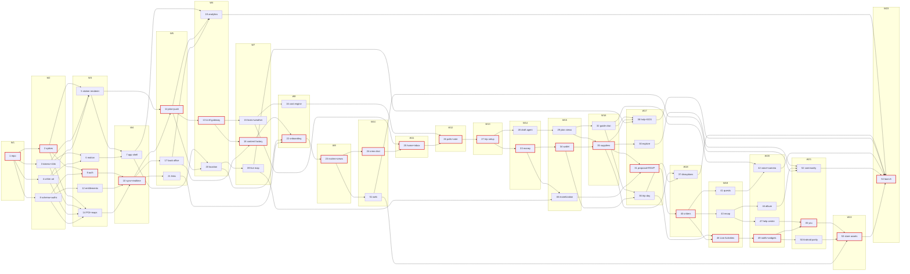

# Critterpass full build

| Field | Value |
|---|---|
| Status | pending |
| Date | 2026-09-26 (Asia/Saigon) |
| Build model | Solo founder + Claude Opus 5.5 coding agents; tasks are verifiable checkpoints — one agent pass may run many tasks or several phases; no time or session estimates |
| Scope | Full: all 192 master-analysis features, iOS + Android parity, one public launch. Master R0–R6 slicing and §12 stubs are void |
| Size | 54 phases, 543 tasks, 23 waves, critical path 249 tasks |
| Docs | [docs/README.md](../../docs/README.md) (reading order), [product-decisions.md](../../docs/product-decisions.md) (decisions 1–20, final), [code-standards.md](../../docs/code-standards.md), [system-architecture.md](../../docs/system-architecture.md), [data-model.md](../../docs/data-model.md), [api-contracts.md](../../docs/api-contracts.md), [design-system.md](../../docs/design-system.md) |
| Reports | [plans/reports/](../reports/) — master synthesis, design analyses, research, fact-checks. Backend authority: [custom Hono backend](../reports/researcher-260926-1649-custom-hono-backend-report.md). Supplier authority: [travel supplier APIs](../reports/researcher-260926-1649-travel-supplier-apis-report.md) |
| Stack | Own backend, never Supabase (D4): Hono on Railway SG, PlanetScale Postgres 18 HA, Better Auth, Centrifugo, self-hosted PowerSync, pg-boss, R2; Expo SDK 58 + SwiftUI/Kotlin surfaces; Claude-only AI |
| Design | `design/` read-only; renders in `docs/design-renders/screens/*.png` + `screens.json` |

## 1. How to execute

| Step | Rule |
|---|---|
| Reading order | `docs/README.md` → `product-decisions.md` → `code-standards.md` (§1 agent rules, §20 DoD) → architecture / data-model / api-contracts sections the phase links → phase file (Context links, Requirements, Architecture & contracts) → the one task → the design renders it names |
| Unit of work | A task (`### Tn`) is a checkpoint, not a session limit. One agent pass may run consecutive tasks and whole phases (e.g. a full wave lane); finish each task’s tests + done-when and commit before starting the next; stop at founder gates, failing tests or missing accounts |
| Ownership | Change only files in the phase `owns` list + task `Files`. Needing a file outside `owns` = stop, report `NEEDS_CONTEXT` |
| Parallelism | All phases in one wave may run concurrently (owns lists are disjoint). Tasks inside a phase run in order unless the phase says otherwise. A phase starts only when every `depends_on` phase is `done` |
| Undesigned flows | Build in code with the design system (D11); log the state in the phase file; founder reviews in the running app |
| Partners not yet approved | Build the adapter + truthful fallback behind a server flag; never fake data |
| Definition of Done | `code-standards.md` §20: owns respected; matches render + done-when incl. loading/empty/error/offline; tests per §17 (narrowest first); lint + typecheck clean; permission/RLS tests if data touched; evals if AI touched; no ids or deferral language in code |
| Task status | Add `- Status: in_progress \| done \| blocked — <short sha or blocker>` as the last line of the task block |
| Phase status | Frontmatter `status: pending → in_progress → done`; mirror in the Status column below. Phase `done` = all tasks done + phase acceptance criteria + Maestro flows on iOS and Android |
| Commits | Branch `feat/<area>-<behaviour>`, one commit per task, one PR per phase (or per pass), squash merge. Conventional commits (`feat(money): split expense by shares`), no AI references, no plan/phase/task/feature ids in code, tests, migrations or commits. `.env.example` only |
| Pass end | `Status: DONE \| DONE_WITH_CONCERNS \| BLOCKED \| NEEDS_CONTEXT` + one-line summary |

## 2. Phases

Generated from phase frontmatter `depends_on` (wave = 1 + max wave of deps; tasks = count of `### Tn` headings — a scope measure, not a time estimate). Regenerate after any `depends_on` edit.

| # | Phase | Tasks | Depends on | Wave | Status |
|---|---|---|---|---|---|
| 1 | [Repo & toolchain bootstrap](./phase-01-repo-toolchain-bootstrap.md) | 10 | - | 1 | in_progress |
| 2 | [Platform go/no-go spikes](./phase-02-platform-spikes.md) | 15 | 1 | 2 | pending |
| 3 | [Design tokens, fonts, i18n](./phase-03-design-tokens-fonts-i18n.md) | 8 | 1 | 2 | pending |
| 4 | [Critter art core](./phase-04-critter-art-core.md) | 8 | 1 | 2 | pending |
| 5 | [Sticker renderer, bake pipeline, share images](./phase-05-critter-renderer-asset-pipeline.md) | 10 | 2, 3, 4 | 3 | pending |
| 6 | [Motion, feedback bus, gestures](./phase-06-motion-feedback-gestures.md) | 10 | 3, 4 | 3 | pending |
| 7 | [App shell, components, a11y](./phase-07-app-shell-component-library.md) | 18 | 5, 6 | 4 | pending |
| 8 | [Core schema, authz + RLS, domain events](./phase-08-core-schema-authz.md) | 9 | 1 | 2 | done |
| 9 | [Auth, anonymous-first, anti-abuse](./phase-09-auth-anonymous-antiabuse.md) | 10 | 2, 8 | 3 | pending |
| 10 | [Offline sync, commands, realtime](./phase-10-sync-realtime-outbox.md) | 11 | 2, 8, 9, 12, 14 | 4 | pending |
| 11 | [Jobs, notification router, push](./phase-11-jobs-notifications-push.md) | 11 | 5, 10 | 5 | pending |
| 12 | [Entitlements, money & FX primitives](./phase-12-entitlements-money-fx.md) | 7 | 8 | 3 | pending |
| 13 | [LLM gateway, personas, autonomy](./phase-13-llm-gateway-personas-autonomy.md) | 10 | 8, 11 | 6 | pending |
| 14 | [POI data, maps, routing](./phase-14-places-maps-routing.md) | 8 | 2, 3, 4, 8 | 3 | pending |
| 15 | [Fares, weather, season & crowds](./phase-15-flights-weather-season-data.md) | 7 | 8, 11, 13 | 7 | pending |
| 16 | [Cost & constraint engine](./phase-16-cost-constraint-engine.md) | 7 | 12, 13, 14, 15 | 8 | pending |
| 17 | [Back-office & ops console](./phase-17-back-office-admin.md) | 8 | 8, 9, 10, 12, 14 | 5 | pending |
| 18 | [Content factory](./phase-18-content-factory.md) | 12 | 4, 5, 13, 14, 17 | 7 | pending |
| 19 | [Analytics, experiments, observability](./phase-19-analytics-observability.md) | 10 | 1, 7, 8, 10, 11, 17 | 6 | pending |
| 20 | [Permissions, location, POI visits](./phase-20-permissions-location-visits.md) | 11 | 2, 7, 10, 11, 14 | 6 | pending |
| 21 | [Links & deferred deep links](./phase-21-links-deferred-deeplinks.md) | 9 | 1, 10 | 5 | pending |
| 22 | [Onboarding: passport, taste, avatar](./phase-22-onboarding-pass.md) | 11 | 5, 7, 9, 10, 18, 20, 21 | 8 | pending |
| 23 | [Invites, crews, referral, seat cap](./phase-23-invites-crews-growth.md) | 10 | 12, 21, 22 | 9 | pending |
| 24 | [Crew chat](./phase-24-crew-chat.md) | 8 | 10, 23 | 10 | pending |
| 25 | [Home, inbox, nudges, tips](./phase-25-home-inbox-nudges.md) | 9 | 11, 13, 15, 23, 24 | 11 | pending |
| 26 | [Polls & destination vote](./phase-26-polls-destination-vote.md) | 12 | 10, 13, 16, 18, 24, 25 | 12 | pending |
| 27 | [Trip setup](./phase-27-trip-setup.md) | 12 | 10, 16, 20, 24, 25, 26 | 13 | pending |
| 28 | [Drafting agent & redraft](./phase-28-draft-redraft-agent.md) | 10 | 13, 16, 18, 27 | 14 | pending |
| 29 | [Plan views, editing, collab](./phase-29-plan-views-editing-collab.md) | 12 | 24, 26, 28 | 15 | pending |
| 30 | [Explore](./phase-30-explore.md) | 10 | 14, 15, 16, 26, 29, 35 | 17 | pending |
| 31 | [Proposal, RSVP, dropout re-split](./phase-31-proposal-rsvp.md) | 10 | 11, 16, 28, 29, 34, 35, 46 | 17 | pending |
| 32 | [Guide chat, metering, phrase cards](./phase-32-guide-chat-metering.md) | 9 | 12, 13, 24, 29 | 16 | pending |
| 33 | [Money: ledger, receipts, settle up](./phase-33-money.md) | 12 | 10, 12, 13, 27 | 14 | pending |
| 34 | [Bookings wallet, imports, flights](./phase-34-bookings-wallet-import.md) | 11 | 11, 13, 15, 33 | 15 | pending |
| 35 | [Supplier layer, rides, ops desk](./phase-35-supplier-layer-agency.md) | 14 | 13, 14, 17, 29, 33, 34 | 16 | pending |
| 36 | [Trip hub, day-of, leave-by, offline](./phase-36-trip-day-offline.md) | 11 | 11, 13, 14, 15, 18, 20, 25, 32, 34 | 17 | pending |
| 37 | [Disruptions](./phase-37-disruptions.md) | 11 | 15, 29, 35, 36 | 18 | pending |
| 38 | [Help hub & crew SOS](./phase-38-safety-help-sos.md) | 7 | 11, 14, 18, 20, 32, 34, 35, 39 | 17 | pending |
| 39 | [Crew live map](./phase-39-crew-live-map.md) | 6 | 12, 14, 20 | 7 | pending |
| 40 | [Critters: hatch, Critterdex, legendaries](./phase-40-critters-collect.md) | 11 | 5, 6, 9, 14, 15, 18, 20, 25, 31, 34 | 18 | pending |
| 41 | [Quests, XP, stickers](./phase-41-quests-stickers.md) | 7 | 13, 33, 40 | 19 | pending |
| 42 | [Voice, point-and-ask, phrases](./phase-42-voice-camera-phrases.md) | 9 | 32, 41 | 20 | pending |
| 43 | [Recap, story, awards, stamps](./phase-43-recap-stamps-memory.md) | 9 | 26, 31, 33, 40 | 19 | pending |
| 44 | [Album, postcards, print](./phase-44-album-postcards.md) | 9 | 10, 12, 13, 43 | 20 | pending |
| 45 | [You: profile, settings, export, deletion](./phase-45-you-profile-settings.md) | 12 | 5, 12, 22, 33, 43, 47, 49 | 21 | pending |
| 46 | [Monetization](./phase-46-monetization.md) | 13 | 9, 11, 12, 24, 33, 39 | 15 | pending |
| 47 | [Help centre, feedback, rating](./phase-47-help-feedback.md) | 8 | 17, 25, 43, 46 | 20 | pending |
| 48 | [Live Activities & Dynamic Island](./phase-48-live-activities.md) | 10 | 2, 5, 11, 34, 36, 39, 40 | 19 | pending |
| 49 | [Actionable notifs, widgets](./phase-49-notification-surfaces-widgets.md) | 10 | 5, 11, 12, 26, 48 | 20 | pending |
| 50 | [Android parity layer](./phase-50-android-parity.md) | 10 | 36, 48, 49 | 21 | pending |
| 51 | [Web: site, invites, tips, legal, OG](./phase-51-web-site-links-og.md) | 11 | 3, 5, 9, 21, 23 | 10 | pending |
| 52 | [Community plans](./phase-52-community.md) | 12 | 17, 28, 29, 30, 43, 44, 46, 51 | 21 | pending |
| 53 | [Store listing & social kit](./phase-53-store-social-assets.md) | 6 | 5, 40, 43, 45, 47, 49, 50, 51 | 22 | pending |
| 54 | [Launch hardening & submission](./phase-54-launch-hardening.md) | 12 | 19, 30, 37, 38, 42, 45, 47, 49, 50, 51, 52, 53 | 23 | pending |

DAG (transitive edges removed; red = critical path):

## 3. Waves and critical path

| Wave | Phases | Tasks | Max parallel agent lanes |
|---|---|---|---|
| 1 | 1 | 10 | 1 |
| 2 | 2, 3, 4, 8 | 40 | 4 |
| 3 | 5, 6, 9, 12, 14 | 45 | 5 |
| 4 | 7, 10 | 29 | 2 |
| 5 | 11, 17, 21 | 28 | 3 |
| 6 | 13, 19, 20 | 31 | 3 |
| 7 | 15, 18, 39 | 25 | 3 |
| 8 | 16, 22 | 18 | 2 |
| 9 | 23 | 10 | 1 |
| 10 | 24, 51 | 19 | 2 |
| 11 | 25 | 9 | 1 |
| 12 | 26 | 12 | 1 |
| 13 | 27 | 12 | 1 |
| 14 | 28, 33 | 22 | 2 |
| 15 | 29, 34, 46 | 36 | 3 |
| 16 | 32, 35 | 23 | 2 |
| 17 | 30, 31, 36, 38 | 38 | 4 |
| 18 | 37, 40 | 22 | 2 |
| 19 | 41, 43, 48 | 26 | 3 |
| 20 | 42, 44, 47, 49 | 36 | 4 |
| 21 | 45, 50, 52 | 34 | 3 |
| 22 | 53 | 6 | 1 |
| 23 | 54 | 12 | 1 |
| **Total** | 54 | **543** | |

**Critical path (249 of 543 tasks, strictly sequential):** 1 (10) → 2 (15) → 9 (10) → 10 (11) → 11 (11) → 13 (10) → 18 (12) → 22 (11) → 23 (10) → 24 (8) → 25 (9) → 26 (12) → 27 (12) → 33 (12) → 34 (11) → 35 (14) → 31 (10) → 40 (11) → 48 (10) → 49 (10) → 45 (12) → 53 (6) → 54 (12).

Keep one agent lane on the critical path at all times; content factory (18) starts batches as soon as 13/14/17 land; single-phase waves (1, 9, 11, 12, 13, 22, 23) are critical-path bottlenecks — fill them with off-path content-factory batches and flag-gated partner adapters. A failed spike changes approach inside the stack (Railway Postgres HA, PowerSync Cloud, bare workflow), never back to Supabase.

## 4. Capability milestones

Each milestone = listed phases `done` + an internal TestFlight and Play internal-track build with Maestro smoke flows green on both platforms. Sets are closed under `depends_on` (a phase needed by an earlier milestone is pulled into it).

| # | Milestone | Phases | Proof on device |
|---|---|---|---|
| M1 | Platform proven | 1, 2, 3, 4, 5, 6, 8, 9, 10, 12, 14 | Spikes S-AUTH, S-SYNC (incl. failover drill), S-DB pass; anonymous user writes offline, syncs, sees realtime echo; sticker renders; entitlement + FX primitives and POI/map tiles served |
| M2 | Crew loop on device | 7, 11, 13, 15, 17, 18, 19, 20, 21, 22, 23, 24, 25 | Onboard → passport → invite via link/code → join crew → chat → Home nudges and push; LLM gateway + content batches live; location session + POI visits; telemetry flowing |
| M3 | Plan-it + money loop | 16, 26, 27, 28, 29, 30, 31, 32, 33, 34, 35, 39, 46 | Destination vote → setup → Opus draft → private review → edit/ChangeSet → proposal → RSVP; guide chat metered at 30/day; expenses + receipt scan + settle up; wallet import; Viator booking (sandbox or live); Pass+/Boost purchase at proposal; live map |
| M4 | Trip day works | 36, 37, 38 | Leave-by alarm, offline day, disruption replan, SOS |
| M5 | Critters, after-trip, iOS off-app | 40, 41, 42, 43, 44, 45, 47, 48, 49 | Hatch, encounters, Critterdex, quests, voice mode, recap story, album, postcards, profile/export/deletion; help centre + feedback; Live Activities / Dynamic Island, AlarmKit, actionable notifications, widgets |
| M6 | Android parity | 50 | Android Live Updates (API 36+), MetricStyle (37+), full-screen alarm; iOS/Android feature matrix identical |
| M7 | Web, community, store kit | 51, 52, 53 | Web invite landing + OG; community publish; store listing + social kit from real builds; each approved partner flag verified |
| M8 | Launch readiness | 54 | Security review closed, counsel sign-off, store submissions approved, drills passed |

## 5. Non-code workstreams — start now

These gate flags, not code; code ships with truthful fallbacks until each lands.

| Workstream | Items | Unblocks phases |
|---|---|---|
| Legal entity + counsel (D18) | Singapore controller entity; counsel on Vietnam PDPL, GDPR, EU AI Act Art. 50, store rules, affiliate disclosure, EU PTD linked arrangements, referral terms, mailbox/insurance/face-match/voice consents, Help/SOS + allergy wording, deletion copy, paywall/gift copy, listing claims, Terms "we never move money" | 19, 22, 23, 33–35, 38, 42, 44–46, 51–54 (launch blocker) |
| Apple | Developer account, App IDs, App Group `group.app.critterpass` + shared Keychain, APNs .p8, Sign in with Apple service id + key, App Attest, AlarmKit, Communication Notifications, Live Activity broadcast (Channel Management), calendar usage strings, Paid Apps agreement + banking/tax, App Store Connect record | 2, 9–11, 36, 44, 46, 48, 49, 53, 54 |
| Google | Play Console + app, Firebase project + service account, Play Integrity, OAuth clients; Play declarations: background location (+ video), exact alarm, full-screen intent, READ_CALENDAR, "Contains ads"; RTDN; physical Pixel + Samsung or Test Lab | 2, 9, 11, 20, 27, 30, 36, 39, 46, 50, 54 |
| Mailbox / calendar verification | Google OAuth verification + CASA (gmail.readonly, calendar freebusy); Microsoft publisher verification + app registration | 27, 34 |
| Store monetisation | App Store + Play products, subscription groups, base plans, Offer Codes; RevenueCat project, webhook secret, REST key; price tiers (Pass+ $3.99/$29.99, Boost, Crew yearly) | 12, 46 |
| Infrastructure accounts | GitHub org, Railway team (SG, private networking, static outbound IP), PlanetScale org + HA + REPLICATION role, Cloudflare (R2, Workers, Access, Email Routing), Expo/EAS, Sentry, PostHog EU, Grafana Cloud + IRM, Langfuse EU, external uptime monitor, DPAs with each | 1, 2, 8, 10, 17, 19 |
| AI + voice vendors | Anthropic org (ZDR check, Opus/Sonnet concurrency), Voyage AI, Deepgram, ElevenLabs + one owned voice per guide (voice actors), music themes (3 named + 3 commissioned), licensed SFX | 6, 13, 18, 32, 42, 45 |
| Data vendors | Foursquare Places, Mapbox (Directions traffic + Geocoding), Open-Meteo commercial, BestTime Pro, AeroDataBox, FlightAware AeroAPI, FSQ OS Places / Overture licence acceptance, ODbL review, hazard-feed redistribution terms, destination photo licence | 14, 15, 30, 31, 34, 36, 37 |
| Partner applications | Travelpayouts (+ Agoda, Trip.com, Klook, GYG, Kiwitaxi, GetTransfer brand approvals), Booking.com via CJ, Viator Full + Booking (+ certification), Agoda Demand API (Fulfill Assisted), Klook Activity API, Trip.com distributor API, GYG API, Grab Farefeed, WhatsApp Business (verified number + auth and vendor templates) | 9, 15, 28, 31, 32, 35, 37 |
| Phone OTP | WhatsApp auth template, Twilio Verify / Prelude, Vietnam SMS brandname registration (start first; slowest) | 9 |
| Domain + email (D20) | critterpass.app + `go.` + `media.` + `in.` hosts, AASA/assetlinks (Team ID, Play signing SHA-256), Resend DKIM/DMARC | 1, 10, 21, 34, 45, 47, 51 |
| Content + review cadence | Founder approval slot per content-factory batch; native-speaker review (persona words, emergency/allergy phrases); translators for 9 non-en locales + Tolgee; trademark check of critter names; designer sign-off on C5 guide colours; editorial season/cost indices; real receipt (>= 40, 4 countries) and confirmation-email corpora | 3, 4, 13, 16, 18, 33, 34 |
| Ops | Print-on-demand vendor (default Prodigi), ops desk staffing 07:00–23:00 SGT, founder on-call phone, Linear workspace, AWS Device Farm access | 35, 38, 44, 47, 54 |
| External auth/permission security review | Book reviewer now; covers auth, RLS backstop, device action keys, admin surface | 54 (launch blocker) |

## 6. Global launch acceptance criteria

| Area | Criterion |
|---|---|
| Scope | All 543 tasks and 54 phases `done`; every one of 192 features traced to a passing Maestro/e2e flow; no deferral language anywhere |
| Parity | iOS 26+ and Android API 36 feature matrix identical in-app; native surfaces present where policy allows (Live Updates gated 36+, MetricStyle 37+) |
| Truthfulness | Stay copy says "free cancellation until {date}" / "book here" — no room holds (3c-8, 3c-12, 3f-1, 3f-3, 3f-4, 4f-1); "seats held" only for Viator timed holds; Critterpass never merchant of record; affiliate disclosure shown; commission-neutral ranking tested |
| Supplier content | Shown verbatim only in supplier cards, never cached, never sent to the LLM (test asserts prompt payloads) |
| AI | Guide never writes directly (every change is a validated ChangeSet); numbers/times/prices from deterministic code; promptfoo eval suites at thresholds; Langfuse traces; cost guard + kill switch live; 30/day free limit server-configurable |
| Security | External review closed with no open high/critical; Testcontainers permission contract suite green for all roles; private fields absent from PowerSync publication and `guide_reader`; Better Auth advisories patched |
| Offline | Full trip day usable in airplane mode; queued commands idempotent by op_id; rejects surface via `cmd_results` |
| Ops | 99.5% SLO dashboards + alerts; uptime monitor; nightly off-provider pg_dump to R2; restore drill (RTO <= 4 h) and PlanetScale failover drill (<= 5 min, logical slots survive) passed |
| Performance + a11y | Architecture §9 budgets met on low-end Android reference and iPhone 13; VoiceOver/TalkBack pass on core flows; reduce-motion honoured |
| Monetization | Purchase, restore, Boost split IOUs, First Trip Free, codes verified in sandbox and production; no web checkout |
| Legal + stores | Counsel sign-off; privacy labels / Data safety match actual collection; all Play declarations approved; store submissions approved on both stores |
| Partners | Every unapproved partner flag off with its truthful fallback copy; approved partners verified end to end |

## 7. Top risks

| Risk | Mitigation |
|---|---|
| Platform entitlements (AlarmKit, Communication Notifications, LA broadcast, background location, exact alarm, full-screen intent) delayed or denied | Request first; every surface has a coded fallback path flag-gated by server config |
| Self-hosted PowerSync + PlanetScale logical replication across failover | S-SYNC failover drill in phase 2; fallbacks Railway Postgres HA / PowerSync Cloud |
| Partner approvals slow; all gated by legal entity | Entity first; adapters behind flags; affiliate links cover launch |
| Critical path of 249 sequential tasks | Keep one agent lane on the critical path at all times; parallel waves fill the rest |
| Founder review is the single human bottleneck (content batches, undesigned flows, milestones) | Fixed review cadence per content batch; review in running app builds, not docs |
| Doc/plan drift: ~50 doc deltas where phases create tables/commands earlier than docs assign | Owning task updates the doc in the same PR; plan wins over docs on ownership |
| LLM cost overrun (Opus drafts, crew-chat guide) | Silent fair-use caps, ai_cost_guard cron, kill switches |

## 8. Open questions (deduplicated; default applies unless the founder overrides)

| # | Question | Default |
|---|---|---|
| 1 | Domain critterpass.app (D20) | Assumed; staging on workers.dev until DNS confirmed |
| 2 | Package scope / bundle id | `@cp/*`, `app.critterpass`; Turbo remote cache off |
| 3 | iOS targets via @bacons/apple-targets fork vs in-repo plugin | Fork as git dependency; spike failure exits to bare workflow |
| 4 | PMTiles delivery | Public `cp-tiles` R2 bucket; region pack <= 80 MB |
| 5 | Low-end Android reference device | Galaxy A15 |
| 6 | Six unnamed extra locales (3n-8) | de, it, nl, tr, ms, pl registered, `shipped:false` until translated |
| 7 | Location TTL conflict (15 min vs share end + 24 h) | 15 min; SOS until resolved + 24 h. Live-map channel `trip_locations:` |
| 8 | Analytics consent model | Explicit opt-in client analytics; server billing/fraud events without person profiles (counsel to confirm) |
| 9 | Guide caps | Crew-chat guide 400 answers/crew/day silent cap (product-decisions entitlement matrix); proactive posts <= 3/crew/day; pitches not counted in 30/day |
| 10 | Undo window for guide actions | Until item start or 24 h |
| 11 | Schema created earlier than docs assign (itinerary + change_sets in 8, device_action_keys in 9, stickers in 33, guide_skins in 40, memories in 43, ops.content_reviews in 18) | Plan ownership wins; owning task writes the doc delta |
| 12 | Same-wave dependencies: 35 T9 needs 32 phrase card; 38 reuses 39 map layers | 32 and 35 share wave 16: run 35 T9 only after 32 is `done` (other 35 tasks run in parallel); 39 is already in 38 `depends_on` |
| 13 | supplier_calls table + suppliers core | Resolved: created by 15 (first outbound call); 34 and 35 use it, no interim path |
| 14 | Price tiers: Boost $11.99, Crew yearly $59.99 | As listed; copy reads store price |
| 15 | Gift length / Crew yearly split | 90-day gift (App Store cap), longer stacks as code grant; IOUs on first purchase only |
| 16 | Agoda Fulfill Assisted PCI exposure | Booking sub-flag off until tokenising proxy or supplier-hosted form approved |
| 17 | Idea-board vote budget 10/month vs design "3 VOTES LEFT" | 10/month server config |
| 18 | Seeded community starter plans (Q-81) | Organic only |
| 19 | Visit dwell / running-late threshold / edit window | 3 min / 10 min / 15 min, all server config |
| 20 | Sign-in skippable at 3a-7 | Yes; required at purchase, invite send, second device |
| 21 | Face self-match in album | Flag off (manual tags) until counsel approves |
| 22 | Device cloud; restore/failover targets | AWS Device Farm; RTO 4 h, failover 5 min |
| 23 | Crew-visible taste tags (Q-17), minimum age (Q-95) | Counsel decides; defaults from phase 22 |
