# Critterpass full build

| Field | Value |
|---|---|
| Status | in_progress: 36 of 59 phases done, 19 in progress, 4 not on main yet (open PRs); 504 of 594 tasks done (2026-10-06 22:30). See **Progress** below |
| Date | 2026-09-26 (Asia/Saigon) |
| Build model | Solo founder + Claude Opus 5.5 coding agents; tasks are verifiable checkpoints — one agent pass may run many tasks or several phases; no time or session estimates |
| Scope | Full: all 192 master-analysis features plus the driver finder (F-193–F-196, added 2026-09-27, [research](../reports/research-260927-2018-local-guide-driver-finder-feasibility-report.md)), the designed ops console (phases 58–59, added 2026-09-28), iOS + Android parity, one public launch. Master R0–R6 slicing and §12 stubs are void |
| Size | 59 phases, 594 tasks, 23 waves, critical path 253 tasks |
| Docs | [docs/README.md](../../docs/README.md) (reading order), [product-decisions.md](../../docs/product-decisions.md) (decisions 1–23), [code-standards.md](../../docs/code-standards.md), [system-architecture.md](../../docs/system-architecture.md), [data-model.md](../../docs/data-model.md), [api-contracts.md](../../docs/api-contracts.md), [design-system.md](../../docs/design-system.md) |
| Reports | [plans/reports/](../reports/) — master synthesis, design analyses, research, fact-checks. Backend authority: [custom Hono backend](../reports/researcher-260926-1649-custom-hono-backend-report.md). Supplier authority: [travel supplier APIs](../reports/researcher-260926-1649-travel-supplier-apis-report.md) |
| Stack | Own backend, never Supabase (D4): Hono on Railway SG, PlanetScale Postgres 18 HA, Better Auth, Centrifugo, self-hosted PowerSync, pg-boss, R2; Expo SDK 58 + SwiftUI/Kotlin surfaces; Claude for generation + Jev for typed decisions (D5 amended) |
| Design | `design/` read-only; renders in `docs/design-renders/screens/*.png` + `screens.json` |

## Progress (updated 2026-10-06 22:30)

**504 of 594 tasks done (85%).** Every unticked task was checked against `origin/main` at 3dfe3e4652 on 6 Oct 22:30 (files, a targeted search and the delivering commit); what is left, in lane-sized batches, is in `plans/reports/critterpass-builder-261006-2229-plan-status-reconcile-report.md` (local).
- **Phases done (36):** 1–5, 7–27, 29–34, 37, 41, 58, 59. Device-only checks left in 2, 19 and 20 move to the live-test pass.
- **In progress on main (19):** 6, 28, 35, 36, 38, 39, 40, 43, 44, 45, 46, 47, 48, 49, 51, 52, 53, 54, 55. What is left is native work, device flows, partner approvals and founder steps; little of it is new app or server code.
- **Nothing on main yet (4):** 42 and 50 (in the open native batch PR #763, with the native halves of 44, 45, 46, 47, 48 and 49), 56 (open PR #770) and 57 (open PR #779).
- **Superseded by the 6 Oct simplify plan** (`plans/261005-2100-simplify-sync-and-ai-content/`: AI place profiles, api reads, `trip_places`): phase 18's curated places batch and phase 30's 500-place pan budget.

**Handover to the section 7 plan (4 Oct):** the founder's section 7 design (screens 7a-1 to 7i-2) replaces screens 3d-1 to 3d-4 and 3e-1 to 3e-3. Phases 29 and 30 close out as they stand; their 3d/3e screens and `apps/mobile/src/features/plan/{overview,day,timeline,review,views}` and `apps/mobile/src/features/explore/**` pass to [`plans/261003-2300-planning-places-v2`](../261003-2300-planning-places-v2/plan.md), which re-points each old screen id behind `planning.redesign` and retires the old screens in its last phase. Phase 37's timeline weather overlay is superseded by 7h-4 (Rain and crowds) and retired there after the founder approves the day plan on device.

**2 Oct** (everything since the 1 Oct 17:00 update):
- **Shipped:**
  - Build 16 reached TestFlight on the night of 1 Oct, and the founder moved to it at 23:49. Build 15's signing failed when Apple's API refused the Time Sensitive capability, which used up its number. Build 16 carries the lock-screen I'M UP fix (#396). App updates now go only to build 16; the release loop publishes one within minutes of each merge.
  - The first real trip is under way: the founder and a friend flew to Đà Nẵng on 2 Oct (9G 956), with the leave-by and flight activities on the lock screen. Their reports drove the day's fixes:
    - the receipt scanner was unreachable, because flag values never reached the app (#480, #482); the founder's next real scan went through end to end;
    - a friend's expenses were added three times (#481);
    - returning phone sign-in (#474, #486, #488);
    - a Boost that the admin tool computed without its billing sources, repaired on staging.
  - Worker deploys drain jobs for 30 s, and the job runtime stops at once on SIGTERM (#487).
- **Merged, server:**
  - help hub and crew SOS (#271);
  - disruptions: flight delay, forecast watch, storm, weather replan and running late (#274), with disruption words in each reader's language (#470);
  - profile, settings, app icon and past trip commands (#285); close, restore and purge an account (#416);
  - widget snapshot, refresh pushes and ping settings (#478);
  - notifications: a daily budget of ten with chat outside it (#393); crew news, trip confirmed, and quiet hours that hold, then send (#384);
  - flags: the api hands the app its flag values (#480);
  - proposal: a member who never answered can still decline (#491), and the organiser can lock in alone (#493).
- **Merged, app:**
  - Explore: destination guide, place page, map, saved places and group swiping (#381);
  - proposal:
    - the trailer, dropout re-split and crowd sheet (#320);
    - the friend's version (#369);
    - shared labels, plan text in the reader's language, and a friend dropping out end to end (#442);
    - locking in alone (#496);
    - reason tags and the guide's own label for each pick (#497, #499);
  - disruptions: flight delayed (#471); running late, with the journey check behind a kill switch (#479); forecast and storm (#485); the weather suggestion (#495);
  - You: the profile behind Home's header and a first Settings screen (#421); sign out, delete and restore (#449); the app's language from Settings (#467);
  - trip hub:
    - the header as one block and a briefing that settles (#405);
    - deadline wording and visit-memory rows (#453);
    - the crew lock-screen sheet from the crew map (#483);
    - joining the crew's trip from Home (#380);
  - bookings: wallet bookings on the plan (#389) and the draft review (#395); a forwarding address linked by code (#461); flight numbers from the schedule, a day picker, arrival time zones and held mail (#473);
  - drafting: typed must-dos answered with a place and a time of day (#466); the guide's places chosen by more than the alphabet (#445);
  - quests: titles in each reader's language (#373); a befriend quest names the nearest spot, with directions (#494);
  - language: plan and briefing text in each person's language (#365, #383, #412); place names the reader knows (#388); headings sized to their line (#428);
  - updates: staging builds apply a downloaded update themselves (#447) and keep the screen (#452); shake for Developer tools (#408);
  - content: Chà Vá's forms and Đà Nẵng spawn rules (#392); a second Chà Vá spot by Mỹ Khê (#438).
- **Fixes:**
  - From the trip:
    - an encounter whose camera can't start keeps its illustrated scene, and the app no longer freezes (#490);
    - a former member's name (#476);
    - timeline blocks keep their second line, and a moved block's title shows whole (#498).
  - Fresh users and first trips:
    - joining a trip under way (#368, #407);
    - leave-by wording without a counted trip (#397, #410, #411);
    - location at home on a trip day (#390, #417);
    - one install id (#375, #402);
    - the invited pass (#399);
    - the egg and the hatch (#404, #413, #434);
    - rates (#419, #424); setup in the crew's currency (#387);
    - bookings, money and trip day (#415, #454);
    - onboarding (#422, #443); Home (#418);
    - the default guide (#444);
    - Help: emergency numbers and place names (#448, #457, #465);
    - chat (#431); the vote at the render's sizes (#436);
    - visit consent at a calm moment (#432);
    - restore after the database opens (#439);
    - a command that can never succeed no longer blocks the queue (#464);
    - a token fetch that never answers (#456).
  - UI:
    - sheets cover the tab bar (#401);
    - keyboard footers (#374, #440, #450);
    - long presses (#435);
    - money grouping on iPhone (#350);
    - rounded draft estimates (#433).
  - Live Activities: tokens on every launch (#377); the flight activity ends on schedule (#394).
- **Tooling:**
  - CI: database suites per package (#409); app test shards (#446); image pulls with retries (#462); append-only docs merge by union (#429); scheduled device runs install the build a repo variable names while none matches the fingerprint (#500).
  - e2e:
    - Live Activities captured once rendered (#386);
    - the calendar row (#403, #414);
    - invite links (#441);
    - waits on the screen, not the clock (#451);
    - the week picker (#469);
    - setup flows (#430, #459);
    - a translation eval suite (#398).
  - Web: destination search on the waitlist (#379); staging invite pages offer TestFlight (#458).

**1 Oct** (everything since the 30 Sep 20:30 update):
- **Shipped:**
  - Build 13 reached TestFlight on the night of 30 Sep with its native batch: boarding-pass brightness (#225), calendar write (#233), phrase speech (#245), font metrics (#246) and the leave-by alarm (#255).
  - The founder set up a trip from a fresh install on 1 Oct and found many problems that seeded flows had hidden. Since then every flow is verified as a fresh real user, and the `fresh-*` flows are part of the release gate.
  - Build 14 was cut at 13:35 and uploaded to TestFlight at 15:50, with the next native batch: app icon and splash (#279), the lock-screen I'M UP outbox (#290), hero video loops (#313), the live camera on the critter encounter (#309), and Live Activities on the lock screen and Dynamic Island (#327).
  - The release gate on the build-14 binaries is not green yet: a cold start that restores into a trip's day-of screen draws blank (an older bug, also on build 13), and the iOS fresh-setup and fresh-proposal steps are being triaged. The leave-by Live Activity is switched off on staging by flag (blank on the test build); the flight activity works.
  - The first real trip: Đà Nẵng, 2–4 Oct, with the Chà Vá guide (#273, #276, #310). Its content batches are approved and released on staging, and the trip has a free Boost.
  - The coming-soon site speaks the ten shipped languages, picked from the browser, with a language switcher and a coming-soon mode that serves only the landing page, privacy and the waitlist (#358, #362, #367). Production deploy of the localised page: in progress.
- **Merged, server:**
  - Explore: swipe, saved lists, place context and sponsored slots (#267);
  - proposal, RSVP, private objections and dropout re-split (#268);
  - critters: hatch, encounters, verification and legendaries (#280);
  - quests, XP and crew-level stickers (#314);
  - Live Activities: orchestration, tables and device commands (#286), and the crew-live meet-up activity (#330);
  - trip lifecycle transitions on the destination clock (#317);
  - language: push templates as catalog messages (#281); the server knows each person's app language and the guide answers in it (#354);
  - content: the editorial stock media pipeline (#303) and the Hội An media subject (#337);
  - receipt lines reconciled with the total (#278, #284), and each guide's own phrase voice (#269).
- **Merged, app:**
  - supplier cards, getting around and messages to places (#259);
  - critters: hatch, Critterdex, detail, encounters and legendaries (#301);
  - the quests screen, hub tile and sticker shelf (#316);
  - proposal, your version, slide to board and lock (#319);
  - a one-place board can be locked in, and setup is gated for a brand-new crew (#300);
  - the launch hatch from the native splash (#292), destination photos under the heroes (#312, #331), and a header and skeleton while the private draft loads (#288);
  - Vietnamese: the proposal (#360) and the rest of the app (#361).
- **Fixes:**
  - From the fresh-install test: the budget locks in the crew's own currency (#349); sending a proposal publishes the plan to the crew (#352); the reply-by job confirms the trip (#356); a crew of one can lock the plan in (#363); push text lives in the catalogs (#364).
  - Fresh accounts: Home and the trip hub while the first trip is still voting (#294); a solo trip with no crew yet (#323); the dates step (#299, #332); Chà Vá stays the trip's guide (#322); a final closes when carried-over ballots already decide it (#321); the boarding pass uses the real airport (#325); proposal follow-ups (#343).
  - Money: settlement currency defaults to the members' home currency (#293); wallet switch and crew-of-one money (#297); keypad and split rows (#298, #336); short amounts and currency symbols on iPhone (#334, #335).
  - Chat and guide: real-user crew chat (#291); the guide's answer breaks where a tool call split it (#296); group thread and phrase audio (#263, #270).
  - Screens against their renders: showdown and reveal (#333, #345), critters (#341, #346), the quest card (#353), sheets that keep their input in reach (#339, #340, #347), onboarding back (#324).
  - Places and data: place search sends the session (#302, #304); the travel-data reader at the app root (#338).
  - Server and deploy: Centrifugo namespaces and cron payloads (#265); undeliverable outbox payloads rejected at the write (#277); migrations run from their own entry (#307); a worker boot deadlock (#315); worker share-card fonts (#305); PostHog flag keys (#275); inbound email (#264, #283); the web critter count (#318); release-gate findings (#266).
- **Tooling:**
  - Fresh-user e2e flows (#311, #328, #366) and steadier iOS gate flows (#287, #295, #308, #342, #344, #357, #359).
  - Database and heavy suites run on a GitHub runner on demand (#289); CI and time-budget fixes (#306, #326, #351).
  - Booking import and receipt scan are graded on the founder's redacted corpus (#272).
  - UI checks: no false truncation on a streaming line (#282), and a second look before reporting no way back (#355).
  - A pull request whose description carries a session link fails CI (#348).

**30 Sep:**
- Build 12 went to TestFlight with the Borel guide font; drafting, the trip plan views, guide chat, the bookings wallet, trip hub and day-of shipped as updates to it.
- Server: bookings wallet (#203), billing (#205), plan ops and collaboration (#221), guide chat (#235, #241), supplier core, rides and tariff estimates (#240, #250, #258), trip day (#248).
- App: money (#209), drafting (#214), plan views (#232, #234), bookings wallet (#224), guide chat (#244), trip hub and day-of (#257).
- Fixes: opening a trip no longer stops sync (#256); final confirms no longer deadlock (#215); happy-path dates, room split and balances (#261); device-sweep findings (#217, #231, #238, #236).
- Tooling: the staging happy-path release gate before every TestFlight build (#242, #252), and the required `ui-reviewed` check (#218).

**6 Oct, open outside the running lanes:**

| Phase | Tasks | What's left |
|---|---|---|
| 6 Motion and feedback | 9/10 | cp-haptics Robolectric pin rides a native change |
| 28 Drafting agent | 10/11 | Viator availability check (partner approval) |
| 35 Suppliers, rides, ops desk | 10/14 | Viator, Agoda, GYG, Klook, Trip.com adapters (partner approvals) |
| 36 Trip hub and day-of | 10/11 | readiness, conflict and alarm flows (the seed script and four flows are in) |
| 39 Crew live map | 5/6 | flows written, never run on a device; `window-end` needs a dev action that ends the share |
| 40 Critters | 10/11 | `copresence.yaml` (second member's dwell) |

**6 Oct lanes:** 43, 44, 45, 47, 52, 55, 56, 57 and 59; 38 with 51; a native batch with 42, 44 T2, 45 T7, 46, 48, 49 and 50. Then 53 (store and social kit) and 54 (launch hardening), then live tests, UX checks and fixes.

**Native builds:**
- **Build 16:** on TestFlight since the night of 1 Oct. The founder and a friend use it on the Đà Nẵng trip, and every app update goes to it.
- **Next native build, after the trip:**
  - the Time Sensitive capability (two portal steps by the founder);
  - Live Activity kinds per phone (#475), and the new kinds and widgets (#477);
  - SOS that breaks through Do Not Disturb, and Sentry for the app;
  - receipt photos resized before upload, and the Android photo picker fix;
  - the RevenueCat SDK, the share extension (find a driver) and the cp-haptics test pin.

**Founder items:** `plans/reports/founder-actions-260927-1745-open-items-for-founder-report.md` (local). Open now:
- partners and accounts:
  - Viator PID and MCID;
  - Travelpayouts stays brands (Agoda, Trip.com, Hotellook, Booking.com, Expedia) plus GetYourGuide;
  - ride tariffs review in the console;
  - Prelude custom codes;
  - booking emails and receipt photos;
  - WhatsApp;
  - billing stores;
  - the photo cut-out check;
- from the trip:
  - who staffs the ops desk during tests;
  - whether to react to flight delays under 30 minutes when something on the plan is at risk;
  - an arrival hatch between midnight and 05:00;
  - which emergency number leads in Vietnam;
  - the visit-consent wording;
  - running late on the founder's own trip;
  - the two Time Sensitive portal steps.

## 1. How to execute

| Step | Rule |
|---|---|
| Reading order | `docs/README.md` → `product-decisions.md` → `code-standards.md` (§1 agent rules, §20 DoD) → architecture / data-model / api-contracts sections the phase links → phase file (Context links, Requirements, Architecture & contracts) → the one task → the design renders it names |
| Unit of work | A task (`### Tn`) is a checkpoint, not a session limit. One agent pass may run consecutive tasks and whole phases (e.g. a full wave lane); finish each task’s tests + done-when and commit before starting the next; stop at founder gates, failing tests or missing accounts |
| Ownership | Change only files in the phase `owns` list + task `Files`. Needing a file outside `owns` = stop, report `NEEDS_CONTEXT`. A phase may also list `mount_points`: the smallest edit (import + render/register) inside files owned by a phase that is already `done` |
| Parallelism | All phases in one wave may run concurrently (owns lists are disjoint). Tasks inside a phase run in order unless the phase says otherwise. A phase starts only when every `depends_on` phase is `done` |
| Undesigned flows | Build in code with the design system (D11); log the state in the phase file; founder reviews in the running app |
| Partners not yet approved | Build the adapter + truthful fallback behind a server flag; never fake data |
| Definition of Done | `code-standards.md` §20: owns respected; matches render + done-when incl. loading/empty/error/offline; tests per §17 (narrowest first); lint + typecheck clean; permission/RLS tests if data touched; evals if AI touched; no ids or deferral language in code |
| Task status | Add `- Status: in_progress \| done \| blocked — <short sha or blocker>` as the last line of the task block |
| Phase status | Frontmatter `status: pending → in_progress → done`; mirror in the Status column below. Phase `done` = all tasks done + phase acceptance criteria, verified by unit tests and manual checks; Maestro flows run locally when the phase's changes need them |
| Commits | Branch `feat/<area>-<behaviour>`, one commit per task, one PR per phase (or per pass), squash merge. Conventional commits (`feat(money): split expense by shares`), no AI references, no plan/phase/task/feature ids in code, tests, migrations or commits. `.env.example` only |
| Pass end | `Status: DONE \| DONE_WITH_CONCERNS \| BLOCKED \| NEEDS_CONTEXT` + one-line summary |

## 2. Phases

Generated from phase frontmatter `depends_on` (wave = 1 + max wave of deps; tasks = count of `### Tn` headings — a scope measure, not a time estimate). Regenerate after any `depends_on` edit.

| # | Phase | Tasks | Depends on | Wave | Status |
|---|---|---|---|---|---|
| 1 | [Repo & toolchain bootstrap](./phase-01-repo-toolchain-bootstrap.md) | 10 | - | 1 | done |
| 2 | [Platform go/no-go spikes](./phase-02-platform-spikes.md) | 15 | 1 | 2 | done |
| 3 | [Design tokens, fonts, i18n](./phase-03-design-tokens-fonts-i18n.md) | 8 | 1 | 2 | done |
| 4 | [Critter art core](./phase-04-critter-art-core.md) | 8 | 1 | 2 | done |
| 5 | [Sticker renderer, bake pipeline, share images](./phase-05-critter-renderer-asset-pipeline.md) | 10 | 2, 3, 4 | 3 | done |
| 6 | [Motion, feedback bus, gestures](./phase-06-motion-feedback-gestures.md) | 10 | 3, 4 | 3 | in_progress (9/10) |
| 7 | [App shell, components, a11y](./phase-07-app-shell-component-library.md) | 18 | 5, 6 | 4 | done |
| 8 | [Core schema, authz + RLS, domain events](./phase-08-core-schema-authz.md) | 9 | 1 | 2 | done |
| 9 | [Auth, anonymous-first, anti-abuse](./phase-09-auth-anonymous-antiabuse.md) | 10 | 2, 8 | 3 | done |
| 10 | [Offline sync, commands, realtime](./phase-10-sync-realtime-outbox.md) | 11 | 2, 8, 9, 12, 14 | 4 | done |
| 11 | [Jobs, notification router, push](./phase-11-jobs-notifications-push.md) | 11 | 5, 10 | 5 | done |
| 12 | [Entitlements, money & FX primitives](./phase-12-entitlements-money-fx.md) | 7 | 8 | 3 | done |
| 13 | [LLM gateway, personas, autonomy](./phase-13-llm-gateway-personas-autonomy.md) | 13 | 8, 11 | 6 | done |
| 14 | [POI data, maps, routing](./phase-14-places-maps-routing.md) | 8 | 2, 3, 4, 8 | 3 | done |
| 15 | [Fares, weather, season & crowds](./phase-15-flights-weather-season-data.md) | 8 | 8, 11, 13 | 7 | done |
| 16 | [Cost & constraint engine](./phase-16-cost-constraint-engine.md) | 7 | 12, 13, 14, 15 | 8 | done |
| 17 | [Back-office & ops console](./phase-17-back-office-admin.md) | 8 | 8, 9, 10, 12, 14 | 5 | done |
| 18 | [Content factory](./phase-18-content-factory.md) | 13 | 4, 5, 13, 14, 17 | 7 | done |
| 19 | [Analytics, experiments, observability](./phase-19-analytics-observability.md) | 10 | 1, 7, 8, 10, 11, 17 | 6 | done |
| 20 | [Permissions, location, POI visits](./phase-20-permissions-location-visits.md) | 11 | 2, 7, 10, 11, 14 | 6 | done |
| 21 | [Links & deferred deep links](./phase-21-links-deferred-deeplinks.md) | 9 | 1, 10 | 5 | done |
| 22 | [Onboarding: passport, taste, avatar](./phase-22-onboarding-pass.md) | 11 | 5, 7, 9, 10, 18, 20, 21 | 8 | done |
| 23 | [Invites, crews, referral, seat cap](./phase-23-invites-crews-growth.md) | 10 | 12, 21, 22 | 9 | done |
| 24 | [Crew chat](./phase-24-crew-chat.md) | 8 | 10, 23 | 10 | done |
| 25 | [Home, inbox, nudges, tips](./phase-25-home-inbox-nudges.md) | 9 | 11, 13, 15, 23, 24 | 11 | done |
| 26 | [Polls & destination vote](./phase-26-polls-destination-vote.md) | 12 | 10, 13, 16, 18, 24, 25 | 12 | done |
| 27 | [Trip setup](./phase-27-trip-setup.md) | 12 | 10, 16, 20, 24, 25, 26 | 13 | done |
| 28 | [Drafting agent & redraft](./phase-28-draft-redraft-agent.md) | 11 | 13, 16, 18, 27 | 14 | in_progress (10/11) |
| 29 | [Plan views, editing, collab](./phase-29-plan-views-editing-collab.md) | 12 | 24, 26, 28 | 15 | done |
| 30 | [Explore](./phase-30-explore.md) | 10 | 14, 15, 16, 26, 29, 35 | 17 | done |
| 31 | [Proposal, RSVP, dropout re-split](./phase-31-proposal-rsvp.md) | 10 | 11, 16, 28, 29, 34, 35, 46 | 17 | done |
| 32 | [Guide chat, metering, phrase cards](./phase-32-guide-chat-metering.md) | 10 | 12, 13, 24, 29 | 16 | done |
| 33 | [Money: ledger, receipts, settle up](./phase-33-money.md) | 12 | 10, 12, 13, 27 | 14 | done |
| 34 | [Bookings wallet, imports, flights](./phase-34-bookings-wallet-import.md) | 11 | 11, 13, 15, 33 | 15 | done |
| 35 | [Supplier layer, rides, ops desk](./phase-35-supplier-layer-agency.md) | 14 | 13, 14, 17, 29, 33, 34, 58 | 16 | in_progress (10/14) |
| 36 | [Trip hub, day-of, leave-by, offline](./phase-36-trip-day-offline.md) | 11 | 11, 13, 14, 15, 18, 20, 25, 32, 34 | 17 | in_progress (10/11) |
| 37 | [Disruptions](./phase-37-disruptions.md) | 11 | 15, 29, 35, 36 | 18 | done |
| 38 | [Help hub & crew SOS](./phase-38-safety-help-sos.md) | 7 | 11, 14, 18, 20, 32, 34, 35, 39 | 17 | in_progress (6/7) |
| 39 | [Crew live map](./phase-39-crew-live-map.md) | 6 | 12, 14, 20 | 7 | in_progress (5/6) |
| 40 | [Critters: hatch, Critterdex, legendaries](./phase-40-critters-collect.md) | 11 | 5, 6, 9, 14, 15, 18, 20, 25, 31, 34 | 18 | in_progress (10/11) |
| 41 | [Quests, XP, stickers](./phase-41-quests-stickers.md) | 7 | 13, 33, 40 | 19 | done |
| 42 | [Voice, point-and-ask, phrases](./phase-42-voice-camera-phrases.md) | 9 | 32, 41 | 20 | pending (0/9; in the open native batch PR) |
| 43 | [Recap, story, awards, stamps](./phase-43-recap-stamps-memory.md) | 9 | 26, 31, 33, 40 | 19 | in_progress (8/9, the last in part) |
| 44 | [Album, postcards, print](./phase-44-album-postcards.md) | 9 | 10, 12, 13, 43 | 20 | in_progress (7/9) |
| 45 | [You: profile, settings, export, deletion](./phase-45-you-profile-settings.md) | 12 | 5, 12, 22, 33, 43, 47, 49 | 21 | in_progress (8/12) |
| 46 | [Monetization](./phase-46-monetization.md) | 13 | 9, 11, 12, 24, 33, 39, 58 | 15 | in_progress (6/13) |
| 47 | [Help centre, feedback, rating](./phase-47-help-feedback.md) | 8 | 17, 25, 43, 46, 58 | 20 | in_progress (6/8) |
| 48 | [Live Activities & Dynamic Island](./phase-48-live-activities.md) | 10 | 2, 5, 11, 34, 36, 39, 40 | 19 | in_progress (7/10) |
| 49 | [Actionable notifs, widgets](./phase-49-notification-surfaces-widgets.md) | 10 | 5, 11, 12, 26, 48 | 20 | in_progress (7/10) |
| 50 | [Android parity layer](./phase-50-android-parity.md) | 10 | 36, 48, 49 | 21 | pending (0/10; in the open native batch PR) |
| 51 | [Web: site, invites, tips, legal, OG](./phase-51-web-site-links-og.md) | 11 | 3, 5, 9, 21, 23 | 10 | in_progress (7/11) |
| 52 | [Community plans](./phase-52-community.md) | 12 | 17, 28, 29, 30, 43, 44, 46, 51, 58 | 21 | in_progress (11/12) |
| 53 | [Store listing & social kit](./phase-53-store-social-assets.md) | 6 | 5, 40, 43, 45, 47, 49, 50, 51 | 22 | in_progress (1/6) |
| 54 | [Launch hardening & submission](./phase-54-launch-hardening.md) | 12 | 19, 30, 37, 38, 42, 45, 47, 49, 50, 51, 52, 53, 55, 56, 57 | 23 | in_progress (1/12) |
| 55 | [Find a driver: ask, capture, compare, pick, private tours](./phase-55-find-a-driver.md) | 13 | 13, 16, 29, 34, 35, 36, 58 | 18 | in_progress (9/13) |
| 56 | [Drivers our crews used: rating, invite, claim, directory](./phase-56-crews-drivers-directory.md) | 8 | 9, 17, 21, 43, 51, 52, 55, 58 | 22 | pending (0/8; open PR) |
| 57 | [Share the plan with your driver: page, PDF, quote back](./phase-57-share-plan-with-driver.md) | 7 | 21, 26, 29, 51, 52, 55 | 22 | pending (0/7; open PR) |
| 58 | [Ops console data capture and early contracts](./phase-58-ops-console-early-contracts.md) | 7 | 11, 13, 17 | 7 | done |
| 59 | [Ops console designed pass](./phase-59-ops-console-designed-pass.md) | 9 | 18, 19, 35, 44, 45, 46, 47, 52, 55, 56, 58 | 23 | done |

**Ops console designs (added 2026-09-28):** the 21 `Ops - *` screens are imported into `design/` with page renders in `docs/design-renders/pages/Ops-*.png`; mapping in the three `researcher-260928-0214-ops-designs-*` reports. Phase 58 runs early as a low-priority filler lane (history that must be captured from day one + registries later panels plug into); panel-owning phases 18, 35, 45, 46, 47, 52, 55 and 56 build their panels to the renders (see each file's "Ops console design" section); phase 59 restyles the rest after the app phases.

**Prerequisite for 55–57, runs now (not gated):** import the driver-finder screens (6a-1 … 6k-1, 23 screens) from the Claude Design project into `design/Critterpass.dc.html`, then `pnpm --filter @cp/design-renders run render:screens` and `extract:screens`, and add the 6a–6k section blurbs to `sections.json`. Phase files reference these renders.

DAG (transitive edges removed; red = critical path):

```mermaid
flowchart LR
  subgraph W1["W1"]; P1["1 repo"]; end
  subgraph W2["W2"]; P2["2 spikes"]; P3["3 tokens+i18n"]; P4["4 critter art"]; P8["8 schema+authz"]; end
  subgraph W3["W3"]; P5["5 sticker renderer"]; P6["6 motion"]; P9["9 auth"]; P12["12 entitlements"]; P14["14 POI+maps"]; end
  subgraph W4["W4"]; P7["7 app shell"]; P10["10 sync+realtime"]; end
  subgraph W5["W5"]; P11["11 jobs+push"]; P17["17 back office"]; P21["21 links"]; end
  subgraph W6["W6"]; P13["13 LLM gateway"]; P19["19 analytics"]; P20["20 location"]; end
  subgraph W7["W7"]; P15["15 fares+weather"]; P18["18 content factory"]; P39["39 live map"]; P58["58 ops capture"]; end
  subgraph W8["W8"]; P16["16 cost engine"]; P22["22 onboarding"]; end
  subgraph W9["W9"]; P23["23 invites+crews"]; end
  subgraph W10["W10"]; P24["24 crew chat"]; P51["51 web"]; end
  subgraph W11["W11"]; P25["25 home+inbox"]; end
  subgraph W12["W12"]; P26["26 polls+vote"]; end
  subgraph W13["W13"]; P27["27 trip setup"]; end
  subgraph W14["W14"]; P28["28 draft agent"]; P33["33 money"]; end
  subgraph W15["W15"]; P29["29 plan views"]; P34["34 wallet"]; P46["46 monetization"]; end
  subgraph W16["W16"]; P32["32 guide chat"]; P35["35 suppliers"]; end
  subgraph W17["W17"]; P30["30 explore"]; P31["31 proposal+RSVP"]; P36["36 trip day"]; P38["38 help+SOS"]; end
  subgraph W18["W18"]; P37["37 disruptions"]; P40["40 critters"]; P55["55 find a driver"]; end
  subgraph W19["W19"]; P41["41 quests"]; P43["43 recap"]; P48["48 Live Activities"]; end
  subgraph W20["W20"]; P42["42 voice+camera"]; P44["44 album"]; P47["47 help centre"]; P49["49 notifs+widgets"]; end
  subgraph W21["W21"]; P45["45 you"]; P50["50 Android parity"]; P52["52 community"]; end
  subgraph W22["W22"]; P53["53 store assets"]; P56["56 crews' drivers"]; P57["57 share with driver"]; end
  subgraph W23["W23"]; P54["54 launch"]; P59["59 ops designed"]; end
  P1 --> P2 & P3 & P4 & P8
  P2 --> P5 & P9 & P14
  P3 --> P5 & P6 & P14
  P4 --> P5 & P6 & P14
  P5 --> P7 & P11
  P6 --> P7
  P7 --> P19 & P20
  P8 --> P9 & P12 & P14
  P9 --> P10
  P10 --> P11 & P17 & P21
  P11 --> P13 & P19 & P20
  P12 --> P10
  P13 --> P15 & P18
  P14 --> P10
  P15 --> P16 & P25
  P16 --> P26
  P17 --> P18 & P19
  P18 --> P22
  P19 --> P54
  P20 --> P22 & P39
  P21 --> P22
  P22 --> P23
  P23 --> P24 & P51
  P24 --> P25
  P25 --> P26
  P26 --> P27
  P27 --> P28 & P33
  P28 --> P29
  P29 --> P32 & P35
  P30 --> P52
  P31 --> P40
  P32 --> P36 & P38 & P42
  P33 --> P34 & P46
  P34 --> P35 & P36
  P35 --> P30 & P31 & P37 & P38
  P36 --> P37 & P48
  P37 --> P54
  P38 --> P54
  P39 --> P38 & P46
  P40 --> P41 & P43 & P48
  P41 --> P42
  P42 --> P54
  P43 --> P44 & P47
  P44 --> P52
  P45 --> P53
  P46 --> P31
  P47 --> P45
  P48 --> P49
  P49 --> P45 & P50
  P50 --> P53
  P51 --> P52 & P53
  P52 --> P54
  P53 --> P54
  P36 --> P55
  P55 --> P56 & P57
  P52 --> P56 & P57
  P56 --> P54
  P57 --> P54
  P13 & P17 --> P58
  P58 --> P35 & P46
  P19 & P45 & P56 --> P59
  classDef crit stroke:#d33,stroke-width:3px
  class P1,P2,P9,P10,P11,P13,P18,P22,P23,P24,P25,P26,P27,P33,P34,P35,P31,P40,P48,P49,P45,P53,P54 crit
```

## 3. Waves and critical path

| Wave | Phases | Tasks | Max parallel agent lanes |
|---|---|---|---|
| 1 | 1 | 10 | 1 |
| 2 | 2, 3, 4, 8 | 40 | 4 |
| 3 | 5, 6, 9, 12, 14 | 45 | 5 |
| 4 | 7, 10 | 29 | 2 |
| 5 | 11, 17, 21 | 28 | 3 |
| 6 | 13, 19, 20 | 34 | 3 |
| 7 | 15, 18, 39, 58 | 34 | 4 |
| 8 | 16, 22 | 18 | 2 |
| 9 | 23 | 10 | 1 |
| 10 | 24, 51 | 19 | 2 |
| 11 | 25 | 9 | 1 |
| 12 | 26 | 12 | 1 |
| 13 | 27 | 12 | 1 |
| 14 | 28, 33 | 23 | 2 |
| 15 | 29, 34, 46 | 36 | 3 |
| 16 | 32, 35 | 24 | 2 |
| 17 | 30, 31, 36, 38 | 38 | 4 |
| 18 | 37, 40, 55 | 35 | 3 |
| 19 | 41, 43, 48 | 26 | 3 |
| 20 | 42, 44, 47, 49 | 36 | 4 |
| 21 | 45, 50, 52 | 34 | 3 |
| 22 | 53, 56, 57 | 21 | 3 |
| 23 | 54, 59 | 21 | 2 |
| **Total** | 59 | **594** | |

**Critical path (253 of 545 tasks, strictly sequential):** 1 (10) → 2 (15) → 9 (10) → 10 (11) → 11 (11) → 13 (13) → 18 (13) → 22 (11) → 23 (10) → 24 (8) → 25 (9) → 26 (12) → 27 (12) → 33 (12) → 34 (11) → 35 (14) → 31 (10) → 40 (11) → 48 (10) → 49 (10) → 45 (12) → 53 (6) → 54 (12).

Keep one agent lane on the critical path at all times; content factory (18) starts batches as soon as 13/14/17 land; single-phase waves (1, 9, 11, 12, 13, 22, 23) are critical-path bottlenecks — fill them with off-path content-factory batches and flag-gated partner adapters. A failed spike changes approach inside the stack (Railway Postgres HA, PowerSync Cloud, bare workflow), never back to Supabase.

## 4. Capability milestones

Each milestone = listed phases `done` + an internal TestFlight and Play internal-track build with Maestro smoke flows green on both platforms. Sets are closed under `depends_on` (a phase needed by an earlier milestone is pulled into it).

| # | Milestone | Phases | Proof on device |
|---|---|---|---|
| M1 | Platform proven | 1, 2, 3, 4, 5, 6, 8, 9, 10, 12, 14 | Spikes S-AUTH, S-SYNC (incl. failover drill), S-DB pass; anonymous user writes offline, syncs, sees realtime echo; sticker renders; entitlement + FX primitives and POI/map tiles served |
| M2 | Crew loop on device | 7, 11, 13, 15, 17, 18, 19, 20, 21, 22, 23, 24, 25 | Onboard → passport → invite via link/code → join crew → chat → Home nudges and push; LLM gateway + content batches live; location session + POI visits; telemetry flowing |
| M3 | Plan-it + money loop | 16, 26, 27, 28, 29, 30, 31, 32, 33, 34, 35, 39, 46 | Destination vote → setup → Opus draft → private review → edit/ChangeSet → proposal → RSVP; guide chat metered at 30/day; expenses + receipt scan + settle up; wallet import; Viator booking (sandbox or live); Pass+/Boost purchase at proposal; live map |
| M4 | Trip day works | 36, 37, 38, 55 | Leave-by alarm, offline day, disruption replan, SOS; find a driver from a pasted message, compare, set on days, offline ride-back card |
| M5 | Critters, after-trip, iOS off-app | 40, 41, 42, 43, 44, 45, 47, 48, 49 | Hatch, encounters, Critterdex, quests, voice mode, recap story, album, postcards, profile/export/deletion; help centre + feedback; Live Activities / Dynamic Island, AlarmKit, actionable notifications, widgets |
| M6 | Android parity | 50 | Android Live Updates (API 36+), MetricStyle (37+), full-screen alarm; iOS/Android feature matrix identical |
| M7 | Web, community, store kit, drivers | 51, 52, 53, 56, 57 | Web invite landing + OG; community publish; driver claim → directory; driver plan page → quote → crew vote; store listing + social kit from real builds; each approved partner flag verified |
| M8 | Launch readiness | 54 | Security review closed, counsel sign-off, store submissions approved, drills passed |
| M9 | Ops console designed (may land after launch) | 58, 59 | Every `Ops - *` render matched on desktop + phone for each role; My work across all queues; Services & spend live; incident banner and maintenance mode drilled |

## 5. Non-code workstreams — start now

These gate flags, not code; code ships with truthful fallbacks until each lands.

| Workstream | Items | Unblocks phases |
|---|---|---|
| Legal entity + counsel (D18) | Singapore controller entity; counsel on Vietnam PDPL, GDPR, EU AI Act Art. 50, store rules, affiliate disclosure, EU PTD linked arrangements, referral terms, mailbox/insurance/face-match/voice consents, Help/SOS + allergy wording, deletion copy, paywall/gift copy, listing claims, Terms "we never move money", driver directory (consent on claim, tips takedown policy, guide-licence wording) | 19, 22, 23, 33–35, 38, 42, 44–46, 51–54, 56 (launch blocker) |
| Apple | Developer account, App IDs, App Group `group.app.critterpass` + shared Keychain, APNs .p8, Sign in with Apple service id + key, App Attest, AlarmKit, Communication Notifications, Live Activity broadcast (Channel Management), calendar usage strings, Paid Apps agreement + banking/tax, App Store Connect record | 2, 9–11, 36, 44, 46, 48, 49, 53, 54 |
| Google | Play Console + app, Firebase project + service account, Play Integrity, OAuth clients; Play declarations: background location (+ video), exact alarm, full-screen intent, READ_CALENDAR, "Contains ads"; RTDN; physical Pixel + Samsung or Test Lab | 2, 9, 11, 20, 27, 30, 36, 39, 46, 50, 54 |
| Mailbox / calendar verification | Google OAuth verification + CASA (gmail.readonly, calendar freebusy); Microsoft publisher verification + app registration | 27, 34 |
| Store monetisation | App Store + Play products, subscription groups, base plans, Offer Codes; RevenueCat project, webhook secret, REST key; price tiers (Pass+ $3.99/$29.99, Boost, Crew yearly) | 12, 46 |
| Infrastructure accounts | GitHub org, Railway team (SG, private networking, static outbound IP), PlanetScale org + HA + REPLICATION role, Cloudflare (R2, Workers, Access, Email Routing), Expo/EAS, Sentry, PostHog EU, Grafana Cloud + IRM, Langfuse EU, external uptime monitor, DPAs with each | 1, 2, 8, 10, 17, 19 |
| AI + voice vendors | Anthropic org (ZDR check, Opus/Sonnet concurrency), Voyage AI, Deepgram, ElevenLabs + one owned voice per guide (voice actors), music themes (3 named + 3 commissioned), licensed SFX | 6, 13, 18, 32, 42, 45 |
| Data vendors | Foursquare Places, Mapbox (Directions traffic + Geocoding), Open-Meteo commercial, BestTime Pro, AeroDataBox, FlightAware AeroAPI, FSQ OS Places / Overture licence acceptance, ODbL review, hazard-feed redistribution terms, destination photo licence | 14, 15, 30, 31, 34, 36, 37 |
| Partner applications | Travelpayouts (+ Agoda, Trip.com, Klook, GYG, Kiwitaxi, GetTransfer brand approvals), Booking.com via CJ, Viator Full + Booking (+ certification), Agoda Demand API (Fulfill Assisted), Klook Activity API, Trip.com distributor API, GYG API, Grab Farefeed, WhatsApp Business (verified number + auth and vendor templates; auth template also gates driver claims) | 9, 15, 28, 31, 32, 35, 37, 55, 56 |
| Phone OTP | WhatsApp auth template, Twilio Verify / Prelude, Vietnam SMS brandname registration (start first; slowest) | 9 |
| Domain + email (D20) | critterpass.app + `go.` + `media.` + `in.` hosts, AASA/assetlinks (Team ID, Play signing SHA-256), Resend DKIM/DMARC | 1, 10, 21, 34, 45, 47, 51 |
| Content + review cadence | Founder approval slot per content-factory batch; native-speaker review (persona words, emergency/allergy phrases); translators for 9 non-en locales + Tolgee; trademark check of critter names; designer sign-off on C5 guide colours; editorial season/cost indices; real receipt (>= 40, 4 countries) and confirmation-email corpora | 3, 4, 13, 16, 18, 33, 34 |
| Driver finder content | Extraction eval corpus: done, synthetic (`packages/ai/evals/provider-extract/fixtures/driver-messages.yaml`); pickup gaps + ask groups drafted ([seed lists](../reports/research-260927-2116-driver-finder-seed-lists-merged-report.md)), awaiting founder approval + ops logged-in URL check; ID translations for the post template, claim and plan pages | 55, 56, 57 |
| Ops | Print-on-demand vendor (default Prodigi), ops desk staffing 07:00–23:00 SGT, founder on-call phone, Linear workspace, AWS Device Farm access | 35, 38, 44, 47, 54 |
| External auth/permission security review | Book reviewer now; covers auth, RLS backstop, device action keys, admin surface | 54 (launch blocker) |

## 6. Global launch acceptance criteria

| Area | Criterion |
|---|---|
| Scope | Every task of phases 1–58 `done` (59, the ops console designed pass, is not a launch gate); every one of 196 features traced to a passing Maestro/e2e flow; no deferral language anywhere |
| Parity | iOS 26+ and Android API 36 feature matrix identical in-app; native surfaces present where policy allows (Live Updates gated 36+, MetricStyle 37+) |
| Truthfulness | Stay copy says "free cancellation until {date}" / "book here" — no room holds (3c-8, 3c-12, 3f-1, 3f-3, 3f-4, 4f-1); "seats held" only for Viator timed holds; Critterpass never merchant of record; affiliate disclosure shown; commission-neutral ranking tested |
| Supplier content | Shown verbatim only in supplier cards, never cached, never sent to the LLM (test asserts prompt payloads) |
| AI | Guide never writes directly (every change is a validated ChangeSet); numbers/times/prices from deterministic code; promptfoo eval suites at thresholds; Langfuse traces; cost guard + kill switch live; 30/day free limit server-configurable |
| Security | External review closed with no open high/critical; Testcontainers permission contract suite green for all roles; private fields absent from PowerSync publication and `guide_reader`; Better Auth advisories patched |
| Offline | Full trip day usable in airplane mode; queued commands idempotent by op_id; rejects surface via `cmd_results` |
| Ops | 99.5% SLO dashboards + alerts; uptime monitor; nightly off-provider pg_dump to R2; restore drill (RTO <= 4 h) and PlanetScale failover drill (<= 5 min, logical slots survive) passed |
| Performance + a11y | Architecture §9 budgets met on low-end Android reference and iPhone 13; VoiceOver/TalkBack pass on core flows; reduce-motion honoured |
| Monetization | Purchase, restore, Boost split IOUs, First Trip Free, codes verified in sandbox and production; no web checkout |
| Legal + stores | Counsel sign-off; privacy labels / Data safety match actual collection; all Play declarations approved; store submissions approved on both stores |
| Partners | Every unapproved partner flag off with its truthful fallback copy; approved partners verified end to end |

## 7. Top risks

| Risk | Mitigation |
|---|---|
| Platform entitlements (AlarmKit, Communication Notifications, LA broadcast, background location, exact alarm, full-screen intent) delayed or denied | Request first; every surface has a coded fallback path flag-gated by server config |
| Self-hosted PowerSync + PlanetScale logical replication across failover | S-SYNC failover drill in phase 2; fallbacks Railway Postgres HA / PowerSync Cloud |
| Partner approvals slow; all gated by legal entity | Entity first; adapters behind flags; affiliate links cover launch |
| Critical path of 253 sequential tasks | Keep one agent lane on the critical path at all times; parallel waves fill the rest |
| Founder review is the single human bottleneck (content batches, undesigned flows, milestones) | Fixed review cadence per content batch; review in running app builds, not docs |
| Doc/plan drift: ~50 doc deltas where phases create tables/commands earlier than docs assign | Owning task updates the doc in the same PR; plan wins over docs on ownership |
| LLM cost overrun (Opus drafts, crew-chat guide) | Silent fair-use caps, ai_cost_guard cron, kill switches |

## 8. Open questions (deduplicated; default applies unless the founder overrides)

| # | Question | Default |
|---|---|---|
| 1 | Domain critterpass.app (D20) | Assumed; staging on workers.dev until DNS confirmed |
| 2 | Package scope / bundle id | `@cp/*`, `app.critterpass`; Turbo remote cache off |
| 3 | iOS targets via @bacons/apple-targets fork vs in-repo plugin | Fork as git dependency; spike failure exits to bare workflow |
| 4 | PMTiles delivery | Public `cp-tiles` R2 bucket; region pack <= 80 MB |
| 5 | Low-end Android reference device | Galaxy A15 |
| 6 | Six unnamed extra locales (3n-8) | de, it, nl, tr, ms, pl registered, `shipped:false` until translated |
| 7 | Location TTL conflict (15 min vs share end + 24 h) | 15 min; SOS until resolved + 24 h. Live-map channel `trip_locations:` |
| 8 | Analytics consent model | Explicit opt-in client analytics; server billing/fraud events without person profiles (counsel to confirm) |
| 9 | Guide caps | Crew-chat guide 400 answers/crew/day silent cap (product-decisions entitlement matrix); proactive posts <= 3/crew/day; pitches not counted in 30/day |
| 10 | Undo window for guide actions | Until item start or 24 h |
| 11 | Schema created earlier than docs assign (itinerary + change_sets in 8, device_action_keys in 9, stickers in 33, guide_skins in 40, memories in 43, ops.content_reviews in 18) | Plan ownership wins; owning task writes the doc delta |
| 12 | Same-wave dependencies: 35 T9 needs 32 phrase card; 38 reuses 39 map layers | 32 and 35 share wave 16: run 35 T9 only after 32 is `done` (other 35 tasks run in parallel); 39 is already in 38 `depends_on` |
| 13 | supplier_calls table + suppliers core | Resolved: created by 15 (first outbound call); 34 and 35 use it, no interim path |
| 14 | Price tiers: Boost $11.99, Crew yearly $59.99 | As listed; copy reads store price |
| 15 | Gift length / Crew yearly split | 90-day gift (App Store cap), longer stacks as code grant; IOUs on first purchase only |
| 16 | Agoda Fulfill Assisted PCI exposure | Booking sub-flag off until tokenising proxy or supplier-hosted form approved |
| 17 | Idea-board vote budget 10/month vs design "3 VOTES LEFT" | 10/month server config |
| 18 | Seeded community starter plans (Q-81) | Organic only |
| 19 | Visit dwell / running-late threshold / edit window | 3 min / 10 min / 15 min, all server config |
| 20 | Sign-in skippable at 3a-7 | Yes; required at purchase, invite send, second device |
| 21 | Face self-match in album | Flag off (manual tags) until counsel approves |
| 22 | Device cloud; restore/failover targets | AWS Device Farm; RTO 4 h, failover 5 min |
| 23 | Crew-visible taste tags (Q-17), minimum age (Q-95) | Counsel decides; defaults from phase 22 |
| 24 | Driver-finder link paths: design shows `/g/{token}`, but `/g/{guide}` is taken (P21) | Driver plan page `/t/{token}`, claim page `/d/{token}`; both web-only, excluded from Universal/App Links, `noindex` |
| 25 | "Verified" WhatsApp on the claim page (6h-1) | WhatsApp OTP to the invited number before YES, LIST ME (P9 template); without OTP the copy would be untrue |
| 26 | "9 crews posted here" (6b-1) count | Distinct crews that opened the group after copying a post; we never read groups |
| 27 | Viator card on 6f-1 shows OPEN VIATOR ↗ | Link-out while `supplier.viator_booking` is off; P35 in-app booking sheet when on |
| 28 | Tokek's fit line on supplier cards (6f-1) | Deterministic templates over structured fields; never an LLM over supplier text (D10) |
| 29 | Compare row "Klook checks" licence copy (6d-1) | Show "Klook operator" unless Klook terms confirm driver vetting; we never label a licence verified ourselves |
| 30 | Directory ordering | Wilson lower bound of loved/rated, then trips, then listed-since; no paid or sponsored placement ever |
| 31 | Rating eligibility | Provider assigned to ≥ 1 day of an ended trip; one combined answer per crew per driver per trip; verified-phone accounts only |
| 32 | Driver photo (6e-2 says own upload; 6h-1 has no field) | Optional photo field under CAR on the claim page, logged as undesigned; initials avatar otherwise |
| 33 | Removal scope | Removing a listing hard-deletes listing, stats and tips; crews keep the driver in their own trips |
