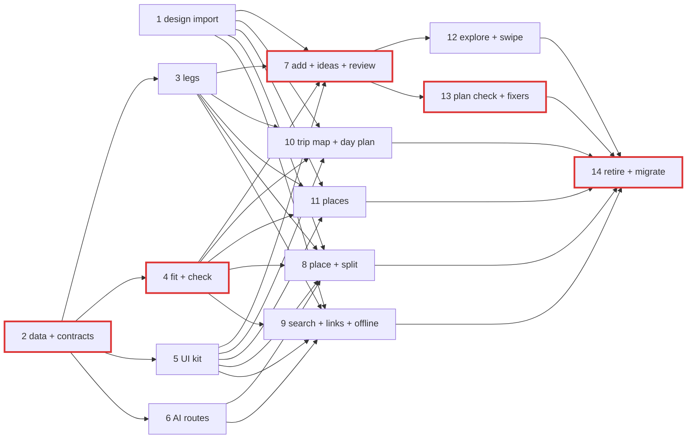

# Planning and places, section 7

| Field | Value |
|---|---|
| Goal | The trip's plan and its places become one experience: a trip map whose sheet runs from a day to the whole trip, a day plan with a live map, places that say when they fit your days, search that understands plain words and links, one Add to plan sheet, Ideas for everything saved but not placed, and a plan check that finds problems and fixes them, all working offline from what's saved |
| Design | Section 7 (30 renders `7a-1 … 7i-2`), worktree `/Users/quocs/Projects/critterpass-worktrees/design-refresh` commit `172fe7218` (landed by phase 1). Captions in `screens.json` are binding behaviour. Prototype `PARENT` map and `hub` prop ("Map first" / "Plan first") read for navigation |
| Replaces | 3d-1 Destination guide, 3d-2 Swipe together, 3d-3 Place detail, 3d-4 Map, 3e-1 Trip plan, 3e-2 Day planning, 3e-3 Review changes (full-build phases 29 and 30 hand these over; see phase 1 T5) |
| Builds on | #569 (accent-insensitive add search), #571/#575 (place photos, one place once), #576/#577 + D24 (live Foursquare details, never stored), #581 + D25 (OSM places and hours, live "More places"), dd9122ed1 (quality-aware search), #579 (day trips), #570/#573/#578 (guide in the trip), #588 (researched hours) |
| Docs | `docs/README.md` order; `product-decisions.md` §1 (D6, D10, D12, D21–D25), §2 (C1, C13, C28, C41, C44), §7 (Q-23, Q-24, Q-30, Q-37); `code-standards.md` §13, §15, §17; `system-architecture.md` §3–5 |
| Rules | As `plans/260926-1718-critterpass-full-build/plan.md` §1 and `CLAUDE.md`: owns lists, one commit per task, one PR per phase, test ladder (database tests via `pnpm test:remote`), device runs on GitHub Actions (Android default; iOS where sheets, keyboard or the paste control matter), `ui-reviewed` gate, no plan/phase/task ids in code, undesigned states logged. Branch from `origin/main`: the main checkout at `/Users/quocs/Projects/critterpass` is stale (#236) |
| Build | JS and server only: no native module, no EAS build. New infra: one private Valhalla service (founder decision 2) |

## Status (2026-10-04 13:50)

| | |
|---|---|
| Merged | Phases 1–10: the foundation (ids, data and contracts, stored legs on our own Valhalla, the fit engine and plan check job, the UI kit, the AI routes), then Add to plan, Ideas and the review (#613, #622), place detail and the crew split (#620), search, plain words and links (#618), and the trip map and day plan (#617). Phase 15's server half: every routed leg stores its road shape (#619; 3,399 legs backfilled on staging) |
| In review | Phase 11, places map and list (#616); phase 15's app half, routes drawn along the roads (#631); phase 16, GO (#624) |
| Being built | Phase 12 (Explore in a trip, swipe together, the destination guide) and phase 13 (the plan check and its fixers) |
| Not started | Phase 14 (retire the replaced screens), after 12 and 13 merge and the founder approves the day plan on device (decision 7) |
| Added by the founder on 4 Oct | Phase 15, plan routes drawn along the roads (07:38). Phase 16, GO: a route preview from where you are, then directions in Google or Apple Maps and a Grab ride (09:29, option 1). Outside this plan: the dates picker (`plans/261004-1030-dates-picker-polish/`, merged as #625) |
| Fixed along the way | Phones now get every place a trip references, whatever its curation (#626). A trip's plan lookups no longer grow with its edit history (#629). The Android device runs draw map text (`-gpu swangle_indirect`, in #617). The iOS 26 keyboard strip no longer trips the screen check (#623) |
| Switches | `planning.redesign` stays off on staging; Developer tools → "Planning redesign" turns the new screens on for one phone (#615) |
| Decided since the plan | All nine founder decisions as recommended (4 Oct 00:32). Crowd curves approved (4 Oct 09:24). No trip hold (4 Oct 01:15) |
| Estimate | Everything through phase 16 ready for the founder's device pass on Mon 5 Oct in the evening, give or take half a day. Then the switch goes on for everyone, phase 14 removes the old screens, and the full-build plan resumes |

Follow-ups queued, not in a phase yet:
- A trigger that rejects change sets on organiser-only versions, so the trip stream can drop its last per-edit lookup.
- Whether a places merge repoints plan stops and ideas to the surviving place.
- The duplicate-place cleanup for Bali and the other destinations (Đà Nẵng is done).
- GO on Explore's place cards (with phase 12).
- A real-data device flow for GO, once a seed has a trip in progress.

## Phases

| # | Phase | Screens | Tasks | Depends on | Wave | Status |
|---|---|---|---|---|---|---|
| 1 | [Design import, screen ids and back targets](./phase-01-design-import-screen-ids.md) | all 7x (ids, parents) | 5 | – | 1 | done (#593) |
| 2 | [Planning data, contracts and wiring](./phase-02-planning-data-contracts.md) | – | 6 | – | 1 | done |
| 3 | [Travel times and stored legs](./phase-03-travel-times-stored-legs.md) | legs for 7a, 7b, 7i-2 | 6 | 2 | 2 | done (#599, #602) |
| 4 | [Fit engine, place signals and the plan check job](./phase-04-fit-engine-plan-analysis.md) | fit/gaps/check data | 7 | 2 | 2 | done |
| 5 | [Planning UI kit, map layers and shared app data](./phase-05-planning-ui-kit-shared-data.md) | kit for all | 6 | 2 | 2 | done (#608) |
| 6 | [Planning AI routes](./phase-06-planning-ai-routes.md) | 7d-2, 7d-3, 7e-1/7e-3 (routes) | 6 | 2 | 2 | done (#601, #606) |
| 7 | [Add to plan, Ideas, placing them and the review](./phase-07-add-to-plan-ideas-review.md) | 7f-1, 7f-2, 7h-6, 7h-7 | 8 | 1, 3, 4, 5 | 3 | done (#613, #622) |
| 8 | [Place detail and crew can't agree](./phase-08-place-detail-crew-split.md) | 7e-1, 7e-2, 7e-3 | 9 | 1, 3, 4, 5, 6 | 3 | done (#620) |
| 9 | [Search, plain words, add from a link, and offline search](./phase-09-search-links-offline.md) | 7d-1…7d-4, 7i-2 | 10 | 1, 3, 4, 5, 6 | 3 | done (#618) |
| 10 | [Trip map, day plan, all days and the empty trip](./phase-10-trip-map-day-plan.md) | 7a-1…7a-3, 7b-1…7b-3, 7i-1 | 9 | 1, 3, 4, 5 | 3 | done (#617) |
| 11 | [Places map and list](./phase-11-places-map-list.md) | 7c-1…7c-3 | 5 | 1, 3, 4, 5 | 3 | in review (#616) |
| 12 | [Explore in a trip, swipe together and the destination guide](./phase-12-explore-swipe-destination.md) | 7g-1…7g-3 | 4 | 1, 4, 5, 7 | 4 | in progress |
| 13 | [Plan check and its fixers](./phase-13-plan-check-fixers.md) | 7h-1…7h-5 | 8 | 1, 3, 4, 5, 7 | 4 | in review (#630) |
| 14 | [Retire the replaced screens and finish the migration](./phase-14-retire-replaced-screens.md) | – | 6 | 1–13 | 5 | pending |
| 15 | [Plan routes drawn along the roads](./phase-15-road-routes.md) | route lines of 7a-1…7a-3, 7b-1, 7b-3 and the old MAP tab | 3 | 3, 5, 10 | 3 | in progress |
| 16 | [GO: the route from here, then directions in the maps app](./phase-16-navigate.md) | GO on 7e-1, 7b-1, 7a-2, day-of and the leave-by push | 4 | 3, 15 | 3 | in progress |

Merged and split where the code says so: "states and offline" is not a phase of its own: 7i-2 lives with search (its fallback is the search code) and 7i-1 with the trip map (it is the map's empty state); the three new model calls are one wave-2 phase so two wave-3 phases never edit the AI routing table; the fit engine and the plan check job share one phase because the job is the engine run over the whole trip; a data phase and a UI kit phase land first so wave 3 runs five lanes without touching migrations, streams, the generated mobile schema or each other's components.

## Waves and critical path

| Wave | Phases | Tasks | Lanes |
|---|---|---|---|
| 1 | 1, 2 | 11 | 2 |
| 2 | 3, 4, 5, 6 | 25 | 4 |
| 3 | 7, 8, 9, 10, 11, then 15 and 16 (added 4 Oct) | 48 | 7 |
| 4 | 12, 13 | 12 | 2 |
| 5 | 14 | 6 | 1 |

Critical path (35 tasks): 2 (6) → 4 (7) → 7 (8) → 13 (8) → 14 (6).

### Same-wave and cross-phase task order

| Task | Waits for |
|---|---|
| 3 T6 (planning travel into fit) | phase 4 done |
| 6 T5 (guide `fit_check` on the engine) | phase 4 done |
| 8 T5 (♡ in a trip), 9 T7 (save to Ideas), 11 T3 (swipe to save/hide) | 7 T1 merged (`save_idea`, `hide_place` handlers) |
| 8 T5 CTA → 7f-1, 9 T6 + → 7f-1 | 7 T4 registers `7f-1`; until then the existing add path |
| 10 T3 SWAP?/FILL IT, 10 T4 SEE | phase 13 registers `7h-*`; entries stay hidden until registered (`useScreenHref`) |

### Shared files (the only ones two lanes may touch)

Append-only, `merge=union` (phase 2 T5 / phase 5 T6): `services/api/src/planning/register.ts`, `services/worker/src/jobs/planning/index.ts`, `apps/mobile/src/features/planning-register.ts`, `docs/api-contracts-planning.md`, `docs/undesigned-states.md`. One import line and one registration line per phase. Re-pointing an old 3d/3e id is always a switch-aware registration from the new screen's own register module (imported last), never an edit to the old registration file. Every new synced table or column is phase 2's (a later need comes back to phase 2 as a delta, so the generated mobile schema has one owner).

## Rollout and rollback

Every section 7 screen ships behind the public config `planning.redesign` (off by default). With it off the app shows the 3d/3e screens unchanged; with it on, old ids (`3e-1`, `3e-2`, `3e-3`, `3d-1`…`3d-4`) resolve to the 7x screens, so trip hub tiles, inbox rows, pushes and deep links keep working. The founder turns it on for staging, then production after the release gate (staging fresh-user happy path with video). Rollback at any time = switch off, no release. Phase 14 removes the switch one release after production is on. Server changes are additive (expand-only migrations; `suggested_slot` kept for installed builds).

## Screen id map and where each screen comes from

| 7x | Phase | Route | Reused | Extended | New |
|---|---|---|---|---|---|
| 7a-1/2/3 Trip map | 10 | `(trip)/[tripId]/plan/map` (+ hub `/plan`) | plan reader/editor, `buildDayCards`, share slot, calendar export, region packs, presence | day rows (legs, issues, gaps) | trip map, map sheet, layers |
| 7b-1 Day plan | 10 | `(trip)/[tripId]/day/[day]` | item sheet, plan ops, lock rules | day screen → stop timeline | live mini-map, reorder |
| 7b-2 Map open | 10 | `…/day/[day]/map` | flyTo | – | stop strip, on-the-way labels |
| 7b-3 All days | 10 | `…/plan/days` | `moveToDayOp` | – | grid, sketches, cross-day drag |
| 7c-1/2 Places map | 11 | `(trip)/[tripId]/places` (+ `/explore/map`) | explore map tiles, carousel, filters, region pack card | filters fade, nearest-first | layer dots, suggest ranking |
| 7c-3 Places list | 11 | `…/places/list` | `ExploreListView` logic | groups, fit sort | swipe save/hide |
| 7d-1…4 Search | 9 | `(trip)/[tripId]/search`, `…/search/link` | fold + merge search, "More places", `ClipboardPasteButton`, `cp-ocr`, guide chat | server search filters, guide prefill | sheet, chips, link import, ways out |
| 7e-1/2 Place | 8 | `/explore/place/[placeId]` | photos, live details, crew row, Q&A, supplier cards, transition | place context | When it fits, sections |
| 7e-3 Crew split | 8 | `(trip)/[tripId]/split/[placeId]` | decision polls, chat cards | – | stances, compromise |
| 7f-1 Add to plan | 7 | `(trip)/[tripId]/add/[placeId]` | editor, time field, attendees, cost preview | – | add sheet |
| 7f-2 Ideas | 7 | `(trip)/[tripId]/ideas` | saved items, swipe matches | `save_place`, `swipe_vote` | Ideas, drag to day |
| 7g-1 Explore in a trip | 12 | `(trip)/[tripId]/explore` | destination screen, picks, swipe entry | trip mode | gaps card |
| 7g-2 Swipe together | 12 (+7 server) | `(trip)/[tripId]/swipe/[sessionId]` | whole swipe UI and server | match → Ideas | – |
| 7g-3 Destination guide | 12 | `/explore/[destination]` | destination screen | sticker hero | – |
| 7h-1 Plan check | 13 (+4) | `(trip)/[tripId]/check` | `checkFeasibility` | – | check job, screen |
| 7h-2 Fill a gap | 13 (+4) | `…/check/gap` | – | – | gaps, gap ideas |
| 7h-3 Less driving | 13 | `…/check/less-driving/[dayId]` | `scheduleDay`, lock rules | – | reorder engine |
| 7h-4 Rain and crowds | 13 | `…/check/rain/[dayId]` | `suggestWeatherMove`, weather change sets | multi-block swaps | climate normals, chart |
| 7h-5 Balance the crew | 13 | `…/check/balance` | must-dos, idea backers | – | screen, private ask |
| 7h-6 Placing ideas | 7 | `…/ideas/placing/[jobId]` | agent job runner + progress | – | placement engine |
| 7h-7 Review changes | 7 | `…/review/[changesetId]` | review screen, cards, chips, chat card, push actions | needs-you, driving chip, only-you | – |
| 7i-1 Nothing saved yet | 10 | trip map empty state | draft flow, swipe, community (when present) | – | empty sheet |
| 7i-2 Offline | 9 | search offline state | offline search, region packs, guide queue | durable queue | works-offline chips |

## Data and sync (detail in phase 2)

| New | Class | Stream |
|---|---|---|
| `trip_ideas` (crew ideas with backers, display copy, fit) | C1 | trip |
| `place_stances` (want / rather not + own words) | C1 | trip |
| `plan_legs` (per version; never a Navigation API result) | C1 | trip / trip_draft by version visibility |
| `plan_checks`, `plan_check_issues` | C1 | trip |
| `place_hides` | C2 owner-only | me |
| `member_asks` | C2 two-party | me (asker and member) |
| `route_cache` | C4 | none |
| `climate_normals` | C0 | none (HTTP) |
| Deltas: `crowd_forecasts` (editorial/visits sources), `change_sets` (new triggers; drafts author-only), `plan_items.custom_place`, `destinations.drive_factor`, `agent_jobs.kind` `place_ideas`, fair-use metrics | | |

Places on phones: still only curated POIs (≈ 386 for Đà Nẵng). The only new place data on phones is the display copy inside `trip_ideas` for places the crew saved (so Ideas and the map work offline even for open-data places) and approved editorial crowd curves for curated places. Open-data places stay server-only (D25). New routes, commands, AI routes, queues and channels: `docs/api-contracts-planning.md` (phase 2 T6, refined by each phase).

## Acceptance criteria

| Area | Criterion |
|---|---|
| Design | All 30 7x renders have EN and VI device screenshots in design \| device sheets, reviewed (`ui-reviewed`) per phase PR |
| Fresh user | On staging, Android and iPhone, no seed: new trip → 7i-1 → paste a TikTok link → places in Ideas → PLACE THEM FOR ME → 7h-7 → send → a second account approves → both phones show the stops with legs within 5 s of apply (phase 14 T5, video kept for the release gate) |
| Fit | Server and phone give identical fit for the shared fixtures; `POST …/fit` 50 places p95 < 800 ms on staging |
| Plan check | An edit that creates a clash shows on the trip within 60 s p95; FIX resolves it; the job makes no model call (test) |
| Offline | Airplane mode: day plan with stored legs, Ideas, search over saved and curated places; a plain-words question asked offline is answered within 2 min of reconnecting, as a ping |
| Privacy | Permission suites green for every new table; drafts author-only; hides owner-only; asks two-party; nothing from Balance in chat; no Foursquare attribute, social post text or Navigation API result stored (tests) |
| Performance | Trip and places maps with 500 places inside the Android dropped-frame budget (CI emulator) |
| Migration | With `planning.redesign` on, every old link (hub tile, inbox, push, deep link, proposal links) opens a 7x screen; with it off nothing changed; after phase 14 no 3d/3e id or PNG remains |

## Founder decisions needed

**Decided 2026-10-04 00:32 (founder: "all recommended"):** every row below takes its Recommendation column, including the product-decisions amendments it names (D21 crowds and routing, D23 place facts, Q-24 swipe matches to Ideas, C28 named stances as explicit public ballots, truthful copy by source). The owning tasks write those deltas into `docs/product-decisions.md`, quoting this line. Gated tasks are unblocked.

Each has a default the plan is written to; tasks gated on a decision say so.

| # | Decision | Options | Recommendation |
|---|---|---|---|
| 1 | **Plan hub**: what the trip's PLAN tile opens (prototype prop "Plan hub", default "Map first"; 7b-1 caption "The day is the home screen") | (a) Map first: 7a-1, the day one drag up; (b) Plan first: 7b-1 | (a) as the default of server config `plan.hub`; both are built, so it can flip without a release |
| 2 | **Routing / drive-time provider.** Mapbox §2.10.1: "Customer shall not export, download, cache or store results from any request to a Navigation API"; §1.9 forbids "bulk or automated queries" (`services/api/src/routing/README.md:17-18`). Section 7 needs stored legs offline, a background check and reordering | (a) self-hosted Valhalla 3.8.3 for all planning, tiles from destination boxes built in GitHub Actions, ODbL so results can be stored and synced, no live traffic (per-destination drive factor); Mapbox stays for live day-of ETAs. (b) Stadia Maps (hosted Valhalla + traffic; caching only while subscribed, ~$80/mo, terms unverified). (c) Mapbox only: no stored legs, straight-line "about" minutes offline and in the check. (d) Straight-line only | (a): it is D21's own "later swap" brought forward because this design makes drive time central. Also: `leave_bys.legs` stores Mapbox results today (`leaveby-recompute.ts:145,158`), a separate fix for the trip-day lane |
| 3 | **Crowd data source.** Design: hourly bars (7e-1), "Busy from 10" (7f-1), crowd lane and "Crowds are what crews saw here in October" (7h-4) | (a) editorial typical-week curves for curated places (content factory, ops-console approved like hours research #588) × the month's crowd index; copy "usually busy from 10". (b) (a) plus our own opt-in visit counts once ≥ 5 crews visited (C5), the only rows that may say "what crews saw". (c) BestTime (paid; storage terms unverified). (d) keep D21: no hourly bars, no crowd reasons | (b), amending D21; copy always names the source used |
| 4 | **Link import and screenshots**: scope and terms per platform (research 2026-10-03: TikTok oEmbed = caption, author, thumbnail, no views or duration; Instagram oEmbed lost author and thumbnail in Nov 2025, current token rules to re-check; YouTube Data API = title, description, duration, views, 30-day refresh rule, no captions of others' videos; Gemini paid tier does not train on inputs and reads public YouTube URLs in preview) | Per platform: TikTok oEmbed; YouTube Data API; Instagram oEmbed if it returns caption text, else "send a screenshot"; Google Maps: parse full URLs with no request, short links either resolve the redirect header only or are unsupported; Apple Maps URL params; screenshots: on-device OCR (`cp-ocr`) → DeepSeek text extraction, no image upload; Gemini fallback (text-less screenshots, YouTube video) behind `ai.gemini_vision` | Launch TikTok, YouTube, Maps full URLs, Apple Maps and OCR screenshots; Instagram through screenshots unless its oEmbed gives captions; short Google links resolved by header only; Gemini adapter built, flag off until terms are checked. Copy: "I read the post", not "I watched it", unless a video was actually analysed; no "1.2M views · 0:48" for TikTok. Nothing from a post is stored except the URL on the idea |
| 5 | **Balance the crew: where the numbers live** (7h-5 "Only the organiser sees this"). Inputs are already crew-visible: must-dos (C1), who saved a place in the trip destination (C1, phase 30 rule), the plan | (a) computed on the phone from synced data, shown to organisers only; (b) organiser-only server route (same inputs, no privacy gain, needs signal); (c) hide who-saved from members (breaks "SAVED BY ALEX + RIN" and Ideas faces) | (a); the private ask is an organiser-only command writing a two-party `member_asks` row; nothing about balance is stored or posted |
| 6 | **Metering** | Plan check: (a) deterministic, no model call, on no meter, debounced (singleton per trip, 45 s), ≤ 96 runs a trip a day, daily recheck; (b) count toward the editor's meter. Plain-words parse, link import, compromise options: (a) search/system work outside the 30/day guide meter with silent per-user caps (100 / 30 / 20 a day); (b) each counts as a question. ASK from no results and plain words queued offline: guide questions (metered as today). PLACE THEM FOR ME: system job under the per-trip system jobs cap (`fair_use.system_jobs_per_trip_day`, 40, wired for the first time) | (a) and (a) as listed |
| 7 | **Retire the 15-minute timeline, live cursors and the calendar tab** (section 7 shows none of them): the 15-minute timeline editor (lanes, resize, rain band, ghost, live cursors) and the plan's CALENDAR tab | (a) retire after the founder approves the day plan on device; times stay editable in the item sheet, calendar export moves under SHARE, weather suggestions show as the day plan note + 7h-4; (b) keep the timeline as an "edit times" mode (undesigned) | (a) |
| 8 | **The two-option vote on a split** (7e-3 "picking one posts it to the crew chat as a two-option vote") | (a) SUGGEST = vote between the chosen way and leaving the place out; "Put it to a vote" = vote between Tokek's two ways; (b) SUGGEST posts the chosen way as a proposal with no alternative | (a) |
| 9 | **Place facts** (ENTRY, WEAR, KNOW BEFORE YOU GO) need a source: see contradiction 5 | (a) add "place facts research" to D23's uses with the hours-research pattern (cited, console-approved before storage; phase 6 T6 + phase 8 T9); (b) editorial only from open data (OSM `fee`/`charge`) and founder edits; tiles hidden when unknown either way | (a) |

### What this design contradicts in product-decisions.md (quoted, not changed)

| # | Decision | Design | Proposal |
|---|---|---|---|
| 1 | D21: "hourly venue crowds wait for a source cheaper than BestTime, so crowd surfaces show the editorial month curve only" | 7e-1 hourly bars, 7f-1 "Busy from 10", 7h-4 crowd lane | decision 3 |
| 2 | D21: "routing is Mapbox Directions/Matrix at launch behind the routing provider, with self-hosted Valhalla as the later swap" | stored legs offline (7b-1, 7i-2), automated plan check (7h-1), reorder (7h-3) | decision 2 |
| 3 | Q-24: "Any member starts a swipe session; match = min(2, participants) yes; matches become ChangeSet suggestions needing organiser approval" | 7g-2: "the card drops into Ideas with everyone who said yes. Tokek finds it a day later, so nothing lands in the plan unannounced" | amend: matches go to Ideas; placing them still ends in a reviewed set (7h-7) under C41. Until amended, phase 7 T2 keeps the ChangeSet and also adds the idea |
| 4 | C28: "Never name the person; suppress in crews < 4; passive signals never shown to peers/organiser; own counters self-only" | 7e-3 names who'd rather not, with their words | treat WANT IT / RATHER NOT as an explicit public stance (like a named ballot), never a private objection; never derived from swipe "no" votes or hidden places; confirm |
| 5 | D23: "Never: … supplier offers, prices or reviews …" and "Web facts keep their source link and stay cite-only: never in plan changes, costs or structured outputs" | 7e-1 "ENTRY RP75K", "WEAR SARONG"; 7e-2 "Lockers by the pools, Rp 5k" | decision 9 |
| 6 | Truthful copy (system-architecture §1; D10's rationale "Truthful copy"); D24 "Foursquare's popularity score is not shown" | 7d-3 "I watched it", "1.2M views · 0:48"; 7h-4 "Crowds are what crews saw"; 7d-4 "that crews rate", "what crews who've been ate" before crew ratings exist | copy follows the source actually used (decisions 3 and 4); crew-rating lines wait for community plans data and read "that Tokek rates" until then |
| 7 | D6: "… No Google" | Google Maps links in "Add from a link" | decision 4: URLs parsed, no Google API |

Not contradictions, recorded so nobody relitigates: Q-30 (7f-1 "ADD TO SAT 17", 7h-3 "USE THIS ORDER" are the organiser's path; members get "SUGGEST …", logged as undesigned); C13 (placing ideas, fixes and swaps never consume a redraft); C44 (an organiser's draft stays theirs on the hub); C30 (Explore stays under Home and Trips).

## Top risks

| Risk | Likelihood × impact | Mitigation |
|---|---|---|
| Maps with sheets and layers drop frames on low-end Android | M × H | layer rendering (no per-pin views), perf flow in phase 5 before any screen, switch-off rollback |
| Routing decision late or Valhalla ops harder than expected | M × H | everything runs on straight-line "about" minutes until phase 3 lands; Stadia as the no-ops fallback |
| Fit says something wrong (closed when open, too far when fine) and trust drops | M × H | only our own hours, unknowns labelled, founder-reviewed fixtures, reasons visible on every fit |
| Privacy regressions (drafts, hides, asks, stances) | L × H | phase 2 permission and stream tests before any screen |
| Gesture complexity (drag to day, cross-day drag, sheet over map) | H × M | long-press activation, non-drag alternatives, device flows on both platforms |
| Five parallel lanes collide | M × M | disjoint owns, union-merged aggregators, contracts first |
| Founder on the Đà Nẵng trip until 2026-10-05 | known | no bulk writes to `da-nang` POIs before 2026-10-05 00:00 +07; nothing ships to production without the release gate |

## Open questions

1. ~~Does `deepseek-flash` read images in production?~~ **Answered 2026-10-04 00:55:** yes. A probe through the staging worker's key sent a generated "CAT 42" image to `deepseek-flash` on the Anthropic-format endpoint and got status 200 with the model describing "black text on a white background" (`.controller/deepseek-vision-probe.mts`). The four image routes are fine; the Gemini adapter stays only for decision 4's fallback cases.
2. Transit cities (Kyoto, Lisbon): legs are walk/drive only; adding transit needs GTFS routing (out of this plan unless the founder adds it).
3. Climate normals source: WeatherAPI history (existing vendor, sampled) vs NASA POWER (public domain, new vendor). Default WeatherAPI.
4. Plan check on an organiser's private draft: default no (the drafting flow validates drafts).
5. "+" on Explore picks saves to Ideas in one tap; "+" in lists opens Add to plan (two captions disagree; phase 12 open question).
6. Where people restore hidden places: default a "Hidden places" row in the list's sort menu.
