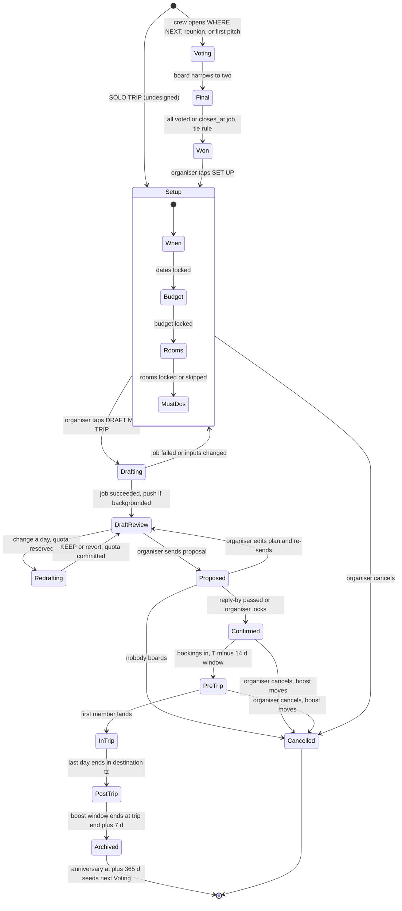

# Critterpass: Master Design Analysis (synthesis of 12 slice reports)

Date 2026-09-26 (rev. 2 after a completeness critique; see Revision notes at the end). Stack-agnostic. Every one of the 149 screens in `design/Critterpass.dc.html` is covered by at least one slice and traced in the §2 Screens column (149/149; the rejected/superseded 4a-1…4a-3 and 4b-2 are traced as reference-only on F-158). **[P]** = proposal for discussion; **Q-xx** = open question (§11.3).
Sources (all in `plans/reports/`, prefix `design-analysis-260926-1143-`):

| Code | Report | Code | Report |
|---|---|---|---|
| OH | onboarding-home (3a, 3b) | DT | during-trip (3k) |
| NT | next-trip-explore (3c, 3d) | CA | critters-after (3l, 3m) |
| PC | plan-proposal-crew (3e, 3f, 3g) | YC | you-community-help (3n, 3o, 3p) |
| BM | bookings-money-guide (3h, 3i, 3j) | SU | subscriptions (4a–4f) |
| OA | off-app-native-surfaces (5a–5c) | DS | design-system-prototype (tokens, components, motion, nav) |
| RE | critter-render-engine (doodles/critters-draw) | WS | web-store-social (site, links, store, social) |

The AI cost figures are research-stage estimates from `scratchpad/ai-cost-model.py`. They are not verified.

---

## 0. Executive summary

1. **Scope.** The design has 149 screens, which dedupe to **192 features** (§2). It also has about 160 component families, about 43 LLM capabilities, 28 realtime channels, and about 33 native surfaces. That is too big for one release, so §12 slices it into R0–R6. The **MVP proposal is R0–R3**.
2. **Three hard technical cores:**
   - (a) **Hybrid AI planning.** A deterministic cost and constraint engine owns every number and time. The LLM only selects and words (draft, redraft, proposal, guide chat).
   - (b) **Multiplayer plus offline.** Every write path must be idempotent and outbox-able, because the same ballot or "I'm up" can come from the app, a widget, a notification, a Live Activity, or offline.
   - (c) **Critter art pipeline.** One TypeScript core feeds a runtime renderer and baked assets. Widgets, Live Activities, notifications, icons, OG images and the web all need it.
3. **Real-world agency is the biggest product risk.** The design shows room holds, "I booked it", lottery entries, vendor WhatsApps, clinic calls and ride booking. These assume supplier APIs that mostly do not exist, so they start as concierge/manual or deep-link features.
4. **Platform physics break parts of the design:**
   - No custom motion or JS renderer on widgets, Live Activities or notifications.
   - No custom alarm UI on iOS (AlarmKit renders it).
   - Live Activities cannot start from the background, so they need push-to-start.
   - A 50 m dwell is finer than geofence resolution.
   - The app cannot pause, cancel or change a store subscription, and cannot read the card's last 4 digits.
   - There is no API to open the iOS add-widget sheet.
5. **Privacy boundaries run through the whole product:** private budget maxes, private guide threads, "tentative" calendar blocks, organiser engagement tracking, dietary and allergy data, faces, live location, and invitee PII. Some designed screens break their own promises (3f-6 vs 3f-4; 3n-3 "Nothing else" vs 10+ screens, C36).
6. **Monetisation contradictions must be settled before the entitlement engine is built:** Boost scope, crew readiness pips, "guide voice", icon and avatar gating, SOS copy, seat-cap scope, flight Live Activity gating, and which perks R3 may advertise (§0.2).
7. **Missing designs.** Empty, loading, error, offline, permission-denied and locked states are missing almost everywhere. About 22 flows are undesigned, including returning sign-in, the start-a-crew follow-up (only the 3g-3 entry exists), the inviter-side invite composer, a trip list/switcher for concurrent trips, solo trip, member-side setup, SOS sender, Help checklists, split editors, booking detail and all Android surfaces (§11.2).
8. **Content ops are a product in their own right:**
   - about 590 undefined critter forms (only Tokek and Pon have form art);
   - 6 guide persona packs;
   - the quiz, help articles, and emergency and insurance datasets;
   - legendary windows, and editorial season and crowd data.
9. **Compliance items:**
   - App Store: 3.1.1 (codes), 3.1.2 (subscription disclosures; perks advertised at R3 must actually ship, C48), 4.8 (SIWA), 5.1.1 (account deletion); new age-rating tiers (13+/16+/18+) questionnaire (UGC chat, location sharing).
   - Play policy: background location, exact alarms, full-screen intent; Data safety form; "Contains ads" label (free-tier sponsored picks, 4e-2 "SHOWN").
   - Gmail restricted scope (CASA assessment).
   - EU AI Act Art. 50 (in force since 2026-08-02).
   - GDPR special categories (diet, faces), and age-signal laws (Texas).
   - IP: trademark clearance of local critter names (e.g. Berlin "Buddy bear", RE risk 9); licences for destination photography (trailer, place pages).
10. **Android is undecided.** The design is iPhone-only, but the site says "Free on iPhone and Android". Platform scope is a stack-phase decision (Q-01).

### 0.2 Contradictions between slice reports and designs, with resolutions

| # | Topic | Conflict (sources) | Resolution **[P]** unless stated |
|---|---|---|---|
| C1 | Trip status model | NT: fine-grained setup states. OH: draft/proposed/booked/in_progress/done. PC: voting/drafting/proposed/confirmed/live/done. DT: phase planning/pre/in/post | One `Trip.status` machine (§1.4), plus a derived `phase` for UI and a `setup_step` sub-field |
| C2 | Poll models | OH DestinationPoll(round, open/final/closed/revealed); NT Poll(board/final); PC Poll(kinds); DT DecisionRequest; CA MvpPoll | One Poll+Ballot engine (F-049) with `kind ∈ {destination, generic, day_option, changeset_approval, decision, mvp}`. Destination polls have stage board→final. A DecisionRequest is a Poll(kind=decision) whose options point at ChangeSets |
| C3 | ChangeSet / GuideAction duplicates (PC, BM, DT, OH) | Three shapes with overlapping fields | **ChangeSet** = proposed plan mutation (ops vs base version). **GuideAction** = executed side effect with an inverse, compensation and audit. **GuideOffer** = the chat "I'M IN · 1 SLOT LEFT" card |
| C4 | "Place" and "tier" overloaded | OH Place=country/city/region; CA Place=country set; NT Place=POI. Place "tier" (set size) vs form tier (rarity) | Entities: **Destination** (city/region with guide coverage), **CritterSet** (country, `setGroup` 0–3), **POI** (venue). Rarity: common/rare/epic/legendary |
| C5 | Guide/place colours | Sardi/Lisbon is green (3b-1, 3b-3), blue (3b-2, 3b-6, 3c-1, 5b-2, 5c-1) and cyan (3c-1 voice). The site maps Tokek green, Lundi sky, Paco yellow (WS) | Canonical = 3b-1, the only screen showing all six with no collisions: Tokek yellow, Pon orange, Lundi blue, Ajo pink, Sardi green, Paco cream. `place.color = guide.color`; the site aligns. Needs designer sign-off (Q-90) |
| C6 | Rare ring colour | Green on 3n-1 vs blue on 3n-3/3n-4 and the tier token | Ring = rarity colour (rare = blue `#4f86ff`). Card background = form palette (Temple Tokek green) |
| C7 | Stamp ink colour | Yellow on 3a-5 and 3n-1 arrival; orange on 3a-6 and 3m-8 | Trip stamp ink = destination colour; home stamp = brand orange (Q-91) |
| C8 | Boost scope | 4e-2 table: ∞ guide "ON TRIP" only, no email or icons. Section intro: "Pass+ features on trip days". 4c-1 chip "PASS+ ON THE TRIP". 4a-1 (rejected) | 4e-2 is the contract. Boost = crew perks plus unlimited guide for all members, for that trip, during the boost window. No mailbox import, no icons. Chip copy becomes "UNLIMITED PON" (Q-70) |
| C9 | First trip free (FTF) | Boost trial, and "everyone has Pass+ until a week after landing" | FTF = Boost **plus** Pass+ for every member until trip end + 7 d. 4c-2 "PAUSES … ALL ICONS" is consistent with this |
| C10 | Leave-by crew pips | 5a-1 has a FREE badge; the OA matrix lists pips as BOOST | Pips are free under the "anything that keeps someone on time stays free" rule. The crew meet-up Live Activity stays Boost (Q-71) |
| C11 | SOS inside Boost copy | 4f-2 and 5a-6 mention "…and SOS" vs the safety rule | SOS and Help location sharing are **always free**. Remove SOS from Boost copy |
| C12 | "Guide voice in notifications" (Pass+) | The OA matrix gates it, while 5b-1 guide-voiced notifications are free. 4e-2 gives Free "Guide chat, voice, camera · 30 A DAY"; 3n-2 "Talk out loud · Voice replies when you speak first" is the reply behaviour of voice mode (3j-2); the 3n-2 chattiness, 3n-8 language and 5b-4 budget samples look like ordinary free settings | Everything visual is free (guide as sender, persona copy, roundup). Voice mode and its "Talk out loud" replies are free within the 30/day meter (Pass+ = unmetered, F-095). Settings samples are free and unmetered (pre-rendered, AI-41). The Pass+ perk narrows to an optional spoken read-out of notifications and the roundup, or is dropped (Q-72) |
| C13 | Redraft quota | 3c-9 organiser-only vs 4c-1 "pon only gave us 3" (crew pool); Pass+ adds none (4e-2) | Counter is **per trip**, shared by whoever may draft. Reserve on submit, release on failure; a reverted redraft still counts. In-trip swaps, weather replans and dropout re-splits don't count. Pass+ gives no extra redrafts, as designed (Q-73) |
| C14 | Countdown target | 3b-2 card says "OCT 12" but the timer maths lands on Oct 13 15:08; 3k-1 "WHEELS UP" is per user | Viewer's first outbound departure if known, else trip start 00:00 in destination tz. Home, hub, widget and LA all use this one source |
| C15 | Leave-by times | Alarm at 03:10 (5b-3) vs 03:00 (5c-4, 3k-2 "rings Alex and Dev at 03:00"). Pickup 03:30 vs "Made is outside" at 03:10 | `LeaveBy{leaveAt 03:10, pickupAt 03:30}`. The alarm fires at leaveAt − lead (default 10 min), and only for members not yet up. The alarm UI shows leaveAt. Fix the copy |
| C16 | Flight LA start | 3h-1 "3 h before boarding" vs 5a-3 "morning you fly" | Push-to-start at boarding − 3 h (inside the 8 h cap). Restart after landing for the pickup face |
| C17 | Leave-by LA layout | 3k-3 is compact with no button; 5a-1 has the trail and I'M UP | 5a-1 is canonical |
| C18 | Notification sender | 3k-3 shows the gecko icon on Maya's message; 5b-1 says crewmates are senders | 5b-1 rule: crewmate = their avatar; guide = guide avatar; feature (Balances) = category tile |
| C19 | Encounter mechanic | 3l-4 hold-to-befriend 1.5 s vs 5a-4 dwell while the phone is locked; 3l-5 "over" vs 5a-4 "drains slowly" | Dwell = eligibility (ring fills with dwell, counts in background). In-camera hold = optional ceremony with an accessible alternative. Wander-off = grace period + slow drain; "over" when the ring drains to 0 (Q-60) |
| C20 | Golden Tokek window | 3l-9 "any day, hardest thing" vs 3m-7 "dry season May–Sep" | Challenge any day; season shown only as a forecast hint (Q-61) |
| C21 | Locked silhouettes | Caption says "never the critter"; the HTML draws each critter's true silhouette | Use true silhouettes (as the markup does). Names stay server-side until found |
| C22 | Counts | "9/150" (3l-2) vs "8 critters" (3n-1, 3n-9) vs "10 UNLOCKED" (3n-4) | Dex count = distinct locals found. Forms count separately. Avatar grid = owned forms |
| C23 | Icon and avatar gating | 4e-2 "Icon styles, avatars 2/ALL" vs 3n-5 (FACE and STICKER free, PASSPORT default, STAMP Pass+) vs 4d-2 "Icons: Sakura Pon and 11 more" lost on cancel vs "none can be bought" | Earned critter icons and critter avatars are never gated. Styles: default + free alternates per 3n-5; STAMP and future styles are Pass+. On lapse, only Pass+ styles revert (Q-74) |
| C24 | Money movement | Legal Terms say a "payment processor" (WS); BM assumes no in-app transfers | No in-app money movement in v1: PayNow/bank deep links, QR codes, mark-paid. Fix the Terms |
| C25 | Location trail | Legal: "not a trail of coordinates". Recap shows a route and "214 KM"; 4c-2 keeps "MAP TRAIL"; 4f-2 replays positions. Check-in features need more than plan stops: 3l-7 "Eat at five different warungs", 3m-5 "Back twice in one day", "Late to 3 pickups", 3o-3 visited-place deck | Store a simplified per-day route from plan stops + ride legs, not raw GPS. The 4f-2 teaser uses a synthetic replay. Check-ins use POI-level **visits** (F-189: poi, arrived, left; no coordinates; opt-in; TTL). Update the policy copy to "places you checked in at, never a trail of coordinates" |
| C26 | Seat cap and split | Trip-level evidence: 3a-10 ticket "SEAT 5 OF 6"; 4f-1 "KYOTO · SEAT 7" and "a seat opens if someone drops out". Crew-level evidence: 4b-3 "Nobody gets removed from the crew"; 4e-2 "Crew size". 3f-7 keeps a dropout in the chat, so a crew-level cap frees no seat for waitlisted Sam. SU uses `seatCap(t)`. 4f-1 "7 ways" vs 4b-3 "6 ways"; 4b-3 CTA counts down to $2 while checkout charges $12 | Cap applies to **trip seats** = participants with RSVP ≠ out: 6, or 16 while that trip is boosted. Crew membership is not seat-capped (hard ceiling 16 [P]); nobody is removed when a boost ends. An RSVP out (even if kept in chat) frees a seat → waitlist offer (N-43). A 7–16-member crew planning an unboosted trip seats 6 and waitlists the rest, or boosts (Q-26). Split covers seated participants at purchase. The CTA shows the charged price; the share is shown in the body |
| C27 | Which guide is "in" chat and the FAB | 3g-1 shows Tokek, 4c-1 shows Pon, for the same crew | Context guide = in-trip trip > next confirmed > proposal/draft trip. One guide per trip thread (Q-20) |
| C28 | Private objection and engagement leak | 3f-4 "Winston only sees maybe" vs 3f-6 "Alex asked me privately about cost". Recipients also see peers' passive engagement: 3f-3 (Rin's view) "Maya watched the trailer twice", hype that "fills whenever anyone reacts"; `proposal:{id}` fans reactions and hype to all recipients; 4f-2 "You opened it 41 times in Bali" | Never name the person: "Someone asked about cost". Suppress in crews under 4 (re-identification risk). Passive signals (opens, views, trailer watches, open hours) are never shown to peers or to the organiser as counts; the organiser sees statuses only. Recipients see explicit reactions and an aggregate hype %. Own counters ("You opened it 41 times") are self-only. Replace "Maya watched the trailer twice" with reaction copy (§10.4) |
| C29 | Wallet tab | Highlighted on 3h-1, 3i-1 and 3i-6, but there is no switcher | WALLET tab = segmented BOOKINGS \| MONEY |
| C30 | Explore entry | "← EXPLORE" exists but there is no Explore tab | Explore lives under HOME (guide grid, search, tip) and TRIPS. No 6th tab (Q-21) |
| C31 | Itemised receipts vs idea board | 3i-3 designs itemised split, yet 3p-4 lists "SPLIT RECEIPTS BY ITEM · BUILDING", "PACKING LISTS PER CREW", "LEAVE-BY ALARMS ON THE WATCH" | Read the idea board as post-v1.0 roadmap hints: itemised receipts come after MVP |
| C32 | Paywall routing | The prototype routes 4b-1 and 4c-2 to the rejected 4a-1. 4a-2 (boarding pass, "ICONS ALL 24") and 4a-3 (gold cover, "No sponsored picks in Explore", "Every app icon and critter avatar") are also rejected directions; 4b-2 is superseded by 4e-2 | Implement only 4e-1, 4e-2 and 4e-3. 4a-1…4a-3 and 4b-2 are reference only (traced on F-158; do not build). Fix prototype routing |
| C33 | Token drift app vs site | `#1f1b38` vs `#221e3d`, `#fffdf6` vs `#fffaf0`; 12 Archivo widths including 58/60, below the axis minimum of 62 | One DTCG token source. Widths 62/66/70/78/100 |
| C34 | Invite fixtures | 3a-10 "YOU / WHEREVER" with W M A J; 3a-12 HOME SIN; 3a-11 and the web show M A J R | Fixture cleanup. The per-person estimate uses the invitee's origin once known |
| C35 | Demo data | Seat 34A vs 14A; plates DK 1234 vs 1842; summit 06:02 vs 06:10; Critterdex bar 18% vs 6%; Dev "paused" vs moving; heatmap shows 6/6 with only 5 calendars synced; 3d-3 "MUST-DO · RIN" on Fushimi Inari vs Rin's must-do Arashiyama (3c-7); 5b-1 "Dev owes you $41" / "Maya paid you back $92.10" vs 3i-1/3i-5 (Rin −41, Jordan −92.10, Dev 0.00); 3i-4 "all seven" lines vs the 3-line receipt with the same total (3i-3); 3j-1 "4 seats held" for a crew of 6; icon counts 3n-3 "5 of 9" vs 3n-5 "4 STYLES · 3 EARNED" / "3 OF 6" vs 4a-2 "ALL 24" vs 4d-2 "11 more"; 3n-1 PASS+ chip on Sep 25 vs 4e-3 "ADMITTED 02 NOV 2026"; boarding 08:25 (3h-1) vs ~08:02 (5a-3) | Fixture list only; not product decisions. Pre-app stamps and "SINCE 2022" on 3n-1 are a product question (F-191, Q-49) |
| C36 | Crew-visible profile data | 3n-3 promises "Your crews see your name, avatar and home airport. Nothing else." Crewmates also see: taste tags (3b-3 reasons with avatars; 3f-3 "YOU PICKED STREET FOOD"); collection (3a-13 "6 critters", 3l-2 "Maya has 14", 3l-3 ALSO HAS IT, 3l-4 "Maya befriended one here"); Pass+ status (4b-1); engagement (3f-3); dietary consequences (3i-1 "Jordan skipped the pork", 3j-3 "ALEX ✕ PEANUTS"); behaviour awards (3m-1 "Dev slept through the summit", 3m-5 "Late to 3 pickups"); location and readiness (3g-4, 3k-2) | The crew-visibility matrix in §10.4 is the contract; each data type has an explicit rule and control. Rewrite 3n-3 to "Your crews see your profile, your pass and what you do on trips together. Your budget, private chats and calendar stay private." (Q-18) |
| C37 | Flight Live Activity, boarding ping, delay fixes: gating | 3h-1 shows no tier: the top pass "pins itself to the lock screen three hours before boarding", "Tokek pings you when boarding opens". 5a-3 is "PASS+ · from your email"; the OA card lists "Flight and pickup LA, from your email" as Pass+; F-172 said "needs mailbox import". Free forward/scan/paste (F-101) flights and 3k-5 delay fixes for manual flights (DT Q10) are unaddressed | [P] Flight tracking, the boarding ping (N-41) and the flight LA work for **any** flight in the wallet (forward, scan, paste, manual), under the C10 "keeps someone on time stays free" rule. The Pass+ perk is that flights are found and added from email automatically (the 5a-3 chip is a source badge). Delay auto-fix entitlement stays Q-78 but is source-agnostic. NEXT FLIGHT widget stays Pass+ as designed (Q-5A) |
| C38 | Special stickers vs "never bought" | 3i-5 Settled Tokek (for settling debts) and the 3l-7 crew-level sticker (XP) vs "earned only by physically being there, never bought"; dex "9/150" (3l-2) | [P] Stickers are not critters: a separate sticker shelf on the pass, not counted in the dex, not forms, not usable as avatars or app icons, never purchasable. The Settled Tokek ships at MVP as a one-off grant inside F-108; crew-level stickers ship with quests (F-129/F-130) (Q-6A) |
| C39 | Home set vs location off at home | 3l-8 "HOME SET · VIETNAM 3/10" and the 3n-5 HOME SET icon, yet 3a-9 "Off when you're home": a resident of the home-set country can never collect it (CA Q10). Winston's home is Singapore (3a-5) but his home set is Vietnam | [P] Home set = the country of the user's home airport (Winston → Singapore; the Vietnam card is fixture data), or one global starter set by design decision. Collecting it at home needs an explicit foreground-only "explore at home" opt-in; background location stays off at home (Q-64) |
| C40 | Spawn rule semantics | 3l-3 rare requirement "Three water temples", yet it was befriended in one Tirta Empul encounter (3l-4, 3l-6); SpawnRule any_of vs set_count undecided (CA Q3). 3m-7 draws the epic form without its pose and edge (RE Q9) | [P] `SpawnRule.kind ∈ {presence, any_of, set_count, window, co_presence}`. "Three water temples" = any_of (the form lives at any of three); change the requirement copy to "At a water temple", or keep set_count and fix the 3l-4 fixture (Q-6B). Epic always adds pose + pink edge at every size bucket; 3m-7 is a design bug |
| C41 | Decision and approval authority | Each flow has its own rule: 3e-3 "SEND TO CREW · NEEDS 3 YESES"; 3j-1 PROPOSE TO GROUP (threshold?); 3k-5 one viewer can APPROVE the crew's dinner move ("NEEDS A YES"); 3k-8 "4 of 6 said swap" + SWAP THE DAYS; 3k-9 an option "messages whoever's waiting before you've even pressed the button"; 3b-4 inbox APPROVE/KEEP. The vote must also finish inside the 3j-1 hold ("4 seats held for 20 min"). F-080 says only "quorum"; Q-37 covers autonomy only | [P] Every approval is a Poll(kind=changeset_approval \| decision) with `decider_policy ∈ {organiser, any_affected, majority_of_affected, threshold_n}` and `closes_at` ≤ the earliest hold expiry. Defaults: spends money or affects others → majority of affected (organiser breaks ties); time-critical in-trip fixes (3k-5, 3k-9) → any affected member, with UNDO and a notice to the rest; personal-only → self. On expiry, keep the current plan (Q-38) |
| C42 | Album tied to settling | 4c-2 "Settle up before Sunday and I'll send the album" vs "KEPT FOR GOOD · 312 PHOTOS" on the same screen (SU risk 15, Q25): reads as gating content on payment | The album is never gated on payment. Copy: "Settle up before Sunday. The album's yours either way." (Q-7F) |
| C43 | Room-hold length | 3f-1 "Hold the rooms for 5 days" (sent Sep 24 → Sep 29) vs 3f-4 "Rooms held until Sep 30" = reply-by (PC Q9). 3j-1 "4 seats held for 20 min" vs the length of a group vote | [P] Hold end = min(supplier free-cancel deadline, reply-by). The builder shows the resulting date, not a day count. Group votes on held items close before the hold lapses (C41). Holds are concierge-only until F-103 (§12 MVP variants) (Q-48) |
| C44 | Draft privacy vs member fit checks | The draft is organiser-only (3c-9, 3c-12 "ONLY YOU SEE THIS"), yet Dev sees "FITS DAY 1" (3c-10), and 3c-7 checks must-dos "against the draft" before 3c-8 drafts it. 3c-12 "I booked it" spends money on a draft the crew has not seen (NT Q13) | [P] Before drafting, fit = feasibility against dates, hours and the trip skeleton (no day numbers). After drafting, members see fit status only (fits / tight / clash), never day structure, until the proposal. No bookings or spend on an unsent draft: "I booked it" becomes "I found a free-cancel slot" (link-out, §12 fakes) (Q-39) |
| C45 | Help/SOS map on unboosted trips | 3k-6 "CREW CAN SEE YOU · 1H" and 3k-10 "See him on the map" / I'M GOING walking directions rely on the crew map (3g-4), which 4f-2 gates behind Boost with a teaser. C11 makes Help/SOS sharing free but no viewing surface was defined | Help/SOS sessions open a free, session-scoped map (sender pin, responders, walking directions) on any trip. The 4f-2 teaser and the paywall governor are suppressed in Help/SOS contexts. The full crew map stays Boost |
| C46 | Boost window display vs rule | Rule: purchase → trip end + 7 d (§8). Display: trip-anchored ranges "KYOTO · APR 2–16" (4b-5, 4c-1) and FTF "OCT 12–26" (4e-1, 4d-1). Redrafts are used before the trip (4f-3; 4c-1 "used them all on day 2"), so the window must be active pre-trip. §8 did not state the FTF start (SU Q3/Q4) | Keep the rule. Copy shows "ON NOW · UNTIL APR 16" with the trip dates separately. FTF starts when the crew's first trip enters Setup (§1.3) and ends at trip end + 7 d (Q-7G) |
| C47 | Queued question: midnight vs morning | 4b-1 "I'll be back at midnight", "ASK AT MIDNIGHT", "RESETS 00:00" vs N-36/AI-40 "morning, not 00:00" | [P] The quota resets at 00:00 in the user's current device tz (Q-76). The queued question is answered at reset (counts toward the new day) and delivered as a passive notification (no sound), then resurfaced in the morning briefing if unread. Design copy stays |
| C48 | Perks sold at MVP vs perks shipped | R3 puts Pass+, Boost and FTF on sale, but the paywall promises later perks: 4e-1 "Guide chat, voice and camera without limits" (F-095/F-096, R5); 4e-3 "Bookings pulled from your email" (F-102, R4); 4e-1 Boost "Redrafts, live map, crews of 16" and the 4e-2 "Live crew map" row (F-051, R4); 5c-5 NEXT FLIGHT and the 5a-3 flight LA (F-172, R4); 3m-9 printed postcard (F-136, R5) | Paywall perk lists and matrix rows are server-driven (F-158, F-019) with a `shipped` flag. The R3 paywall, comparison, welcome, 4c-2 and 4d-2 copy list only delivered perks (§12 MVP variants). Alternative: pull F-095/F-096 into R3. Avoids App Store 3.1.2 and consumer-law exposure (Q-7D) |

---

## 1. Product summary, loops, roles, lifecycle

**Product.** Critterpass is a mobile group-travel planner.
- **Crews** seat up to 6 people per trip, or 16 when that trip is boosted (seats are per trip, C26). Users can belong to several crews.
- **Guides.** Each trip is run by a destination **guide critter**. There are 6 live guides: Tokek (Bali), Pon (Kyoto), Lundi (Iceland), Ajo (Mexico City), Sardi (Lisbon) and Paco (Cusco). Tokek acts as **guest guide** anywhere else.
- **What the guide does:** pitches places, drafts the itinerary, writes each friend a personal proposal, runs the trip day, fixes disruptions, and ends up as a stamp on the pass.
- **Collectibles.** 150 locals × 4 forms across 61 places, earned only by physically being there. They are never bought or traded.
- **Metaphor.** The whole product uses a passport/visa/stamp metaphor.
- **Money.** Pass+ is per person ($3.99/mo, $29.99/yr). Trip Boost is per trip ($12, split-able; $59/yr crew). A crew's first trip is free.
- **Surfaces.** Designed for iPhone 390×844 with iOS system surfaces. Plus a marketing and invite website, store assets and a social kit.

**North-star targets from the design:**

| Target | Value |
|---|---|
| New pass | ~45 s |
| Invite link → "you're in" | ~15 s |
| Draft | ~20 s |
| Menu stickers | ≤1.5 s |
| Voice first audio | ≤1.5 s (derived) |
| Must-do suggestions | ≤150 ms |
| Duplicate-idea match | <300 ms |

### 1.1 Core loop

| Stage | Screens | Actor / trigger | AI involved | Output → next |
|---|---|---|---|---|
| Vote | 3b-2, 3b-3, 3b-6, 3c-1, 3c-2, 5b-2, 5c-1 | Any member pitches; everyone votes; closes when all have voted or at the deadline | Streamed pitch, tie sentence | Winning destination → Setup |
| Setup | 3c-3…3c-7, 3c-10 | Organiser drives; members give private inputs (calendar, max, must-do) | Best-window reason, fit checks, room grouping | Dates, budget, rooms, must-dos locked → Draft |
| Draft | 3c-8, 3c-9, 3c-11, 3c-12, 3o-2 | Organiser; guide job (private) | Drafting agent, redraft diffs | Itinerary vN (organiser-only) → Proposal |
| Proposal | 3f-1…3f-7, 4f-1 | Organiser sends; each invitee responds | Personal versions, objection options, resend suggestions | RSVPs IN, holds, egg granted → Book |
| Book | 3h-1, 3h-2 | Anyone adds; guide finds in email | Email extraction | Wallet + auto-expenses → Pre-trip |
| Pre-trip | 3b-2, 3k-1, 3e-*, 3g-*, 3i-*, 5c-* | Crew edits the plan, chats, pays | Briefings, replans | Offline day bundles → On-trip |
| On-trip | 3k-*, 3j-*, 3h-3, 5a-*, 5b-* | Everyone; guide monitors | Briefing, disruption agent, chat, voice, camera | Activity events, photos, expenses → Collect and Recap |
| Collect | 3l-1…3l-10, 5a-4 | Each member, physically at spots | Quests, hints | Collection, XP, stickers → Recap |
| Recap | 3m-1…3m-9, 3o-3, 3o-4, 3p-6 | System at trip end | Recap copy, awards, album picks, postcard note | Stamp, recap, published plan → Memory |
| Memory | 3m-10, 3l-9, 4c-2 | Scheduled +365 d; legendary windows | Memory line | PLAN A REUNION → a new Vote (loop closes) |

### 1.2 Roles

| Role | Who | Can | Notes / limits |
|---|---|---|---|
| Organiser | Crew member who starts the trip (3a-13 "organiser") | Run setup and lock steps; draft and redraft (private until sent); build and send the proposal; apply re-splits; approve disruption changes that cost money (decider policy per flow, C41) | Co-organisers and transfer are undesigned (Q-11). The draft is organiser-only (3c-9) |
| Member | Crew member / trip participant | Pitch; vote; give private inputs; RSVP; chat; add bookings and expenses; buy a Boost; publish the plan? (Q-80) | Rights to edit the plan and drag days are undefined (Q-30) |
| Invited guest | Invitee who has not claimed a seat yet (app, pre-account) or a web viewer | See the ticket and trailer ("Just look around first"); issue an anonymous pass; claim a seat | Waitlisted state (Sam, 4f-1); web shows only the public subset (WS §2) |
| Former / dropout | Declined (3f-7 "Keep Dev in the chat") or deleted account | Keeps chat, photos and recap if kept in chat | Deleted accounts appear as "former member" (3n-9) |
| Guide (AI) | Per-trip critter persona, a participant in chat | Pitch; draft; DM members privately; post; take autonomous reversible actions with UNDO; propose ChangeSets | Must ask for anything that costs money, affects others or is irreversible (F-052). Never sees budget maxes |
| Guest guide | Tokek outside the 6 live cities | Same, with a lighter data pack | Data coverage limits (Q-22) |
| Payer roles | Boost buyer (any member); Pass+ holder | Buying unlocks crew perks; a Pass+ holder makes crew-chat guide answers unmetered for the crew (4b-1) | Crewmate Pass+ status is disclosed ("Maya has Pass+") (Q-75; crew-visibility matrix §10.4, C36) |
| Ops agent (human) | Concierge desk **[P]** | Vendor messages, holds, escalations on behalf of the guide | Not designed; needed for the "fake at first" plan (§12) |

### 1.3 Trip lifecycle state machine

| Transition | Trigger (who/what) | Side effects |
|---|---|---|
| → Voting | Member pitches (3b-3, 3d-1, 3b-8), reunion (3m-10) or WHERE NEXT | Poll(kind=destination, stage=board). A pitch made during a final is queued for the next round |
| Voting → Final | Rule TBD (organiser, candidate cap or time) (Q-12) | Board folds into the split card (3b-6); vote-closing LA push-to-start |
| Final → Won | Close job at `closes_at` or when all have voted. Tie → cheaper for the majority's origin, with prices frozen at close | Reveal-once flag per user (3c-2); widget and lock-screen flip; loser goes back in the deck |
| Won → Setup | Organiser only | Setup inbox tasks for members; FTF grant if this is the crew's first trip (FTF window starts here, C46) |
| Setup substeps | Organiser locks each step (member views undesigned). Members submit calendar, max and must-do | Availability recompute; anonymous dots; typing presence |
| → Drafting | Organiser | AgentJob (F-074); organiser-only channel; optional holds (concierge) |
| Redrafting | Organiser; 4f-3 before the last free one | Atomic quota reserve/release; diff card |
| → Proposed | Organiser SEND (3f-1) | Per-recipient versions; push "I wrote a version for you"; reply-by and hold timers |
| Proposed → Confirmed | Reply-by passes, or organiser locks with ≥1 IN (rule TBD, Q-40) | Unopened/maybe → out or waitlist; holds converted or released |
| PreTrip → InTrip | Flight-landed webhook, arrival geofence, or manual "I've landed" | Egg hatch (3l-1); music theme switch; Bali stamp fills; location trip-mode on |
| InTrip → PostTrip | Destination-tz midnight after the last day, or return-flight landing (Q-62) | Crew-map sharing off; recap job; settle-up nudges; FTF ending push at end − 3 d |
| → Archived | Boost/FTF window ends (end + 7 d) | Perks pause; plan, album, recap and critters kept forever |
| → Cancelled | Organiser | Boost moves to the next trip or becomes a credit (Q-77); holds released |

**Sub-state machines (one line each):**
- **Candidate:** pitched → on_board \| queued → final → won \| back_in_deck.
- **RSVP:** unopened → opened → maybe \| in \| out; plus waitlisted. `out` frees a trip seat (C26); the first waitlisted invitee gets an offer (N-43), never an auto-join (Q-45).
- **Booking/hold:** none → held → booked \| released. A hold ends at min(free-cancel deadline, reply-by) (C43).
- **Encounter:** idle → accruing (in radius) → ready → befriended \| draining → wandered_off.
- **LeaveBy:** scheduled → window (LA live) → alerting → departed \| cancelled.
- **Subscription:** active → grace \| billing_retry → on_hold → expired; also paused, cancelled_active.
- **Account:** anonymous → registered → closed (30 d) → purged \| restored.

---

## 2. Feature inventory (deduplicated, 192 features)

**Legend**
- **Cx:** S / M / L / XL.
- **Ent. (entitlement):** Free / Pass+ / Boost / FTF (first trip free); "unmetered" = does not count against the 30/day guide meter.
- **MVP:** Y / N / Partial. MVP = R0–R3 in §12: one crew goes vote → setup → draft → proposal → bookings and money → trip-day basics with offline and safety → hatch and commons Critterdex → recap-lite, with Pass+, Boost (without the live map) and FTF on sale.
- Slice-report features are merged into these rows. Traceability is by screen ids: all 149 ids appear in the Screens column (rejected/superseded 4a-1…4a-3 and 4b-2 on F-158 as reference-only).

| ID | Feature | Area | Screens | Cx | Deps | Ent. | MVP | Reason |
|---|---|---|---|---|---|---|---|---|
| F-001 | Design tokens package (DTCG → app, extensions, site, renderers; semantic colour roles, type, motion, cue ids) | Platform | all | M | – | – | Y | everything consumes it |
| F-002 | Fonts + script fallbacks (Archivo width instances, Geist, Geist Mono, Caveat; vi/CJK/Thai fallbacks) | Platform | all | M | F-001 | – | Y | brand + extensions |
| F-003 | Motion runtime (loop presets on a shared clock, one-shot entrances, stamp/slap/deal/flyTo/odometer/flap/typewriter/confetti/sheen; reduce-motion policy; slowmo) | Platform | all | L | F-001 | – | Y | brand-critical |
| F-004 | Nav shell (5-slot tab bar + guide FAB tap/hold; 10 transitions; detents; edge-swipe/drag-dismiss; back-stack synthesis from PARENT map; state groups) | Platform | all | L | F-003 | – | Y | app skeleton |
| F-005 | Feedback bus (haptic map incl. hold ramp and SOS buzz; SFX categories; per-guide music with landing crossfade; quiet hours + temple mute; silent switch) | Platform | 3n-7, all | L | F-003; F-023 for temple mute (R3+) | – | Partial | haptics+SFX at R0; temple mute with location (R3); music R5 |
| F-006 | Critter art core (TS display list extracted from doodles.js / critters-draw; canonical seeds; form spec {palette, pose, edge}) | Platform | all | XL | – | – | Y | critical path |
| F-007 | Runtime sticker renderer (Skia-class backend; cached images; blink = 2-frame swap; ≤2 concurrent draw-ons) | Platform | all | L | F-006 | – | Y | lists and heroes |
| F-008 | Critter asset pipeline (build-time bake per size bucket; colour/mask/mono/tinted; LA, widget, notification, avatar, icon, OG, store; golden tests) | Platform | 5a–5c, 3n-5, web | L | F-006 | – | Y | extensions cannot run JS |
| F-009 | Critter content ops (600 forms: names, notes, palettes, poses, rules, geofences, windows; CMS; art direction for pose-less archetypes) | Platform | 3l-* | XL | F-006, F-025 | Free | Partial | MVP: 6 guides × 4 forms + 144 commons |
| F-010 | Realtime sync (channels, ACL, presence, typing, element-anchored cursors, versioned ops, fan-out) | Platform | 3b–3g, 3k | L | – | – | Y | multiplayer core |
| F-011 | Offline store + outbox (encrypted local DB, UUIDv7 client ops, ordered flush, per-op conflict results) | Platform | 3k-4, all writes | XL | F-010 | – | Y | trips go offline |
| F-012 | Trip/day offline bundle (plan, tickets, contacts, phrase audio, FX table, map region, help context) + prefetch triggers | Platform | 3k-4, 3n-2 | L | F-011, F-031 | Free | Y | "offline maps stay free" |
| F-013 | LLM gateway (persona packs, tool registry, structured/streamed output, validators, numbers-from-tools, C3 redaction, metering hooks, cache, model routing, evals, moderation) | Platform | all AI | XL | – | – | Y | every AI feature |
| F-014 | Agent job runner (durable steps, progress stream, retries, compensation, idempotent side effects, push on completion) | Platform | 3c-8, 3f-1, 3k-5 | L | F-013, F-010 | – | Y | draft/proposal jobs |
| F-015 | Domain events + activity log (append-only; feeds ticker, inbox, recap, analytics) | Platform | 3k-1, 3b-4, 3m | M | F-010 | – | Y | integration hub |
| F-016 | Notification router (always/budgeted/roundup classes, ping budget, quiet hours, dedupe/collapse/expiry, per-tz day, roundup queue) | Platform | 5b-1, 5b-4 | L | F-015 | Free | Y | every slice notifies |
| F-017 | Push + sender identity (APNs/FCM, NSE, Communication Notifications, MessagingStyle, threads, token hygiene) | Platform | 5b-1 | M | F-016, F-008 | Free | Y | guide-as-sender |
| F-018 | Link resolver + deep-link router (/i, /p, /r, /plan, /g, /locals, /app; AASA/assetlinks; alt UL host; custom scheme for extensions) | Platform | 3a-10, web | L | F-010 | – | Y | invites are the growth loop |
| F-019 | Entitlement engine (user + trip scopes, all sources, server-driven limits, extension cache, push invalidation) | Platform | 4*, 5c-5 | L | – | – | Y | gates everywhere |
| F-020 | Cost & constraint engine (versioned quotes, per-origin shares, allocation/rounding, re-split; validator for hours, transit, bookings, must-dos) | Platform | 3c-1, 3c-5, 3c-9, 3e-3, 3f-3/4/7 | XL | F-021, F-030, F-032, F-033 | – | Y | one price truth |
| F-021 | Money & FX primitives (minor units, ISO exponents, FX snapshots, HOME/LOCAL/BOTH formatter, compact notation) | Platform | 3i-*, 3n-8 | M | – | – | Y | money correctness |
| F-022 | Permission orchestrator (primer with live demos, OS prompt mapping, status mirror, ask-later triggers, when-in-use → always, AlarmKit / exact alarm, camera, microphone + speech recognition, photo library read vs add-only, Live Activities user toggle, Settings deep links; contacts and dialing need no prompt) | Platform | 3a-9 + in context (3a-3, 3a-12, 3j-2, 3m-2, 3m-6) | L | F-017 | – | Y | notifications at R1 |
| F-023 | Location engine (trip-mode gating, background sessions, geofences, dwell accrual, hysteresis, battery budget, mock flags) | Platform | 3l-4, 3g-4, 3k-6 | XL | F-022 | – | Partial | MVP: foreground + Help share |
| F-024 | Analytics & experiments (taxonomy §10.5, funnels, consent, cookieless web) | Platform | all | M | F-015 | – | Y | funnels and targets |
| F-025 | Back-office (content CMS, moderation queues, feedback triage, idea statuses, concierge console) | Platform | none designed | L | – | – | Y | minimal; ops need it |
| F-026 | Localisation framework (ICU plurals, runtime in-place switch, uppercase at render, per-script line-height, LLM output language, local-word markup) | Platform | 3n-8 | L | F-002 | – | Partial | framework yes, en-only launch |
| F-027 | Accessibility layer (Dynamic Type strategy, doodle labels, gesture alternatives, contrast fixes, live regions) | Platform | all | M | F-003, F-004 | – | Y | store + EAA |
| F-028 | Island toast + press/gesture kit (non-Dynamic-Island banner variant) | Platform | proto, all | S | F-003 | – | Y | confirmation pattern |
| F-029 | Anti-abuse (App Attest / Play Integrity, rate limits, SMS pumping, code enumeration, bot filtering) | Platform | 3a-8, 3a-11, web | M | – | – | Y | OTP and codes |
| F-030 | POI & destination data (canonical IDs, tz-aware hours, categories, licensed photos, geofence authoring, city index) | Data | 3b-7, 3c-10, 3d-*, 3l | L | 3rd-party | – | Y | drafting + search |
| F-031 | Map platform (custom dark style, annotations, clustering, offline regions) | Data | 3d-4, 3g-4, 3h-3, 3k-9 | L | 3rd-party | Free | Y | explore + offline |
| F-032 | Routing/ETA (walk, scooter, drive, transit; matrix; closures) | Data | 3d-4, 3k-2, 3g-4 | M | F-030 | – | Y | leave-by + drafting |
| F-033 | Flight price & route data (price calendars per origin × dest × month, durations, stops) | Data | 3b-3, 3c-1, 3c-5, 3d-1 | L | 3rd-party | – | Y | start with cached estimates |
| F-034 | Season & crowd data (month crowd + events; hourly POI forecasts) | Data | 3c-3, 3d-1, 3d-3, 3l-5 | L | 3rd-party / editorial | – | Partial | editorial months first |
| F-035 | Weather, marine, hazard feeds (hourly precip, point/elevation, marine, volcano) | Data | 3e-2, 3k-2, 3k-7 | M | 3rd-party | – | Partial | basic weather |
| F-036 | Flight status tracking (webhooks, gate/boarding, co-travellers, landed/delay events) | Data | 3h-1, 3k-5, 3l-1, 5a-3 | L | F-100 | – | Y | landed → hatch |
| F-037 | Trip & plan model (Trip.status machine, PlanDay/PlanItem stable IDs, lanes/subgroups, participants/RSVP, tz) | Plan | 3c–3e | L | – | – | Y | core domain |
| F-038 | Anonymous-first pass (draft state machine, live preview, ICAO MRZ, pass number, local issue + sync) | Onboarding | 3a-1…3a-6 | M | F-006, F-003 | Free | Y | first-run hook |
| F-039 | Taste profile (6-question quiz content, tag taxonomy, chips mode, retake, crew-visible tags) | Onboarding | 3a-4, 3a-12, 3n-1 | M | F-038 | Free | Y | feeds every prompt |
| F-040 | Avatar system (guide/critter sticker with rarity ring, initials; photo with segmentation + moderation; PNG variants for OS surfaces) | Onboarding | 3a-3, 3n-4 | L | F-007, F-008 | Free | Partial | photo avatar later |
| F-041 | Home airport search (bundled dataset, fuzzy search, IP-geo nearest, home currency, local "home" word) | Onboarding | 3a-5, 3n-3 | M | F-021 | Free | Y | prices start here |
| F-042 | Auth + account upgrade (SIWA, Google, phone OTP; link/merge; returning sign-in (undesigned); SIWA revoke) | Onboarding | 3a-7, 3a-8 | L | F-029 | Free | Y | save the pass |
| F-043 | Invites & join codes (seat tokens, CSPRNG 6-char codes, expiry/rotation, channel tags, bot-filtered opens, transactional claim vs seat cap) | Onboarding | 3a-10, 3a-11, 3g-3 | L | F-018, F-019 | Free | Y | growth loop |
| F-044 | Deferred deep linking (Play Install Referrer; iOS paste control; phone-hash match; first-launch resolver; App Clip optional) | Onboarding | 3a-10 | XL | F-043 | – | Y | App Clip later |
| F-045 | Invited fast path (prefill with provenance, LLM tag inference, 3-tap issue, manifest + welcome line) | Onboarding | 3a-12, 3a-13 | M | F-038, F-039, F-042, F-043, F-013 | Free | Y | 15 s target |
| F-046 | Referral programme (attribution, qualification, stamps/covers ledger, fraud, dashboard undesigned) | Onboarding | Site-Referral | L | F-043, F-044 | Free | N | post-PMF growth |
| F-047 | Crews (create (3g-3 entry "Name it and share the code"; follow-up flow undesigned), join, switch with theme, member colours up to 16, invites JOIN/LATER, leave/mute (undesigned)) | Crew | 3g-3, 3b-2 | M | F-043 | Free (6) | Y | unit of use |
| F-048 | Crew chat (messages, rich cards, mentions, typing, unread, media, report, outbox) | Crew | 3g-1 | XL | F-010, F-011 | Free | Y | coordination hub |
| F-049 | Poll & ballot engine (all kinds; sources app/widget/notification/LA; idempotent; deadlines; quorum) | Crew | 3b, 3c-1, 3g-1, 3g-2, 3e-3, 3k-8, 3m-5 | M | F-010 | Free | Y | voting is free |
| F-050 | Live collaboration (anchored cursors, anchored comments and +1, guide accommodation KEEP/UNDO) | Crew | 3g-2 | L | F-010, F-049, F-052 | Free | N | polish |
| F-051 | Crew live map (sharing window/pause/auto-off, pins/trails, meet-up, 60 s ETAs, PING ALL, on my way) | Crew | 3g-4 | XL | F-023, F-032, F-019 | Boost | N | background location, R4 |
| F-052 | Guide autonomy & undo policy (autonomous vs approval rules, audit, inverse patches) | Crew | 3b-4, 3g-2, 3k-5 | M | F-014 | – | Y | trust and safety |
| F-053 | Home mode machine (first-run / everyday / final / no-trip / in-trip / post; header; HomeState; offline cache) | Home | 3b-1, 3b-2, 3b-6 | M | F-047, F-054 | Free | Y | entry screen |
| F-054 | Next-trip countdown (tz-correct target, plan %) | Home | 3b-2, 3k-1 | S | F-037 | Free | Y | cheap delight |
| F-055 | Inbox / action items (fan-out, needs-you vs earlier, inline actions shared with notification/widget, undo, empty watch) | Home | 3b-4, 3b-5 | L | F-015; F-052 for guide-action undo (R2) | Free | Y | decisions land here; undo items from R2 |
| F-056 | Nudges (guide-voiced, send-time model, caps; non-installed invitees have no push token → inviter share-sheet relay [P], SMS/WhatsApp/email only with consent, cost and anti-spam rules, Q-19) | Home | 3a-13, 3b-4, 3f-6, 3k-1, 5c-2 | M | F-016 | Free | Y | simple timing first |
| F-057 | Proactive tip strip (price drop / season insight) | Home | 3b-2 | M | F-033, F-013 | Free | N | needs price history |
| F-058 | Destination board (candidates, pitch queue, sticker layout, live voters) | Vote | 3b-2, 3b-6 | M | F-049 | Free | Y | loop start |
| F-059 | Guide pitch (streamed, tool-grounded, taste reasons, alternatives, cached) | Vote | 3b-3 | L | F-013, F-033, F-039 | Free (unmetered) | Y | signature moment |
| F-060 | Final showdown (elimination to 2, deadline job, tie rule on frozen prices, reveal-once) | Vote | 3c-1, 3c-2 | M | F-058, F-020 | Free | Y | loop core |
| F-061 | Place search + guest guide (any city, locals silhouettes, guest persona brief) | Vote | 3b-7, 3b-8 | M | F-030, F-009, F-013 | Free | Y | coverage beyond 6 cities |
| F-062 | Solo trip (skip vote/RSVP; undesigned) | Vote | 3d-1, 3b-8 | M | F-037 | Free | N | undesigned |
| F-063 | Destination guide page (month bars re-priced for crew airports, picks, save, pitch/solo) | Explore | 3d-1 | M | F-033, F-034 | Free | Y | pitch entry |
| F-064 | Place detail (hourly crowds, tips, crew Q&A, add-to-day slot, share) | Explore | 3d-3 | M | F-030, F-034 | Free | Y | crowd chart optional |
| F-065 | Explore map (pins with avatars, filters, carousel, guide sprite, offline search) | Explore | 3d-4 | L | F-031, F-032 | Free | Y | basic pins |
| F-066 | Saved places, saved plans & lists (♡ SAVE, SAVED filter) | Explore | 3d-1, 3b-8, 3d-4, 3o-2 | S | F-030 | Free | Y | cheap |
| F-067 | Swipe together (live deck, card notes, WHY THIS?, match rule, auto-slot) | Explore | 3d-2 | L | F-010, F-013, F-078 | Free | N | delight, R5 |
| F-068 | Sponsored picks (labelled free-tier slots; undesigned) | Explore | 3d-1, 3o-1 | L | F-019 | Free only | N | undesigned; ads policy |
| F-069 | Setup wizard shell (stepper, step machine; member views undesigned) | Setup | 3c-3…3c-7 | S | F-037 | Free | Y | frames setup |
| F-070 | Availability & dates (device calendars → date-level free/busy; manual fallback; heatmap; best window; no-fit options; private ask) | Setup | 3c-3, 3c-4 | L | F-022, F-034 | Free | Y | OAuth calendars later |
| F-071 | Private budgets (write-only maxes; server-bucketed anonymous dots, hidden for crews <4; band that never reveals the lowest max; knob; breakdown) | Setup | 3c-5, 3n-2 | M | F-020 | Free | Y | privacy promise |
| F-072 | Rooms & stays (trait grouping, drag swap, per-room pricing) | Setup | 3c-6 | M | F-039, F-020 | Free | N | MVP: skippable, even split |
| F-073 | Must-dos (prompt to each member, presence, per-keystroke suggestions + fit, freeform, book-ahead/lottery flags) | Setup | 3c-7, 3c-10 | L | F-030, F-020, F-010 | Free | Y | draft input |
| F-074 | Drafting agent (candidate pools + solver + LLM narrative + validator + step stream; p50 ≤20 s) | Plan | 3c-8, 3c-9 | XL | F-013, F-014, F-020, F-030, F-032, F-034 | Free (unmetered) | Y | core value |
| F-075 | Private draft versions & review (organiser ACL, versions, must-do coverage) | Plan | 3c-9 | M | F-074 | Free | Y | "only you see this" |
| F-076 | Day redraft + diff (reason chips, ops on stable IDs, computed metrics, keep/revert, quota reserve/release, last-redraft sheet 4f-3) | Plan | 3c-11, 3c-12, 4f-3 | L | F-074, F-075, F-019 | Free 3/trip; Boost ∞ | Y | Boost driver |
| F-077 | Trip plan overview (days, chips, weather, drag reorder, presence, guide-touched sweep) | Plan | 3e-1 | M | F-037, F-010 | Free | Y | shared plan |
| F-078 | Day view + simple edit (item detail (undesigned), time picker, add/remove) | Plan | 3e-2, 3k-2 | M | F-077, F-020 | Free | Y | editable plan |
| F-079 | Timeline drag editor (15-min snap, lanes, collision reflow, remote cursors, rain band, a11y steppers) | Plan | 3e-2 | XL | F-078, F-050 | Free | N | XL polish |
| F-080 | ChangeSet review & approval (shared diff card, per-change accept, apply vs send with quorum, stale detection) | Plan | 3e-3, 3c-12, 3j-1, 3k-5, 3f-7 | L | F-049, F-037 | Free | Y | reused by 5 flows |
| F-081 | Personal plan overlay ("Apply to my plan only", JUST ME) | Plan | 3e-3, 3j-1 | L | F-080 | Free | N | semantics open |
| F-082 | Weather replan suggestions (forecast watcher → solver + LLM ghost) | Plan | 3e-2 | L | F-035, F-074 | Free | N | R4 disruptions |
| F-083 | Plan Map/Calendar views + calendar export | Plan | 3e-1 | M | F-065 | Free | N | undesigned |
| F-084 | Proposal builder (format, toggles, reply-by, hold row (hidden until F-103; MVP shows the saved rate's free-cancel date, C43), preview-as, send with progress) | Proposal | 3f-1 | M | F-085 | Free | Y | loop core |
| F-085 | Personalised versions (per recipient: slides, poster, postcard, highlights, savings; no private leakage) | Proposal | 3f-1…3f-3 | XL | F-013, F-014, F-039, F-020 | Free (unmetered) | Y | signature moment |
| F-086 | Story player (5–6 s slides, Ken Burns, word stamps, reactions, pause; used by trailer + recap) | Proposal | 3f-2, 3m-3…9 | L | F-003, F-085 | Free | Y | shared component |
| F-087 | Your version page (why-chips, share donut, savings toggles, aggregate hype (C28), hold timer (with F-103)) | Proposal | 3f-3 | M | F-085, F-020 | Free | Y | conversion |
| F-088 | Private objection sheet (reasons, repricing options, follow-up; strict privacy) | Proposal | 3f-4 | L | F-020, F-013 | Free (unmetered) | N | MVP: MAYBE + guide DM |
| F-089 | Slide-to-board RSVP (scrubbed 6 s choreography, a11y action, egg grant) | Proposal | 3f-5 | M | F-003, F-037 | Free | Y | commitment moment |
| F-090 | RSVP tracker + guide suggestions (segments, activity lines, resend-at-hour, offer-to-all) | Proposal | 3f-6 | L | F-015, F-016, F-056 | Free | Y | smart suggestions later |
| F-091 | Dropout re-split & waitlist (reply intent, rooms/bookings/splits, apply or ask crew, seat → waitlist) | Proposal | 3f-7, 4f-1 | XL | F-080, F-020, F-072 | Free | N | MVP: manual remove + recompute |
| F-092 | Web previews (proposal, recap, read-only plan, locals pages; undesigned) | Proposal | 3a-10, 3o-4, 3m-9 | L | F-018, F-140 | Free | N | undesigned |
| F-093 | Guide chat (sheet, group/private threads, streaming persona, tool ChangeSets, quick actions (CALL A CAR / TRANSLATE A MENU hidden until F-104 / F-096; JUST ME apply until F-081), quota meter) | Guide | 3j-1, 4b-1 | XL | F-013, F-080, F-019 | Free 30/day; ∞ Pass+/Boost | Y | Pass+ driver |
| F-094 | Guide in crew chat (@mention replies, proactive posts, book-slot offers with explicit confirm) | Guide | 3g-1, 4c-1 | L | F-048, F-093 | 4b-1 rule | Y | MVP: mentions only |
| F-095 | Voice mode (streaming STT → LLM → TTS, barge-in, level-driven waveform; "Talk out loud" spoken replies, C12) | Guide | 3j-2, 3n-2 | L | F-093 | counts in 30/day | N | cost + latency |
| F-096 | Point and ask (live OCR, translation stickers, dietary flags, follow-ups, order card, allergy caution) | Guide | 3j-3 | XL | F-093, F-098 | counts in 30/day | N | safety review needed |
| F-097 | Phrase cards + TTS (local phrase + gloss, pre-rendered audio, show mode, offline) | Guide | 3h-3, 3k-6 | M | F-013 | Free | Y | Help depends on it |
| F-098 | Dietary & accessibility profiles (capture UI undesigned; consent; visibility) | Guide | 3c-8, 3i-3, 3j-3 | S | F-039 | Free | Y | drafting input |
| F-099 | Queued question at reset (answered at the 00:00 reset, passive delivery, resurfaced in the morning briefing, C47) | Guide | 4b-1 | S | F-093, F-016 | Free | N | nice limit UX |
| F-100 | Bookings wallet (typed stack, detail/edit undesigned, offline barcodes/PDFs, boarding-pass mode, .pkpass optional) | Bookings | 3h-1 | M | F-012 | Free | Y | trip essentials |
| F-101 | Booking import: forward/paste/scan (crew inbound address, JSON-LD then LLM, dedupe, ADD/IGNORE candidates, auto-expense, BCBP decode) | Bookings | 3h-2 | L | F-013, F-100, F-105 | Free [P] | Y | zero-typing wallet |
| F-102 | Mailbox auto-scan (Gmail/Graph restricted scopes, daily job, trip filter, consent) | Bookings | 3h-2, 3n-2 | XL | F-101 | Pass+ | N | CASA lead time |
| F-103 | Supplier holds & agentic bookings (room holds, activity booking, lottery entry, release on revert) | Bookings | 3c-8, 3c-12, 3f-1, 3j-1 | XL | F-014, F-117 | – | N | concierge / "saved rate" first |
| F-104 | Rides (transfer partners or deep links, live driver, ETA, book next leg, auto-split) | Bookings | 3h-3 | XL | F-032, F-105 | – | N | no public APIs |
| F-105 | Expense ledger & balances (multi-currency, FX snapshot, crew currency, split modes, rounding, realtime, outbox) | Money | 3i-1, 3g-1 | L | F-021, F-011 | Free | Y | always free |
| F-106 | Add expense UI (keypad, payer, split editors BY SHARE/CUSTOM undesigned) | Money | 3i-2 | M | F-105 | Free | Y | core money |
| F-107 | Receipt scan (MVP: total + even split; later: itemised auto-assign, failure path) | Money | 3i-3, 3i-4 | L | F-105, F-098, F-013 | Free (unmetered [P]) | Partial | itemised after MVP (C31) |
| F-108 | Settle up (min-transfer netting, statuses, nudge/remind, payout methods revealed to payer, PayNow/bank links; Settled Tokek one-off sticker grant to everyone at the last payment, C38) | Money | 3i-5 | L | F-105, F-016 | Free | Y | close the money loop |
| F-109 | Trip budget & forecast (planned vs actual by category/day, forecast line) | Money | 3i-6 | M | F-105, F-071 | Free | N | nice-to-have |
| F-110 | Trip hub + trip list (phase-aware, 4 live tiles (QUESTS tile hidden until F-129), ticker; list/switcher for concurrent trips, e.g. Bali in progress while Kyoto votes, Q-07) | Trip | 3k-1, 3e-1 | M | F-015, F-053 | Free | Y | TRIPS tab root |
| F-111 | Morning briefing (per-user daily job, typed actions, event inserts, dedupe with roundup) | Trip | 3k-1, 5c-2 | L | F-013, F-016 | Free (unmetered) | Y | template-first |
| F-112 | Day-of + leave-by engine + readiness ("I'm up", escalation, packing list) | Trip | 3k-2 | L | F-032, F-037 | Free | Y | on-time promise |
| F-113 | Leave-by alarm (AlarmKit / exact alarm + full-screen UI; snooze-once; crew knock; offline) | Trip | 5b-3, 5c-4 | L | F-112, F-022 | Free | Y | "on time stays free" |
| F-114 | Offline mode UI (banner, still-works list, queued list, reconnect, conflicts) | Trip | 3k-4 | M | F-011, F-012 | Free | Y | trust offline |
| F-115 | Flight-delay agent (impact analysis, autonomy policy, action stream, approvals, undo) | Trip | 3k-5 | XL | F-036, F-052, F-117 | TBD (Q-78) | N | MVP: alert + manual replan |
| F-116 | Forecast watch list + storm decisions (3-hourly ingest, impact scoring, options, crew decision, swap days) | Trip | 3k-7, 3k-8 | XL | F-035, F-080, F-049 | TBD (Q-78) | N | R4 |
| F-117 | Vendor comms / concierge desk (WhatsApp/SMS/email/voice, reply parsing, human ops) | Trip | 3k-5, 3k-9, 3k-10 | XL | F-025 | – | N | human ops first |
| F-118 | Running-late rerouting (live ETA vs booked slot, closures, options, subgroup split) | Trip | 3k-9 | XL | F-032, F-117 | TBD | N | depends on vendors |
| F-119 | Help hub (emergency numbers, reverse geocode, nearest facility, 4 checklists (undesigned), phrase card, 1 h location share) | Trip | 3k-6 | L | F-097, F-121, F-023 | Free | Y | safety |
| F-120 | Crew SOS (sender flow undesigned, breakthrough alert, takeover, responders, resolve; deterministic fan-out) | Trip | 3k-10, 5a-2 | L | F-023, F-017 | Free | Y | safety, never gated |
| F-121 | Insurance vault + consented sharing | Trip | 3k-6, 3k-10, 3h-1 | S | F-100 | Free | Y | Help input |
| F-122 | Egg + arrival hatch (granted at boarding; hatches on landed / geofence / manual) | Critters | 3f-5, 3l-1 | M | F-036, F-089 | Free | Y | differentiator |
| F-123 | Critterdex / pass tab + sets (counts, filters ALL/FOUND/NEAR ME, here-now, legendary-on-dates, home set (C39), ranked rows; sticker shelf kept outside the dex, C38) | Critters | 3l-2, 3l-8 | M | F-009, F-007 | Free | Y | PASS tab root |
| F-124 | Critter detail + make-it-my-guide skin + share card | Critters | 3l-3 | M | F-007, F-140 | Free | Y | collection depth |
| F-125 | Encounter engine (spawns, 50 m dwell, drain/grace, offline evaluation, signed evidence, anti-spoof) | Critters | 3l-4, 3l-5, 5a-4 | XL | F-023, F-009 | Free | Partial | MVP: foreground dwell |
| F-126 | Encounter UI + befriend (camera scene, hold ceremony, wandered-off, befriended, fly-to-pass) | Critters | 3l-4…3l-6 | L | F-125, F-003 | Free | Y | core fun |
| F-127 | Legendary windows + reminders (calendar strip, after-dark/sunrise rules, month-before nudges) | Critters | 3l-9, 3l-10 | L | F-009, F-125 | Free | N | only 6 windows exist |
| F-128 | Crew co-presence legendary (all N at a spot by a time) | Critters | 3l-3, 3l-7, 3l-9 | L | F-125, F-010 | Free | N | multi-device proof |
| F-129 | Crew quests + XP/level (daily LLM from plan, verifiable templates, progress events, rewards) | Critters | 3l-7, 3k-1 | XL | F-013, F-015, F-125 | Free | N | R5 |
| F-130 | Special stickers (crew-level sticker; simultaneous grant; sticker shelf outside the dex, C38; the Settled Tokek ships earlier inside F-108) | Critters | 3i-5, 3l-7 | S | F-108, F-129 | Free | N | with quests |
| F-131 | Recap generation pipeline (trip-end job, stats, route legs, receipt, awards, got-away, stamp, LLM copy, re-run on late data) | After | 3m-1…3m-9 | XL | F-013, F-015, F-105 | Free | Partial | recap-lite at MVP |
| F-132 | Recap summary + story cards (8 cards, music, choreography) | After | 3m-1, 3m-3…9 | L | F-086, F-131 | Free | Partial | 4 cards at MVP |
| F-133 | Crew awards + MVP vote | After | 3m-5 | M | F-131, F-049 | Free | N | tone risk |
| F-134 | Passport stamps + live signatures | After | 3m-8, 3n-1 | M | F-131, F-010 | Free | Y | pass metaphor |
| F-135 | Postcard composer (photo, LLM note, 3 formats, send to crew) | After | 3m-9 | M | F-140 | Free | N | R5 |
| F-136 | Printed postcard mailing (addresses, print vendor, tracking, 1 per trip) | After | 3m-9 | L | F-135, F-019 | Pass+ | N | vendor + PII |
| F-137 | Shared album (background upload, offline queue, live stream, day grouping; viewer undesigned; ingestion mode (manual pick vs auto by trip dates; 3k-4 queues 12 photos offline) and library access level open, Q-6C) | After | 3m-2, 3k-4 | L | F-011 | Free | Y | trips = photos |
| F-138 | Album curation AI (blur/duplicate/aesthetic scoring, faces → members opt-in, picks, note) | After | 3m-2, 3o-4 | L | F-137, F-013 | Free | N | biometric consent |
| F-139 | Anniversary memory + reunion vote | After | 3m-10 | M | F-131, F-058 | Free | N | fires at +365 d |
| F-140 | Share image renderer (critter card, recap cards, 9:16 story, postcard, poster, memory) | After | 3l-3, 3m-*, 3o-4 | M | F-008 | Free | Y | virality |
| F-141 | Profile page (stats, stamps, taste, crews, MRZ) | You | 3n-1 | M | F-039; F-134 for trip stamps (R3); F-191 for stats | Free | Y | identity; R1 shows home/issued stamps only |
| F-142 | Edit profile (name, unique username, home airport, languages) | You | 3n-3 | S | F-041 | Free | Y | basic |
| F-143 | Settings framework (synced vs device prefs, chattiness, talk out loud, privacy rows, offline pack, permission-denied states) | You | 3n-2, 3n-6 | M | F-022 | Free | Y | basic |
| F-144 | Sound settings + music themes (per-guide themes, volumes, SFX categories, quiet on road) | You | 3n-7 | M | F-005 | Free | N | music licensing |
| F-145 | Language & currency settings (16 locales, in-place switch, app-wide price mode) | You | 3n-8 | M | F-026, F-021 | Free | Partial | currency Y, locales later |
| F-146 | Alternate app icons (styles × appearances, earned icons, bundled in binary) | You | 3n-5, 4e-3 | L | F-008, F-019 | Free styles + Pass+ STAMP; earned free | Y | Pass+ perk |
| F-147 | Data export (async zip, emailed link) | You | 3n-6, 3n-9 | M | – | Free | Y | GDPR |
| F-148 | Account deletion + sign-out safeguards (preflight, hold, 30-day undo, pre-purge reminder [P], purge/anonymise, SIWA revoke, web deletion URL; confirmation by email, or SMS/in-app for phone-only accounts) | You | 3n-9…3n-11 | L | F-042; F-105 for the owed-money preflight (R3) | Free | Y | store requirement |
| F-149 | Crew plans browse (filters, taste-match ranking, guide's pick) | Community | 3o-1 | L | F-152 | Free | N | cold start |
| F-150 | Shared plan detail + copy into draft (fit-check merge job, overlap note) | Community | 3o-2 | L | F-074, F-080 | Free | N | needs corpus |
| F-151 | Rate the trip + place tips (card stack, anonymous tips, moderation) | Community | 3o-3 | M | F-131, F-025 | Free | N | seeds corpus |
| F-152 | Publish plan with privacy controls (preview, toggles, face blur, PII scrub, unlisted link) | Community | 3o-4 | XL | F-138, F-092 | Free | N | consent model open |
| F-153 | Help centre (hub, articles CMS, search; reader undesigned) | Help | 3p-1 | M | F-025 | Free | Y | support URL required |
| F-154 | Feedback + shake-to-report (mood, category, screenshot, device info, outbox, fix-shipped loop) | Help | 3p-2, 3p-3 | L | F-025, F-055 | Free | Y | minimal form |
| F-155 | Idea board + duplicate detection (vote budget, statuses, crew faces, embeddings) | Help | 3p-4, 3p-5 | M | F-025 | Free | N | later |
| F-156 | Rating prompt rules (eligible after a good trip, suppression, one prompt arbiter per screen) | Help | 3p-6 | S | F-131, F-159 | Free | Y | cheap |
| F-157 | Store billing (products, purchase with account token, server verification, store notifications, reconciliation, restore) | Monetise | 4e-1, 4b-4, 4d-* | XL | F-019, F-042 | – | Y | revenue; R0 = sandbox spike only, production in R3 after F-042 |
| F-158 | Paywall visa + comparison + welcome (disclosures, localised prices, server-driven perk lists so R3 copy lists only shipped perks, C48) | Monetise | 4e-1…4e-3; reference only: 4a-1, 4a-2, 4a-3 (rejected directions), 4b-2 (superseded by 4e-2); do not build, fix prototype routing (C32) | L | F-157, F-019 | – | Y | revenue |
| F-159 | Paywall governor + entry-point registry (≤1/day, suppressed contexts, quiet-no per trip, rating-prompt exclusion) | Monetise | 4b-1, 4f-*, 4c-2 | M | F-019, F-024 | – | Y | trust rules |
| F-160 | Guide metering + limit card (atomic daily counter, tz rule, exemptions, crew-chat rule) | Monetise | 4b-1 | M | F-093, F-019 | Free 30/day | Y | cost control |
| F-161 | Seat cap + waitlist (trip-seat cap, C26; all join paths incl. 3a-10/3a-11; 4f-1 sheet; waitlist state; seat-opened offer) | Monetise | 4f-1, 3a-10, 3f-7 | M | F-043, F-019, F-037 | Free 6 / Boost 16 per trip | Y | Boost driver |
| F-162 | Trip Boost purchase + split IOUs (4b-3 options, intent lock, checkout, stamped screen, Expense(source=boost)) | Monetise | 4b-3…4b-5 | L | F-157, F-105 | Boost | Y | FTF needs Boost |
| F-163 | Boost lifecycle (window = purchase → end + 7 d, shown as "ON NOW · UNTIL …", C46; FTF auto-grant when the first trip enters Setup + abuse checks; expiry, move/credit, refunds) | Monetise | 4b-3, 4c-2, 4d-1 | L | F-162, F-037 | Boost | Y | FTF acquisition |
| F-164 | Crew boost broadcast (chat card with live settled row, header pill, perks refresh, guide reaction) | Monetise | 4c-1 | M | F-162, F-048 | Boost | Y | social proof |
| F-165 | Live map gate + teaser (synthetic replay, per-trip dismissal; suppressed in Help/SOS, which get a free session map, C45) | Monetise | 4f-2, 5a-6 | M | F-051 | Boost | N | ships with F-051 |
| F-166 | Free-trip-ending reminder (T−3 d push, recap placement) | Monetise | 4c-2 | M | F-163, F-016 | FTF | Y | FTF conversion |
| F-167 | Plan management (Your plan states, store handoff for cancel/change, billing grace, restore; pause emulation later) | Monetise | 4d-1…4d-3 | L | F-157 | Pass+ | Y | pause R4 |
| F-168 | Codes & gifting (Offer Codes, IAP-funded gift codes, redeem UI) | Monetise | 4d-4 | L | F-157 | Pass+ | N | gift flow undesigned |
| F-169 | Crew yearly boost ($59, includes buyer Pass+) | Monetise | 4b-3 | L | F-163 | Boost yearly | N | odd product shape |
| F-170 | LA orchestration (activity types, push-to-start tokens, broadcast channels, transition scheduler, relevance, stale/end) | Off-app | 5a-* | XL | F-017, F-008 | – | Partial | leave-by only at MVP |
| F-171 | Leave-by LA + Dynamic Island + I'M UP intent | Off-app | 5a-1, 5a-5, 3k-3 | L | F-170, F-112 | Free | Y | signature surface |
| F-172 | Flight-day LA → pickup for any wallet flight; the Pass+ badge means "found in your email" (C37) | Off-app | 5a-3, 3h-1 | L | F-170, F-036, F-100 | Free [P]; auto-import Pass+ | N | LA kinds beyond leave-by ship in R4; the boarding ping (N-41) ships at R3 via F-036 |
| F-173 | Critter-nearby LA (push-to-start on proximity, dwell ring, silhouette stages) | Off-app | 5a-4 | L | F-170, F-125 | Free | N | needs background dwell |
| F-174 | Crew-live LA (meet-up lane, stragglers, LATE, SOS) | Off-app | 5a-2, 5a-6 | XL | F-170, F-051 | Boost | N | R4 |
| F-175 | Other LA kinds (vote closing, storm, SOS, alarm countdown, ride/pickup live car) | Off-app | card, 3k-8, 3k-10, 3h-3 | M | F-170 | Free | N | R4 |
| F-176 | Actionable vote notification (category actions, content-extension poster, background ballot, stamp) | Off-app | 5b-2 | M | F-017, F-049 | Free | Y | votes drive the loop |
| F-177 | Ping settings (budget, roundup time, category toggles, OS-denied banners, TTS sample) | Off-app | 5b-4 | M | F-016 | Free | Y | noise trust |
| F-178 | Widget platform + home widgets (countdown, Critterdex, vote interactive, Today, Balances nudge, Crew, Next flight) | Off-app | 5c-1, 5c-2 | L | F-008, F-019 | Free / Boost / Pass+ | Partial | countdown + vote at MVP |
| F-179 | Lock-screen + StandBy widgets (inline/circular/rectangular; vibrant art; sleepy clock) | Off-app | 5c-3, 5c-4 | M | F-178 | Free | N | R4 |
| F-180 | Widget gallery (previews, tier pills, how-to add, locked → offer; add the Critterdex widget missing from 5c-5) | Off-app | 5c-5 | M | F-178 | – | N | R4 |
| F-181 | Android parity layer (Live Updates, channels, exact alarms, FSI, Glance, hub mode, pin widget, alt icons) | Off-app | all 5* | XL | F-170, F-171, F-176, F-178 (R3); F-172…F-175, F-179, F-180 (R4) | – | Partial | depends on Q-01 |
| F-182 | Marketing site (home 8 sections, official store badges, mobile nav + 404 undesigned) | Web | Site-Home | M | F-001, F-008 | – | Y | launch |
| F-183 | Invite landing + /join (SSR public subset, QR, countdown, code lookup, store handoff, error states) | Web | Site-Invite | M | F-018, F-043 | – | Y | growth loop |
| F-184 | Tips journal (MDX, categories, RSS, OG, AI disclosure) | Web | Site-Tips, Tip Article | M | F-182 | – | N | SEO later |
| F-185 | Legal set + deletion web flow + help/support URLs + versioning | Web | Site-Legal | M | – | – | Y | store-required |
| F-186 | OG / share image service (sticker atlas + static fonts, CDN cache) | Web | invite, tips | M | F-008 | – | Y | link previews |
| F-187 | Store listing & assets (screens × 2 platforms, previews from in-app capture, icons, CPPs, In-App Events, privacy labels) | Web | Store Assets, App Icon | M | F-008 | – | Y | launch |
| F-188 | Social kit exports (templates → batch render; local of the week) | Web | Social Kit | S | F-008 | – | N | marketing ops |
| F-189 | POI visit detection (Visit{poi, arrived_at, left_at, source geofence \| expense \| manual}; opt-in; TTL; no coordinates stored; feeds quests, awards, rate-the-trip deck, temple mute) | Platform | 3l-7, 3m-4, 3m-5, 3n-7, 3o-3 | L | F-023, F-030 | Free | N | R5 with quests and awards (C25) |
| F-190 | Invite composer, inviter side (contact picker, prefill name/home/taste note, channel choice, 7th person → 4f-1, invite existing users into a crew → 3g-3 JOIN/LATER; undesigned) | Onboarding | 3a-10, 3a-12, 3g-3, 4f-1 (outputs only) | M | F-043, F-045; F-161 for the 7th-seat sheet (R3) | Free | Y | growth loop; AI-05 needs the note |
| F-191 | Travel history & stats (trips/countries/critters counts from in-app trips, stamps list; optional manual back-fill of pre-app trips) | You | 3n-1, 3g-3 | M | F-134, F-141 | Free | Partial | in-app counts only; back-fill is Q-49 |
| F-192 | Phrase practice with the guide (learn and say phrases, progress, optional pronunciation check; quest metric) | Guide | 3l-7 | M | F-097, F-095, F-129 | Free | N | R5 with quests |

**Counts:**

| MVP value | Features |
|---|---|
| Y | 122 |
| Partial | 16 |
| N | 54 |

By area:

| Area | IDs |
|---|---|
| Platform | F-001–F-029, F-189 |
| Data | F-030–F-036 |
| Plan | F-037, F-074–F-083 |
| Onboarding | F-038–F-046, F-190 |
| Crew | F-047–F-052 |
| Home | F-053–F-057 |
| Vote | F-058–F-062 |
| Explore | F-063–F-068 |
| Setup | F-069–F-073 |
| Proposal | F-084–F-092 |
| Guide | F-093–F-099, F-192 |
| Bookings | F-100–F-104 |
| Money | F-105–F-109 |
| Trip | F-110–F-121 |
| Critters | F-122–F-130 |
| After | F-131–F-140 |
| You | F-141–F-148, F-191 |
| Community | F-149–F-152 |
| Help | F-153–F-156 |
| Monetise | F-157–F-169 |
| Off-app | F-170–F-181 |
| Web | F-182–F-188 |

---

## 3. Unified domain model

### 3.1 Entity relationships (core)

```mermaid
erDiagram
  USER ||--o{ AUTH_IDENTITY : "signs in via"
  USER ||--o{ DEVICE : uses
  USER ||--|| PASS : owns
  PASS ||--o{ STAMP : holds
  USER ||--o| TASTE_PROFILE : has
  USER ||--o| DIETARY_PROFILE : has
  USER ||--o{ CREW_MEMBER : is
  CREW ||--o{ CREW_MEMBER : has
  CREW ||--o{ INVITE : issues
  CREW ||--o{ TRIP : plans
  CREW ||--o{ MESSAGE : chat
  CREW ||--o{ POLL : runs
  POLL ||--o{ POLL_OPTION : offers
  POLL_OPTION ||--o{ BALLOT : receives
  USER ||--o{ BALLOT : casts
  GUIDE ||--o{ DESTINATION : covers
  DESTINATION ||--o{ POLL_OPTION : "candidate in"
  TRIP }o--o| DESTINATION : "goes to"
  TRIP ||--o{ TRIP_PARTICIPANT : includes
  USER ||--o{ TRIP_PARTICIPANT : is
  TRIP_PARTICIPANT ||--o| BUDGET_MAX : "sets privately"
  TRIP ||--o| BUDGET_PLAN : locks
  TRIP ||--o{ MUST_DO : collects
  TRIP ||--o{ AGENT_JOB : runs
  TRIP ||--o{ ITINERARY_VERSION : versions
  ITINERARY_VERSION ||--o{ PLAN_DAY : has
  PLAN_DAY ||--o{ PLAN_ITEM : has
  PLAN_ITEM }o--o| POI : at
  PLAN_ITEM }o--o| BOOKING : "backed by"
  TRIP ||--o{ CHANGE_SET : proposes
  CHANGE_SET ||--o{ CHANGE : contains
  CHANGE_SET |o--o| POLL : "approved via"
  TRIP ||--o{ GUIDE_ACTION : "guide executes"
  TRIP ||--o| PROPOSAL : pitches
  PROPOSAL ||--o{ PROPOSAL_VERSION : "per recipient"
  TRIP ||--o{ BOOKING : holds
  BOOKING |o--o| EXPENSE : creates
  TRIP ||--o{ EXPENSE : logs
  EXPENSE ||--o{ EXPENSE_SHARE : splits
  EXPENSE |o--o| RECEIPT : "scanned from"
  TRIP ||--o{ PAYMENT : settles
  TRIP ||--o{ LEAVE_BY : schedules
  LEAVE_BY ||--o{ READINESS : tracks
  TRIP ||--o{ LOCATION_SHARE : windows
  TRIP ||--o{ SOS_INCIDENT : raises
  TRIP ||--o{ DISRUPTION : detects
  CRITTER_SET ||--o{ CRITTER : contains
  CRITTER ||--|{ CRITTER_FORM : "has four"
  CRITTER_FORM ||--o{ SPAWN_RULE : "unlocked by"
  USER ||--o{ ENCOUNTER : attempts
  ENCOUNTER }o--|| SPAWN_RULE : against
  USER ||--o{ COLLECTION_ENTRY : owns
  COLLECTION_ENTRY }o--|| CRITTER_FORM : is
  TRIP ||--o{ QUEST : generates
  TRIP ||--o| RECAP : produces
  TRIP ||--o{ PHOTO : album
  TRIP ||--o| SHARED_PLAN : "published as"
  USER ||--o{ INBOX_ITEM : receives
  USER ||--o{ SUBSCRIPTION : pays
  TRIP ||--o{ TRIP_BOOST : "boosted by"
  USER ||--o{ USAGE_COUNTER : meters
  DEVICE ||--o{ DEVICE_ACTIVITY : "runs LA"
  USER ||--o| USER_SETTINGS : configures
  USER ||--o{ CONSENT : grants
  USER ||--o{ VISIT : "checks in"
  VISIT }o--|| POI : at
  TRIP ||--o{ PRICE_QUOTE : "priced from"
  TRIP ||--o{ ACTIVITY_EVENT : logs
  TRIP ||--o{ BRIEFING : "briefs daily"
  TRIP ||--o{ PACKING_ITEM : packs
  TRIP ||--o{ RIDE : books
  PLAN_ITEM }o--o| PROVIDER : "run by"
```

### 3.2 Legends

**Privacy classes**

| Class | Meaning | Examples |
|---|---|---|
| **C0** | Public / catalogue | Critters, destinations, POIs, published plan projection |
| **C1** | Crew-visible | Plan, votes, chat, shared bookings, expenses, avatars, taste tags (disclose), collection counts |
| **C2** | Personal | Settings, usage, own RSVP reasons |
| **C3** | Sensitive | Field-level encryption; never in LLM prompts, logs, analytics, support tools or exports unless purpose-bound |
| **C4** | Biometric / minors | On-device only, opt-in |
| **C5** | Financial record | Retained for audit; user link anonymised on deletion |

**Sync modes**

| Code | Meaning |
|---|---|
| RT | Live channel |
| EV | Eventual (fetch or invalidation push) |
| OR | Readable offline (bundle or cache) |
| OW | Writable offline via outbox |
| DL | Device-local only |

### 3.3 Entities, key fields, privacy, sync

| Entity | Key fields (abridged) | Privacy | Sync |
|---|---|---|---|
| USER | id, status anonymous/registered/closed/purged, display_name, username, home_airport, home_country, home_currency, locale, tz, passport_no, member_since, avatar_id, app_icon, email? (phone-only accounts have none), purge_at | C1 per the §10.4 crew-visibility matrix; C2 rest | EV, OR |
| AUTH_IDENTITY | provider apple/google/phone, subject (unique), email relay, apple_refresh_token (revocation) | C3 phone/email | – |
| DEVICE | platform, versions, push tokens, push-to-start and widget tokens, permission_state{notif, alarm, location level, precise, calendar}, attribution{invite, channel, source}, ask_later | C2 | EV |
| PASS / STAMP | Pass{number, issued_at, mrz (derived), cover}. Stamp{kind home/issued/trip/referral, seq_no, destination, dates, colour, status upcoming/stamped, signatures[]} | C1 | EV, OR |
| TASTE_PROFILE | answers[], tags[enum], source per tag quiz/chips/inviter/guide, chronotype, pace, room_pref | C1 (disclose) | EV |
| DIETARY_PROFILE | diet, allergies[], avoid[], spice, accessibility notes, consent_at, visibility | **C3** (health) | EV, OR |
| CREW / CREW_MEMBER | Crew{name, member ceiling 16 [P] (seats are per trip, C26), settlement_currency (3i-1 USD for an SGD user; 3n-8 "Balances split in the crew's currency"), active_code, inbound_address ref, boost_state}. Member{role organiser/member, colour, status active/left/former, keep_in_chat, last_read, notify_level} | C1 | RT |
| INVITE / JOIN_CODE | Invite{seat_token ≥128-bit, inviter, invitee_user_id? (existing users, 3g-3), invitee prefill (name, home hint, tags, inviter note "Winston says you'll eat anything", provenance), channel, status pending/later/declined/claimed/waitlisted/expired, waitlist_position, open_count (bot-filtered), expires, claimed_by}. Code{6 chars, target crew/trip/referral, expiry, uses} | **C3** prefill (non-user PII, TTL); C0 public subset | EV |
| TRIP | status (§1.3), phase, setup_step, crew, destination, guide, guest flag, solo, dates, tz, local_currency (settlement currency lives on CREW), seat_cap 6/16 (derived, C26), plan_progress ("PLAN 80%", definition Q-25), redrafts_used, boost ref, organiser_ids | C1 | RT, OR |
| TRIP_PARTICIPANT | rsvp unopened/opened/maybe/in/out/waitlisted, holds_seat (false when out or waitlisted), waitlist_position, chosen_options, share_minor, home_airport, countdown_target (per viewer, C14), landed_at (per-user hatch), egg ref, boarding code | C1 status; C2 options | RT |
| POLL / POLL_OPTION / BALLOT | Poll{kind, stage board/final, eligible_voter_ids (snapshot; 3g-1 bars divide by 5 of 6), decider_policy organiser/any_affected/majority_of_affected/threshold_n (C41), threshold, closes_at (≤ earliest hold expiry), allow_change, tie_rule, status, winner}. RevealSeen{user, poll}. Option{destination/POI/changeset}. Ballot{user, option, source app/widget/notification/LA, idempotency_key, cast_at} | C1 | RT, OW |
| PITCH / DESTINATION / GUIDE | Pitch{sections JSON, price_quote_refs, model, prompt_version}. Destination{guide coverage live/guest, colour, currency, best_months}. Guide{persona pack, voice ids, colour, local words} | C1 / C0 | EV |
| AVAILABILITY_DAY / CALENDAR_SOURCE | date, state free/busy/tentative/unknown, source device/oauth/manual; tokens encrypted. No titles or attendees | **C3** | EV |
| BUDGET_MAX / BUDGET_PLAN | Max{amount, currency} (write-only, aggregation service only; profile default from 3n-2). Plan{target, band, breakdown by category, planned_by_day[] (3i-6 "dashes = plan"), quote_version → PRICE_QUOTE} | **C3** / C1 | EV |
| STAY / ROOM_ASSIGNMENT | rooms[{capacity, price}], hold_status, free_cancel_until, occupants, trait label | C1 | EV |
| MUST_DO | owner, title, poi?, freeform, fit_status, target_day, external_action (lottery/book-ahead) | C1 | RT |
| AGENT_JOB | kind draft/redraft/merge/proposal/disruption/recap/quests, steps[], partial, input_hash, base/result version, cost_tokens, model | C2 (organiser) | RT |
| ITINERARY_VERSION / PLAN_DAY / PLAN_ITEM | Version{visibility organiser/crew, status, parent, cost_pp}. Item{stable_id, start/end tz, lane, attendees[], poi, provider, booking, must_do, category, cost_model per_person/group/unit + amount, status confirmed/proposed/voting (3e-1 VOTE, 3e-2 "4 of 6 voted"), guide_hold ("table held", "Tokek is guarding it"), flexibility, outdoor, created_by user/guide, version} | C1 (draft C2 organiser) | RT, OR, OW |
| CHANGE_SET / CHANGE | trigger weather/manual/dropout/delay/chat, base_version, scope group/personal, status, threshold, cost_delta, ops[{op, target, before, after, reason, affected, booking impact, accepted}] | C1 | RT |
| GUIDE_ACTION | kind, target provider, channel, status planned/running/done/failed/needs_approval/undone, reversible, compensates, cost_delta, audit | C1 | RT |
| PROPOSAL / PROPOSAL_VERSION / ENGAGEMENT | Proposal{format, show_cost, reply_by, hold_until}. Version{slides, poster, postcard, highlights, savings, lead_item}. Engagement{opened, viewed, reacted, local_hour} | C1; engagement C2 (organiser sees statuses only [P]) | RT |
| PRIVATE_GUIDE_THREAD | owner, reason, free text, offered/chosen options, follow_up_at | **C3** (ACL excludes organiser) | RT |
| MESSAGE / GUIDE_THREAD | Message{sender user/guide/system, type text/photo/poll/expense/guide_offer/changeset/boost/meetup, client_msg_id}. Thread{mode group/private} | C1 / C2 | RT, OR, OW |
| BOOKING / IMPORT_CANDIDATE / FLIGHT_SEGMENT | Booking{type, times+tz, travellers[], price, paid_by, source forward/mailbox/scan/paste/guide/manual, barcode, attachments, visibility crew/personal, hold status}. Candidate{extracted, confidence, dedupe_key, status}. Flight{carrier, no., gate, seat, status, boarding} | C1; attachments C2 | EV, OR, OW |
| MAILBOX_CONNECTION | provider, scopes, KMS-encrypted refresh token, last_history_id | **C3** | – |
| EXPENSE / EXPENSE_SHARE / RECEIPT | Expense{amount_minor, currency, fx{rate, as_of}, crew_amount, payer, split_mode, category stays/food/transit/fun/other (3i-2, 3i-6, 3m-6), description/merchant ("Smoothie bowls, Clear Café"), local_datetime + trip_day (3i-6 BY DAY, 3m-6 "CHEAPEST DAY"), poi?, booking_id?/ride_id?, source, client_id, version, edit_audit[]}. Share{weight/fixed, computed, excluded_reason}. Receipt{image (private), quality, lines[]} | C1; receipt image C2 | RT, OR, OW |
| PAYMENT / PAYOUT_METHOD | Payment{from, to, amount, status pending/requested/marked_paid/confirmed, method}. Payout{type, encrypted details} (revealed only to the payer of an open payment) | C1 / **C3** | RT, OW |
| LEAVE_BY / READINESS / ALARM | LeaveBy{leave_at, pickup_at, legs, alarm_policy}. Readiness{state, source, snoozes}. Alarm{os_id, state} (device-authoritative) | C1 / DL | RT, OR, OW |
| LOCATION_SHARE / LOCATION_FIX / MEETUP | Share{reason crew_map/help/sos, window, paused}. Fix{lat, lng, accuracy, activity} (TTL minutes). Meetup{place, at}. MemberEta{eta, mode} | **C3** fixes; C1 ETA | RT |
| SOS_INCIDENT / DISRUPTION / WATCH_ITEM | SOS{status, summary, responders, steps}. Disruption{kind, affected, source snapshot}. Watch{kind, status plan_b/watching/go/set, impact} | C1 (health content C3) | RT |
| INSURANCE_POLICY / PHRASE_CARD / EMERGENCY_NUMBER / FACILITY | Policy{provider, number, assistance phone, doc} (consent to share). Phrase{lang, text, gloss, audio, contexts[]}. EmergencyNumber{country, general, police, ambulance, fire, tourist_police, verified_at}. Facility{name, kind, hours, geo, insurance_networks[], verified_at} (3k-6) | **C3** / C0 | OR |
| CRITTER_SET / CRITTER / CRITTER_FORM / SPAWN_RULE | Set{rank, setGroup 0–3}. Critter{no, name (native script), species, art_params, canonical seed}. Form{rarity, name, palette, pose, edge, note, requirement, xp}. Rule{kind presence/any_of/set_count/window/co_presence (C40), pois[], n, geofences, dwell_s, hold_ms, windows (incl. solar after_dark / by_sunrise), min_members} | C0 (names hidden until found) | OR (trip cities) |
| ENCOUNTER / SIGHTING / COLLECTION_ENTRY / EGG | Encounter{dwell_accum, outcome, offline, integrity evidence}. Entry{form, found_at, poi, source hatch/encounter/quest, verification}. Egg{granted_at, hatched_at, trigger} | C1 counts; samples C3 (short TTL) | OW, EV |
| QUEST / XP_LEDGER / STICKER | Quest{template, params, metric, target, reward, status}; signups; XP{amount, source}; Sticker{kind settled/crew_level, trip, granted_at} (shelf outside the dex, C38) | C1 | RT |
| RECAP / RECAP_VIEW / PHOTO / MEMORY | Recap{status, version, stats, route legs, receipt, awards, cards}. Photo{uploader, taken_at, hashes, quality, pick, faces (opt-in), exif_gps private}. Memory{anchor, text, reactions} | C1; faces **C4** | EV, OW (uploads) |
| SHARED_PLAN / PLACE_TIP / RATING | Projection per toggles (names off, cost rounded, blurred photos, no chat), share_token, copies; tips anonymous | C0 | EV |
| INBOX_ITEM / NOTIFICATION / PING_LEDGER / ROUNDUP | Item{kind, needs_you, actions[], deep_link, expires, undo}. Notification{category, class always/budgeted/roundup, sender, collapse_key}. Ledger{local_date, sent, queued} | C2 | RT |
| SUBSCRIPTION / STORE_TRANSACTION / TRIP_BOOST / BOOST_INTENT / CODE / USAGE_COUNTER / PAYWALL_IMPRESSION | Sub{platform, status, period, auto_renew, grace_end, resume_at (emulated pause), app_account_token}. Txn{signed payload, price, storefront}. Boost{source purchase/ftf/crew_year/moved, starts, ends = trip end + 7 d, expense}. Usage{metric, period_key, count, limit} | C2; transactions **C5** | EV (entitlement push) |
| DEVICE_ACTIVITY / BROADCAST_CHANNEL / WIDGET_SNAPSHOT | LA{kind, started_via, tokens, state, ends_at}; channel GC; snapshot in App Group (never budget maxes) | C2 | DL, EV |
| FEEDBACK / IDEA / IDEA_VOTE / HELP_ARTICLE / ACCOUNT_DELETION / DATA_EXPORT | Ticket no., mood, category, device info opt-in; idea embedding, status; deletion{reason, balances snapshot, purge_at} | C2 | EV, OW (feedback) |
| USER_SETTINGS / NOTIFICATION_PREFS / DEVICE_PREFS | Settings (synced): chattiness, talk_out_loud, leave-by through DND, crew-chat mode, location_mode ("During trips"), email_import, budget_max_default, price_display HOME/LOCAL/BOTH, time/distance formats, app_locale (3n-2, 3n-8). NotificationPrefs: ping_budget 1–10, roundup_time + tz, toggles guide tips / crew chat / money / critters nearby (5b-4). DevicePrefs: music, SFX, critter voices, quiet on the road, haptics, motion (3n-7) | C2 | EV (synced), DL (device) |
| AVATAR / APP_ICON / USER_ICON_UNLOCK / GUIDE_SKIN | Avatar{type initials/critter/photo, form_id, ring (rarity), rendered PNGs per size, moderation_status} (3a-3, 3n-4). AppIcon{style FACE/PASSPORT/STAMP/STICKER, appearance, earned_rule}. Unlock{user, icon (TEMPLE, SARDI, HOME SET, PON, GOLDEN, BALI SIX), at} (3n-3 "Classic · 5 of 9", 3n-5). GuideSkin{user, trip?, form_id} (3l-3 MAKE IT MY GUIDE; propagates to the FAB, LA and notifications; multiplies F-008 bakes) | C1 avatar; C2 rest | EV |
| PACKING_ITEM / BRIEFING / BRIEFING_ITEM / ACTIVITY_EVENT | Packing{trip, day, owner? (null = shared), label, checked, suggested_by} (3k-2, offline check-offs 3k-4). Briefing{trip, user, date, items[]}; Item{icon, text, action done/nudge/set/open, target_user_ids, status, source daily_job/event, source_event_id} (per-viewer visibility, since items name members: "Dev and Alex haven't got any yet"). ActivityEvent{trip, actor user/guide, verb, object, text, at} (append-only; ticker, recap, awards) | C1 (briefing C2 per viewer) | RT, OR, OW (checks) |
| PROVIDER / RIDE / VISIT | Provider{kind driver/stay/restaurant/spa/clinic/tour_guide/boat, name, contact{phone, whatsapp, email}, vehicle{model, plate}, policies} (3h-3 Made, 3k-2 "Guide: Ketut", 3k-5, 3k-9 Karsa, 3k-10 BIMC; offline for 3k-4 "Ketut's number"). Ride{leg, provider, driver, vehicle, plate, eta, status, booked_by user/guide, price, split expense} (3h-3, 5a-3). Visit{user, poi, arrived_at, left_at, source geofence/expense/manual} (F-189; no coordinates) | C1 / C1 / **C3** (visits: opt-in, TTL) | EV, OR; `ride:{id}` RT |
| OFFLINE_BUNDLE / OUTBOX_OP | Bundle{trip, date, version, assets[], map_region}. OutboxOp (client){client_op_id UUIDv7, type, payload, summary, attempts, status, server_result accepted/conflict/rejected (e.g. vote_closed)} (3k-4) | C2 (encrypted at rest) | DL |
| PRICE_QUOTE / COST_COMPONENT / SHARE_CALC | Quote{kind flight/stay/activity, origin, destination, dates, amount, currency, source, fetched_at, version, frozen_at (poll-close tie rule, 3c-1)}; referenced by PITCH.price_quote_refs and BUDGET_PLAN.quote_version (risk R3). Component{trip, kind, shared/individual, unit per room/person/group, amount, quote ref}. ShareCalc{participant, components, personal options (3f-4 −$140/−$64), total, version} (re-split on dropout, 3f-7) | C1 (per-person options C2) | EV |
| DATE_WINDOW_OPTION / AVAILABILITY_ASK | Window{start, end, free_count, missing_members, price_delta, reason, is_pick}. Ask{target member, block ref (tentative), status asked/replied, intent freed/not, replied_at} (3c-4 ASK DEV) | C1 option; **C3** ask | EV |
| SWIPE_SESSION / SWIPE_VOTE / SWIPE_MATCH / COMMENT | Session{trip, deck[], started_by, live members, match_rule}. Vote{user, card, yes/no}. Match{card, users, slotted_to} (3d-2). Comment{anchor item/option, author, text, plus_ones[]} (3g-2 "+1 from Rin") | C1 | RT |
| SAVED_ITEM | {user, kind place/plan/day, ref, list, saved_at} (3b-8, 3d-1 ♡ SAVE, 3d-4 "SAVED 14", 3o-2) | C2 | EV |
| REMINDER / SCHEDULED_DELIVERY | Reminder{user, target (form window, quiet window, legendary), fire_at, condition (e.g. "only if the crew is planning", 3m-7), status} (3l-5, 3l-9). Delivery{kind resend/ask_later/nudge, target, send_at_local, payload, status} (3f-6 resend at 21:00; 3f-4 "Ask me on Sunday") | C2 | EV |
| POSTCARD / POSTCARD_MAILING / MAILING_ADDRESS | Postcard{trip, photo, note, format}. Mailing{postcard, recipients, vendor_ref, status, tracking}. Address{user, fields} (never shown to the crew) (3m-9) | C1 / C2 / **C3** | EV |
| REFERRAL / BOOST_CREDIT / FTF_GRANT / GIFT_CODE | Referral{referrer, referee, code, qualified_at, reward} (Site-Referral). BoostCredit{owner crew or buyer (Q-77), source cancelled trip, expires}. FtfGrant{crew, trip, members, abuse signals (Q-7C)}. GiftCode{buyer, recipient, txn, redeemed_by, expires} (4d-4) | C2; transactions **C5** | EV |
| CREW_INBOUND_ADDRESS | {crew, address (3h-2 bali-six@in…), allowed_senders (members' verified emails), rotated_at, status}; unknown senders quarantined (spam and prompt-injection vector) | C2 | EV |
| QUEUED_GUIDE_QUESTION | {user, thread, text, queued_at, answer_at (reset, C47), status, answer_msg} (4b-1) | C2 | EV |
| CONSENT | {user, purpose dietary_visibility / faces / mailbox_surfacing / insurance_to_clinic (3k-10) / help_auto_share (3k-6) / multi_member_publish (3o-4) / visit_detection / crew_phone_visible, scope, granted_at, revoked_at, copy_version} | C2 (audit) | EV |
| PAST_TRIP / PHRASE_PROGRESS | PastTrip{user, place, country, month, source manual} (only if F-191 back-fill ships, Q-49). PhraseProgress{user, phrase, practised_at, score?} (F-192) | C1 counts; C2 rest | EV |

---

## 4. AI guide capability catalogue

**Global contract (applies to every row)**
- **Numbers.** Prices, times, distances, deltas and metrics come only from tools and the deterministic engines (F-020). The LLM words them.
- **Privacy.** C3 data never enters prompts: budget maxes, private threads, calendar detail, payout details.
- **Persona.** A persona pack per guide sets voice, local words (marked up for TTS and translators), chattiness quiet/normal/chatty, output language = app locale, and AI disclosure (EU AI Act Art. 50).
- **Outputs.** Structured output is schema-validated, with template fallbacks. Safety content (Help, allergies, SOS) is curated first and personalised second.
- **Latency classes:**
  - STR = streamed.
  - INT = interactive, ≤2–3 s.
  - BG = background job.
  - PRE = pre-generated or cached (ships offline).
  - EMB = embeddings.
- **Metering (Free).** 30 guide answers a day across text, voice and camera. A unit is one completed answer turn. Failures and refusals don't count; system jobs are exempt (4b-1). **[P]** Pitches, fit checks, Help and SOS, and the private proposal sheet are also exempt.

| # | Capability | Screens | Inputs | Output shape | Latency | Tools / data | Cost driver (est.) | Free limit |
|---|---|---|---|---|---|---|---|---|
| AI-01 | Guide pitch | 3b-3 | place, month, crew airports, taste tags | Sections streamed: headline, chips, reasons[member_ids], quote, alternatives | STR | flight quotes, travel time, events, taste, alternatives | ~$0.008/pitch; cache per (crew, place, month) | unmetered |
| AI-02 | Place brief, blurbs, first-timer picks, guest-guide facts | 3b-7, 3b-8, 3d-1 | place, crew-size bucket, retrieval | {facts[icon, text], best_months, tagline} | PRE / BG | POI, season, retrieval | per place, cached | unmetered |
| AI-03 | Home tip (price or season insight) | 3b-2 | candidates × airports price history; price forecast if licensed | {text ≤120, facts_used, target}; forward-looking fare claims ("drop to $412 if you book by February") only from a forecast tool with confidence, else phrased as history | BG | price history, price-drop detector job | per crew per day | unmetered |
| AI-04 | Micro-lines (name reaction, welcome, consolation, tie sentence, quips, boost reaction, limit line; wake lines in LA and notifications grounded in pickup and readiness state: "Made is already outside" only if the ride says so) | 3a-2, 3a-13, 3c-1/2, 4b-5, 4b-1, 3k-3, 5a-1 | event + computed facts | ≤90 chars persona text | PRE / template first | – | tiny | unmetered |
| AI-05 | Taste tags from inviter note | 3a-12 | free-text note | {tags ≤3 (enum), rationale ≤70} | INT | moderation | per invite | unmetered |
| AI-06 | Nudge copy + send time | 3b-4, 3f-6, 3k-1 | target, reason, open-hour histogram | {message, send_at_local} | BG | engagement stats | per nudge | unmetered |
| AI-07 | Best-window reason ("Blossoms peak around April 3, so this week gets you both"), no-fit options copy, private availability DM, reply intent | 3c-3, 3c-4 | deterministic windows, tentative flags (consented) | option copy; DM; {intent freed \| not} | INT / BG | calendar aggregates | per ask | unmetered |
| AI-08 | Must-do suggestions, blurbs, fit | 3c-7, 3c-10 | query, destination, draft skeleton | [{poi, blurb, fit{status, day}}] | INT (search ≤150 ms; blurbs PRE) | POI index, fit engine | search is not LLM | unmetered |
| AI-09 | **Drafting agent** | 3c-8, 3c-9 | dates, profiles, dietary, budget target (aggregate only), stays, must-dos, season, flights | ItineraryVersion + step log + cost per person | BG, p50 ≤20 s, step stream | POI and hours, transit matrix, crowds, pricing, stays, solver, validator (repair ≤2) | largest job: ~$0.25–0.47 per draft | unmetered |
| AI-10 | Day redraft | 3c-11, 3c-12 | day, reason chips, note, base version, locks | ops diff + headline/quip (metrics computed) | BG (few s) | as AI-09 | ~$0.02–0.04 | 3/trip; Boost ∞ |
| AI-11 | Room grouping labels + stay mix | 3c-6 | traits, stay options | labels, quip, mix choice | INT | clustering (deterministic) | tiny | unmetered |
| AI-12 | Swipe deck, card notes, WHY THIS?, auto-slot | 3d-2 | crew taste, plan gaps, distance | deck[30]{poi, note}; why line; slot | BG / INT | POI, scheduler | per session | unmetered |
| AI-13 | Place tips + crew Q&A summary | 3d-3 | place, chat snippets | tip; summary | PRE / BG | chat retrieval | per place | unmetered |
| AI-14 | Weather replan + ChangeSet narrative | 3e-2, 3e-3 | forecast, plan | ChangeSet + headline + reasons | BG | solver, weather | per material change | unmetered |
| AI-15 | **Personal proposal versions** | 3f-1…3f-3 | final plan, recipient taste + must-do, cost | {slides[], poster, postcard, highlights[{item, reason_tag}], savings[]} | BG fan-out per recipient | cost engine | ~$0.009 per recipient | unmetered |
| AI-16 | Objection handling | 3f-4 | reason, free text, deterministic options | ranked options + persona lines | INT | cost engine | per objection | unmetered [P] |
| AI-17 | RSVP suggestions (resend hour, lead item, anonymised offer) | 3f-6 | engagement aggregates | suggestions[] | BG | – | per proposal | unmetered |
| AI-18 | Reply intent + dropout narrative | 3f-7 | reply text | {intent in \| maybe \| out \| question} + ChangeSet | INT / BG | room optimiser | per reply | unmetered |
| AI-19 | **Guide chat (text)** | 3j-1 | question, thread, plan, weather, location, crew | streamed text + optional ChangeSet/holds | STR | plan, places, hours, availability, costs, weather, create poll | ~$0.01–0.025 per answer; **~60% of the ~$8 per-crew-trip AI cost** | 30/day |
| AI-20 | Guide in crew chat (mentions, proactive offers) | 3g-1, 3g-2 | chat window, plan | message \| action card \| poll \| edit with UNDO | STR fan-out | AI-19 tools + add expense, book slot (explicit confirm) | per mention; fair-use cap needed | 4b-1 rule |
| AI-21 | Voice mode | 3j-2 | audio | transcript + streamed TTS + ChangeSet | STR, <1.5 s to first audio | STT, per-guide TTS | +~$0.01–0.014 per turn | counts |
| AI-22 | Point and ask (menu) | 3j-3 | on-device OCR lines + crops, crew dietary | items[{original, translation, price, bbox, flags[member ok \| clash, reason]}], advice | INT, first stickers ≤1.5 s | vision LLM, dietary | ~$0.008–0.018 per scan | counts |
| AI-23 | Phrase cards | 3h-3, 3k-6 | purpose, address, language, register | {text, gloss} + audio file | PRE (offline) | TTS | cached | unmetered |
| AI-24 | Booking extraction | 3h-2 | email HTML/PDF/image | Booking JSON + per-field confidence | BG | JSON-LD parser first | ~$0.01 per email | unmetered |
| AI-25 | Receipt extraction, auto-assign, payer inference ("SPLIT IT · MAYA PAID"), quality | 3i-3, 3i-4 | image/OCR, crew dietary, presence, who scanned / recent payer | lines[{label, qty, amount, kind, assignment, reason, confidence}], payer{user, reason, confidence} (confirmed before posting), quality enum | INT ≤3 s | vision, split engine | ~$0.006–0.017 per receipt | unmetered [P] |
| AI-26 | Budget forecast line, balance reason text | 3i-6, 3i-1 | computed numbers | one line | template / INT | – | tiny | unmetered |
| AI-27 | Morning briefing | 3k-1 | plan, bookings, flights, balances, readiness | items[{icon, text, action{done \| nudge \| set \| open, targets}}] | BG daily per user | – | ~$0.008–0.016 per day | unmetered |
| AI-28 | Disruption agent (flight delay) | 3k-5 | flight event, itinerary, bookings, people | {summary, actions[{kind, reversible, needs_approval, cost_delta, affected}]} | BG + progress stream | vendor comms, rides, plan write | ~$0.05 per disruption | unmetered |
| AI-29 | Watch-list impact, storm and late options | 3k-7…3k-9 | forecasts, closures, events, plan | WatchItems + decision options + recommendation | BG, 3-hourly | weather, marine, volcano, traffic, events | 8 runs/day/trip | unmetered |
| AI-30 | SOS summary, Help checklist personalisation | 3k-10, 3k-6 | sender text, location | summary (fallback: raw text); localised curated checklist | INT, hard timeout; **never on the fan-out path** | – | rare | never metered |
| AI-31 | Vendor messages + reply parsing | 3k-5, 3k-9 | action, vendor, template | message; reply intent | BG | WhatsApp, SMS, email, voice | per action | – |
| AI-32 | Quest generation | 3l-7 | day plan, balances, phrases, visits (F-189), phrase progress (F-192), template catalogue | [{template_id, params, title, desc, reward}] | BG batch ~04:00 local | template validator | ~$0.004 per day | unmetered |
| AI-33 | Critter hint line (dex, and the 3b-8 tap hint: "where it lives, never its name") | 3l-2, 3b-8 | form rules + plan | line | template / INT | rules engine | tiny | unmetered |
| AI-34 | Recap copy (cards, awards, route line, got-away, receipt quip), postcard note, memory line | 3m-* | deterministic aggregates | per-card copy JSON | BG at trip end | – | ~$0.06 per trip | unmetered |
| AI-35 | Album curation + note | 3m-2, 3o-4 | on-device-prefiltered photos; faces opt-in | picks[24], note | BG | vision | prefilter is essential (naive ~$0.41 vs ~$0.03) | unmetered |
| AI-36 | Community: title/tags, overlap note, copy-merge fit, tip moderation, PII scrub | 3o-1…3o-4 | plan, draft | title, tags; {overlap_days, best_day, note}; diff | BG / INT | draft engine | per publish or copy | Q-41 (redraft?) |
| AI-37 | Idea duplicate detection | 3p-5 | text | top-k similar | EMB <300 ms | vector index | negligible | – |
| AI-38 | Feedback triage + summary | 3p-2, 3p-3 | text, context | category, summary | BG | helpdesk | tiny | – |
| AI-39 | Roundup + guide-voice rewrites | 5b-1 | queued items, tomorrow diff | {title, items ≤5} | BG, ~10 min before send | template fallback | ~$0.003 per user per day | unmetered |
| AI-40 | Queued question at reset | 4b-1 | thread | answer | BG at the 00:00 reset, passive delivery, resurfaced in the morning briefing (C47) | as AI-19 | per question | counts next day |
| AI-41 | Chattiness, language and ping-budget samples | 3n-2, 3n-8, 5b-4 | – | pre-rendered TTS | PRE | TTS | one-off | free, unmetered (C12) |
| AI-42 | Taste-match % and guide's pick ranking for crew plans | 3o-1 | crew taste vectors, plan tags (AI-36) | {match_pct, reasons[]}; ranked list | EMB / deterministic score, calibrated; LLM only for tags | embeddings | negligible | unmetered |
| AI-43 | Phrase practice feedback | 3l-7 | target phrase, user audio (on-device STT) | {recognised, ok \| retry, tip} | INT | STT, phrase cards | tiny if on-device | unmetered [P] |

**Cost envelope** (research-stage estimates):
- Typical crew trip (6 people, 8 days): **~$8.3 of AI** (~$1.39 per person). Guide questions ~$5.1, voice ~$0.9, receipts ~$0.4, draft ~$0.3.
- A free user maxing 30 answers a day costs ~$0.49/day.
- Net revenue: Boost ~$10.2 per trip; Pass+ ~$2.1–3.4 per month.
- Risks: free-tier heavy use, and one Pass+ member making crew-chat answers unmetered for 16 people (§11 R13).

---

## 5. Realtime / multiplayer catalogue

Presence and cursors are ephemeral (never persisted). Every channel is ACL'd per member/participant.

| Channel | Participants (ACL) | Payload | Frequency |
|---|---|---|---|
| `crew:{id}` | crew members | member joined/left, invite opened, boost state, active-trip summary, home badges | event |
| `crew:{id}:chat` | crew members | messages, typing (users + guide token stream), poll tallies, guide-offer takers, unread | per message; typing ≤2 Hz |
| `poll:{id}` | eligible voters | ballot upserts, pending voters, close/result, reveal; also ChangeSet approval and decision tallies (3e-3 "NEEDS 3 YESES", 3k-8 "4 of 6 said swap") | per ballot |
| `trip:{id}:setup` | participants | step status, calendar sync counts; budget = submission count + server-bucketed anonymous dot positions + band (dots withheld for crews <4; the band never equals the lowest max; the "UNDER ALL N MAXES" check is computed server-side); rooms; must-do rows with fit status only (C44); typing | event |
| `trip:{id}:draft` | organiser(s) only | job steps, partial day titles, completion, redraft results | ~1/s during a job |
| `trip:{id}:plan` | participants | versioned ops, guide-touched markers, forecast band, match inserts | per op |
| `trip:{id}:presence` | viewers | who's here, element-anchored cursors, typing | ≤10 Hz, throttled |
| `trip:{id}` | participants | hub: activity ticker events (3k-1 "scrolls in real time"), tile summaries, boost state + intent lock ("someone is already boosting"), redraft counter, seat count | event |
| `trip:{id}:dayof` | participants | leave-by readiness pips (3k-2 "snore until they tap I'm up"), packing check-offs, leave-by changes (these also drive the LA broadcast) | event |
| `trip:{id}:watch` | participants | watch-list inserts and status (3k-7 "a new warning slides in at the top"), forecast updates | per 3-hourly run / event |
| `trip:{id}:copresence` | participants inside the geofence | who is at a crew-legendary or quest spot (3l-9 "4 OF 6 IN", Sunrise Squad 3l-7) | event, short TTL |
| `swipe:{session}` | live swipers | presence, votes, matches (server-arbitrated), progress | per swipe |
| `proposal:{id}` | recipients (organiser also gets engagement statuses) | explicit reactions, aggregate hype %, RSVP statuses, hold timer; never per-person opens or views (C28) | per event |
| `guide-thread:{id}` | group: crew; private: owner | streamed tokens, tool events, ChangeSet deal | streaming |
| `user:{id}` | own devices | inbox items, badges, entitlement changes, usage counters, private guide thread, job progress, outbox acks, session revoked | event |
| `crew:{id}:money` | crew | expense CRUD, balances, payment status, reward grant (same server timestamp) | per event |
| `crew:{id}:bookings` | crew | import candidates, bookings, flight status | per event |
| `trip:{id}:locations` | sharing participants, inside the window | batched fixes, meet-up, ETAs, pings | fixes 15–60 s; ETA 60 s |
| `ride:{id}` | riders on that leg | driver position, ETA, status | 1–5 s |
| `disruption:{id}` | affected members | action progress | per step |
| `sos:{id}` | crew | sender location, responders, steps, messages | sub-second |
| `crew:{id}:collection` · `trip:{id}:quests` · `trip:{id}:album` | crew | befriend/sighting/first spotter · quest progress/rewards · photo added/picked | event |
| `recap:{id}` · `memory:{id}` | crew | views → signatures, MVP votes · reactions | event |
| APNs broadcast channels (LeaveBy, MeetUp, Vote) | LA subscribers | LA content-state (≈4 KB; ETA only, never coordinates) | priority 5 routine; 10 for arrival, late, SOS |
| Widget push (iOS 26+) / FCM data → Glance | devices with that widget kind | content-changed for vote, balance, plan, forecast, crew | budgeted, ~40–70/day |

---

## 6. Native platform surfaces and third-party integrations

### 6.1 Native surface catalogue (iOS ↔ Android)

| Surface | iOS API (min OS) | Android equivalent | Features | Constraints / notes |
|---|---|---|---|---|
| Live Activity + Dynamic Island | ActivityKit (push-to-start 17.2, broadcast 18, scheduled start 26, landscape island 27), `Text(timerInterval:)` | Android 16 Live Updates (ProgressStyle, status chip); ongoing notification below 16 | F-170…F-175 | 8 h active + 4 h on lock screen; ~4 KB state; no custom motion; bundled art only; priority-10 budget; users can switch LAs and frequent updates off per app, so mirror that state in F-022 and fall back to notifications |
| Alarm through DND | AlarmKit (26); pre-26 falls back to Time Sensitive | `setAlarmClock` + SCHEDULE_EXACT_ALARM (user-granted 14+) + full-screen intent (restricted 14+) | F-113 | iOS alert UI is system-drawn (design's slide/Tokek only on Android); Play policy review |
| Notifications with sender identity | NSE + Communication Notifications (INSendMessageIntent, INPerson avatar), thread ids, interruption levels | MessagingStyle + Person + conversation shortcuts; channels | F-017 | App Review risk: AI personas as "people"; fallback = image attachment |
| Actionable rich notification | UNNotificationCategory actions + Content Extension (animated poster) | BigPicture + actions → receiver → expedited work | F-176 | ~30 s background; idempotent ballots; re-post to show stamp |
| Critical / breakthrough | Critical Alerts entitlement (unlikely for travel) vs Time Sensitive | high-priority FCM + DND-bypass channel + FSI | F-120 | SOS in-app takeover works; lock-screen loudness does not on iOS |
| Home widgets | WidgetKit + App Intents buttons (17) + widget push (26) + App Group + shared Keychain | Jetpack Glance, `actionRunCallback`, WorkManager/FCM updates | F-178 | 40–70 reloads/day; ~30 MB memory; accented/tinted art |
| Lock-screen widgets / StandBy | accessory inline/circular/rectangular (vibrant); systemSmall in StandBy | Lock-screen hub (Android 16 QPR2, Pixel); hub mode/DreamService | F-179 | monochrome art; night mode is system-controlled |
| Widget add flow | none (no API to open the add sheet) | `requestPinAppWidget` | F-180 | iOS needs a how-to overlay |
| Alternate app icons | `setAlternateIconName` (bundled icons, system alert on change), Icon Composer layered icons | activity-alias (may kill task / drop shortcuts), themed mono icons | F-146 | forced appearances need duplicate icons; earned icons ship with app updates |
| Location | `CLLocationUpdate.liveUpdates`, `CLBackgroundActivitySession` (17), CLMonitor, Always, temporary full accuracy | FGS type location, ACCESS_BACKGROUND_LOCATION (Settings step), geofencing | F-023, F-051, F-125 | 50 m dwell below region resolution; Play declaration + video |
| Activity recognition | CoreMotion activity | Activity Recognition API | F-051 ("On the scooter") | extra permission |
| Calendar | EventKit full access (17) | CalendarContract READ_CALENDAR | F-070 | freshness only when the app runs |
| Auth | Sign in with Apple, `oneTimeCode` autofill, `webcredentials` | Credential Manager, SMS Retriever | F-042 | Apple button style (HIG), Google branding |
| Deferred link / paste | UIPasteControl, `detectPatterns` | Play Install Referrer | F-044 | iOS not deterministic |
| Universal / App Links, App Clip | AASA, App Clip (optional) | assetlinks.json (Instant Apps retired) | F-018 | in-app browsers break Universal Links; needs an alt host |
| Camera + vision | AVFoundation, VisionKit DataScanner (text/barcode), Vision subject lift | CameraX, ML Kit text/barcode/subject segmentation | F-040, F-096, F-101, F-107, F-126 | camera not in the 3a-9 primer |
| Speech / TTS / audio session | Speech framework, AVSpeechSynthesizer or pre-rendered audio, ambient+mix / playback; microphone + speech-recognition permissions (3j-2 "hold to talk") | SpeechRecognizer, TextToSpeech, AudioAttributes; RECORD_AUDIO | F-095, F-097, F-192, F-005 | silent switch; ducking; both permissions missing from the 3a-9 primer |
| Haptics | Core Haptics (ramps, long SOS buzz) | VibrationEffect | F-005 | – |
| Photos / background transfer / tasks | PHPicker (no permission) for manual picks (3a-3, 3m-2); PhotoKit read (limited/full) only if the album auto-ingests by trip dates (Q-6C); add-only access for "saved as an image" (3m-6) and postcards; background URLSession, BGTaskScheduler | Photo Picker; READ_MEDIA_IMAGES / partial access for auto-ingest; MediaStore insert; WorkManager | F-040, F-137, F-140, F-011, F-070 | opportunistic scheduling; access level drives consent copy |
| Store billing, review, subscriptions | StoreKit 2, Server API + Notifications v2, Offer Codes, manage-subscriptions sheet, `requestReview` | Play Billing, RTDN, ReviewManager, promo codes, `defer` | F-157, F-156 | no pause (iOS), no card data, grace options 3/16/28 d |
| Wallet / share / shake | PassKit .pkpass, share sheet + Instagram Stories intent, `motionEnded` | Google Wallet, Sharesheet, accelerometer | F-100, F-140, F-154 | optional |
| Contacts picker | CNContactPickerViewController (no permission; only picked fields) | contact picker intent (ACTION_PICK) | F-190 | 3a-12 "FROM WINSTON'S CONTACTS"; never upload the address book |
| Telephony | `tel:` URL (system confirm) | ACTION_DIAL | F-117, F-119, F-120 | 3k-6 CALL 112/110, 3k-10 CALL JORDAN, driver phone; crewmate numbers only with consent (§10.4) |
| Document scanner | VisionKit VNDocumentCameraViewController | ML Kit Document Scanner | F-101 | 3h-2 SCAN "Paper or screen", then OCR / BCBP decode |
| Watch / CarPlay / Mac | LA `.small` family (automatic) | – | F-170 | cheap bonus; decide (Q-83) |
| Age signals | Declared Age Range API | Play Age Signals | compliance | Texas act enforceable |

### 6.2 Third-party data and integration catalogue (candidates to verify in the stack phase)

| Category | Needed by | Candidates (from slice research) | Criticality | Fallback / manual first |
|---|---|---|---|---|
| LLM (text, vision, tools, streaming) | AI-* | major providers; multi-model routing | Critical | template copy |
| STT / TTS (per-guide voices; id, ja, is, es, pt, qu) | F-095, F-097 | on-device + cloud neural TTS | Medium | pre-rendered audio |
| Flight prices / route connectivity | F-033 | Travelpayouts/Aviasales Data, Duffel, Amadeus (2026 availability TBC) | High | nightly cache + editorial estimates |
| Flight status | F-036 | FlightAware AeroAPI, Cirium, OAG | High | manual "I've landed" |
| Places / POI / hours / photos | F-030 | Google Places (caching limits), Foursquare, Apple Maps Server API | Critical | curated POI packs per guide city |
| Maps + offline tiles | F-031 | Mapbox / MapLibre + self-hosted tiles (Google restricts offline) | High | – |
| Routing / transit / closures | F-032 | Google Routes, HERE, TomTom, Mapbox; Navitime (Japan) | High | straight-line + buffer |
| Crowds (hourly, per POI) | F-034 | BestTime-type forecasts | Medium | editorial month curves; hide the chart |
| Season / events (blossom, festivals) | F-034, F-127 | licensed bloom forecasts; curated calendars | Medium | editorial per guide |
| Weather / marine / volcano | F-035 | WeatherKit REST, Open-Meteo (+ Marine), Tomorrow.io; MAGMA/PVMBG, GVP/USGS | Medium | – |
| FX rates | F-021 | ECB / OXR-type daily feed | High | cached table offline |
| Stays with refundable holds | F-103 | Expedia Rapid, Booking Demand, Rakuten/Jalan | Low (v1) | "saved free-cancel rate, one-tap book" link-out |
| Activities / tickets | F-103 | GetYourGuide, Viator, Klook, KKday | Low | links |
| Rides / transfers | F-104 | transfer partners; deep links to Grab/Gojek/Uber | Low | deep link + manual expense |
| Vendor messaging / voice | F-117 | WhatsApp Business Platform, Twilio SMS, email; telephony/AI voice | Medium | human ops desk with user-approved drafts |
| SMS OTP | F-042 | verification provider with fraud controls | High | Apple/Google only |
| Inbound email + mailbox APIs | F-101, F-102 | MX→webhook provider; Gmail (restricted, CASA), Microsoft Graph | High / Low | forward only |
| Calendar OAuth | F-070 | Google freeBusy, Graph getSchedule | Low | device calendars + manual |
| Push | F-017 | APNs (token), FCM v1 | Critical | – |
| Attribution | F-044 | self-hosted (+ optional Branch/AppsFlyer/Adjust) | Medium | 6-char code |
| Subscriptions infra | F-157 | in-house vs vendor (stack decision) | High | – |
| Print & mail | F-136 | international postcard vendor | Low | defer |
| Moderation, embeddings, vector store | F-025, F-155 | provider moderation; multilingual embeddings | Medium | manual queue |
| Face detection / blur | F-138, F-152 | on-device Vision / ML Kit; server blur before any public URL | Medium | no faces; manual picks |
| Analytics, crash, experiments | F-024 | product analytics + crash reporting (cookieless web) | High | – |
| Storage + CDN + image transforms | photos, avatars, OG | object store + CDN | Critical | – |
| IP geo, airport dataset | F-041 | IP DB; OurAirports/OpenFlights + schedule data | Medium | search only |
| Emergency numbers, facilities, insurance networks | F-119 | curated per country (verifiedAt) | High (safety) | manual curation |
| Helpdesk / tracker / CMS | F-153, F-154 | Zendesk/Intercom/Linear; git-MDX | Medium | email |
| Transactional email (outbound) | F-147, F-148, F-153, F-154 | ESP with templates, DKIM/DMARC | High | phone-only accounts (3a-8) have no email: SMS or in-app inbox for deletion confirmation (3n-11 "We emailed this…"), export link and support replies (3p-1, 3p-3) |
| Invitee nudge channel (non-installed) | F-056 | inviter share-sheet relay; WhatsApp Business / SMS / email with consent, cost caps, TCPA/PDPA rules | Medium | share-sheet relay only |
| Sunrise / sunset calculation | F-125, F-127 | on-device solar library, per POI (3l-10 "only after dark"; Golden Tokek "by sunrise") | Low | editorial times |
| Destination photography licence | F-030, F-064, F-085 | licensed editorial/stock per guide city (Places photos carry display and caching limits) for the trailer (3f-2) and place pages (3d-3) | High | guide art cards without photos |

---

## 7. Notifications, scheduled jobs, background tasks

**Budget rules**
- **Classes.** ALWAYS = bypasses budget and quiet hours (time-sensitive). BUDGET = counts toward the user budget (default ~5/day, adjustable 1–10). ROUNDUP = only delivered in the evening roundup. SILENT = data / LA / widget push. LOCAL = device-scheduled but mirrored into the ledger.
- **Overflow and quiet hours.** Overflow joins the roundup at the user's time (default 20:00; trip tz vs device tz is Q-84). Quiet on the road (22:00–07:00, inside temples) holds BUDGET items. It never mutes ALWAYS items or alarms.
- **ALWAYS set:** leave-by alarms, crew knock, SOS, flight changes, and "costs money if missed" (hold or reply-by expiry with holds, payment deadlines, disruption approvals). The full list is Q-85.
- **Paywall pushes** also pass the paywall governor (F-159, ≤1/day).

| # | Notification | Trigger → timing | Audience | Class |
|---|---|---|---|---|
| N-01 | Vote needs you / progress (5b-2 actions) | new poll or ballot; collapse per poll | pending voters | BUDGET |
| N-02 | Vote closing (+ vote LA) | closes_at − 24 h / − 2 h [P] | pending voters | BUDGET / SILENT |
| N-03 | Winner revealed | poll closed | members not in the app | BUDGET |
| N-04 | Must-do prompt / setup task | organiser opens a step | members with missing input | BUDGET |
| N-05 | Guide availability DM | "Ask Dev" chosen in 3c-4 | target member | BUDGET |
| N-06 | Draft ready | job done while app backgrounded | organiser | BUDGET |
| N-07 | "I wrote a version for you" | proposal sent | recipients | BUDGET (high relevance) |
| N-08 | Scheduled resend / "ask me Sunday" | suggestion or private sheet, recipient local time | recipient | BUDGET |
| N-09 | Reply-by / hold expiring | reply_by − 24 h; hold − 24 h | unanswered; organiser | ALWAYS (money) |
| N-10 | RSVP change | status change | organiser | BUDGET |
| N-11 | Crew chat / mention | message; per-crew mode (default mentions only; doc delta 1 Oct 2026, product-decisions Q-85a: every message in a crew of six or fewer, and not counted toward the budget) | members | BUDGET |
| N-12 | Nudge (guide-voiced) | nudge scheduler, engagement hour | target app user; a non-installed invitee has no push token → inviter share-sheet relay [P] (Q-19) | BUDGET |
| N-13 | "Found N bookings" | import candidate created | crew | ROUNDUP |
| N-14 | Flight change (delay, gate, cancel) | provider webhook | travellers + crew | ALWAYS |
| N-15 | Landed → egg hatch | landed event | traveller | BUDGET |
| N-16 | Money events (paid, owed, nudge, remind) | payment events; nudge ≤1/pair/24 h | payer/payee | BUDGET (small items → ROUNDUP) |
| N-17 | Settled Tokek / quest reward | last payment / completion (same server timestamp) | crew | BUDGET |
| N-18 | Evening roundup (≤5 items, skip if empty) | user time (default 20:00) | each user | ROUNDUP |
| N-19 | Leave-by LA start | leaveAt − ≤8 h / evening before | item participants | SILENT push-to-start |
| N-20 | Leave-by alarm | leaveAt − lead (10 min), not-up members only | self | LOCAL + ALWAYS |
| N-21 | Crew knock | 2nd snooze, or not up by T0 + N | awake members | ALWAYS |
| N-22 | Crew LA meet-up updates | ETA every 60 s | boosted crew | SILENT (p5; p10 on arrive/late/SOS) |
| N-23 | PING ALL / on my way / running late | user action | crew | ALWAYS [P] |
| N-24 | SOS | sender trigger | crew (+ in-app takeover) | ALWAYS |
| N-25 | Help location share on/off | Help opened; +1 h | crew | BUDGET |
| N-26 | Watch escalation / storm LA | status → plan-changing | crew | ALWAYS if plan-changing, else ROUNDUP |
| N-27 | Running late detected | ETA > slot + threshold | traveller + waiting subgroup | ALWAYS |
| N-28 | Disruption: done / needs a yes | agent step | affected members | ALWAYS |
| N-29 | Critter nearby (+ LA) | device-reported proximity | self | BUDGET (toggle) |
| N-30 | Quiet-window / legendary / got-away reminders | user opt-in; window − 30 d; "May if crew planning" | self | LOCAL / BUDGET |
| N-31 | Quests ready | ~04:00 job | crew | ROUNDUP |
| N-32 | Recap ready | recap job done | crew | BUDGET |
| N-33 | Free boost ending | FTF end − 3 d local; again on recap | FTF crew members | BUDGET (governed) |
| N-34 | Boost activated | purchase | crew (crewmate sender) | BUDGET |
| N-35 | Anniversary memory | anchor + 365 d local | crew (not deleted) | BUDGET (passive) |
| N-36 | Queued question answered | at the 00:00 reset, delivered passive (no sound); resurfaced in the morning briefing if unread (C47) | asker | BUDGET (passive) |
| N-37 | Billing issue / pause resume | store notification; resume − N d | subscriber | BUDGET |
| N-38 | Fix / idea shipped | tracker webhook when installed version ≥ fixed | reporters / voters | ROUNDUP (Inbox card) |
| N-39 | Invite opened / member joined | first real open (bots excluded) / claim | inviter / crew | ROUNDUP / BUDGET |
| N-40 | Deletion confirmation / export ready | job | self | email + push |
| N-41 | Boarding opens (3h-1 "Tokek pings you when boarding opens") | flight boarding event, or scheduled boarding time | travellers on that flight; any wallet flight (C37) | ALWAYS [P] |
| N-42 | Crew invite received by an existing user (3g-3 "Dev invited you") | invite created | invitee | BUDGET |
| N-43 | A seat opened for you (4f-1 waitlist) | RSVP out, removal, or boost | first waitlisted invitee (+ organiser) | BUDGET |
| N-44 | Gift received (4d-4 "From Maya") | gift code sent | recipient (push if a user, else link) | BUDGET |
| N-45 | Lottery entry deadline / result (3c-7 ENTERED, 3c-9 "lottery result Mar 1") | deadline − N d; result date | entrants / must-do owner | BUDGET |
| N-46 | Availability-ask reply (3c-4 ASK DEV) | target replies | organiser | BUDGET |
| N-47 | Meet-up created / moved; everyone under 5 min (3g-4 MOVE IT) | meet-up events | sharing crew (Boost) | BUDGET |
| N-48 | SOS resolved / "he's safe" (3k-10) | resolve | crew | ALWAYS |
| N-49 | Crewmate befriended / spotted first (3l-4 "Maya befriended one here", 3l-10 "Rin spotted it first") | befriend event | crew on that trip | ROUNDUP |
| N-50 | Guide acted, with UNDO (3b-4 "Tokek moved Rin's pickup") | non-disruption GuideAction done | affected members | BUDGET (Inbox card) |
| N-51 | MVP vote open (3m-5) | awards card viewed / recap ready | crew | ROUNDUP |
| N-52 | Account purge reminder [P] (3n-11) | purge_at − 3 d | closed account | email / SMS |
| N-53 | Trip confirmed, "It's on: {place}, {dates}" (`trip_confirmed`; added 1 Oct 2026 on the founder's say) | the trip becomes confirmed: the organiser locks it in, or enough are in when reply-by passes | everyone holding a place on the trip, except whoever locked it | BUDGET |

**Scheduled and background jobs**

| Cadence | Jobs |
|---|---|
| Continuous / event-driven | outbox processor (idempotency store); inbox fan-out; quest evaluator; encounter verifier; reward fan-out; boost intent lock expiry; widget refresher; LA updater; flight webhooks; vendor reply parser; SOS orchestrator (deterministic fan-out → AI steps → escalation timer); nudge + scheduled-delivery dispatcher (N-08, N-12); conditional reminder evaluator (N-30, "only if the crew is planning"); crew-knock escalation (N-21); waitlist promotion on RSVP out (N-43); ChangeSet/decision expiry (closes before a hold lapses, C41); alarm re-sync push on plan change; engagement aggregation → RSVP suggestion engine (AI-17); avatar/photo moderation, thumbnails, dedupe; referral qualification; gift-code abuse checks; idea-shipped fan-out (N-38) |
| 60 s | meet-up ETA engine; ride/late ETA monitor |
| Hourly / 3-hourly | forecast watcher (faster for marine/volcano); FX (hourly or daily) |
| Daily (per user or trip local time) | morning briefing; quests ~04:00; roundup builder (per tz bucket, T−10 min); mailbox scan (Pass+); flight price calendars (active origins × destinations); crowd/season refresh; stale-calendar nudges; billing reconciliation; purge closed accounts; anonymous-account GC; invite/code expiry + PII purge; LA token hygiene + broadcast channel GC; anniversary scan; price-drop detection for the tip strip (AI-03); legendary-window and bloom-forecast ingestion → reminder reschedule (3l-9 "early APR"); retention purges (location-fix TTL, encounter samples, visits, receipt images, menu scans, face data); gift/offer-code expiry |
| Scheduled per object | poll close at closes_at; hold expiry/release; reply-by close; leave-by scheduler (start, T−15 relevance, T0, end); boost/FTF expiry (pause perks, end crew LAs, freeze seats); grace expiry; location share expiry (1 h / midnight last day); day bundle builder (night before, geofence exit, wake time); recap at trip end (re-run on late data); queued-question answer at reset (N-36, AI-40); FTF T−3 d (N-33) and pause-resume reminders (N-37); flight boarding-time scheduler (N-41); spawn scheduler with geofence rotation (iOS 20-region monitoring cap) and per-POI solar windows (after dark, by sunrise); account pre-purge reminder (N-52) |
| On demand | draft/redraft/merge jobs; proposal fan-out; receipt/booking extraction; album curation; data export; OG render |

---

## 8. Entitlement matrix

**Prices and scopes**

| Product | Price | Scope |
|---|---|---|
| **Pass+** | $3.99/mo or $29.99/yr (−37%, $2.50/mo) | Per user, follows them into every crew |
| **Trip Boost** | $12 | One trip, every member. Window = purchase → trip end + 7 d (copy: "ON NOW · UNTIL APR 16", with the trip dates shown separately, C46). Anyone in the crew can buy; cost can be split into Balances as IOUs. A cancelled trip moves its boost to the next one |
| **Crew yearly** | $59/yr | Every crew trip for 12 months, and Pass+ for the buyer |
| **First trip free (FTF)** | free | The crew's first trip is boosted from the moment it enters Setup (§1.3, C46), and every member has Pass+ until trip end + 7 d |

**Always free:** voting, planning, splitting money, offline maps, notifications, community, every critter, SOS and the Help/SOS session map (C11, C45), and [P] flight tracking with the boarding ping for any wallet flight (C37).

| Capability | Free | Pass+ | Boost (trip) | FTF | Crew yearly |
|---|---|---|---|---|---|
| Guide 1:1: text + voice + camera (one meter) | 30/day, reset 00:00 local (tz Q-76) | ∞ | ∞ in that trip's context (C8) | ∞ | buyer ∞; crew ∞ on crew trips |
| Guide in crew chat | asker's meter; unmetered if any member has Pass+ (4b-1); fair-use cap [P] | ∞ | ∞ | ∞ | ∞ |
| System guide work: pitch, draft, fit, proposals, briefing, disruptions, quests, recap, Help/SOS | unmetered | – | – | – | – |
| Redrafts (per trip, crew-wide) | 3 | 3 | ∞ | ∞ | ∞ |
| Seats per trip (C26) | 6 | 6 | 16 on that trip (nobody removed from the crew when it ends) | 16 | 16 |
| Live crew map, ETAs, meet-up, PING ALL; crew LA; crew widget | – | – | ✓ | ✓ | ✓ |
| Own leave-by LA + alarm; crew readiness pips (C10) | ✓ | ✓ | ✓ | ✓ | ✓ |
| Critter-nearby LA (5a-4 FREE), vote-closing LA (OA card FREE), storm LA, SOS LA | ✓ | ✓ | ✓ | ✓ | ✓ |
| Widgets: countdown, vote, Critterdex (5c-1 "three free widgets"), Today, Balances; lock-screen widgets (5c-3) | ✓ | ✓ | ✓ | ✓ | ✓ |
| Help/SOS session map: sender pin, responders, walking directions (C45) | ✓ | ✓ | ✓ | ✓ | ✓ |
| Mailbox auto-scan (auto-import of bookings, incl. flights) | – | ✓ | – (C8) | ✓ | buyer ✓ |
| Flight status, boarding ping and flight-day LA for any wallet flight (C37) | ✓ [P] | ✓ | ✓ | ✓ | ✓ |
| NEXT FLIGHT widget (5c-5) | – | ✓ | – | ✓ | buyer ✓ |
| Forward / paste / scan bookings | ✓ [P] | ✓ | ✓ | ✓ | ✓ |
| App icon styles | default + free alternates (C23) | all | – | all | buyer all |
| Earned critter icons, critter avatars | earned | earned | earned | earned | earned |
| Sponsored picks | shown | none | none (trip context) | none | none |
| Printed postcard (1 per trip, mailed to the crew) | – | ✓ | ? | ? | ? (Q-79) |
| Voice mode + "Talk out loud" replies (C12) | in the 30/day meter | ∞ | ∞ in trip context | ∞ | as the guide row |
| Settings voice samples (3n-2, 3n-8, 5b-4) | ✓ | ✓ | ✓ | ✓ | ✓ |
| Spoken read-out of notifications / roundup (C12; or drop, Q-72) | – | ✓ | ? | ✓ | buyer ✓ |
| Kept after a boost ends: plan, album, recap, map trail, critters, stamps | kept | kept | kept | kept | kept |
| Boost or FTF on a solo ("Just me") trip | – | – | ? (Q-7E) | ? (Q-7E) | ? |
| Pass+ intro offer / free trial; Family Sharing | – | ? (Q-7E) | n/a | n/a | n/a |

**Resolution rules** (server-side, F-019):
- `passPlus(u)` = active store sub ∨ grace ∨ cancelled-in-period ∨ gift/promo time ∨ crew-yearly buyer ∨ FTF active on any of u's trips.
- `boostActive(t)` = paid boost ∨ FTF ∨ crew-yearly.
- `guideUnlimited(u, t)` = passPlus(u) ∨ boostActive(t).
- `redraftLimit(t)` = boostActive(t) ? ∞ : 3.
- `seatCap(t)` = boostActive(t) ? 16 : 6, counted over t's participants with RSVP ≠ out (C26). Crew membership ceiling 16 [P].
- `helpMap(u, t)` = u is in an active Help or SOS session on t (bypasses the map gate and the teaser, C45).
- `sponsored(u, t)` = ¬passPlus(u) ∧ ¬boostActive(t).

**Lifecycle overlays:**
- **Paused Pass+** (emulated): loses unlimited guide and email import; keeps icons and avatar.
- **Cancelled:** full Pass+ until the period ends.
- **Expired:** Pass+ icon styles revert on next foreground.
- **Billing grace:** 7 days, implemented server-side (store options are 3/16/28 d). Boosts are unaffected.
- **Boost ended:** redrafts, live map and new seats past 6 pause.
- **Refund or revoke:** policy needed for IOUs already settled between friends (Q-77).

**Paywall entry points** (governor F-159):
- At most 1 unsolicited paywall a day.
- Never on day-of screens, Help, SOS (including any map opened from them, C45), a delay, or right after an error.
- A "quiet no" hides that offer for the trip.
- The rating prompt never follows a paywall.
- Explicit navigation is exempt.
- Offer copy is server-driven: a perk appears on a paywall or comparison only once it ships (C48; §12 MVP variants).

| Entry | Trigger | Offer | Governed |
|---|---|---|---|
| Guide limit (4b-1) | 30th answer of the day | inline card → 4e-1 Pass+ | yes |
| Last free redraft (4f-3) | submitting a redraft with 1 left (recommended trigger) | use last / Boost 4b-3 | yes |
| Seven's a crowd (4f-1) | inviting a 7th member (any join path) | Boost; else waitlist | yes |
| Live map teaser (4f-2) | opening the map on an unboosted trip | Boost (synthetic replay) | yes, per-trip dismissal |
| On every lock screen (5a-6) | "put this on the lock screen" (control undesigned) | Boost | yes |
| Free boost ending (4c-2) | push at end − 3 d + recap | Boost next trip / Pass+ / stay free | yes |
| Postcard mail (3m-9) | "Mail a real one" | Pass+ | yes |
| Locked widget / gallery (5c-2, 5c-5) | tap on a locked widget or row | Pass+ / Boost | tap = yes; gallery = explicit |
| STAMP icon style (3n-5); plan chips (3n-1, 3n-2) | explicit navigation | 4e-1 / 4d-1 | exempt |

**Store constraints that reshape screens:**
- 4d-2 pause needs emulation: iOS turns off auto-renew and schedules a reminder; Play allows ≤3 months. Pause cannot apply to a prepaid year.
- 4d-2 cancel and 4d-1 "change plan" are store handoffs.
- 4d-1 and 4d-3 cannot show a card's last 4 or expiry.
- 4b-4 checkout cannot show the split row or a per-trip product name.
- 4d-4 promo and partner codes must be Offer Codes; a custom code UI only works for IAP-funded gifts. The "renewal moves" extension is capped at ≤90 days.
- 4e-1 needs auto-renew terms and Terms/Privacy links (App Store 3.1.2).

---

## 9. Design system, motion and critter engine (summaries; see DS and RE)

**Design system (DS §2–§8)**
- **Surfaces.** Dark-first: 136/149 screens sit on ink `#17142a`. Paper `#f4efe4` marks document moments (passport, stamps, receipts). Colour floods mark celebration or urgency. Name these roles `surface.document`, `surface.celebrate`, `surface.alert`.
- **Accents.** Six accents (yellow, orange, pink, blue, green, cream) serve five jobs: guide/place, crew member, category, rarity tier, confetti. A semantic token layer is required. Crew member colours need a rule for 7–16 people (Q-92).
- **Type.**
  - Archivo 900 condensed, uppercase, widths normalised to 62/66/70/78/100.
  - Geist for body; Geist Mono for MRZ, times and codes; Caveat = the guide's voice.
  - Minimum 11 pt for information (the design goes down to 7–9.5 px). Fonts are used but not loaded: Geist 800, Geist Mono 600/700, Caveat 700.
- **Components.** About 160 families: ~45 primitives, ~75 composites, ~25 feature widgets, ~15 extension views. Signature pieces:
  - passport page, stamp (slam), ticket/boarding pass, visa, receipt, postcard;
  - diff/change row (used 5×), poll card, split showdown card, hold ring, slide-to-confirm;
  - story player, odometer, split-flap, island toast.
- **Navigation.**
  - 10 transitions with exact timings: push 480 · sheet 540 · rise 620 · zoom 560 (shared-element grow) · burst 640 + flash · fold 560 · flip · tab · fade; standard easing `cubic-bezier(.32,.72,0,1)`.
  - Gestures: edge-swipe (110 px / .55 px·ms⁻¹), drag-dismiss (150 px), press scale .92/.96/.975.
  - Prototype extras: 29 scenario entries, 12 state groups, a PARENT map for deep-link back stacks, slowmo QA.
- **Motion.**
  - `tg-motion` keyframe DSL with 12 presets (bob 2400, float 4200, wiggle 1600, pulse 1600, ping 1800, hop 2600…). Loops share a global clock.
  - Design entrances are drawn as 9 s showcase loops; **in the app they play once**.
  - Fitted springs: snappy k≈420/c≈26, bouncy k≈350/c≈21, gentle k≈240/c≈21, soft k≈195/c≈21.
  - Choreography rules: an impact fires visual + screen jolt + haptic + SFX in the same frame; button labels change with a flap; numbers never jump.
- **Sound and haptics.** The prototype has no audio or haptic code. The cue list has about 40 SFX across 6 families, 6 music themes (only 3 named), TTS, and ~10 haptic patterns. Rules for ducking, the silent switch and per-guide notification sounds are missing.
- **Accessibility.**
  - Reduce-motion mapping per motion class; recommend an in-app motion setting.
  - Contrast fails for `#6f698c` text (3.2–3.5:1), `#3a3466` outlines (1.6:1) and rust Caveat on paper (3.55:1).
  - Colour-only signals: tier dots, overspend bar, rings.
  - Gesture-only interactions need alternatives: hold, slide, drag, 15-min snap.
  - Doodles need generated labels.
  - Several sheets have no ✕.

**Critter engine (RE)**
- **Size and primitives.** 139.5 KB raw / 41.5 KB gzipped. Draws only polylines, variable-width ribbons, alpha, one `multiply` blend and one sticker drop shadow: no curves, gradients, clips or text. Portable to any Skia, CoreGraphics or Android canvas.
- **Proven in Node.** The *unmodified* scripts run in Node on a Skia canvas and are pixel-equivalent to Chromium (mean diff 0.06–0.42/255). A build-time asset pipeline needs no port.
- **Performance.** Cost is raster-bound: the sticker composite is 75–85% of frame cost, and caching the final image is 30× cheaper. The design approach does not scale: 12 × 96 pt draw-ons run at 25 fps with 4× CPU throttle, and a 150-sticker dex uses 69 MB of canvas.
- **Recommendation.**
  - A pure TypeScript core emits a display list, with backends for Canvas2D (web and Node) and a Skia runtime (if the app stack is React Native).
  - Bake bitmaps for every static or extension surface.
  - Allow at most 2 concurrent draw-ons.
  - A Flutter or native app ports only the runtime backend and golden-tests against the TS core.
- **Fidelity traps:**
  - Multiply must be layer-isolated and canvas-local; Android `PorterDuff.MULTIPLY` is wrong.
  - Line weight depends on size (minimum width 1.05 pt), so bitmaps must be rendered per size bucket.
  - Wobble is tied to tessellation index.
  - Seeds are inconsistent across screens; pick one canonical seed per critter.
  - Guide cp-ids are not renderable as `kind`.
- **Content gap.** Forms are not data yet. Only Tokek has 3 of 4 forms drawn, and Pon has common + Sakura. 10 of 15 archetypes cannot express "epic adds a pose".
- **Budget.**
  - Bundled tier ~6–10 MB (guides × forms × poses, 150 masks, icon sets).
  - On-device cache ~60 MB.
  - Full prerender ≈ 55 MB WebP: CDN only.
- **Effort.** Engine ≈ 33–46 person-days, plus art time for about 590 forms.

---

## 10. Cross-cutting concerns

### 10.1 Offline (the 3k-4 promise: "sends when you're back")

| Module | Offline read | Offline write (outbox) | Notes |
|---|---|---|---|
| Plan, day-of, packing | day bundle (built night before, at geofence exit, at wake) | check-offs, packing, readiness; plan ops queued with rebase | conflicts surface as a result list after sync |
| Bookings / tickets / insurance / contacts | full, including barcodes, PDFs, policy card, provider and guide numbers (3k-4 "Ketut's number") | manual booking add | encrypted at rest |
| Money | last balances, FX table ("rates work offline") | expenses, mark-paid | FX keep-vs-re-rate rule (Q-51) |
| Chat / votes | cached history, open polls | messages, ballots | ballot rejected if the poll closed while offline (show it) |
| Photos | – | background upload queue | size and battery limits; manual picks vs auto-ingest by trip dates (Q-6C) |
| Guide chat | history, phrase cards | question queued (undesigned) [P] | no offline LLM in v1 |
| Help / SOS | numbers, phrases, nearest facility cache, insurance | SOS needs network; 112 dials via the OS | SMS fallback for SOS (Q-54) |
| Maps | offline region tiles + POI search | – | tile licence must allow caching |
| Critters | catalogue, spawns and geofences for trip cities | encounter evaluated on device; signed evidence queued | server may revoke later (UX needed) |
| Widgets / LA | App Group snapshot | intents via the shared outbox client | – |
| Recap, community, paywall | online only | – | needs offline states |

### 10.2 i18n, currency, time

- **Languages.**
  - 16 UI languages planned: 4 named (en, zh-Hans, id, ja) + 12 (es, pt, fr, ko, th, vi + 6 unnamed; RTL possible).
  - [P] Launch in English. Build the framework now (F-026), with in-place switching.
  - The guide keeps local words through markup. LLM output language = app locale.
- **Typography.**
  - Uppercase at render with locale rules.
  - Per-script display line-height: ≥1.0 for vi and th, ≥1.15 for CJK.
  - CJK needs a heavy fallback face (no width axis) and a handwriting fallback for Caveat.
  - Glyph-text arrows must become icons.
- **Currencies.** Three kinds: **home** (from home airport), **local** (destination), **crew settlement** (per crew, stored as `CREW.settlement_currency`; 3i-1 shows USD for an SGD user, Q-50). TRIP stores only the local currency.
  - Display mode HOME / LOCAL / BOTH applies app-wide (one formatter, F-021).
  - Integer minor units; ISO exponents (IDR, JPY and ISK have 0 decimals).
  - FX snapshot per expense.
  - Deterministic remainder allocation: $1.72 × 7 ≠ $12.
  - A Boost is charged in the buyer's storefront currency, so record the charged amount and currency.
- **Time.**
  - Trip-local times for plan, alarms, LAs, midnight auto-off and recap trigger.
  - Recipient-local times for resends, "ask me Sunday" and roundups.
  - DST (Lisbon, Iceland) and split-timezone travel days.
  - Countdown rule (C14; stored per participant). Quota reset at 00:00 local and the queued answer (C47; tz Q-76).
- **Passport.** MRZ uses ICAO 9303 transliteration (A–Z, 0–9, `<`) with language-neutral taste codes.

### 10.3 Accessibility

- **Dynamic Type.** Body scales to AX3; display headings scale at half the factor with auto-fit (minimum 0.7, max 3 lines); mega numerals are decorative duplicates.
- **Gesture alternatives:**
  - slide-to-board and alarm → "Board" / "I'm up" actions;
  - hold rings → custom action (delete uses a confirm dialog);
  - drag/snap → move actions and time steppers;
  - story → pause control (WCAG 2.2.2).
- **Screen readers.** Label generator for doodles (e.g. "Tokek waving"; "Undiscovered local, found by being in Hội An"). Charts get text summaries. Hide the MRZ. Live regions for countdowns (interval announcements), streamed text (on completion) and toasts. A "plain text for the guide" option instead of Caveat.
- **Contrast and targets.** Fix the contrast failures in §9. Touch targets ≥44 pt (chips, pills, pins and month pills are below).
- **Motion.** Reduce-motion mapping per DS §6.1, and an in-app motion setting.

### 10.4 Privacy and security

| Data | Class | Rule |
|---|---|---|
| Private budget max | C3 | Write-only; aggregated server-side only; never in LLM prompts, logs, analytics, support tools or exports. Dots are bucketed server-side and hidden for crews <4; the channel carries buckets, never values. The band's upper edge is rounded down and never equals the lowest max; "UNDER ALL N MAXES" appears only with ≥4 maxes. Re-split warns without revealing |
| Calendar | C3 | Date-level states only; no titles. "Tentative" collapses to busy unless the member opts into "the guide may ask me". OAuth tokens encrypted |
| Location | C3 | Trip mode only (off at home). Fixes TTL in minutes. Windows: Help 1 h, crew map until midnight of the last day, SOS until resolved. Lock-screen payloads carry ETA only. Encounter samples reduced to aggregates. Route stored per day, simplified (C25). Visits (F-189) are POI-level {poi, arrived, left}, opt-in, TTL, and feed quests and awards; policy copy: "places you checked in at, never a trail of coordinates". Help and SOS override a paused share, with explicit copy |
| Dietary / allergy | C3 (health) | Explicit consent; visibility setting ("Jordan skipped the pork" shows to others). Allergy advice comes with a caution and "ask staff" |
| Private threads / objections | C3 | ACL excludes the organiser; suggestions anonymised (C28) |
| Engagement ("opened 3 times", "opens at night", "watched the trailer twice") | C2 | [P] Nobody sees another person's passive signals (opens, views, watches, open hours). The organiser sees statuses; recipients see explicit reactions and an aggregate hype %. Own counters are self-only (4f-2). Timing models (AI-06, AI-17) use them server-side only. Disclose; bounded retention (C28) |
| Invitee PII (non-users) | C3 | Only via seat token (never in a URL); minimal fields; TTL purge; web shows initials only; preview bots never count as opens |
| Payout details, postal addresses, insurance, phone | C3 | Field-level encryption. Payout revealed only to the payer of an open payment; addresses never shown to the crew; insurance shared with a clinic only by consent; phone hashed for lookup. A member's number is shown to crewmates (3k-10 CALL JORDAN) only with CONSENT(crew_phone_visible); vendor and guide numbers (3k-4 "Ketut's number") are trip-scoped and cached offline |
| Photos / faces | C4 | Faces on device, opt-in per member. Blur server-side before any public URL. Strip EXIF GPS on shares. Crew-scoped signed URLs for photo avatars |
| Mailbox | C3 | Tokens in KMS; keep extracted fields and hashed message ids only; trip-matching filter; consent to surface to the crew |
| Store transactions | C5 | Retain for audit; anonymise the user link on deletion |
| Account deletion | – | 30-day soft close with sign-in restore; then purge; the crew keeps plans and expenses as "former member"; SIWA and Google revoke; removal from shared plans; web deletion URL (Play) |
| Security | – | App Attest / Play Integrity; rate limits; CSPRNG codes with an ambiguity-safe alphabet; seat tokens ≥128-bit, single-claim. Prompt-injection defence: chat, place names, notes and emails can drive tool calls, so use allowlisted tools and require explicit confirmation for any spend. UGC moderation; encrypted offline DB; `privacySensitive` on money and location widgets |

**Crew-visibility matrix (C36).** This replaces the 3n-3 promise "Your crews see your name, avatar and home airport. Nothing else." Proposed 3n-3 copy **[P]**: "Your crews see your profile, your pass and what you do on trips together. Your budget, private chats and calendar stay private." (Q-18)

| Data | Crewmates see | Control | Design refs |
|---|---|---|---|
| Name, username, avatar, home airport | yes | – | 3n-3, 3n-4 |
| Taste tags | yes, as reasons on pitches and versions | disclosed at the quiz; hide option [P] (Q-17) | 3b-3, 3f-3, 3n-1 |
| Collection: counts, forms, "also has it", "befriended one here" | yes | per-user hide [P] | 3a-13, 3l-2, 3l-3, 3l-4 |
| Pass+ status | only as the 4b-1 crew-chat hint | Q-75 | 4b-1 |
| Passive engagement (opens, views, watches) | never (C28) | – | 3f-3, 3f-6 |
| Explicit reactions, RSVP status | yes | – | 3f-2, 3f-3, 3f-6 |
| Dietary / allergy | only the consequence ("skipped the pork", "✕ PEANUTS") | CONSENT(dietary_visibility) | 3i-1, 3j-3 |
| Behaviour awards ("Late to 3 pickups", "slept through the summit") | yes, in the recap | awards opt-out (Q-68) | 3m-1, 3m-5 |
| Live location, readiness | trip days, inside sharing windows only | pause; Help/SOS override | 3g-4, 3k-2 |
| Visits / check-ins | only as quest or award outcomes | CONSENT(visit_detection) | 3l-7, 3m-5 |
| Phone number | only with consent | CONSENT(crew_phone_visible) | 3k-10 |
| Budget max, private guide threads, calendar detail | never | – | 3c-5, 3f-4, 3c-4 |

### 10.5 Analytics event taxonomy (starter)

**Conventions**
- Event names are `object_action`, snake_case.
- Common properties: `user_pid` (pseudonymous), `crew_id`, `trip_id`, `trip_status`, `platform`, `app_version`, `locale`, `entitlement` (free/pass/boost/ftf), `guide_id`, `surface` (app/widget/notification/la/web), `source`.
- **Never** send names, budget amounts, raw coordinates, message text or dietary data.

| Funnel | Events (key properties) |
|---|---|
| Acquisition | `link_clicked`(type, channel, is_bot) · `install_attributed`(referrer \| paste \| code) · `invite_prefill_viewed` · `pass_issued`(path new \| invited, duration_ms) · `account_saved`(provider) · `permission_result`(perm, context, result) |
| Crew / vote | `crew_created` · `crew_joined`(via) · `invite_sent`(channel) · `place_pitched`(by, stream_ms) · `ballot_cast`(poll_kind, surface) · `poll_closed`(reason) · `reveal_seen` |
| Setup / plan | `dates_locked`(all_free, method) · `budget_max_set` (no value) · `budget_locked`(band_bucket) · `mustdo_added`(fit) · `draft_completed`(duration_ms, failed_steps) · `redraft_decided`(kept, quota_left) · `plan_edited`(op) · `changeset_applied`(scope, n) |
| Proposal | `proposal_sent`(format, n) · `proposal_opened`(dedup) · `trailer_completed` · `rsvp_changed`(status) · `boarded`(time_to_board) |
| Guide | `guide_question`(modality, metered) · `guide_answer`(latency_ms, tools, token_bucket, fallback) · `guide_limit_hit` · `changeset_from_chat` |
| Trip | `booking_added`(source) · `expense_added`(source, currency) · `receipt_scanned`(quality) · `settled_all` · `im_up`(source, min_before) · `alarm_snoozed` · `offline_session`(duration, queued_ops) · `disruption_resolved`(auto_actions, approvals) · `help_opened`(entry) · `sos_triggered` / `sos_resolved`(time_to_responder) |
| Critters / after | `egg_hatched`(trigger) · `encounter_ended`(outcome, dwell_s, rarity, offline) · `quest_completed` · `recap_story_completed` · `photos_uploaded`(n) · `plan_published`(toggles) |
| Monetise / off-app | `paywall_shown`(entry_point, suppressed_reason) · `purchase_completed`(product, split_mode) · `quiet_no` · `subscription_state_changed` · `notification_delivered`(category, class, overflowed) · `roundup_sent`(n) · `la_started`(kind, started_via) · `widget_action`(kind) |
| Ops (internal) | `llm_call`(feature, model, latency, cost_est) · `job_failed`(kind) · `outbox_conflict`(op) |

---

## 11. Risks, gaps, open questions

### 11.1 Top 20 implementation risks (ranked by impact × likelihood)

| # | Risk | Why it bites | Mitigation | Features |
|---|---|---|---|---|
| R1 | Real-world agency without APIs (holds, "I booked it", lottery entries, vendor WhatsApps, clinic calls, rides) | Liability, failed promises, supplier terms, payer identity | Launch without autonomous spend. Human concierge desk with user-approved drafts. "Saved free-cancel rate + one-tap book". Autonomy policy F-052. Every action has a compensation | F-103, F-104, F-115, F-117, F-118 |
| R2 | Draft quality, latency and cost (≈20 s, many constraints) | One LLM call breaks hours, transit, must-dos and budget; hallucinated venues | Hybrid: curated POI pools → solver → LLM select/narrate → validator with repair ≤2. Only known place IDs. Progress steps reflect real work. Eval set per guide city | F-074, F-076, F-020 |
| R3 | Number consistency (vote $1,480 → budget $1,350 → draft $1,310 → dropout $1,334) and money correctness | Screens disagree; rounding drift; LLM arithmetic | One cost engine with versioned quotes and per-origin shares. Integer minor units, allocation rules. LLM never computes. Golden tests on design numbers | F-020, F-021, F-105 |
| R4 | Privacy leaks across the promised boundaries | Budget maxes (dots, band edge), private threads, "tentative" calendar, peer engagement, dietary data, lock screens; the 3n-3 "Nothing else" promise is already broken by 10+ screens (C36) | C3 classes enforced in prompt assembly and APIs, with tests. Anonymisation thresholds. Organiser sees statuses only. `privacySensitive` widgets | F-013, F-071, F-088, F-090 |
| R5 | Background location, dwell and battery vs store policy | Always permission, Play background declaration, 50 m finer than region monitoring, OEM task killers | Foreground encounters in MVP. Two-step permission escalation at trip start. Hysteresis, accuracy gating, drain grace. LA-based sessions in R4 | F-023, F-051, F-125 |
| R6 | Safety-critical delivery (SOS, alarms) | Critical Alerts unlikely; AlarmKit is iOS 26+ only; Android FSI restricted; poor networks | Deterministic fan-out with no LLM on the path. AlarmKit (min iOS 26 [P]). Time-sensitive fallback. SMS fallback (Q-54). Legal review. SOS always free | F-113, F-119, F-120 |
| R7 | Motion and renderer can't reach system surfaces | Widgets, LA, notifications and StandBy are static; the JS renderer can't run in extensions | Baked asset pipeline (F-008). Designer pass for "static + update transition" variants. Content extension for the vote poster | F-008, F-170–F-179 |
| R8 | Multi-surface write consistency plus offline | The same ballot or "I'm up" comes from app, widget, notification, LA or outbox; deadline races | One idempotent action endpoint per intent. Server-authoritative versions. Outbox with conflict results. Collapse ids | F-011, F-049, F-176 |
| R9 | Scope (188 features, ~160 components, 2 OSes, web) | Never ships | Release slicing (§12). Cut list. Shared components first (diff card, poll card, story player, stamp) | all |
| R10 | Critter content ops (~590 forms, geofences, windows) | Engineering is blocked by art and data; pose-less archetypes | MVP = 6 guides × 4 forms + 144 commons. Form data model + preview gallery. Seasonal ops calendar | F-009, F-127 |
| R11 | Store compliance items | Offer Codes, 3.1.2 disclosures, no pause/cancel/last-4, custom badges, staged preview frame, SIWA styles, communication notifications for AI personas; the R3 paywall advertising unshipped perks (C48); Play "Contains ads" + Data safety; age-rating tiers | Rework 4d-*, 4e-1 disclosures, official badges, in-app-captured previews. Server-driven perk lists. Early App Review pre-check | F-157–F-169, F-187 |
| R12 | iOS deferred deep-link reliability | No deterministic path; in-app browsers break Universal Links | 6-char code first-class. Paste control. Alt associated host. Measure funnel; App Clip if lagging | F-043, F-044, F-183 |
| R13 | Guide cost exposure | Free heavy use ~$0.5/day; one Pass+ member makes crew-chat answers unmetered for 16 people | Model routing and caching. Fair-use caps. Clear metering unit. Monitor cost per trip vs Boost net ~$10 | F-013, F-160 |
| R14 | Data vendor licensing and coverage | Price-calendar APIs (2026), POI caching and offline limits, Japan transit, hourly crowds | Vendor spikes in R0. Editorial fallbacks. Missing-data states everywhere | F-030–F-035 |
| R15 | Android parity undefined | Site promises Android; design is iOS-only | Decide in R0 (Q-01). Cross-platform in-app; extension parity in R4 | F-181 |
| R16 | Entitlement contradictions | Engine and paywall copy would churn | Decision workshop on C8–C13 and C23 before building F-019 | F-019, F-158 |
| R17 | Anonymous-first identity | Merges, returning users without a sign-in entry, phone recycling, SMS pumping | Add a sign-in entry on 3a-1. Merge policy. Attestation, geo allowlists, cost alarms | F-038, F-042, F-029 |
| R18 | Localisation and accessibility of condensed caps and gesture-first UI | Diacritics clip; CJK; hold/slide/drag-only interactions | en launch; per-script tokens; ICU; gesture alternatives; contrast fixes | F-026, F-027 |
| R19 | Legal regimes | GDPR special categories (diet, faces), EU AI Act Art. 50, age laws, Gmail CASA, Play policies, Terms vs product, visit detection, invitee SMS/WhatsApp consent (TCPA/PDPA), critter-name trademarks, photo licences | Counsel in R0. Defer faces and mailbox scan. AI disclosure in the guide UI. Legal set F-185 | F-102, F-138, F-185 |
| R20 | Realtime concurrency | Seat-cap races, swipe matches, quota races, guide ChangeSets on stale plan versions | Transactional claims. Server-arbitrated matches. Atomic reserve/release. Base-version checks with rebase or mark stale | F-043, F-067, F-076, F-080 |

### 11.2 Gaps and missing states across the design

| Area | Undesigned flows | Missing states |
|---|---|---|
| Global | Android; iPad; light mode / high contrast; landscape (StandBy only) | empty, loading, error, offline, permission-denied, locked, stale on nearly every screen; ✕ missing on 3b-3, 3c-11, 3g-3, 3o-4 |
| Onboarding | returning-user sign-in; account merge; phone number entry + errors; skip "save pass"; photo capture/crop; permission primer for invited path; inviter-side invite composer (contact pick, prefill, taste note, channel; F-190) | invite expired / revoked / full / forwarded / already a member; OTP failures; offline first launch |
| Crew / roles | start-a-crew follow-up (3g-3 has only the entry); crew settings, leave, mute, archive; organiser transfer; member views of setup steps; 7–16 member layouts | single crew, no crews, invite expired |
| Home / vote | Home with no trip, in-trip, post-trip; multiple upcoming trips and a TRIPS list/switcher for concurrent trips (Q-07); elimination to final; solo trip | tie, closed before reveal seen, >2 finalists, you haven't voted |
| Setup | private-max entry screen; manual availability; "pick a week anyway" picker; room constraints; must-do push | calendar denied, 0 synced, waiting for maxes, no sweet spot, clash visual |
| Draft / plan | item detail; add item; Map and Calendar views; plan conflicts; read-only viewer | draft failed/slow/partial, stale draft, holds expiring, quota exhausted, overnight items |
| Proposal | generation progress; poster/postcard recipient screens; explicit decline; what a member sees after boarding; web preview | hold expired, reply-by passed, all in, organiser preview mode |
| Chat / guide | "+" attach menu; mic semantics; message actions; moderation; JUST ME visuals; order card; phrase practice mode (F-192) | empty thread, thinking, streaming error, quota states for voice and camera |
| Bookings / money | booking detail and edit; BY SHARE / CUSTOM split editors; expense history and edit; itemised manual editor; payer view (pay button, PayNow QR); disputes | empty wallet, delayed/cancelled flight card, you owe, all settled |
| During trip | Help checklists ×4; SOS sender flow (trigger, confirm, cancel, resolve); storm LA; decisions taken by others; waiting crew's view of lateness | hub in-trip/post phases, fix failed, forecast unavailable, vendor declined |
| Critters | quest detail and sign-up; country set detail; set-complete celebration; camera-denied fallback scene | first-run empty dex, GPS inaccurate, offline befriend pending, already owned |
| After | story card #2; reaction composer; postcard mailing flow; album viewer; signature slots for non-openers | recap generating/partial/failed, no photos, unsettled receipt variant |
| You / community / help | stamps list; past-trip back-fill if kept (F-191); past-crew view; INITIALS and PHOTO avatar tabs; pickers; restore interstitial; Widgets and "How much we ping" rows; article reader; idea detail; retro-tip collection | cold-start corpus, export in progress, deletion when owing money or while organising |
| Monetisation | gift purchase (sender side); Android store variants; Your plan free/monthly/paused/grace/expired; R3 perk-copy variants (C48) | purchase pending/failed/verifying, already boosted, crewmate purchasing |
| Off-app | "put this on the lock screen" control; expanded LA for flight/crew/critter/vote/SOS; static widget variants | widget empty/locked/voted/closed, LA stale/ended |
| Web | mobile nav, 404/500, cookie notice, deletion page, proposal/recap/plan/locals pages, email templates, in-app referral dashboard | invite error states, no-JS |

### 11.3 Consolidated open product questions (deduped, grouped)

**Platform and scope**
- Q-01: Android at v1 (full, core-only, or later), and what minimum iOS (17, 18 or 26)? Min iOS 26 simplifies AlarmKit, scheduled LAs and widget push.
- Q-02: iPad and tablet support?
- Q-03: Launch locales, and en-GB vs en-US?
- Q-04: Is the island toast a production pattern? Non-Dynamic-Island devices?
- Q-05: Per-tab navigation stacks, or reset on tab switch?
- Q-06: Is baked critter art acceptable everywhere except hero draw-ons?
- Q-07: Concurrent trips (Bali in progress while Kyoto votes, 3g-3, 3n-1, 4c-1): does the TRIPS root get a trip list/switcher? Is Home crew-scoped while the Inbox is global (OH Q19)?

**Identity, crews, roles**
- Q-10: Is sign-in mandatory after the pass is issued? What is the merge policy when the identity already owns a pass?
- Q-11: Co-organisers, and organiser transfer (dropout or deletion)?
- Q-13: Invited-path permission priming?
- Q-14: Seat token per invitee always, or only when a contact is picked? What does a forwarded link show?
- Q-15: Code alphabet: vanity vs random? One `/i/` namespace for crew, trip and referral codes?
- Q-16: Max crews per free user?
- Q-17: Are taste tags crew-visible (needs disclosure)? See the crew-visibility matrix (§10.4).
- Q-18: Sign off the crew-visibility matrix and the 3n-3 copy change (C36).
- Q-19: Nudge channel for non-installed invitees (3a-13, 3b-4, 3f-6): inviter share-sheet relay, or SMS/WhatsApp/email with consent, cost caps and TCPA/PDPA rules (OH Q18)?

**Home, vote, explore, guide identity**
- Q-12: Rule for narrowing the board to the final 2 (who, when, how many candidates); can the organiser override?
- Q-20: Which guide owns chat and the FAB when two trips are active?
- Q-21: Explore entry point?
- Q-22: Guest-guide rule and data coverage (Help, forecasts, phrases) outside the 6 cities?
- Q-23: Sponsored picks: where, how labelled, and does it conflict with the "no advertisers" policy?
- Q-24: Swipe session: who starts it; is the match threshold always 2; auto-insert without organiser approval?
- Q-25: Definitions of on-screen metrics: "PLAN 80%" (3b-2); the lock-screen countdown ring % (5c-3, ≈72% at 17 days); "CREW HYPE 82%" (3f-3, Q-46); "★ 4.8 · 212 CREWS" (copier rating or the source crew's self-rating, 3o-1); "~$1,240 EACH" per origin and in which currency on the web invite (3a-11, WS Q14).
- Q-26: Confirm trip-seat scope for the cap (C26). How does a 7–16-member crew plan an unboosted trip (4b-3 "Nobody gets removed", SU Q8)?

**Setup and plan**
- Q-30: Who may edit and reorder the shared plan?
- Q-31: Private max: per trip or profile default; mixed currencies; lowest max below feasible cost?
- Q-32: Is showing someone's "tentative" calendar block acceptable (opt-in)?
- Q-33: Rooms: how traits are collected; couples and beds; unequal room prices?
- Q-34: Can drafting start before all must-dos are in? Do late must-dos trigger a free redraft?
- Q-35: What does "Apply to my plan only" mean (a personal fork)?
- Q-36: Collision rule on the timeline (push, lanes, or swap)?
- Q-37: Guide autonomy list: what may it do unasked, with undo?
- Q-38: Decider policy and expiry for each approval flow (3e-3, 3j-1, 3k-5, 3k-8, 3k-9, 3b-4; C41)?
- Q-39: Draft privacy vs member fit checks; may the guide book anything on an unsent draft (3c-12 "I booked it"; C44)?

**Proposal and community**
- Q-40: When is a trip Confirmed (reply-by, quorum, organiser lock)?
- Q-41: Does "copy into our trip" consume a redraft?
- Q-42: Are holds real supplier holds, and who pays?
- Q-43: Is there an explicit decline button?
- Q-44: Personal discounts (e.g. $1,170) vs re-split "everyone's share"?
- Q-45: Waitlist auto-offer when a seat opens (offer vs auto-join; N-43)?
- Q-46: Hype % formula; are reactions persisted?
- Q-47: Web previews for non-installed invitees?
- Q-48: Hold length: a fixed day count, or tied to reply-by and the free-cancel deadline (3f-1 vs 3f-4; C43)?
- Q-49: Past trips: in-app only, or a manual back-fill of pre-app trips ("SINCE 2022", stamps from 2023–24 on 3n-1; F-191; YC Q5)?

**Money, bookings, trip, safety**
- Q-50: Who picks the crew settlement currency, and can it change?
- Q-51: Offline FX: keep the offline rate or re-rate later?
- Q-52: Who may add, edit or delete expenses?
- Q-53: Who marks PAID: payer, payee, or both?
- Q-54: SOS without data (SMS fallback)? Sender flow and confirm window? Auto-escalate to 112?
- Q-55: Is Help location sharing automatic on open? Consent copy?
- Q-56: Morning briefing vs roundup vs inbox: dedupe rules; per user or per crew?
- Q-57: Can a guide ever phone a clinic or message vendors? Does the user see and approve outgoing messages?
- Q-58: Does forward-to-crew-address import count as Pass+?
- Q-59: Which bookings are crew-shared vs personal?
- Q-5A: Do flights added by forward/scan/paste/manual get the flight LA, boarding ping and delay auto-fix (C37; DT Q10)? Does the NEXT FLIGHT widget stay Pass+?
- Q-5B: Visit detection (F-189): consent copy, retention, and does it need background location?
- Q-5C: When may crewmates see each other's phone numbers (3k-10 CALL JORDAN), and are vendor numbers cached offline (3k-4)?

**Critters and after**
- Q-60: Encounter parameters: required dwell per tier, drain rate, grace; is the camera mandatory?
- Q-61: Golden Tokek window (any day vs dry season)?
- Q-62: Recap trigger (last day, return landing, or everyone home)? Shared or personal recaps?
- Q-63: Egg scope for multi-city trips and overland arrivals?
- Q-64: Is the home set global or per user (Winston's home is SIN yet his home set is Vietnam), and how does anyone collect it when location is off at home (3a-9; C39)?
- Q-65: Do locals need legendaries and windows, or only the 6 guides?
- Q-66: XP: personal or crew? Values per tier?
- Q-67: Signatures: auto-generated or drawn?
- Q-68: Awards tone opt-out; no health references?
- Q-69: Face tagging opt-in, and photo rights for published plans?
- Q-6A: Special stickers (Settled Tokek, crew level): counted in the dex, usable as avatar or icon (C38; BM Q17, CA Q12)?
- Q-6B: Spawn rule semantics any_of vs set_count ("Three water temples"), and the 3m-7 epic drawn without pose/edge (C40; CA Q3, RE Q9)?
- Q-6C: Album ingestion: manual picks or auto by trip dates (3k-4 queues 12 photos offline)? Photo-library access level, consent, and free-tier storage for photos "kept forever" (CA risk 15)?
- Q-6D: Phrase practice scope (F-192: tracking only, or speech check?) and what the crew level-8 sticker unlock is (3l-7)?

**Monetisation**
- Q-70: Boost scope for members (C8)?
- Q-71: Are crew readiness pips free (C10)?
- Q-72: Pass+ "guide voice" = a spoken read-out of notifications and the roundup only, or drop the perk? ("Talk out loud" and the samples stay free, C12.)
- Q-73: Redraft quota semantics and Pass+ effect (C13)?
- Q-74: Icon and avatar gating (C23)?
- Q-75: May the app disclose a crewmate's Pass+ status?
- Q-76: Quota reset timezone while travelling? Can the limit-hitting question still be answered? Is passive delivery at 00:00 acceptable (C47)?
- Q-77: Boost move/credit on cancel: crew's next trip or buyer's; credit expiry; refunds after IOUs are settled?
- Q-78: Are disruption auto-fixes, forecast watch and rerouting free, Pass+ or Boost?
- Q-79: Postcard perk scope, and the address collection flow?
- Q-7A: Pause offered only on monthly? Real pause via Play only?
- Q-7B: Crew yearly: auto-renewing or fixed 12 months? What if the buyer leaves?
- Q-7C: FTF abuse definition (per crew vs per user)?
- Q-7D: R3 perk lists: omit voice, camera, email import, live map, flight LA and postcard from paywall copy, or pull F-095/F-096 into R3 (C48)?
- Q-7E: Boost/FTF on solo trips; a Pass+ intro offer or free trial; Family Sharing (SU Q28, Q29)?
- Q-7F: Approve the 4c-2 copy change so the album is never tied to settling (C42)?
- Q-7G: Boost window copy ("ON NOW · UNTIL …") and FTF start at Setup (C46)?

**Off-app, notifications, community**
- Q-80: Who may publish a crew plan, and do other members consent?
- Q-81: Crew plans cold start (hide the entry until N plans; guide "starter plans")?
- Q-82: Idea-board vote budget, and can anonymous users vote?
- Q-83: Ship the Watch/CarPlay LA `.small` family?
- Q-84: Roundup in trip tz or device tz? One roundup across all crews?
- Q-85: Definitive "always gets through" list?
- Q-86: Lock-screen privacy default for money and locations?
- Q-87: Crew LA per meet-up only, or continuous during the trip?
- Q-88: Who creates meet-ups?
- Q-89: Nudge target when several people owe you?

**Design, brand, legal**
- Q-90: Canonical guide colours (C5)?
- Q-91: Stamp colour rule (C7)?
- Q-92: Member colours for 7–16 people; per user or per crew?
- Q-93: Default app icon (FACE on the site vs PASSPORT "in use" in 3n-5)?
- Q-94: Music themes for Ajo, Sardi and Paco; voice actors vs synthetic TTS; licensing?
- Q-95: Minimum age (16+ in Terms vs rating tiers; age-signal APIs)?
- Q-96: Licence of the adapted hand-drawn canvas code (`alesha-pro/tools`)?
- Q-97: Referral dashboard surface; rename the "Gold cover" reward to avoid colliding with the Pass+ gold visual?
- Q-98: Keep the staged group-chat opening of the App Store preview (rejection risk)?
- Q-99: Is `critterpass.app` secured? Are the `go.` and `in.` subdomains and the social handles available?

---

## 12. Proposed release slicing (**PROPOSAL for discussion**)

**Principle.** Ship the loop before the depth:
- R1 gives crews a reason to open the app between trips (the "where next" argument).
- R2 delivers the core AI value (draft + personal proposal).
- R3 makes the trip itself work, and is the **public launch = MVP**.
- R4+ adds the live, agentic and delightful layers.

Every MVP=Y/Partial feature in §2 sits in R0–R3; every MVP=N feature sits in R4–R6.

| Release | Goal / audience | Features |
|---|---|---|
| **R0 Foundations** (internal) | Platform, tokens, renderer, data spikes, decisions | F-001, F-002, F-003, F-004, F-005 (haptics+SFX), F-006, F-007, F-008, F-010, F-011, F-013, F-014, F-015, F-016, F-017, F-018, F-019, F-020 (skeleton), F-021, F-024, F-025, F-026 (framework), F-027, F-028, F-029, F-037, F-157 (sandbox spike only; production in R3); vendor spikes for F-030…F-035 |
| **R1 Crew & vote** (closed alpha, invite-only crews) | Growth loop + "where next" | F-009 (6 guides), F-022, F-030 (city index), F-033 (cached), F-034 (editorial months), F-038, F-039, F-040 (sticker/initials), F-041, F-042, F-043, F-044 (referrer + paste + code), F-045, F-190, F-047, F-048, F-049, F-053, F-054, F-055, F-056, F-058, F-059, F-060, F-061, F-063, F-066, F-141, F-142, F-143, F-147, F-148, F-153, F-154, F-176, F-177, F-178 (countdown + vote), F-182, F-183, F-185, F-186 |
| **R2 Plan it** (open beta) | Core AI value: setup → draft → proposal | F-031, F-032, F-035 (basic weather), F-052, F-064, F-065, F-069, F-070, F-071, F-073, F-074, F-075, F-076, F-077, F-078, F-080, F-084, F-085, F-086, F-087, F-089, F-090, F-093, F-094, F-098 |
| **R3 Go = MVP** (public launch; Pass+, Boost, FTF on sale) | The trip works: offline, safety, money, critters, recap-lite | F-012, F-023 (foreground + Help share), F-036 (+ boarding ping N-41), F-097, F-100, F-101, F-105, F-106, F-107 (total only), F-108 (+ Settled Tokek one-off, C38), F-110, F-111, F-112, F-113, F-114, F-119, F-120, F-121, F-122, F-123, F-124, F-125 (foreground dwell), F-126, F-131 + F-132 (lite, 4 cards), F-134, F-191 (in-app counts), F-137, F-140, F-145 (currency), F-146, F-156, F-157 (production, after F-042), F-158, F-159, F-160, F-161, F-162, F-163, F-164, F-166, F-167 (no pause), F-170 + F-171 (leave-by LA), F-181 (in-app + notifications), F-187 |
| **R4 Crew on the road** (Boost gets its live perks) | Live, off-app, disruptions | F-051, F-165, F-172, F-173, F-174, F-175, F-179, F-180, F-181 (extensions), F-102 (after CASA), F-115, F-116, F-117 (human ops desk), F-082, F-088, F-091, F-099, F-109, F-072, F-127, F-168, F-169; background dwell for F-023/F-125; pause emulation in F-167 |
| **R5 Delight & depth** | Premium feel, community, virality | F-046, F-050, F-057, F-062, F-067, F-068 (after policy decision), F-079, F-081, F-083, F-092, F-095, F-096, F-103, F-104, F-118, F-128, F-129, F-130, F-133, F-135, F-136, F-138, F-139, F-144, F-149, F-150, F-151, F-152, F-155, F-184, F-188, F-189, F-192; itemised receipts (F-107 full) |
| **R6 Scale** | Content + locales | F-009 (remaining ~590 forms and legendaries for locals), F-026 (16 locales, CJK/Thai/RTL phrase cards), F-034 (hourly crowds), community SEO pages, iPad (Q-02) |

### Rationale per release

- **R0.** The renderer/asset pipeline, realtime + outbox, LLM gateway, cost engine and entitlement engine are cross-cutting. Retrofitting them is the most expensive rework.
  - Decisions needed: C5, C8–C13, C23, Q-01, and min iOS version.
  - Vendor spikes de-risk R14.
- **R1.**
  - Voting, pitches and invites are daily-engagement features that need no trip data.
  - Invites and the web landing prove the 15 s join funnel early.
  - Pitch numbers can come from cached estimates.
  - The Home and Inbox shells will host every later feature.
- **R2.**
  - The guide's "draft in 20 s" and the personal proposal are the product's reason to exist. Quality needs a beta cohort and an eval loop before launch.
  - Guide chat ships here because the draft invites questions.
- **R3.**
  - Launch needs a trip to *work*: wallet + offline bundle, money + settle, day-of + leave-by (alarm + LA), Help and SOS (free, safety), hatch + commons dex + foreground encounters (the differentiator), and recap-lite + stamps (closes the loop).
  - Monetisation launches with perks that are cheap to deliver: ∞ guide, ∞ redrafts, 16 seats, icons, and FTF as the acquisition hook. Paywall copy lists only those (C48; see MVP screen variants).
- **R4.** Boost's headline perk (live map + crew Live Activity) depends on background location, broadcast channels and Android parity. Disruption agents need the ops desk and real vendor relationships first.
- **R5.** High-polish or legally sensitive features: voice, camera allergy advice, faces, publishing, and physical mail.

### What can be faked or run manually at first (without misleading users)

| Designed promise | First version | Later |
|---|---|---|
| "Held 2 ryokan rooms, free cancel" / "I booked it" (3c-8, 3c-12) | Guide shortlists a **free-cancellation rate**; one-tap link-out to book; the user adds the booking by forward/paste | partner APIs with real holds (F-103) |
| Lottery "entered all six of you" (3c-7) | Reminder task + deadline in Inbox ("Enter by…") | never automate (terms) |
| Vendor messages ("Made rebooked", "Karsa said yes") (3k-5, 3k-9) | **Human ops desk** sends WhatsApp templates after user approval; guide copy says "I've asked…" until confirmed | messaging platform + parsing (F-117) |
| Flight-delay auto-fix (3k-5) | Always-through alert + guide chat suggestion + manual ChangeSet | agent (F-115) |
| Ride booking + live car (3h-3) | Deep link to local ride apps + phrase card + manual expense | transfer partners (F-104) |
| Hourly crowd forecasts, blossom and season data (3d-1, 3d-3, 3l-5) | Editorial month curves per guide city; hide the hourly chart when there's no data | licensed data (F-034) |
| Price calendars for all origins (3b-3, 3d-1) | Nightly cache for the crew's airports × 6 guide cities; "~" estimates labelled | full coverage (F-033) |
| Mailbox scanning (3h-2, Pass+) | Forward-to-crew-address import (free) | Gmail/Graph after CASA (F-102) |
| Clinic call / insurance send (3k-10) | Deterministic steps only: fan-out, location, "call clinic" button for a human | never AI-call without disclosure and consent |
| Quests and crew level (3l-7) | Off; the Settled Tokek sticker is a one-off grant | templated quests (F-129) |
| Crew plans corpus (3o-1) | Hidden until N plans exist per destination; no fake seed data | organic corpus + clearly labelled guide starter plans |
| 600 critter forms | 6 guides × 4 forms + commons for all 150 | seasonal form drops (content ops) |
| Printed postcards (Pass+) | Digital postcard only; the perk is shown as "coming" or omitted from the paywall | print vendor (F-136) |
| Live crew map teaser (4f-2) | Synthetic scripted replay, never real past positions | – |

### MVP (R3) screen variants: entry points to hide or stub

These MVP screens link to features that ship later. Each needs an R3 variant so nothing advertised is missing.

| Screen(s) | Element | Deferred feature (release) | R3 variant |
|---|---|---|---|
| 3f-1, 3f-3, 3f-4, 3f-6, 4f-1 | "Hold the rooms for 5 days", ROOMS HELD, hold timer; N-09 hold branch | F-103 holds (R5) | hide the hold row; show "free cancellation until {date}" of the saved rate; N-09 fires on reply-by only |
| 3b-8, 3d-1 | SOLO TRIP | F-062 (R5) | hide |
| 3d-1 | "1,240 CREW PLANS ›" | F-149 (R5) | hide |
| 3k-1 | QUESTS tile, "crew level 7" | F-129 (R5) | swap for a critters "found here" tile |
| 3e-1 | MAP / CALENDAR tabs; SHARE → 3o-4 | F-083, F-152 (R5) | LIST only; SHARE = read-only link or hidden |
| 3e-3, 3j-1 | "Apply to my plan only", JUST ME apply | F-081 (R5) | hide |
| 3j-1 | CALL A CAR, TRANSLATE A MENU | F-104, F-096 (R5) | hide; keep PHARMACY → Help |
| 3i-1 | BUDGET | F-109 (R4) | hide |
| 3f-6 | OFFER (anonymised offer to all) | F-088 (R4) | hide; MAYBE + guide DM |
| 3m-1, 3m-5, 3m-9 | awards card, MVP vote, postcard card | F-133, F-135, F-136 (R5) | 4-card recap-lite |
| 3i-5 | "all six of you get the Settled Tokek" | F-130 (R5) | keep: the one-off grant ships in F-108 (C38) |
| 4e-1, 4e-2, 4e-3, 4c-2, 4d-2 | "voice and camera without limits", "Bookings pulled from your email", Boost "live map", "Live crew map" row, LIVE MAP pause chip | F-095/F-096 (R5), F-102 (R4), F-051 (R4) | server-driven perk list shows only shipped perks (C48, Q-7D) |
| 5c-5, 5a-3 | NEXT FLIGHT widget, flight LA | F-172, F-180 (R4) | omit from the gallery and Pass+ copy; the boarding ping (N-41) still ships |
| 3m-9 | "Mail a real one" (Pass+) | F-136 (R5) | omit (see the fake table) |
| 3g-2 | anchored comments, +1, remote cursors | F-050 (R5) | plain poll card in chat |
| 3d-2 | swipe together | F-067 (R5) | no entry point |

### Decisions blocking R0/R1 (from §0.2 and §11.3)

1. Platform scope and minimum OS (Q-01).
2. Entitlement contract (C8–C13, C23; Q-70–Q-75).
3. Canonical guide colours and the stamp rule (C5, C7).
4. Sign-in entry and merge policy (Q-10).
5. Privacy rules for engagement tracking and private objections (C28; R4 in §11.1).
6. Guide autonomy policy (Q-37, Q-57).
7. Holds and bookings stance (Q-42).
8. Crew plan edit rights (Q-30).
9. Vote narrowing rule (Q-12).
10. Recap trigger and critter encounter parameters (Q-60, Q-62).
11. Seat-cap scope (C26, Q-26) and the crew-visibility matrix (C36, Q-18).
12. Which perks the R3 paywall may advertise (C48, Q-7D).

The full list of unresolved questions is §11.3 (Q-01…Q-99). The design-state gaps that designers need to fill are §11.2.

---

## Revision notes (rev. 2, 2026-09-26: completeness critique)

All 42 critic gaps were checked against `scratchpad/screens.json` (screen text and captions) and the slice reports before any edit. Scripts re-ran the 149-screen trace (now 149/149) and the §12-vs-Deps order check. **Applied: 42. Rejected: 0.** Six gaps were partly overstated; their fixes are scoped to what the sources support (see "Corrections to the critique").

**Fixes applied**

| # | Gap | Fix and location |
|---|---|---|
| 1 | 4a-1…4a-3 and 4b-2 untraced | F-158 Screens (reference only), C32, header, §2 legend |
| 2 | C12 made Talk out loud and samples Pass+ | C12 rewritten; §8 split into voice mode / samples / spoken read-out rows; F-095, AI-41, Q-72 |
| 3 | Seat cap: crew vs trip level | C26 → trip seats; F-161; §8 seats row + `seatCap(t)`; CREW, TRIP, TRIP_PARTICIPANT, INVITE fields; N-43; waitlist job; §1.3 RSVP; Q-26 |
| 4 | 3n-3 "Nothing else" promise | C36; §10.4 crew-visibility matrix + 3n-3 copy; §1.2; R4; Q-18 |
| 5 | Recipient-visible engagement | C28 extended; §10.4 engagement row; `proposal:{id}` payload; F-087 |
| 6 | Flight LA, boarding ping, delay-fix gating | C37; F-172; §8 rows + always-free line; N-41; Q-5A |
| 7 | Budget channel payload | §5 `trip:{id}:setup`; F-071; §10.4 budget row (band edge, ≥4 rule) |
| 8 | No visit/check-in model | F-189; VISIT entity; C25; §10.4 location row; AI-32; CONSENT; Q-5B |
| 9 | R3 paywall sells R4/R5 perks | C48; F-158 server-driven perks; §8 governor bullet; §12 MVP variants; R11; Q-7D |
| 10 | MVP screens link deferred features | new §12 "MVP (R3) screen variants" table; F-084, F-087, F-093, F-110; Settled Tokek moved into F-108 |
| 11 | Features scheduled before deps | Deps cells of F-005, F-055, F-141, F-148, F-157, F-181 now name the release of each late dep; §12 R0 sandbox / R3 production billing |
| 12 | User-level entities | §3.3 USER_SETTINGS / NOTIFICATION_PREFS / DEVICE_PREFS; AVATAR / APP_ICON / USER_ICON_UNLOCK / GUIDE_SKIN; USER fields; §3.1 |
| 13 | Trip-day entities | §3.3 PACKING_ITEM / BRIEFING / ACTIVITY_EVENT; PROVIDER / RIDE; OFFLINE_BUNDLE / OUTBOX_OP; EMERGENCY_NUMBER / FACILITY; §3.1 |
| 14 | Planning and social entities | §3.3 PRICE_QUOTE / COST_COMPONENT / SHARE_CALC; DATE_WINDOW_OPTION / AVAILABILITY_ASK; SWIPE_* / COMMENT; SAVED_ITEM; REMINDER / SCHEDULED_DELIVERY; POSTCARD_*; REFERRAL / BOOST_CREDIT / FTF_GRANT / GIFT_CODE; CREW_INBOUND_ADDRESS; QUEUED_GUIDE_QUESTION; CONSENT; INVITE status |
| 15 | Missing fields | rows for EXPENSE, CREW, BUDGET_PLAN, TRIP, TRIP_PARTICIPANT, PLAN_ITEM, POLL, SUBSCRIPTION, INVITE |
| 16 | Missing notifications | N-41…N-52 |
| 17 | Nudges to non-installed invitees | F-056; N-12; §6.2 channel row; Q-19 |
| 18 | Missing jobs | §7 jobs table (continuous, daily and per-object rows) |
| 19 | Missing realtime channels | `trip:{id}`, `trip:{id}:dayof`, `trip:{id}:watch`, `trip:{id}:copresence`; `poll:{id}` tallies |
| 20 | Native surfaces | §6.1 Speech, Photos and LA rows; new Contacts, Telephony and Document scanner rows; F-022; F-175 ride LA; §10.4 phone row; Q-5C |
| 21 | Inviter-side invite composer | F-190 (R1); §0 item 7; §11.2 |
| 22 | Past trips and stats | F-191 (R3, Partial); PAST_TRIP; C35 note; Q-49 |
| 23 | Phrase learning | F-192 (R5); AI-43; PHRASE_PROGRESS; §11.2; Q-6D |
| 24 | Special stickers vs the "never bought" rule | C38; F-108, F-123, F-130; Sticker in the QUEST row; Q-6A |
| 25 | Home set vs location off at home | C39; Q-64 |
| 26 | Spawn-rule semantics; epic on 3m-7 | C40; SPAWN_RULE kinds; Q-6B |
| 27 | Decision authority | C41; POLL decider_policy; `poll:{id}`; §1.2; Q-38 |
| 28 | 4c-2 album tied to settling | C42; Q-7F |
| 29 | Room-hold duration | C43; F-084; §1.3; Q-48 |
| 30 | Draft privacy vs member fit checks | C44; `trip:{id}:setup`; Q-39 |
| 31 | Help/SOS map on unboosted trips | C45; F-165; §8 row, always-free line, governor |
| 32 | §8 missing rows | LA row (critter-nearby, vote, storm, SOS), widget row (Critterdex), solo trips, intro offer / Family Sharing; F-180; Q-7E |
| 33 | Boost window display | C46; F-163; §8 price rows; §1.3; Q-7G |
| 34 | Midnight vs morning | C47; F-099; AI-40; N-36; §10.2; Q-76 |
| 35 | Email provider, solar calculation, photo licence, IP | §6.2 rows; F-148; §0 item 9; R19 |
| 36 | Compliance labels | §0 item 9 (Play "Contains ads", Data safety, age tiers); R11 |
| 37 | Citation errors | F-066 screens; F-123 filters; start-a-crew wording in F-047, §0 item 7 and §11.2 |
| 38 | Fixture conflicts | C35 |
| 39 | Missing AI rows | AI-03, AI-04, AI-07, AI-25, AI-33; new AI-42 |
| 40 | Concurrent trips | F-110 trip list/switcher; §11.2; Q-07 |
| 41 | Photo ingestion | F-137; §6.1 Photos row; §10.1; Q-6C |
| 42 | Undefined metrics | Q-25; TRIP.plan_progress |

**Corrections to the critique (applied, but narrower than claimed)**
- Gap 1: F-019's "4*" nominally covered the 4a/4b screens, but no feature row traced them meaningfully. They are now explicit on F-158.
- Gap 20: §6.1 already had Speech and PHPicker rows. Only the permissions, access levels, LA toggle and three missing surfaces were added.
- Gap 33: the FTF start was already in §1.3 (Won → Setup, "FTF grant"). It is now also stated in §8 and C46.
- Gap 35: F-030 already listed "licensed photos". The licence is now explicit in §0 and §6.2.
- Gap 16: no 30-day purge reminder is designed. N-52 is added as [P] only.
- Gap 39: payer inference on 3i-3 may be deterministic (who scanned, or the recent payer). It is folded into AI-25 with confirm-before-post rather than given its own row.

**Counts after revision:** 192 features (Y 122 / Partial 16 / N 54), AI-01…AI-43, 28 realtime channels, N-01…N-52, C1–C48.

**Unresolved questions added or changed by this revision (all in §11.3):**
- New: Q-07, Q-18, Q-19, Q-25, Q-26, Q-38, Q-39, Q-48, Q-49, Q-5A, Q-5B, Q-5C, Q-6A, Q-6B, Q-6C, Q-6D, Q-7D, Q-7E, Q-7F, Q-7G.
- Updated: Q-17, Q-45, Q-64, Q-72, Q-76.
- Decisions 11 and 12 were added to "Decisions blocking R0/R1".
