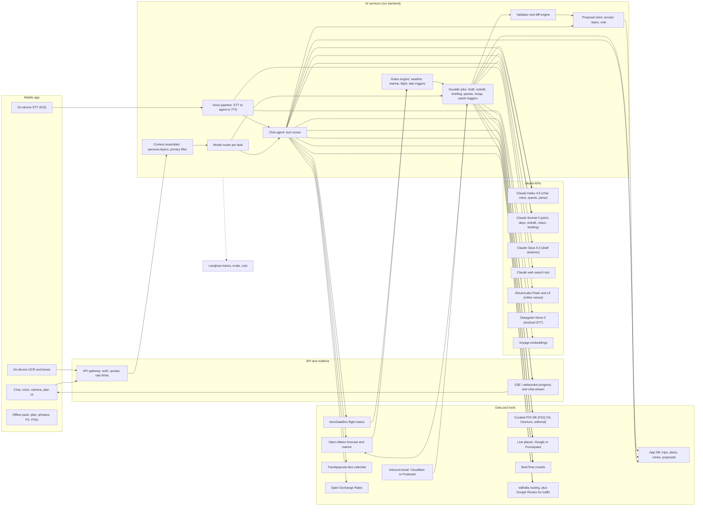

# Critterpass: AI guide and its data (tech stack research)

Date 2026-09-26. Scope: LLM selection and routing, persona system, tools and orchestration, voice, camera, receipt and email parsing, travel data APIs, cost model, safety, evals and observability.
Inputs: `scratchpad/requirements-brief.txt`, `scratchpad/screens.json` (149 screens). Prices and limits come from live pages fetched on 2026-09-26 (see Key claims, §10). Token counts are ESTIMATES, because no code exists yet. Cost script: `scratchpad/ai-cost-model.py`.

---

## 0. TL;DR

- **Brain: Claude only, with three tiers routed per task.** Haiku-class handles chat, voice, and cheap text. That is Haiku 4.5 today, re-evaluated when Haiku 5.5 ships ("coming weeks", announced 2026-09-22). Haiku 4.5 retirement is "not sooner than 2026-10-15". **Sonnet 5 ($2/$10)** is the workhorse. **Opus 5.5 ($4/$20, effort medium)** is used only for the itinerary skeleton.
- **Orchestration: our own backend.** Code-first workflows plus the Anthropic SDK tool runner and a durable job queue. **Not** the Claude Agent SDK. **Not** Managed Agents in v1.
- **The agent never writes.** Every mutation is a `Proposal`. Code validates it (schema, place ids, hours, travel time, money), and a human or a vote accepts it. This matches the designs in 3e-3, 3j-1 PROPOSE TO GROUP, and 3c-12 KEEP IT.
- **Facts come from tools and numbers come from code.** The LLM writes words and picks ids. Private data such as budget maxes never enters any prompt (3c-5: "including Pon").
- **Voice (3j-2): a cascaded pipeline.** On-device or Deepgram STT feeds the same Claude chat agent, which feeds ElevenLabs Flash streaming TTS with one owned voice per critter. Runner-up: OpenAI **GPT-Live-1** ($0.05/min, GA 2026-09-10) with client delegation to Claude.
- **Camera (3j-3): on-device OCR plus Sonnet 5.** Apple Vision or ML Kit gives bounding boxes. Sonnet 5 returns translations and dietary flags keyed by OCR line id. Claude's own coordinates are "approximate", so they are not used for the overlay.
- **Receipts (3i-3): on-device OCR plus Claude vision structured output**, about $0.006–0.017 per receipt. Veryfi is $0.08 per receipt with a $500/mo minimum.
- **Email (3h-2): forwarding address plus JSON-LD plus LLM in v1.** Gmail inbox scanning needs a restricted scope, which brings an annual CASA assessment. Defer it unless it is the core Pass+ perk (4a-3).
- **Data:** see the table below.

| Need | Source |
|---|---|
| Places | Curated per-destination POI DB (FSQ OS Places / Overture seed plus editorial). Live source is Google Places if the map is Google, or Foursquare if the map is Mapbox/MapLibre (ToS coupling) |
| Crowds | BestTime |
| Weather and marine | Open-Meteo, commercial plan |
| Flight status | AeroDataBox |
| Monthly fares | Travelpayouts month-matrix |
| Routing | Self-hosted Valhalla, plus Google Routes for traffic legs |
| FX | Open Exchange Rates |
| Phrase audio | Pre-rendered TTS |

- **Cost:** a typical crew trip (6 people, 8 days) is about **$8.3 in AI (about $1.4 per person)**, plus roughly $1–3 in variable data. Guide chat is about 60% of AI spend.
- **Margin risks:** the free tier's "30 a day" and Boost's "∞ on trip". Both need fair-use caps and a Haiku-class default.

---

## 1. Context: what the designs demand of the AI

AI surfaces, with screen ids:

| Screen | Surface |
|---|---|
| 3b-3 | Pitch, streamed |
| 3c-6 | Room grouping |
| 3c-7 / 3c-10 | Must-do fit checks, live while typing |
| 3c-8 / 3c-9 | Itinerary draft: "About 20 seconds", visible task list, day cards stream past |
| 3c-11 / 3c-12 | Redraft of one day, shown as a diff |
| 3d-1 / 3d-3 | Destination guide. Month prices for crew airports; crowd forecast by hour |
| 3d-2 | Swipe "why this?" |
| 3e-2 / 3e-3 | Suggestion ghosts; review changes |
| 3f-3 / 3f-4 | Personalised proposal; private "not sure yet" chat |
| 3g-1 | Guide in group chat, answering @tokek |
| 3h-2 | Booking import |
| 3h-3 | Phrase card read aloud |
| 3i-3 / 3i-4 | Receipt OCR and its failure path |
| 3j-1 / 3j-2 / 3j-3 | Chat, voice, point-and-ask |
| 3k-1 | Daily briefing |
| 3k-5 | Flight-delay auto-fix |
| 3k-6 | Help |
| 3k-7 / 3k-8 | Watch list; storm warning |
| 3k-9 | Running late |
| 3k-10 | SOS |
| 3l-7 | Crew quests "from the actual plan each morning" |
| 3m-* | Recap narration, awards, postcard note, photo picks |
| 3o-2 | Copy days from shared plans ("Pon checks it against your must-dos") |
| 3p-5 | Duplicate idea detection |
| 5b-1 | Notifications in the guide's voice, 20:00 roundup |
| 3n-2 | Chattiness setting (quiet / normal / chatty); "talk out loud" |
| 3n-8 | Guides mix local words in any app language |

Design facts that constrain the stack. These are load-bearing.

- **Limits.** 4b-1 says **"30 OF 30 TODAY · RESETS 00:00"**, so the free limit is 30 per day, not 30 total as the brief says. "Your Kyoto plan and the vote don't count". A Pass+ crewmate can ask in crew chat.
- **Tiers (4e-2).** Pass+ gets ∞ chat, voice and camera. Boost gets "∞ on trip" for the whole crew. Redrafts are 3 per trip on both Free and Pass+, and ∞ on Boost. "Bookings pulled from your email" is a Pass+ perk (4a-3).
- **Privacy constraints.**
  - 3c-5: "Nobody sees anyone else's number, including Pon". Aggregation must happen in code, and the model receives only the sweet spot.
  - 3f-4 "Nothing on this sheet reaches the crew" and 3j-1 GROUP vs JUST ME: context isolation must be enforced in the context-assembly layer, not by prompt.
  - 3o-4: photos with "faces blurred". 3m-2: "long-pressing one shows who's in it", which means face recognition. That is biometric data and a product-owner decision (§9).
- **Real-world actions the designs claim.** Most have no public API: see §4.3 and §9.
  - "Held 2 ryokan rooms" (3c-8)
  - "entered all six of you" in the Nintendo lottery (3c-7)
  - "I booked it" for the canal boat (3c-12)
  - "Made rebooked for a 13:50 pickup" (3k-5)
  - "KARSA SAID YES" (3k-9)
  - "Called BIMC Ubud" (3k-10)
  - "booked by Tokek" for a driver (3h-3)
- **Polling cadence.** 3k-7: "I check every three hours and only ping you when it changes the plan". This must be rules first, LLM on trigger (§6).
- **Live ETAs.** 3g-4: "ETAs recount every minute". Paid routing at that cadence would be very expensive (§4.7).

## 2. Evaluation criteria

| # | Criterion | Why | Screens |
|---|---|---|---|
| C1 | Persona writing quality and voice consistency | The brand is the critter voice | 3b-3, 5b-1, 3m-*, 3k-1 |
| C2 | Agentic tool use and structured output reliability | Plans, diffs, proposals | 3c-8, 3c-12, 3e-3, 3k-5 |
| C3 | Latency (TTFT, first audio) | Streaming UX, voice | 3b-3, 3j-1, 3j-2, 3c-10 |
| C4 | Vision and OCR accuracy, multilingual | Receipts, menus | 3i-3, 3j-3 |
| C5 | Grounding and citations (no invented places, hours or prices) | "Tap anything to see why it's there" | 3f-3, 3d-3 |
| C6 | Cost per task and per trip versus $3.99/mo | Free 30/day; ∞ tiers | 4b-1, 4e-2 |
| C7 | Custom per-critter voice and language coverage | 6 guides plus local words; app in 16 languages | 3j-2, 3n-8, 3h-3 |
| C8 | Data terms (storage, display, LLM use) | Offline mode, own DB, maps | 3k-4, 3d-4 |
| C9 | Safety and guardrails | Help, SOS, medical | 3k-6, 3k-10 |
| C10 | Operational simplicity and vendor risk | Small team, model churn | all |

## 3. Options matrices

Scores run from 1 (poor) to 5 (best). Quality scores are judgement from docs and positioning, not benchmarks run for this app, so they must be validated by the eval plan in §4.10.

### 3.1 LLM vendor strategy

| Option | C1 | C2 | C3 | C4 | C5 | C6 | C9 | C10 | Notes |
|---|---|---|---|---|---|---|---|---|---|
| **A. Claude only (Haiku 4.5 / Sonnet 5 / Opus 5.5)** | 5 | 5 | 4 | 4 | 5 | 3 | 5 | 5 | Details below |
| B. Claude plus a cheap non-Claude model for bulk (gpt-6-luna $0.10/$0.50) | 4 | 5 | 4 | 4 | 5 | 5 | 4 | 3 | Saves little at our volumes. Adds a vendor, evals and persona drift |
| C. OpenAI only (gpt-6-sol $2/$10, luna, realtime) | 4 | 4 | 4 | 4 | 3 | 4 | 4 | 4 | Stronger voice stack. No `search_result`-style citations checked |
| D. Gemini only (3.8 Flash $0.75/$3.75 until 2026-12-31, then $1.50/$7.50; Live; TTS) | 3 | 4 | 5 | 4 | 4 | 5 | 4 | 4 | Cheapest full stack. Maps grounding $14/1K after 5K free. Price doubles in January 2027 |

Details for option A:
- `search_result` blocks give citations for our own tool data.
- Structured outputs and `strict` tools are supported.
- Caching reads are cheap (0.1× on Haiku and Sonnet, 0.05× on Opus 5.5).
- Batch is 50% off.
- No embeddings API, so we need a third party (Voyage).

### 3.2 Orchestration

| Option | Fit | Verdict |
|---|---|---|
| **Own backend: code-first workflows, Anthropic SDK tool runner or manual loop, durable job queue** | Full control of latency, parallel fan-out, proposals, quotas, multi-vendor voice, our DB | **Pick** |
| Claude Agent SDK | It is the Claude Code harness (file, bash, web tools) running on our own infra. Built-in tools are irrelevant, the process model is heavy, and it is aimed at coding and filesystem agents | Reject |
| Claude Managed Agents (beta) | Anthropic runs the loop and a per-session container at $0.08/session-hour plus tokens. Claude API only; no Batch discount. Has outcomes and scheduled deployments. Our tasks are short, latency-bound, DB-bound, and need no sandbox | Not v1. Revisit for long offline jobs such as destination-pack research |

### 3.3 Voice conversation (3j-2; "hold to talk", "voice replies when you speak first")

| Option | Custom critter voice | Same brain and tools as text | Latency / barge-in | $/voice question (est.) | Languages | Complexity | Score |
|---|---|---|---|---|---|---|---|
| **A. STT (Apple SpeechAnalyzer on device / Deepgram Nova-3 multilingual $0.0058/min) → Claude Haiku-class → ElevenLabs Flash v2.5 ($0.05/1K chars, ~75 ms model)** | Yes, via voice design or cloning, commercial on paid plans | Yes, identical agent | ~1.3–1.6 s to first audio (est.). Turn-based fits hold-to-talk | ~$0.027 | Flash: 32 languages (no Icelandic); v3: 74 | Medium (Pipecat BSD-2 or custom) | **4.4** |
| B. OpenAI GPT-Live-1 ($0.05/min, billed per second) + client delegation to Claude | Custom voices for "eligible customers" only | Yes, via delegation | Best: full duplex, barge-in | ~$0.035–0.04 | 12 new voices; languages "coming months" | Medium | 3.8 |
| C. gpt-realtime-2.1-mini (audio $10/$20 per 1M tokens) | Same restriction as B | No. OpenAI model runs persona and tools, which causes drift | Good | ~$0.01–0.015 | Many | Low–medium | 3.2 |
| D. Gemini 3.8 Live (audio in $0.005/min, out $0.018/min) | 30 prebuilt voices; replicated voices for "select customers" | No | Good | ~$0.01 | 70 | Low–medium | 3.2 |

### 3.4 Camera "point and ask" (3j-3)

| Option | Overlay accuracy | Dietary reasoning | Latency | Offline | Verdict |
|---|---|---|---|---|---|
| **On-device OCR (Apple Vision `RecognizeDocumentsRequest` iOS 26 / ML Kit Text v2) with boxes, then Sonnet 5 on OCR lines, a small image and crew profiles** | Exact boxes | Strong | ~2–4 s (est.) | Partial (OCR plus on-device translate) | **Pick** |
| Pure vision LLM returning boxes | Claude: coordinates "approximate" | Strong | ~3–5 s | No | Reject for overlay |
| On-device only (Apple Foundation Models iOS 27 vision plus OCRTool) | Exact | Weak / unknown | Fast | Yes | Later offline fallback (Apple devices only) |

### 3.5 Receipt OCR to line items (3i-3 / 3i-4)

| Option | Cost per receipt | Terms | Verdict |
|---|---|---|---|
| **On-device OCR (instant scan-line UI and total), then Claude vision structured output with per-line confidence** | ~$0.017 (Sonnet 5 hi-res) / ~$0.006 (Haiku 4.5) | None | **Pick** |
| Claude vision only | Same as above | None | Loses the live scan-line effect |
| Veryfi | $0.08 per receipt, **$500/mo minimum** | Vendor | Reject for now |
| Mindee | Unclear: plans ~$44–116/mo | Page inconsistent | Unverified |

### 3.6 Booking email ingestion (3h-2)

| Option | Cost | Friction | Verdict |
|---|---|---|---|
| **Per-crew forwarding address (`bali-six@in.critterpass.app` is already in the design)** | Cloudflare Email Routing inbound is free (25 MiB per message) or Postmark ~$1.50/1K | User forwards | **v1** |
| Gmail API scan ("found in your crew's inboxes", "I check every morning") | Restricted scope: CASA security assessment by an empanelled assessor, **re-done every 12 months**, "several weeks". Third-party guides put it at ~$500–4,500 per year | Best UX | Pass+ v2, once CASA is budgeted |
| Microsoft Graph Mail.Read | Unverified here | Medium | Research later |
| Share sheet, PDF or wallet pass import | $0 | Low | v1 |

### 3.7 Travel data (2026 prices; details in §4.7)

| Need | Pick | Runner-up | Rejected / notes |
|---|---|---|---|
| Places / POI | Own curated DB per destination, seeded from **FSQ OS Places (Apache-2.0, 100M+ POIs)** and **Overture places (CDLA-Permissive-2.0, monthly)**, plus editorial. Live checks: **Google Places (New)** if the map is Google, else **Foursquare Places API** | Mapbox Search Box ($3/1K sessions after 500) | Google content: no storage except place_id; not on a non-Google map |
| Crowd by hour | **BestTime** Pro metered ($0.009/credit, $99/mo minimum; 1 credit per venue by id) | None found at comparable coverage | — |
| Weather and marine | **Open-Meteo** commercial (~$29/mo for 1M calls; marine included; CC BY 4.0 attribution) | Apple WeatherKit (500K calls/mo free with the developer program, then from $49.99 per 1M) | Tomorrow.io: no public price |
| Flight status and alerts | **AeroDataBox** Growth $99/mo for 400K units (status is about tier 2); general commercial use OK | FlightAware AeroAPI Standard ($100/mo minimum, $0.005 per status call, $0.02 per alert; B2C allowed) | Cirium / OAG: enterprise |
| Monthly fares for crew airports | **Travelpayouts Aviasales Data API** (month-matrix, grouped prices; cached from searches, "use for static pages"; affiliate token) | Skyscanner Indicative Prices (partner approval) | **Amadeus Self-Service shut down 2026-07-17**. Kiwi Tequila invite-only. Duffel is for live offers and booking only ($3/order, 1500:1 search:book) |
| Routing and ETAs | **Self-hosted Valhalla** (3.9.0, 2026-09-19; has motor_scooter costing) for per-minute crew ETAs | Mapbox Directions / Matrix (100K free, then $2/1K) | Google Routes ($5/1K Essentials, 10K free) only for traffic-aware leave-by and running-late |
| FX | **Open Exchange Rates** Developer $12/mo (200+ currencies incl. PEN, MAD) | Frankfurter, free ECB rates (no PEN, MAD or VND) | — |
| Phrase TTS | Pre-render phrase cards per destination, stored for offline | Runtime TTS for dynamic addresses, cached | Quechua unsupported by major TTS |
| Ride-hailing | Deep links out (Grab / Gojek / Uber) | — | No public Grab/Gojek ride-booking API (partner-only) |

---

## 4. Deep dives

### 4.1 Model routing per task

Routing is pinned in config per route. Models are swappable after eval.

| Task (screens) | Model / effort | Mode | Latency target | Est. cost |
|---|---|---|---|---|
| Persona chat text (3j-1, 3g-1 @mention, 3f-4) | **Haiku 4.5**, thinking off, as default | Stream; tools (≤3 rounds); `search_result` citations | TTFT <1 s (Haiku ~0.63 s per Artificial Analysis) | $0.0125/q |
| Chat escalation (plan change, multi-constraint, group proposal) | **Sonnet 5, effort low** | Stream; tools; returns `Proposal` via strict tool | <3 s to first token | $0.025/q |
| Pitch a place (3b-3) | Sonnet 5, low | Stream line by line; destination pack cached | TTFT ~1.5 s, masked by the sticker slap | $0.008 |
| Itinerary draft (3c-8) | **Opus 5.5, medium** skeleton, then **Sonnet 5, low** × N days in parallel, then code validator, then Sonnet 5 repair | Durable job; SSE progress; strict JSON | ~20–30 s total; day cards stream | $0.32 |
| Redraft a day (3c-12) | Sonnet 5, medium | Structured new-day JSON. **Server computes the diff**; model writes one reason per change | <10 s | $0.022 |
| Must-do fit check (3c-10, 3c-7) | **No LLM per keystroke**: places autocomplete plus a deterministic constraint engine. Optional Haiku one-liner from cached blurbs | — | <150 ms | ~$0 |
| Personalised proposal per friend (3f-3) | Sonnet 5, low | Structured (picks, `reason_tag`, `source_ids`) | Parallel on BUILD | $0.009 each |
| Daily briefing (3k-1) | Sonnet 5, low (or Haiku) over rule-engine items | Scheduled job about 1 h before the local wake window | Async | $0.016/crew/day |
| Crew quests (3l-7) | Haiku 4.5 via **Batch** (−50%) overnight | Quest objects with machine-checkable predicates | Async | $0.004/crew/day |
| Watch list / storm / delay / late (3k-5, 3k-7..9) | Rules engine on data feeds; Sonnet 5 low **only on trigger** to build Plan B proposals | Job | <10 s after trigger | $0.02–0.05 per trigger |
| Recap narration, awards, postcard (3m-3..9) | Sonnet 5, medium. Stats and award winners computed by code; LLM writes lines | Job at trip end | Async | $0.06 |
| Photo picks (3m-2, 3o-4) | On-device aesthetic, blur and face-count prefilter; Sonnet 5 on ~40 thumbnails | Job | Async | $0.03 (naive 312 photos on Haiku: $0.41) |
| Notification copy (5b-1) | **Pre-generated template library per guide** (Sonnet 5 offline, Batch) with slot filling; Haiku for the 20:00 roundup | — | Instant | ~$0.003 per roundup |
| Duplicate idea (3p-5) | Embeddings (voyage-4-lite $0.02/M; 200M free tokens) + pgvector; Haiku tie-break | Live while typing | <300 ms | ~$0 |
| Receipt (3i-3) | Sonnet 5 (Haiku if evals pass) | Structured output with per-line `confidence` / `unreadable` | <5 s | $0.017 / $0.006 |
| Booking email (3h-2) | JSON-LD (schema.org reservations) parse first, then Haiku 4.5 structured, then Sonnet 5 on low confidence | Job | Async | ~$0.01 |
| Menu (3j-3) | Sonnet 5 | Structured, keyed by OCR line id | 2–4 s | $0.018 |
| Guest guide (3b-7 / 3b-8) | Sonnet 5 + `web_search_20260209` ($10/1K searches; allowed domains) with citations; results saved as destination notes | Job plus stream | <8 s | $0.03–0.05 |
| Help / medical intent (3k-6) | Deterministic Help flow. Haiku intent classifier routes there; **the LLM is never on the SOS path** | — | Instant | ~$0 |

Model API gotchas (from the claude-api skill and docs, 2026-09-26):
- Opus 5.5 and Fable 5.1 **reject forced `tool_choice` (any/tool)**. Use `auto` plus `strict: true`, or `output_config.format`.
- Opus 5.5 thinking cannot be disabled; its default effort is `medium`.
- **Citations are incompatible with `output_config.format`.** Use `source_ids` fields in schemas for structured outputs, and `search_result` blocks for prose.
- Sampling params (`temperature`) return 400 on 4.7+ models. Persona variety must come from prompts.
- The minimum cacheable prefix is **4096 tokens on Haiku 4.5** and 1024 on Sonnet 5. The static prefix must stay above 4096 for Haiku caching to work.
- The Claude 4.7+ tokenizer yields ~30% more tokens. Sonnet 5 uses it.

### 4.2 Persona system (6 guides plus the guest guide)

- **Persona spec per critter, versioned in the repo.** Fields: `id`, `species`, `destination`, `colour`, `voice_id` (per TTS vendor), `register` (warmth, humour, dryness 0–5), `catchphrases`, `local_words[]` (term, gloss, IPA, when to use, **native-speaker vetted**), `taboos`, `sign_off`, `knowledge_pack_ref`, `chattiness_map`.
- **Chattiness** (3n-2 quiet / normal / chatty) maps to the max sentences per reply, local-word density (for example 0 / 1 / 2 per reply), and the proactive-interjection budget in group chat. It is applied via a mid-prompt instruction, not a separate prompt, to keep the cache intact.
- **Language.** The reply is in the user's app language (EN, zh-Hans, id, ja plus 12 more; 3n-8), and the guide always keeps a few vetted local words. The LLM must not improvise local-language phrases. Phrase cards and local words come from vetted tables to avoid mistranslations and cultural errors.
- **Prompt layering in cache order.**
  1. Tools, identical for all guides.
  2. Global guide rules, safety and action policy (shared).
  3. Persona block (per guide).
  4. Destination pack (per destination).
  5. Trip context (per crew; privacy-filtered).
  6. Conversation.
  With byte-stable prefixes, every user of a guide shares cache entries. Caches are per workspace.
- **Guest guide (3b-8, "Not my island, but I've done my homework").**
  - Persona is Tokek plus `guest_mode`: hedged language and "what Tokek knows so far".
  - Grounding is web search plus the Google or Foursquare live places source. There is no curated pack.
  - Guest-mode answers are cached as destination notes for reuse.
  - Locals' names are never revealed (3b-7 caption).
- **Group chat behaviour (3g-1).** The guide replies on @mention. Proactive chime-ins only when a Haiku classifier finds an actionable opportunity (for example a poll about a bookable slot), capped per day by chattiness.
- **Quota accounting.** Group asks are charged to the asker, a Pass+ member, or a boosted trip (4b-1). This needs a product-owner rule (§9).
- **Voice identity.** Commission **voice actors (rights owned)** for the 6 critters and clone them on the chosen TTS vendor. This keeps voices portable across ElevenLabs, Gemini TTS, OpenAI custom voices and Cartesia. A vendor-designed voice is locked to that vendor.

### 4.3 Tools and orchestration

**Read tools** (server-executed, cached, cost-metered):

| Tool | Returns |
|---|---|
| `places_search(query, near, category, open_at?, dietary?)` | Curated DB first, then live provider. Cards with `place_id`, `source` |
| `place_details(place_id, fields)` | Hours, price level, booking notes |
| `crowd_forecast(place_id, date)` | Hourly 0–100 (BestTime) |
| `weather(lat, lng, from, to)` / `marine(...)` | Open-Meteo |
| `flight_status(number, date)` / `fare_calendar(origins[], dest, month)` | AeroDataBox / Travelpayouts |
| `route_eta(origins[], dest, mode, depart_at?)` | Valhalla; Google Routes when traffic matters |
| `fx(amount, from, to)` | OXR snapshot |
| `crew_profiles(trip_id)` | Taste, dietary, pace, chronotype. **Redacted**: no private budget maxes, no "just me" chat content |
| `plan_read(trip_id, day?)` | Plan with `version` |
| `bookings_read(trip_id)` | Bookings |
| `web_search` (Anthropic server tool) | Guest guide, events and closures (for example "procession closes Jalan Raya"). Domain allow-lists |

**Write tools** produce drafts only and never mutate:

| Tool | Behaviour |
|---|---|
| `propose_plan_changes(trip_id, base_version, ops[{op, item, new, reason, source_ids}])` | Server validates: schema, place ids exist, opening hours, travel-time feasibility, 15-min grid, must-dos untouched unless allowed. Code computes cost deltas ("+$22 each"). The result is a `Proposal` rendered by 3e-3. On apply, `base_version` gives optimistic concurrency against live collaboration (3g-2) |
| `create_vote_draft(crew_id, question, options, closes_at)` | Only after the user taps PROPOSE TO GROUP |
| `request_hold` / `request_booking` | **Stubbed.** No partner APIs exist for most items shown (see §9) |

**Action policy**, encoded in code and not in the prompt:
- Auto-apply is allowed only if the change is reversible, costs no money, and touches only the requester's own items (for example 3b-4 "moved Rin's pickup · UNDO").
- Anything that costs money or affects others needs a yes. This mirrors 3k-5 "NEEDS A YES" and 5b-4 "anything that costs money".

**Draft job (3c-8) runs as a workflow, not a free-roaming agent.** Its visible task list maps to the steps:
1. Load profiles and must-dos (code).
2. Parallel prefetch (code): candidates per must-do and interest, hours, crowds, seasonal signals such as the blossom forecast or weather normals, travel matrix.
3. Skeleton: day themes, stays, early/late balance (Opus 5.5).
4. Day fan-out: 8 parallel Sonnet 5 calls, each streamed to the client as a day card.
5. Validate (code).
6. Repair only the violating days (Sonnet 5).
7. Summary lines in persona.

Serial agent turns cannot hit "about 20 seconds". Sonnet 5 runs at ~80 tok/s, so 8 days × 900 tokens serially takes about 90 s; parallel fan-out takes about 12 s.

**Loop implementation.** Chat uses the SDK tool runner with hooks for quota, logging and approval. Jobs run on a durable queue with retries, idempotency keys, cancellation and progress events over SSE or websocket, plus a push when finished. The engine is chosen in the backend report.

**Prompt-injection stance.**
- Email bodies, web results, reviews and OCR text are data. Wrap them as documents or search results, never as system text.
- Writes are proposals. Tool allow-lists apply per route; for example the email parser has no tools.

### 4.4 Voice details (3j-2)

- **Latency budget for A (estimates):**

| Stage | Time |
|---|---|
| STT final after release | 0.2–0.4 s |
| Haiku TTFT | ~0.6 s |
| First clause (~20 tokens) | ~0.25 s |
| TTS first byte | ~0.1–0.25 s |
| **Total to first audio** | **~1.2–1.5 s** |

  A tool round adds about 1 s. Speak a persona filler line ("Checking the rain…") while tools run. Swap cards render from the same structured response.
- **STT.** iOS uses `SpeechAnalyzer` / `SpeechTranscriber` (iOS 26, on device, free). Android and fallback use Deepgram Nova-3 Multilingual ($0.0058/min). Flux ($0.0065/min) is listed as "Flux English".
- **TTS.**
  - ElevenLabs Flash v2.5 for live replies (32 languages; no Icelandic).
  - ElevenLabs v3 (74 languages incl. Icelandic) for pre-rendered recap narration, phrase cards and Lundi's Icelandic words.
  - Cost-lever alternative: **Gemini 3.8 Flash TTS** (GA; 130+ languages incl. Icelandic; voice design and replication; ~$0.0135/min until 2026-12-31, then doubling). TTFB is unverified, so it needs a bake-off.
- **Cost per voice question** is about $0.014 for STT and TTS plus about $0.0125 for the brain, so about $0.027. That is about 2.2× a text question.
- **Fair use.** Voice counts as a question (4e-2 groups chat, voice and camera). Cap spoken reply length by chattiness.

### 4.5 Camera and receipts

- **Menu (3j-3).**
  1. On-device OCR returns lines and boxes. Instant on-device translation gives first stickers.
  2. The server sends OCR lines (with ids), a downscaled photo (≤1568 px, about 2.6K visual tokens on Sonnet 5) and crew dietary profiles to Sonnet 5.
  3. It returns `{line_id, translation, description, spice, flags:[{member, conflict, reason}]}` plus a suggestion line.
  4. The client overlays on the OCR boxes.
  - Allergy flags are **advisory**; show "ask staff" copy (safety, §4.9).
- **Receipt (3i-3 / 3i-4).**
  1. On-device OCR drives the scan line and locks the total.
  2. Claude returns items, qty, amounts, service and tax, currency, and per-field confidence.
  3. **Code checks that items + service + tax equal the total.** On mismatch or low confidence, go to the 3i-4 path: keep the total, offer TYPE THE LINES / RETAKE / SPLIT EVENLY.
- **Vision cost formula:** `ceil(w/28) × ceil(h/28)` visual tokens. The hi-res tier (4.7+ models: Sonnet 5, Opus 5.5) allows up to 2576 px and 4784 tokens; the standard tier (Haiku 4.5) allows 1568 px and 1568 tokens. Downscale before upload.

### 4.6 Booking email (3h-2)

- **Inbound.** Each crew gets an MX alias. Inbound goes through a Cloudflare Email Routing Worker or a Postmark webhook, then a queue.
- **Parsing.** Try the JSON-LD `FlightReservation` / `LodgingReservation` markup first. Then Haiku 4.5 structured output (`booking_type`, times with timezone, confirmation code, travellers, price, cancellation). Then escalate to Sonnet 5 on low confidence.
- **After parsing.** Dedupe by confirmation code across the crew. A flight booking auto-starts the flight-day Live Activity (5a-3).
- **Gmail scanning ("I check for new confirmations every morning", "from Alex's email").** It needs a restricted scope, which means an annual CASA assessment plus weeks of verification. Budget it if it is a launch Pass+ perk.

### 4.7 Travel data: terms that shape the architecture

- **Google Places (New).** Hours are **Enterprise** ($20/1K Place Details after 1K free per month). Content cannot be cached except `place_id`, and must not be displayed or used on a non-Google map. If the map is Mapbox or MapLibre (likely, for the hand-drawn style), use Foursquare as the live source instead: Pro $15/1K after 500 free, premium fields $18.75/1K.
- **Curated destination DB.** For the 6 live destinations, curate about 300–800 POIs each with vetted hours, refreshed monthly. This cuts live-lookup spend and powers offline mode (3k-4). OSM `opening_hours` is ODbL, so keep derived tables separate and get legal review.
- **Maps Grounding Lite** (Google MCP) requires an LLM that does not train on inputs. Anthropic states that commercial API data is not used for training by default. Still, it only fits a Google-map stack.
- **BestTime.** Store the weekly forecast per venue (refresh monthly). 6 destinations × about 500 venues × 2 credits is roughly 6K credits a month, so the $99/mo minimum covers it.
- **Open-Meteo.** The free tier is **non-commercial**, so pay for the ~$29/mo commercial plan. It includes the marine API (waves for 3k-8). Attribution (CC BY 4.0) is required.
- **Crew ETAs every minute (3g-4).**
  - Google Routes would cost about 6 people × 60/h × active hours per crew, for example 3,600 calls per day, which is about $18 per crew-day at $5/1K.
  - Instead use self-hosted Valhalla, and only while a meet-up is active and sharing is on.
  - Use Google Routes or Mapbox traffic only for leave-by (5a-1) and reroute (3k-9).
- **Fares (3d-1 "re-prices for your crew's airports").** Travelpayouts cached month-matrix per (home airport, destination IATA), refreshed daily and labelled "from ~$X". Affiliate links can double as "sponsored picks" revenue.
- **Local signals** (3k-7 "procession", "volcano alert level"). There is no global API. Use a per-destination curated feed list plus `web_search` on a schedule, with rules deciding relevance.

### 4.8 Grounding and hallucination control

1. Every place, time, price or duration the model mentions must come from a tool result. Structured outputs carry `place_id` and `source_ids`, and the server rejects unknown ids.
2. **Numbers are computed by code**: shares, "+$22 each", "90 min less on trains", budget sweet spot, awards stats. The LLM only phrases them.
3. Prose answers cite via `search_result` blocks, which power 3f-3 "Tap anything to see why it's there".
4. A validator runs on every proposal and draft (hours, travel time, 15-min grid, capacity, must-dos, dietary).
5. Safety-critical facts are **never generated**: emergency numbers, embassy details, visa rules (3k-1 "Visa on arrival is $35"). They come from a curated, dated table with a "last checked" stamp.

### 4.9 Safety and guardrails (3k-6, 3k-10)

- **Help and SOS paths are deterministic and offline-capable.** They use curated numbers per country (for example 112 / 110 in Indonesia), phrase cards (pre-rendered audio), nearest 24h facility from the curated DB, and location sharing with a 1-hour auto-off. No LLM sits in the critical path.
- **Medical questions.** The guide gives only safe, non-diagnostic guidance plus "call 112 / go to X". It routes to the Help tiles. It keeps the "Hurt or sick" checklist. System prompt rules state it is not a doctor, must escalate, and must not dose medications.
- **"Called BIMC Ubud" (3k-10) and "Sending his insurance details to the clinic".** Autonomous calls or messages to third parties plus sharing health and insurance data is high risk (consent, accuracy, liability). Recommend one-tap actions for the user instead (§9).
- **Allergy and dietary flags are advisory.** They carry "confirm with staff" copy, and severe allergies always get a warning.
- **Handle `stop_reason: "refusal"`.** Enable server-side fallbacks on Opus 5.5. Log refusals.
- **Abuse limits:** per-user and per-crew rate limits, and moderation of community plans and ideas.

### 4.10 Evals and observability

- **Evals.**
  - Golden sets per destination: about 30 crews with profiles and must-dos, about 200 chat questions, 50 receipts (including crumpled), 50 menus, 50 booking emails, 20 redraft requests.
  - Deterministic graders: validator pass rate, must-dos kept, id existence, arithmetic.
  - LLM-judge rubrics: persona voice consistency, local-word correctness (with native-speaker spot checks), helpfulness, chattiness adherence.
  - Run in CI on prompt or model change. Re-run when Haiku 5.5 / Sonnet 5.5 ship.
- **Observability.**
  - **Pick Langfuse** (MIT core; Cloud Core $29/mo for 100K units, $8 per 100K overage; self-hostable). It was acquired by ClickHouse on 2026-01-16 with "no licensing changes planned"; v4.46.0 was released 2026-09-25.
  - Instrument via OpenTelemetry to keep it swappable. Runner-up: Braintrust (Pro $249/mo, stronger eval UX).
  - Also: promptfoo (MIT, active) for CI prompt tests.
  - Metrics: cost per trip, cost per user per day, cache-hit rate (`cache_read_input_tokens`), TTFT, proposal acceptance rate, validator failures, refusals.

## 5. Recommended AI architecture

## 6. Cost model

Estimates come from `scratchpad/ai-cost-model.py`. They assume Claude list prices, the prompt-cache structure in §4.2, and the token assumptions in the script.

Per task (USD):

| Task | Model | $ |
|---|---|---|
| Chat question | Haiku 4.5 / Sonnet 5 / Opus 5.5 | 0.0125 / 0.025 / 0.044 |
| Chat question (reference only) | Gemini 3.8 Flash / gpt-6-luna | 0.009 / 0.001 |
| Draft | Opus 5.5 skeleton + Sonnet 5 days (all-Sonnet $0.25; all-Opus $0.47) | 0.32 |
| Redraft | Sonnet 5 | 0.022 |
| Pitch | Sonnet 5 | 0.008 |
| Proposal per friend | Sonnet 5 | 0.009 |
| Briefing per crew-day | Sonnet 5 | 0.016 |
| Quests (Batch) | Haiku 4.5 | 0.004 |
| Receipt | Sonnet 5 / Haiku 4.5 | 0.017 / 0.006 |
| Email parse | Haiku 4.5 | 0.010 |
| Menu | Sonnet 5 | 0.018 |
| Recap | Sonnet 5 | 0.06 |
| Voice extras per turn | Deepgram + ElevenLabs Flash | 0.014 |
| Web search | $10/1K | 0.01 |

**Typical crew trip** (6 people, 8 days, 6-week planning, 5 questions per person per trip day, 2 per person per planning week, 70/30 Haiku/Sonnet chat mix, 20% voice): **about $8.33 AI per crew, about $1.39 per person.** Breakdown:

| Item | $ |
|---|---|
| 312 questions | 5.07 |
| Voice extras | 0.88 |
| Receipts ×25 | 0.42 |
| Web search ×40 | 0.40 |
| Draft | 0.32 |
| Everything else | ~1.2 |

**Data, per crew trip (est.):**

| Item | $ |
|---|---|
| Live place-detail checks if not curated (~100–160 Enterprise calls) | $2–3.2 |
| With curated DB | <$0.5 |
| Flight status and alerts | <$0.5 |
| Routing (self-hosted) | ~$0 |

**Fixed data subscriptions: about $370/mo.** Open-Meteo $29, BestTime $99, AeroDataBox $99, OXR $12, Langfuse $29, plus ElevenLabs plan and hosting.

**Revenue per user after App Store fees** (15% Small Business Program year 1; subscriptions always 15% from year 2):

| Plan | Net |
|---|---|
| Pass+ monthly | $3.39/mo |
| Pass+ annual | $25.49/yr (about $2.12/mo) |
| Boost | $10.20 per trip |

**Margin stress:**

| Scenario | AI cost | Versus revenue |
|---|---|---|
| Heavy Pass+ user in a trip month (30 questions/day × 8 days, 30% voice, menus) | ~$5.1 | Exceeds $3.39 monthly, though annual plus off-months averages out |
| Free user at the cap, Haiku mix | $0.49/day | Up to ~$3.9 per trip at 0 revenue |
| Free user at the cap, all-Sonnet | $0.75/day | — |
| Boosted crew of 6 at 30/day each | ~$23+ | Versus $10.20 |

**How limits protect margin:**
1. Keep chat on a Haiku-class default. It halves chat cost.
2. Change the free tier from **30/day to 30 per trip or per week plus 5/day on trip**, or keep 30/day but count voice at 2×.
3. Soft fair-use caps on "∞", for example 100 per person per day and 60 voice-minutes per trip, then degrade to Haiku with shorter answers instead of blocking.
4. Redraft limits (3 per trip) already cap the costly Sonnet path. Drafts are cheap (~$0.32), so redraft limits are more product than cost.
5. Rules-first watchers. An LLM every 3h on every crew is about 64 calls, roughly $1.3 per trip, avoided.
6. Pre-generated notification templates.
7. Batch for quests and templates.
8. Cache-hit monitoring: a broken cache roughly doubles chat cost.

## 7. Recommendation, runner-up, flip conditions

**Recommendation:** Claude-only brain (Haiku-class default, Sonnet 5 workhorse, Opus 5.5 draft skeleton) on our own backend. Code-first workflows, the tool runner, and a proposal-only write path. Cascaded voice with owned critter voices on ElevenLabs. On-device OCR plus Claude. A curated destination DB with licensed live sources: BestTime, Open-Meteo, AeroDataBox, Travelpayouts, Valhalla, OXR. Langfuse. Forwarding-address email in v1.

**Runner-up:** the same architecture with voice on **GPT-Live-1 plus Claude backend** (client delegation), and places live source and map on **Google** (Places, Routes and Maps SDK, where the mobile SDK is free) if the design team accepts Google map styling.

**Flip conditions:**
- If persona evals show Haiku-class clearly below bar, make Sonnet 5 (low effort) the chat default and tighten the free limit.
- If Haiku 5.5 ships and passes evals, switch the default. This is expected soon, and Haiku 4.5 retirement is "not sooner than 2026-10-15".
- If a phone-call-like, interruptible voice becomes a requirement, or custom-voice access is granted by OpenAI, move voice to GPT-Live-1.
- If cost dominates and the team accepts 2 vendors, route bulk classification and briefings to gpt-6-luna or Gemini Flash-Lite. Voice could move to Gemini Live, but critter voices are lost unless replicated voices are granted.
- If the map stack is Google Maps SDK, make Google Places the live source; if it is Mapbox or MapLibre, make Foursquare the live source.
- If Gmail inbox scanning is a launch must-have, budget CASA and multi-week verification now.
- If trip-planning jobs become long autonomous research tasks (guest destinations at scale), evaluate Managed Agents (outcomes, scheduled deployments).

## 8. Risks and mitigations

| Risk | Impact | Mitigation |
|---|---|---|
| Model churn: Haiku 4.5 retirement ≥2026-10-15; 5.5 family "coming weeks" | Behaviour and cost shifts | Model ids in config; eval gate; pin by route |
| "∞" tiers and 30/day free abused | Negative margin | Fair-use caps, Haiku default, cost dashboards per user and crew |
| Hallucinated places, hours or prices | Trust, real-world harm | Tool-only facts, id validation, code-computed numbers, citations |
| Private data leakage (budget maxes, "just me" chat, health) | Trust, legal | Privacy filter in context assembler; tests asserting absent fields |
| Designs promise actions with no API (holds, bookings, lotteries, calls, driver rebooking) | Scope blow-up | Product-owner decision; stub as "drafted message / one-tap link" |
| Google Places ToS (no storage; no non-Google map) | Compliance | Choose live source by map stack; curated DB from open data |
| Gmail restricted scope (CASA yearly) | Cost, delay | Forwarding first; budget later |
| Voice latency or quality in noisy streets | UX | On-device STT, filler speech, text fallback, bake-off |
| Voice vendor lock-in | Brand | Owned actor recordings, vendor-agnostic cloning |
| Local-word or phrase errors, Quechua gap | Cultural harm | Vetted tables, native review, Spanish fallback for Cusco |
| Face recognition in photos (3m-2) | Biometric law (GDPR/BIPA) | On-device, opt-in, or drop "who's in it" |
| Prompt injection via email, web or reviews | Rogue proposals | Data-wrapping, no-tool parsers, proposal-only writes |
| Amadeus-style API shutdowns | Feature loss | Provider interfaces; Amadeus Self-Service already gone 2026-07-17 |

## 9. Decisions the product owner must make

1. **Free guide limit.**
   - (a) 30 per day, as designed. Costs up to ~$3.9 per free user per trip.
   - (b) 30 per trip plus 5 per day on trip.
   - (c) 30 per day, with voice and camera counting double.
   - Recommend (b) or (c).
2. **Fair use on "∞"** (Pass+ and Boost).
   - (a) Hidden soft cap that degrades quality.
   - (b) Visible generous cap.
   - (c) No cap and accept risk.
   - Recommend (a).
3. **Real-world actions** shown in the designs (hold rooms, book boat, enter lottery, message spa, rebook driver, call clinic).
   - (a) v1 shows drafted messages and deep links the user sends.
   - (b) Integrate partner APIs for selected categories (for example Klook or GetYourGuide for activities, Duffel for flights).
   - (c) Human concierge ops.
   - Recommend (a), with copy changes so the guide does not claim "I booked it".
4. **Email import.**
   - (a) Forwarding only.
   - (b) Plus Gmail and Outlook scanning as Pass+ (CASA yearly).
   - Recommend (a) at launch, and (b) later.
5. **Voice.**
   - (a) Hold-to-talk cascaded, with owned critter voices.
   - (b) Full-duplex GPT-Live with preset voices.
   - Recommend (a). Also fund voice actors for 6 critters.
6. **Map and places vendor coupling.** Google (Maps SDK free on mobile, Places ToS) versus Mapbox or MapLibre (styling freedom, Foursquare data). Decide together with the map researcher.
7. **Face features.** "Who's in it" and "everyone's in at least three" need face recognition.
   - (a) On-device opt-in clustering.
   - (b) Drop and use detection only (blur and count).
   - Recommend (b) for v1.
8. **Group-chat quota charging.** Should asks be charged to the asker, to any Pass+ member present (4b-1 implies this), or to a boosted trip? Also: should proactive guide messages be free?
9. **Emergency data ownership.** Who curates and re-verifies emergency numbers, 24h clinics and "takes your insurance" (insurer networks are not in any API found)? Recommend a quarterly editorial review.
10. **Offline guide** (idea board: "Offline voice for the guide"). Should it be a later phase using Apple Foundation Models (iOS 27: rebuilt on-device model with vision and tools; Private Cloud Compute 32K) and Gemini Nano on Android?

## 10. Key claims

All pages were accessed 2026-09-26. The "Date" column is the page or event date where shown.

| Claim | Source | Date | Conf. |
|---|---|---|---|
| Claude prices: Opus 5.5 $4/$20 (cache read $0.20), Sonnet 5 $2/$10 (read $0.20), Haiku 4.5 $1/$5 (read $0.10); Batch −50%; web search $10/1K; web fetch free; Managed Agents $0.08/session-hr | https://platform.claude.com/docs/en/about-claude/pricing | 2026-09-26 | High |
| Sonnet 5 $2/$10 made permanent (planned increase cancelled) | same | 2026-09-26 | High |
| Model lineup; Opus 5.5 default effort medium; Haiku 4.5 TTFT tier "fastest"; knowledge cutoffs | https://platform.claude.com/docs/en/about-claude/models/overview | 2026-09-26 | High |
| Haiku 4.5 retirement "not sooner than October 15, 2026"; ≥60 days' notice | https://platform.claude.com/docs/en/about-claude/model-deprecations | 2026-09-26 | High |
| Sonnet 5.5 and Haiku 5.5 "will follow in the coming weeks" | https://www.anthropic.com/claude-opus-5-5 (via search) | 2026-09-22 | Med |
| Sonnet 5 launched 2026-06-30 | https://www.anthropic.com/news/claude-sonnet-5 | 2026-06-30 | High |
| Forced tool_choice rejected on Opus 5.5 / Fable 5.1; citations incompatible with output_config.format; Haiku 4.5 cache minimum 4096 tokens | claude-api skill (bundled docs 2.1.281) | 2026-09-26 | High |
| `search_result` blocks give citations for custom RAG and tool results; all active models; no beta | https://platform.claude.com/docs/en/build-with-claude/search-results.md | 2026-09-26 | High |
| Vision tokens `⌈w/28⌉×⌈h/28⌉`; hi-res tier (4.7+) 2576 px / 4784 tokens; coordinates approximate; Claude will not identify people | https://platform.claude.com/docs/en/build-with-claude/vision.md | 2026-09-26 | High |
| Anthropic API data not used for training by default | https://privacy.claude.com/en/articles/7996868-is-my-data-used-for-model-training | 2026-09-26 | High |
| Haiku 4.5 TTFT ~0.63 s, ~85 tok/s; Sonnet 5 ~1.5 s TTFT | https://artificialanalysis.ai/models/comparisons/claude-sonnet-5-vs-claude-4-5-haiku-reasoning | 2026-09 | Med |
| gpt-realtime-2.1 audio $32/$64, mini $10/$20 per 1M; gpt-4o-mini-tts; gpt-6-luna $0.10/$0.50; gpt-6-sol $2/$10 | https://developers.openai.com/api/docs/pricing | 2026-09-26 | High |
| GPT-Live-1: $0.05/min billed per second; delegation to backend; function calling; no structured outputs; concurrent-session limits by tier | https://developers.openai.com/api/docs/models/gpt-live-1 | 2026-09-26 | High |
| GPT-Live-1 GA 2026-09-10; client delegation to "any model" | https://cellcog.ai/blog/gpt-live-1/ | 2026-09 | Med |
| OpenAI custom voices limited to eligible customers, 20 per org, consent recording | https://developers.openai.com/api/docs/guides/custom-voices | 2026-09-26 | High |
| Gemini 3.8 Live audio $0.005/min in, $0.018/min out; 3.8 Flash $0.75/$3.75 until 12/31/26; Maps/Search grounding $14/1K after 5K | https://ai.google.dev/gemini-api/docs/pricing | 2026-09-24 | High |
| Gemini TTS 3.8: voice design and replication, 130+ languages incl. Icelandic, streaming, GA | https://ai.google.dev/gemini-api/docs/speech-generation | 2026-09-24 | High |
| Gemini Live: 30 prebuilt voices; replicated voices select customers only | https://docs.cloud.google.com/gemini-enterprise-agent-platform/models/live-api/configure-language-voice (via search) | 2026-09 | Med |
| ElevenLabs Flash $0.05/1K chars (~75 ms), v3 $0.10/1K; agents $0.08/min; Scribe realtime $0.39/hr | https://elevenlabs.io/pricing/api | 2026-09-26 | High |
| ElevenLabs Flash v2.5: 32 languages, no Icelandic; v3: 74 languages | https://elevenlabs.io/docs/overview/models (via search) | 2026-09 | Med |
| Cartesia: Pro $5, Startup $49 (1.25M credits), Scale $299 (8M); agents $0.06/min | https://cartesia.ai/pricing | 2026-09-26 | High |
| Deepgram: Flux English $0.0065/min, Nova-3 multilingual $0.0058/min, Aura-2 $0.030/1K chars, $200 credit | https://deepgram.com/pricing | 2026-09-26 | High |
| iOS 26 SpeechAnalyzer / SpeechTranscriber on device | https://developer.apple.com/documentation/speech/speechanalyzer | 2026-09 | High |
| iOS 27 Foundation Models: rebuilt on-device model with vision; OCRTool; LanguageModel protocol; PCC 32K | https://developer.apple.com/videos/play/wwdc2026/241/ | 2026-06 | High |
| RecognizeDocumentsRequest (iOS 26) detects tables and lists; 26 languages | https://developer.apple.com/documentation/vision/recognizedocumentsrequest (via search) | 2026-09 | Med |
| ML Kit Text v2: Latin, Chinese, Devanagari, Japanese, Korean; boxes; on device | https://developers.google.com/ml-kit/vision/text-recognition/v2 | 2026-09 | High |
| Veryfi $0.08 per receipt, $500/mo minimum | https://faq.veryfi.com/en/articles/3743986-what-are-the-plans-prices-for-ocr-api (via search) | 2026-09 | Med |
| Restricted scopes need CASA by empanelled assessor, re-done every 12 months, "several weeks" | https://developers.google.com/identity/protocols/oauth2/production-readiness/restricted-scope-verification | 2026-08-19 | High |
| CASA cost ~$500–4,500 | https://deepstrike.io/blog/google-casa-security-assessment-2025 | 2026 | Low |
| Cloudflare Email Routing inbound free, 25 MiB | https://developers.cloudflare.com/email-service/platform/limits/ (via search) | 2026-09 | Med |
| Postmark inbound ~$1.50/1K | https://postmarkapp.com/inbound-email (via search) | 2026-09 | Med |
| Google Places: Text Search $32/1K; Place Details Enterprise $20/1K (1K free); Routes Essentials $5/1K (10K free); mobile Maps SDK unlimited free | https://developers.google.com/maps/billing-and-pricing/pricing | 2026-09-17 | High |
| Opening hours, rating and price are in the Place Details Enterprise tier | https://developers.google.com/maps/documentation/places/web-service/data-fields | 2026-09 | High |
| Places content: no caching except place_id; not on a non-Google map | https://developers.google.com/maps/documentation/places/web-service/policies (via search) | 2026-09 | Med |
| Maps Grounding Lite requires a model that does not train on inputs | https://developers.google.com/maps/ai/grounding-lite | 2026-09-17 | High |
| Foursquare Places: 500 free, then Pro $15/1K, Premium $18.75/1K | https://foursquare.com/pricing/ | 2026-09-26 | Med (free-tier wording inconsistent) |
| FSQ OS Places Apache-2.0, 100M+ POIs; portal access | https://docs.foursquare.com/data-products/docs/access-fsq-os-places (via search) | 2026 | Med |
| Overture places CDLA-Permissive-2.0, monthly releases | https://docs.overturemaps.org/attribution/ (via search) | 2026-08 | Med |
| BestTime: Pro metered $0.009/credit, $99/mo minimum; 1 credit by venue id | https://besttime.app/subscription/pricing | 2026-09-26 | High |
| Open-Meteo free tier non-commercial; commercial includes marine; CC BY 4.0 | https://open-meteo.com/en/pricing | 2026-09-26 | High |
| Open-Meteo Standard $29/mo for 1M calls | https://open-meteo.com/en/pricing (via search snippet) | 2026-09 | Med |
| WeatherKit 500K calls/mo included; tiers from $49.99 per 1M | https://developer.apple.com/weatherkit (via search) | 2026 | Med |
| FlightAware AeroAPI: Standard $100/mo minimum, $0.005 per flight query, $0.02 per alert; Standard allows B2C | https://www.flightaware.com/commercial/aeroapi/ | 2026-09-26 | High |
| AeroDataBox: Starter $19 (40K units), Growth $99 (400K), Scale $499 (4M); general commercial use OK | https://aerodatabox.com/pricing | 2026-09-26 | High |
| Amadeus Self-Service portal decommissioned 2026-07-17 | https://www.phocuswire.com/amadeus-shut-down-self-service-apis-portal-developers | 2026-02 | High |
| Kiwi Tequila invite-only since 2024 | https://phptravels.com/blog/comprehensive-guide-to-flights-api-integration (via search) | 2026 | Med |
| Duffel: $3/order, 1% managed content, 1500:1 search:book, $0.005 per excess search | https://duffel.com/pricing | 2026-09-26 | High |
| Travelpayouts month-matrix and monthly prices; cached data; affiliate token | https://travelpayouts.github.io/slate/ | 2026-09-26 | Med (help-center page returned 403) |
| Skyscanner API partner-only | https://www.partners.skyscanner.net/product/travel-api (via search) | 2026 | Med |
| Mapbox: Directions 100K free then $2/1K; Search Box $3/1K sessions; mobile 25K MAU free | https://www.mapbox.com/pricing | 2026-09-26 | High |
| Valhalla 3.9.0 (2026-09-19); OSRM v26.9.0 (2026-09-01) | GitHub API (gh) | 2026-09-26 | High |
| Frankfurter lacks PEN, MAD, VND | https://api.frankfurter.dev/v1/currencies | 2026-09-26 | High |
| OXR Developer $12/mo, 200+ currencies | https://openexchangerates.org/signup | 2026-09-26 | High |
| Voyage-4-lite $0.02/M, 200M free tokens | https://docs.voyageai.com/docs/pricing (via search) | 2026 | Med |
| Langfuse Core $29/mo (100K units, $8/100K); MIT core | https://langfuse.com/pricing | 2026-09-26 | High |
| Langfuse acquired by ClickHouse 2026-01-16 | https://clickhouse.com/blog/clickhouse-acquires-langfuse-open-source-llm-observability | 2026-01 | High |
| Braintrust Pro $249/mo | https://www.braintrust.dev/pricing | 2026-09-26 | High |
| App Store: 15% subscriptions from year 2; Small Business Program 15% in year 1 | https://www.revenuecat.com/blog/engineering/small-business-program (via search) | 2026 | Med |

## 11. Unresolved questions

1. Is the free limit meant to be 30 per day (design 4b-1) or 30 total (brief)? This is the biggest driver of cost.
2. Which "guide does it for you" actions are real at launch (holds, bookings, lotteries, calls, driver rebooking, messaging venues)? Are there partner deals in progress (Klook, GetYourGuide, private-driver networks)?
3. What is the map stack (Google vs Mapbox/MapLibre)? It decides the live places vendor under the ToS.
4. Are the destination content packs curated in-house? What editorial budget covers 6 destinations × 300–800 POIs plus monthly refresh?
5. Is Gmail/Outlook scanning a launch Pass+ perk? If so, who owns the CASA budget and timeline?
6. What is the target platform split? Android needs a cloud STT and ML Kit OCR paths.
7. Should voice actors be commissioned for 6 critters, and with which license terms (AI cloning consent, all vendors)?
8. Which local-language reviewers are available (Indonesian, Japanese, Icelandic, Mexican Spanish, European Portuguese, Quechua/Cusco Spanish)?
9. What data residency or retention requirements apply? This covers EU users and health info shared in SOS. Opus 5.5 is a covered model (30-day retention); ZDR is only for eligible models.
10. Not verified this session:
    - Mindee pricing.
    - The exact Google Maps Service Terms LLM clauses (page truncated).
    - Tomorrow.io pricing.
    - Cirium and OAG pricing.
    - Grab/Gojek deep-link parameters.
    - Microsoft Graph verification requirements.
    - Gemini Live session limits.
    - Cartesia language list.
    - Gemini TTS time to first byte.
    - Apple Translation framework on-device API details.
11. Unmeasured: the real Haiku-class versus Sonnet 5 persona quality. It needs the eval set before locking the chat default.
