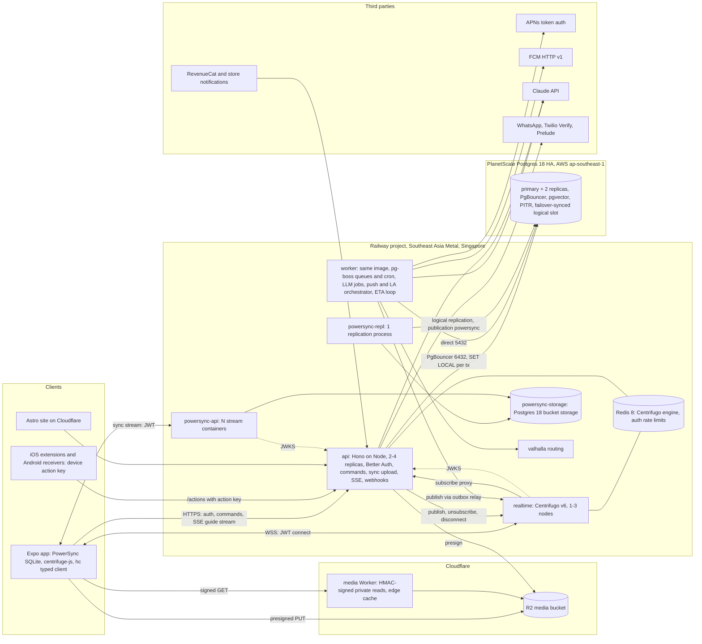

# Critterpass: custom TypeScript Hono backend (replacing Supabase)

Researcher report · 2026-09-26 (Asia/Saigon) · Design and analysis only; no code exists yet.

**Trigger.** The founder wants "our own Hono backend… easier to customise, no worries about Supabase limitations one day". This is a founder decision. This report designs the best custom stack and does not re-argue the decision. §9 gives an honest comparison and says when Supabase would still be the wiser choice.

**Inputs:**
- Master synthesis §0, §3, §5, §6.2, §7, §10.4.
- Tech-stack decision brief (D5–D8, D14; §3–4).
- Previous backend report and its fact-check. Their Supabase figures are reused as the comparison baseline, as verified on 2026-09-26.

**Key constraint change vs the brief.** The brief assumed a team of 5–6 engineers. This report assumes **one founder plus Claude Opus 5.5 coding agents, full scope at launch**. That makes operational burden the top criterion.

**Evidence rules:**
- Versions come from the npm registry or the GitHub API. Everything else comes from primary docs.
- Everything was checked 2026-09-26.
- "(est.)" marks our own estimate. "(unverified)" marks a claim not confirmed from a primary source.
- WebSearch was exhausted, so all evidence came from direct fetches of primary pages, APIs and repos.

---

## 0. TL;DR

1. **Recommended custom stack** (exact pins in §5.1):
   - **Runtime:** Hono 4.13 on **Node 24 LTS, moving to Node 26 LTS** once 26 enters LTS on 2026-10-28.
   - **Codebase:** one server codebase deployed as `api` and `worker`.
   - **Realtime:** **Centrifugo v6 (OSS)**.
   - **Offline sync:** **self-hosted PowerSync Open Edition**.
   - **Auth:** **Better Auth 1.7**.
   - **Database:** **Postgres 18 on PlanetScale Postgres HA (AWS ap-southeast-1)**, with Drizzle 0.45 and **RLS plus per-request `SET LOCAL` claims**.
   - **Jobs:** pg-boss 12.
   - **Media:** Cloudflare R2.
   - **Push:** @parse/node-apn 8.1 + firebase-admin 14.
   - **Hosting:** everything else runs on **Railway, Southeast Asia Metal (Singapore)**.
2. **Why it is viable now.** Four facts from 2026 checks:
   - Railway has shipped Postgres HA (Patroni) and PITR (pgBackRest).
   - PlanetScale Postgres documents failover that **preserves logical replication slots**, which PowerSync needs.
   - Centrifugo OSS covers JWT/JWKS (EdDSA), per-channel authorisation, presence, history recovery and server-side unsubscribe.
   - Better Auth covers anonymous-first sign-in, phone OTP, native Apple/Google ID tokens, JWKS for third parties, and Expo.
3. **What it fixes structurally vs Supabase:**
   - **Realtime revocation lag is gone.** Supabase caches policies per connection; here the server can force an unsubscribe.
   - **No refresh-token race with app extensions.** Better Auth sessions slide instead of rotating.
   - **No Supabase caps:** Realtime connections, presence rate, per-message billing, or the 30 SMS/h auth limit.
   - **Sync stays in Singapore.** PowerSync Cloud has **no Singapore region** (US/EU/JP/AU/BR/IN), so self-hosting keeps data in-region.
4. **What it costs:**
   - **Build:** about **+5–10 founder-weeks** before launch (est.; central ~7).
   - **Operations:** about **0.5 day/week** ongoing (est.).
   - **Permanent ownership** of auth security (Better Auth has had 32 advisories since 2024-12; 3 critical, most in plugins we won't use), database operations, and on-call as a single operator.
   - **Hosting cost is at parity or cheaper**, even with database HA: **~$95 / ~$280 / ~$1.4k per month** at 1k / 10k / 100k MAU. The Supabase path is ~$95–110 / $200–320 / $1.6–1.85k *without* database HA.
5. **Scores:** a near tie on the weighted matrix (§3). Custom scores **84**; Supabase scored **86** because of operations and build effort. The founder's preference for control legitimately tips it.
   - **Runner-up (within custom):** an all-Railway variant with Railway Postgres (standalone + PITR, then HA). It is cheapest and has no second vendor. However, Railway calls its database templates "unmanaged", and failover of logical replication slots is undocumented.
   - **Flip back to Supabase** if the three R0 gates fail (§8), if the launch date is fixed and tight, or if the founder won't be on-call.
6. **Must-know gotchas:**
   - Better Auth's anonymous plugin creates a **new user id** when you sign in with another method and deletes the anonymous one. Use `linkSocial({idToken})` and the phone plugin's `verify({updatePhoneNumber:true})` to keep the uid. Spike this.
   - PowerSync Pro caps at 3,000 concurrent clients by default.
   - Railway limits:
     - Edge: 10k concurrent connections (raisable) and a 5-minute request-body upload limit.
     - Scaling: no built-in autoscaling, and at most 42 replicas per service on Pro.
     - Health: healthchecks run only at deploy time.
   - R2 presigned URLs don't work on custom domains.
   - Node 24 leaves Active LTS on 2026-10-20.

---

## 1. Context: what changes and what stays

| Stays (contracts from the brief and master) | Changes (this report) |
|---|---|
| Postgres schema and privacy classes C0–C5 (master §3.2) | Supabase Auth → **Better Auth** |
| Every mutation is an **idempotent command keyed by `op_id`** (UUIDv7) | SQL RPCs via PostgREST → **Hono command endpoints** (one handler registry) |
| PowerSync local-first + outbox (3k-4) | PowerSync Cloud (Supabase connector) → **self-hosted PowerSync** with a custom JWKS and a `/sync/upload` endpoint |
| Durable data in the DB; realtime carries ephemeral traffic and nudges only | Supabase Realtime (RLS on `realtime.messages`) → **Centrifugo** namespaces + subscribe proxy |
| Worker jobs, APNs/FCM orchestrator, ETA loop, LLM gateway (brief D9, D14) | pg_cron + pgmq → **pg-boss** (cron, queues and DLQ in the same Postgres) |
| Extensions never run JS or hold refresh tokens | Supabase Storage (TUS) → **R2 presigned PUT/multipart** + a Worker for private CDN reads |
| Singapore region; Vietnam PDPL review (brief D-11) | Supabase dashboard/Studio → **our admin surface** (Better Auth admin plugin + a DB GUI + a small internal console) |

---

## 2. Criteria tied to Critterpass features (weights sum to 100)

| # | Criterion | Wt | Critterpass evidence |
|---|---|---|---|
| K1 | Privacy enforcement for C3 data | 15 | Budget max "nobody sees anyone else's number" (3c-5); private guide threads (3f-4); live location windows (3g-4, 3k-6); dietary (3i-1, 3j-3); payout handles (3i-5) |
| K2 | Offline outbox and local-first | 12 | 3k-4 "sends when you're back"; "Bookings · all offline"; offline FX; ~20 live screens |
| K3 | Realtime fit | 12 | 28 channels (master §5): chat, typing, presence and cursors (3g-2), votes, crew location every 15–60 s, SOS sub-second, swipe; **revocation on member removal** |
| K4 | Auth fit | 12 | Pass exists before the account (3a); link Apple/Google/phone keeping data; merge on conflict; phone OTP routing (WhatsApp → SMS) and the VN brandname; extension actions (5a-1, 5b-2, 5c) |
| K5 | Jobs and scheduling | 8 | Per-timezone morning briefing and 20:00 roundup, leave-by, a 60 s ETA loop, multi-minute AI drafting with visible steps (3c-8), purges and exports |
| K6 | Operational burden for a solo founder | 15 | One person is on-call for everything; agents write code but don't carry pagers |
| K7 | Build effort with AI agents | 10 | Popular, typed, well-documented libraries with stable APIs; fewer bespoke protocols |
| K8 | Cost at 1k–100k MAU | 6 | Bootstrapped; AI dominates cost anyway (brief §4.3) |
| K9 | Control and lock-in | 5 | The founder's stated goal |
| K10 | Security maturity and track record | 5 | Auth is the highest-risk surface we would own |

---

## 3. Options matrix (stack level; scores 1–5; weighted /100)

| Option | K1 | K2 | K3 | K4 | K5 | K6 | K7 | K8 | K9 | K10 | **Total** |
|---|---|---|---|---|---|---|---|---|---|---|---|
| **A. Custom, managed DB:** Hono/Node + PlanetScale PG HA + Better Auth + Centrifugo + PowerSync (self-host) + pg-boss + R2 | 5 | 4 | 5 | 4 | 5 | 3 | 4 | 4 | 5 | 3 | **84** |
| B. Custom, all-Railway: A but with Railway PG (standalone + PITR → HA) | 5 | 3 | 5 | 4 | 5 | 2 | 4 | 5 | 5 | 3 | 80 |
| C. Custom, DIY realtime: A but with Hono WebSockets + Redis pub/sub instead of Centrifugo | 5 | 4 | 3 | 4 | 5 | 2 | 3 | 4 | 5 | 2 | 73 |
| D. Custom, edge: Hono on Cloudflare Workers + Durable Objects/PartyServer + a connection to SG Postgres | 4 | 4 | 5 | 4 | 3 | 3 | 3 | 5 | 3 | 3 | 75 |
| E. Supabase Pro + worker + PowerSync Cloud (previous recommendation) | 5 | 4 | 4 | 3 | 4 | 5 | 5 | 4 | 4 | 4 | **86** |

Scoring notes:
- **A, K2 = 4:** PowerSync self-host plus PlanetScale's documented failover of slots. **B, K2 = 3:** Railway's Patroni runs `use_slots` for *physical* member slots only, and **logical-slot failover isn't documented**. After a failover, PowerSync may need a full re-replication (§4.2).
- **E, K4 = 3:** Supabase manual linking is still Beta, the 10 s refresh-token reuse window races with extensions, and there is a 30 SMS/h project limit (fact-check).
- **K6:** A = 3 because the DB is managed but we operate 7 Railway services. B = 2 because Railway says its DB templates are "unmanaged". E = 5.
- **C, K3 = 3; K10 = 2:** we would re-implement presence, history recovery, channel auth and backpressure ourselves.
- **D, K5 = 3; K9 = 3:** a second runtime model (Workers). The DB is far from Workers placement for users worldwide. Deeper Cloudflare coupling.

---

## 4. Deep-dives by layer

### 4.1 Runtime and framework

| Item | Fact (2026-09-26) | Implication |
|---|---|---|
| Node release lines | 24 LTS: maintenance from **2026-10-20**, EOL 2028-04-30. **26: LTS from 2026-10-28**, EOL 2029-04-30. 26.10.0 was released 2026-09-22 | Spike on 24. **Ship on 26 LTS** before R1; a CI matrix runs 24 and 26 |
| Hono | 4.13.9 (2026-09-24), MIT, 32k★. WebSocket helper for Node is **built into `@hono/node-server` 2.x** (2.1.1); `@hono/node-ws` is **deprecated** | No extra WebSocket package. We only need WebSockets for dev tools, because realtime is Centrifugo |
| Bun | 1.4.2 (2026-09-05). Hono supports it natively (`hono/bun` websocket) | No hot path benefits: realtime is offloaded and the API is bound by the DB and the LLM. Library maturity on Node is higher: `@parse/node-apn` 8.x declares Node 22/24, and pg-boss needs "Node 22.12+ or Bun". **Use Bun only for scripts and tests, if at all.** Bun's `node:http2` client parity for APNs was not verified |
| Deploy shape | One `apps/server` image with two Railway services (`ROLE=api`, `ROLE=worker`). Migrations run in a Railway **pre-deploy command**, which runs on the private network; failure blocks the deploy; timeout 1–3600 s | Same code, two scaling profiles. `api` is stateless with 2+ replicas; `worker` is singleton-safe through pg-boss |
| Railway edge | HTTP/1.1 and HTTP/2; WebSockets exempt from duration/idle limits; HTTP ≤15 min while data flows; **request body must finish in 5 min**; **10,000 concurrent connections** (raisable on request); X-Real-IP set; no sticky sessions | SSE guide streaming fits. Large uploads go **directly to R2**, not through the API. Ask Railway to raise the connection limit before ~5k concurrent sockets |

**API style.**

| Option | Expo app | Swift/Kotlin extensions | Agent ergonomics | Verdict |
|---|---|---|---|---|
| Hono RPC `hc<AppType>` only | End-to-end types, no codegen | None (TS only) | Types need care: Hono docs warn IDE slowness grows with route count; the fix is compiling `AppType` via tsc/project references and keeping one Hono version. **TypeScript 7.0.2 (native compiler) is current**, which reduces this pain | Partial |
| `@hono/zod-openapi` 1.6.3 (zod 4.6.5) + generated clients | Codegen step | `swift-openapi-generator` 1.13.1, openapi-generator | Explicit contracts, a docs UI (`@scalar/hono-api-reference`), contract tests | Good |
| **Both: define routes with zod-openapi, consume with `hc`** | `hc` works because zod-openapi "supports Hono's RPC mode" | `/openapi.json` for Swift/Kotlin (only ~5 `/actions/*` endpoints; hand-write them unless they grow) | One schema source in `packages/contracts` | **Recommend** |

Command surface:
- `POST /v1/cmd/{name}` with body `{op_id, ...}`. Each command is a zod input → policy → transaction → outbox events.
- The **same handler registry** serves `/v1/cmd/*` (app), `/sync/upload` (PowerSync queue) and `/actions/*` (extensions).

### 4.2 Postgres hosting in Singapore

| Host | HA | Backups / PITR | Logical replication for PowerSync | pgvector | Network to Railway SG | Managed? | $/mo at 1k / 10k / 100k (DB only) |
|---|---|---|---|---|---|---|---|
| **PlanetScale Postgres** (`ap-southeast` listed) | Production branches get **1 primary + 2 replicas**. A commit needs ≥1 replica ack. PgBouncer (6432) **buffers queries during failover** | Backups every 12 h included. **PITR** from 2 days ago (default) to "5 minutes before now"; longer with custom schedules | Supported (PowerSync: "enabled by default"). **Failover-safe slots are documented**: `sync_replication_slots=on`, `logical_slot_sync_timeout`, plus a failover slot list (PG17+) | Yes (+ pgvectorscale) | Public internet with TLS (cross-provider). Allow-list Railway **static outbound IPs** (Pro; 3 IPs; may be shared) | Yes | HA SKUs (**us-east-1 list prices**): PS-20 $50 (¼ vCPU, 2 GiB) / PS-80 $148 (1 vCPU, 8 GiB) / PS-320 $570 (4 vCPU, 32 GiB). Storage extra (rate not captured). **SG prices "vary by region" (unverified)** |
| Railway Postgres (`asia-southeast1-eqsg3a`) | **HA via Patroni 4.1.3 + etcd + HAProxy**, 2–7 replicas; failover "<10 s" (template README). Conversion drops connections and changes endpoints | Scheduled volume backups (daily 6 d / weekly 27 d / monthly 89 d). **PITR via pgBackRest** to a Railway bucket: weekly full + daily differential, last 4 fulls (~4 weeks); `archive_timeout=60` | Works on standalone (`ALTER SYSTEM SET wal_level=logical`). HA: `use_slots` covers physical member slots; logical slots are "never touched"; **no documented logical-slot failover** | **pgvector 0.8.x baked into the official images** (HA needs an official image) | Private network, no egress fee | **"Unmanaged"** per Railway docs; you tune and maintain it | Standalone + PITR ~$10 / ~$50 / ~$215; HA ~$30 / ~$125 / ~$520 (est., usage billing $20/vCPU, $10/GB, $0.15/GB volume) |
| Neon (`aws-ap-southeast-1`) | **No hot standby**. Recovery takes "a few seconds" (crash) to "1–10 minutes" (AZ failure) | PITR up to 7 d (Launch) / 30 d (Scale) at $0.20/GB-month | Supported. Max 10 slots. **Inactive slots auto-removed after ~40 h**; a branch restore deletes slots | Yes | Public (cross-provider) | Yes | Scale $0.222/CU-h + $0.35/GB: ~$45 / ~$180 / ~$750 always-on (est.) |
| AWS RDS Postgres Multi-AZ (ap-southeast-1) | Multi-AZ standby (mature) | Automated backups and PITR (retention not re-verified here) | `rds.logical_replication` (PowerSync docs) | Yes (not re-verified) | Public/cross-provider | Yes | db.t4g.medium MAZ $0.203/h ≈ $148 + gp3 MAZ $0.276/GB. db.m7g.large MAZ $0.468/h ≈ $342. db.m7g.xlarge MAZ $0.937/h ≈ $684. Total ≈ $154 / $356 / $767 |
| Aurora Serverless v2 (SG) | Needs a reader instance for HA | Continuous backup | Supported (not verified) | Yes | Public | Yes | $0.20/ACU-h ($0.26 IO-Optimized); storage $0.11/GB. Not modelled |
| Crunchy Bridge | HA option | PITR | Supported (not verified) | Yes | Public | Yes | Still sold ("hobby-0 … $5 minimum"); the calculator isn't machine-readable, so SG pricing is **unverified** |
| Google Cloud SQL (asia-southeast1) | HA option | PITR | Supported via flags (PowerSync docs) | Yes | Public | Yes | Pricing page not machine-readable; **unverified** |
| Supabase as DB-only (founder prefers to avoid; listed for honesty) | No HA on Pro | Daily backups; PITR $100/mo per 7 d | First-class | Yes | Public | Yes | $25 / ~$75 / ~$225 (+$100 PITR). Keeps a Supabase dependency, which contradicts the goal |

**Pick: PlanetScale Postgres HA (Postgres 18) in ap-southeast-1.** It is the only managed option that documents all four things Critterpass needs:
- HA with replicas;
- PITR;
- **logical slots that survive failover** (PowerSync);
- pgvector.

Guardrails:
- Connection split: `api` connects through PgBouncer :6432, which is compatible with transaction-pooled `SET LOCAL`. `worker` (pg-boss LISTEN) and the PowerSync replication role connect **directly on :5432**.
- Keep a nightly logical dump to R2 as an off-provider DR copy.

**Runner-up: Railway Postgres** (standalone + PITR at R0–R1, then HA before R3). Flip to it if either of these holds:
- PlanetScale's SG Postgres availability, latency or price fails the spike (§8, S-DB);
- the R0 test proves a PowerSync slot survives a Railway HA switchover.

### 4.3 ORM, migrations, SQL, DB tests

| Library | Version (npm) | Status | Fit |
|---|---|---|---|
| **Drizzle ORM** | **0.45.3** stable (2026-09-21); **1.0 in RC** (`rc` tag 1.0.0-rc.4, 2026-06-27; RC builds continue) | v1 changes the migrations folder layout (`drizzle-kit up`), and Relational Queries v1 → v2 is breaking | **Recommend 0.45 plus the SQL-like core API only.** Avoid RQB v1, so the v1 upgrade is mechanical. It has first-class `pgPolicy`/`pgRole` RLS (drizzle-kit generates policies; set `entities.roles`) |
| Kysely | 0.29.6 (0.30 beta) | Stable query builder, no schema/migration generator | Good fallback for complex SQL. pg-boss and Better Auth both have Kysely adapters |
| Prisma | 7.10.0 stable; **8.0.0-rc.17 is on the `latest` dist-tag** ("Prisma Next" renamed to Prisma 8, new contract model) | Major transition in flight | Avoid for a new build now |

**Migrations:**
- `drizzle-kit generate` produces SQL files that are reviewed and committed.
- **Custom SQL migrations** hold what the ORM doesn't model: roles and grants, RLS helper functions, the `powersync` publication, triggers, pgvector indexes.
- The pre-deploy command runs `drizzle-kit migrate` with a timeout.
- Rules: expand/contract migrations only; never drop a column that is in the publication without first updating the Sync Streams.

**DB tests:**
- **Vitest 5.0.2 + `@testcontainers/postgresql` 12.1.0**, using a real Postgres 18 + pgvector image.
- The **permission contract suite** covers fixture users (outsider, ex-member, member, organiser) × commands × RLS × Sync Streams × Centrifugo channel authorisation × LLM context views. It is PR-blocking.
- PGlite 0.5.8 is optional for fast pure-SQL unit tests. pgTAP is not needed (YAGNI): Vitest drives the same `withUser()` path production uses.

### 4.4 Authorisation model

| Option | Pros | Cons | Verdict |
|---|---|---|---|
| App-layer only (policy functions in Hono) | Simple; one place for business rules | One missed `WHERE crew_id` in agent-written code leaks C3 data. No backstop for the worker or ad-hoc queries | Not enough for the promises in 3c-5 and §10.4 |
| RLS only | DB-enforced | Business rules (entitlements, state machine, quotas) are awkward in SQL; policy sprawl | No |
| **Both: app-layer policy + RLS backstop, with per-request claims via `SET LOCAL` in each transaction** | Defence in depth. RLS catches data-scope bugs; app code owns business rules. Works with PgBouncer transaction pooling | Two layers to keep aligned. Needs the contract tests | **Recommend** |

How the recommended model works:
- **`withUser(uid, fn)`** runs `BEGIN; SET LOCAL ROLE app_user; SELECT set_config('app.uid', $uid, true); …; COMMIT`. Drizzle documents the same pattern.
- Policies use `STABLE SECURITY DEFINER` helpers (`app.is_crew_member(crew)`, `app.can_see_location(owner, trip)`) that read `current_setting('app.uid')`. Index `crew_members(user_id, crew_id)`.
- **Database roles:**
  - `app_owner`: migrations only.
  - `app_user`: API request context; RLS forced; no BYPASSRLS.
  - `app_system`: worker system jobs; explicit grants; cross-user writes only via SECURITY DEFINER functions.
  - **`guide_reader`**: LLM context; SELECT on non-C3 views only.
  - `powersync_repl`: REPLICATION; SELECT on published tables only.
  - `auth`: owns the Better Auth tables in an `auth` schema.
- **C3 tables** (`budget_max_private`, `user_private`, `payout_methods`, `private_guide_threads`, `location_fixes`, `dietary_profile`, `calendar_days`):
  - owner-only RLS;
  - **excluded from the `powersync` publication** (PowerSync reads everything in the publication);
  - no grant to `guide_reader`;
  - aggregates are exposed only through SECURITY DEFINER functions (budget band with k ≥ 4).
- **Field-level encryption** (AES-GCM, key in Railway variables, rotated yearly) for payout details, postal addresses and phone numbers (a hashed copy is kept for lookup).

### 4.5 Auth

| Option | Anonymous → link keeps uid | Phone OTP with a custom router | Native Apple/Google ID tokens | JWKS for PowerSync and Centrifugo | Expo | Lock-in | Maturity |
|---|---|---|---|---|---|---|---|
| **Better Auth 1.7.6** (MIT, 30k★, 2026-09-24) | `linkSocial({provider, idToken})` links to the **current** user. Phone: `verify({updatePhoneNumber:true})`. **Caveat: `signIn.*` from an anonymous session calls `onLinkAccount` and deletes the anonymous user (new uid)** | `phoneNumber` plugin: `sendOTP` hook (our router), custom `verifyOTP` (Twilio Verify), attempt limits, 300 s expiry | `signIn.social({idToken})`; Apple needs `appBundleIdentifier` | `jwt` plugin: **EdDSA/Ed25519 by default**, `/jwks`, key rotation, private key encrypted with AES-256-GCM | `@better-auth/expo` 1.7.6 stores the session in `expo-secure-store`. **The guide is written for Expo SDK 55** (we target 58) | None (own DB) | 32 GitHub advisories 2024-12 → 2026-08 (3 critical). Most are in `sso`, `scim` and `oauth-provider`, which we won't use. **Relevant ones:** "OAuth sign-in can link to an account an attacker registered in advance" (CVE-2026-53516), an IPv6 rate-limit bypass (CVE-2026-45364) and a repeated-slash rate-limit bypass (2025-12) |
| Auth.js | Weak for mobile | – | – | – | – | none | "Auth.js is now part of Better Auth"; its README recommends new projects use Better Auth |
| Custom with jose 6.2.12 + arctic 3.7 | We build it all | We build it | We build it | Trivial | We build it | none | Highest security-review burden. No |
| Clerk | No documented anonymous users | Pro: SMS US/CA $0.01, international "market rate" | Yes | Yes | Yes | High | Pro $25/mo, 50k MRU included, then $0.02 |
| WorkOS AuthKit | Not documented | Not documented | Yes | Yes | – | High | Free to 1M MAU |
| Stytch | Not researched (budget) | – | – | – | – | High | – |

**Recommended Better Auth configuration:**
- **Plugins:** `anonymous` (with `onLinkAccount` merge), `phoneNumber`, `jwt`, `expo`, and `admin` (support tooling).
- **IDs:** `advanced.database.generateId` returns UUIDv7, so domain foreign keys stay uuid.
- **Sessions:** `expiresIn` 30 d and `updateAge` 1 d. **Sessions slide rather than rotate**, so the Supabase 10 s refresh-token reuse race disappears.
- **Rate limiting:** storage `secondary-storage` in Redis, because there are several API replicas. `ipAddressHeaders: ['x-real-ip']` (Railway sets it). Custom rules on `/sign-in/anonymous` and `/phone-number/send-otp`.
- **Attestation:** a `hooks.before` on anonymous sign-in and OTP start verifies App Attest / Play Integrity.
- **JWT for sync and realtime:** 10–15 min EdDSA tokens. `aud` = [sync, rt]. `sub` = uid (the PowerSync requirements are `kid`, `aud`, `sub`, `iat`/`exp` ≤ 24 h, 60 min recommended).

**Our own code on top:**
- the SIWA `authorizationCode` → refresh-token capture and **revocation on deletion**;
- anonymous-user GC;
- the merge ticket for the "identity already exists" path;
- the device **action keys** for extensions (least privilege; kept even though the race is gone);
- `/account/delete` for the Play web requirement.

### 4.6 Realtime

| Option | Horizontal scale | Reconnect / history | Per-channel auth and revocation | Presence | Ops | Cost at 100k MAU (5k sockets) | Verdict |
|---|---|---|---|---|---|---|---|
| **Centrifugo v6.9.6** (Apache-2.0, 10.8k★, Go single binary) | Redis engine (Sentinel or Cluster). Railway Redis 8 HA is available. The Postgres broker is **experimental** | Per-channel **history stream + automatic recovery** (offset/epoch) | Connection JWT (HS/RS/ES; **EdDSA via JWKS**). **Subscribe proxy** to our API, or subscription tokens. **Server API `unsubscribe`/`disconnect`/`refresh`** | Built in (join/leave) | 1–3 containers + Redis | ~$60–80 in Railway resources (est.) | **Recommend** |
| Hono WebSockets (`ws`) + Redis pub/sub | Build it | Build it (Redis Streams) | Build it | Build it (TTL sets) | Our code | ~$50 (est.) | We'd rewrite Centrifugo's hard parts: recovery, presence cleanup on node crash, backpressure |
| Postgres LISTEN/NOTIFY fan-out | One listener per node | None | None | None | – | – | Payload **<8000 bytes**, delivered at commit, one 8 GB queue ("transactions calling NOTIFY will fail at commit" when full). Fine for wake-ups (pg-boss), not for location fan-out |
| Cloudflare Durable Objects / PartyServer 0.5.10 | Per-room object, hibernation | Build it (DO SQLite) | Verify JWT in the Worker | Build it | Second platform | $0.15/M requests, WebSocket messages billed 20:1 (fact-check) | Flip if users outside Asia dominate a crew's latency, or Railway connection limits bite |
| Soketi | – | – | – | – | – | – | **Stale:** last release 1.6.1 on 2024-03-25. Excluded |
| Ably (hosted) | Managed | History | Token auth (second system) | Yes | None | Standard $29 + $2.50/M messages + $1/M connection-minutes; ≤10k connections (Pro $399, 50k) | Flip for an SLA |
| Pusher Channels | Managed | No | Private channel auth | Presence channels | None | Business $299 (5k connections, 10M messages/day) → Premium $499 (10k) | Expensive per connection |

**Centrifugo limitations to plan for (OSS vs PRO):**
- Per-operation rate limits, the token revocation API, channel CEL permissions and multiple JWKS providers are **PRO-only** (commercial licence; price on request).
- Mitigations:
  - Throttle cursors and typing on the client (≤5 Hz, ≤1 per 3 s).
  - Only whitelisted namespaces allow client publish.
  - Revoke access with server-API `unsubscribe`/`disconnect` plus short connection-token `exp`.

### 4.7 Offline sync

| Option | Offline writes | Our Postgres + custom JWT | Status (2026-09-26) | Verdict |
|---|---|---|---|---|
| **PowerSync, self-hosted Open Edition** (service 1.26.1; `journeyapps/powersync-service`; **FSL-1.1-ALv2**) | Yes: the ordered upload queue calls our backend | Postgres ≥11, `wal_level=logical`, a publication named `powersync`, a REPLICATION or BYPASSRLS user. JWKS URI with RS/EdDSA/ECDSA; JWT ≤24 h | Bucket storage in **MongoDB or Postgres**. Production: 1 replication container + **2+ API containers (≤200 connections each, target ≤100)** + a daily compact job. **No dashboard when self-hosting.** Custom write checkpoints are Enterprise-only (not needed if uploads apply synchronously) | **Recommend** |
| PowerSync Cloud | Same | Same | Regions **US, EU, JP, AU, BR, IN; no Singapore**. Pro "from $49": 1k peak clients, **max 3,000 by default**, 30 GB synced + 10 GB hosted then $1/GB, $30 per extra 1k. Team $599 (max 10k, raisable) with an SLA | Flip if self-host operations hurt. Costs a public DB endpoint plus a copy of personal data in Japan |
| ElectricSQL 1.x | "Electric does not do write-path sync" | Read path only | `@electric-sql/client` 1.5.28 | Weak for 3k-4 |
| Zero 1.9.0 | **"Zero does not support offline writes"** ("not a priority right now") | – | – | Fails 3k-4 |
| Hand-rolled trip pack + outbox | Yes | Yes | – | Fallback on the same command contract |

**Write path:**
1. The client writes `cmd_*` rows into insert-only tables.
2. `uploadData` sends a `POST /sync/upload` batch.
3. Each op dispatches to the command handler inside `withUser`, idempotent on `op_id`.
4. The response is **2xx even for validation rejects**, as PowerSync recommends. The reject detail goes into a `cmd_results` row synced back to the client.
5. A 5xx is returned only for transient errors.

**Account switch.** On a uid change (the merge path), the client calls `disconnectAndClear()` and resyncs.

### 4.8 Jobs and scheduling

| Library | Version | Durability | Cron | Idempotency and retries | Throughput | Notes | Verdict |
|---|---|---|---|---|---|---|---|
| **pg-boss** | 12.34.0 (2026-09-23), MIT | Postgres, same transaction as the command (Drizzle/Kysely adapters) | **Cron + RRULE**, deferral | Singleton/debounce policies, retries with exponential backoff, **dead-letter queues with redrive**, priorities | SKIP LOCKED + LISTEN/NOTIFY | `@pg-boss/dashboard` 1.9.0. **Single maintainer** | **Recommend** |
| Graphile Worker | 0.18.0 | Postgres | crontab | `job_key` dedupe | ~183k jobs/s benchmark, 4 ms latency | Faster; fewer queue policies | Runner-up |
| pgmq (extension) | 1.13.0 | Postgres | No (needs pg_cron) | Visibility timeout | – | Needs the extension on the host. Supabase-style; no Node worker framework | No |
| BullMQ | 6.3.9 | **Redis** (not transactional with Postgres) | Repeatable jobs | Dedup, rate limiter (group limits are Pro) | Highest | Needs Redis durability (AOF) and a dual-write outbox | No |

**Design (unchanged semantics from the brief D14):**
- `scheduled_events.due_at` is computed from local time + timezone.
- A pg-boss cron every minute runs `enqueue_due`, which feeds the queues `push | ai | eta | maint | rt-outbox`.
- AI job progress goes into `ai_jobs.steps` and is published to `user:#uid`.
- Quotas are reserved inside the command transaction and released on failure.
- Throughput at 100k MAU is ≪100 jobs/s (est.), well within either library.

### 4.9 Storage and media

| Decision | Choice | Facts |
|---|---|---|
| Object store | **Cloudflare R2** | $0.015/GB-month, **free egress**, Class A $4.50/M, Class B $0.36/M. Free tier: 10 GB, 1M A, 10M B |
| Uploads | Client renditions (2048 px ≈1.2 MB + 512 px thumbnail, per brief), **presigned PUT** from background URLSession/WorkManager. Originals >5 MB use **presigned multipart** (parts ≥5 MiB, ≤10,000 parts; incomplete uploads abort after 7 d) | Presigned URLs support GET/HEAD/PUT/DELETE, 1 s–7 d expiry. `CreateMultipartUpload` is a POST, so it is called server-side. After upload, a `register_photo` command writes the row |
| tus (`@tus/server` 2.4.5 + `@tus/s3-store` 2.0.7) | **Not needed** (YAGNI) | Routing tus through Railway also hits the 5-minute request-body limit |
| Private reads | Custom domain `media.critterpass.app` → a **Cloudflare Worker validating HMAC-signed, short-TTL URLs** (album membership checked when minting) → edge cache | "Presigned URLs … cannot be used with custom domains". Use the WAF HMAC or a Worker |
| Thumbnails/transforms | Client-side for user photos. `sharp` 0.35.4 in the worker for avatars, OG and moderation crops. Cloudflare Images only for the static catalogue | Images: 5k unique transforms free, then **$0.50 per 1k**; can transform R2 sources |
| Purge | Deletion job removes objects via the S3 API, then rows | Keep an object manifest per user for exports and deletion |
| Railway Buckets | Use for **PITR/backup archives only** | $0.015/GB, free egress/ops, **private only (no public/CDN)** |

### 4.10 Push

| Need | Library | Evidence |
|---|---|---|
| APNs token auth; `liveactivity`; push-to-start with `input-push-channel`; **channel management (create/read/readAll/delete)**; **broadcast**; `widgets` push type | **`@parse/node-apn` 8.1.0** (2026-04-12) | README sections "Manage Channels" and "Sending A Broadcast Notification". 8.1.0 adds the `widgets` push type; 6.5.0 added `input-push-channel`. It supports Node 22/24 (8.0 dropped 18). **Node 26: test in CI** |
| FCM HTTP v1 | **`firebase-admin` 14.5.0** (2026-09-23) | Standard |
| Channel GC, budgets, priority 5/10 | Our LA orchestrator (brief D14) | 10k channels per environment (fact-check P1) |

### 4.11 Search and vectors

- **pgvector 0.8.x** (latest tag v0.8.6): HNSW for idea-board duplicate detection (AI-37) and taste matching (AI-42). PlanetScale also offers pgvectorscale.
- **Full text:** `tsvector` with the `simple` config plus `unaccent` for multilingual place names, and **`pg_trgm`** for fuzzy POI search (unverified on PlanetScale's extension list; check it in the spike). No separate search engine is needed.

### 4.12 Operations

**Railway topology.** One project; `production` and `staging` environments; PR environments optional.

| Service | Image | Replicas (1k → 100k) | Volume | Public domain |
|---|---|---|---|---|
| `api` | apps/server (`ROLE=api`) | 2 → 4 | – | `api.critterpass.app` |
| `worker` | apps/server (`ROLE=worker`) | 1 → 2 | – | – |
| `realtime` | `centrifugo/centrifugo:v6` | 1 → 3 | – | `rt.critterpass.app` (WebSocket only) |
| `redis` | `redis:8` (→ Redis HA via Sentinel: 3 nodes + HAProxy) | 1 → 3 | yes | – |
| `powersync-repl` | `journeyapps/powersync-service` (`start -r sync`) | 1 (exactly one) | – | – |
| `powersync-api` | same image (`start -r api`) | 1 → 25–50 (≤200 connections each) | – | `sync.critterpass.app` |
| `powersync-storage` | Railway Postgres 18 (bucket storage; rebuildable) | 1 | yes | – |
| `valhalla` | Valhalla 3.9.0 | 1 → 2 | yes (tiles) | – |
| DB | PlanetScale Postgres HA (external) | – | – | – |

**Operational facts that shape the plan:**
- **Autoscaling:** Railway scales each container vertically on its own. Replica counts are manual or set through the API (the docs publish a DIY autoscaler guide). Maximum **42 replicas/service on Pro** (50 per the guide text; the plan table says 42).
- **Zero-downtime deploys:** needs a healthcheck path. **Services with volumes have redeploy downtime** (Redis standalone, Valhalla, powersync-storage).
- **Realtime deploys:** Centrifugo node restarts drop sockets. Clients reconnect and recover from history.
- **Monitoring:** Railway healthchecks are **not continuous**. Add an external uptime monitor on `/health`, `sync/probes/liveness` and the realtime health endpoint.
- **Observability:**
  - Railway collects metrics and logs automatically.
  - **Built-in OTLP trace receiver** (preview; traces only) is exposed through `OTEL_EXPORTER_OTLP_ENDPOINT`.
  - `@opentelemetry/sdk-node` 0.222.0.
  - **Sentry:** stay on `@sentry/node` 10.x until 11.0.x patches land (11.0.0 shipped 2026-09-23).
  - PowerSync exposes Prometheus metrics. Enable `pg_stat_statements`.
- **Secrets:** Railway variables per environment, with reference variables for DB and bucket credentials. Rotate quarterly: Better Auth secret and JWT keys (the plugin supports `rotationInterval`), APNs .p8, FCM service account, R2 keys, DB passwords.
- **Backups and DR:**
  - Primary: provider PITR (PlanetScale ≥2 d default; extend to 14–30 d with a custom schedule).
  - **Nightly `pg_dump` to R2** (off-provider) with 35-day retention.
  - **Monthly restore drill:** restore into a fork, run the contract suite, record RTO.
  - Targets (est.): RPO ≤5 min, RTO ≤2 h.
  - PowerSync bucket storage needs no backup: it is re-replicated from source.

**Security hardening checklist (R0–R3):**
1. TLS everywhere. DB reached only from static outbound IPs. The DB user for `api` has no DDL.
2. RLS `FORCE` on all user-data tables. Default-deny grants. C3 excluded from the publication and from `guide_reader`.
3. Better Auth:
   - pin a minor version; watch the advisories feed; patch within 48 h;
   - disable unused endpoints;
   - `trustedOrigins` = the app scheme and the site;
   - `disableImplicitLinking` for OAuth (conflicts go through the explicit merge ticket).
4. Rate limits:
   - per IP (/64 for IPv6), per phone number and per device;
   - SMS country allow-list, daily SMS spend alarm, App Attest / Play Integrity on anonymous sign-in and OTP start.
5. Every command validated with zod. Body limits in Hono. Idempotency table with a TTL. Every endpoint authenticated except `/health`, JWKS and webhooks (webhooks verify signatures: RevenueCat, App Store Server Notifications, inbound email).
6. Centrifugo:
   - client publish only in `*-ephemeral` namespaces;
   - `allow_subscribe` only via the proxy or `#` user boundary;
   - admin UI disabled in production;
   - API key only on the private network.
7. R2: bucket private; presign TTL ≤15 min for PUT and ≤1 h for GET; HMAC keys rotated.
8. Prompt-injection controls from the brief (allow-listed tools, confirmation before spend). `guide_reader` has no C3 grants.
9. Dependencies: Renovate with grouped weekly PRs, `npm audit`/OSV in CI, container image digests pinned.
10. External pen-test or security review of the auth and permission layer before R3 (~$3–8k, unverified).

**What the founder and agents must operate that Supabase handled:**

| Responsibility | Under Supabase | Custom stack | Recurring effort (est.) |
|---|---|---|---|
| Postgres patching, HA, failover | Supabase (no HA on Pro) | PlanetScale (managed) or you (Railway) | ~0 / 1 h/mo |
| Backups, PITR, restore drills | Supabase + $100 PITR add-on | Provider PITR + **your** nightly dump + monthly drill | 1–2 h/mo |
| Auth security patches and abuse | Supabase | **You:** Better Auth upgrades (~1.5 advisories/mo historically), SMS-pumping alarms | 1–3 h/mo + incidents |
| Realtime scaling and upgrades | Supabase | Centrifugo + Redis | 1 h/quarter |
| Sync service | PowerSync Cloud | Self-hosted PowerSync (upgrades with storage migrations, compact job, metrics) | 1–2 h/mo |
| Connection pooling | Supavisor | PlanetScale PgBouncer | ~0 |
| Dashboard / auth admin / table editor | Studio | DB GUI + Better Auth `admin` plugin + internal console (build 1–2 weeks) | – |
| Capacity planning | Pick a compute size | Replica counts per service (no autoscaler) | 1 h/mo |
| On-call / status | Supabase infra on-call; you for the app | **You for everything**: uptime monitor + Sentry alerts to phone | continuous |
| Dependency and CVE upgrades | Fewer surfaces | ~8 services + ~25 libraries | 1–2 h/week |

---

## 5. Recommendation

### 5.1 Recommended custom stack (pins as of 2026-09-26)

| Layer | Choice | Version |
|---|---|---|
| Runtime | Node.js LTS | 24.x now → **26.x LTS** (LTS from 2026-10-28) |
| Language | TypeScript | 7.0.2 |
| HTTP framework | Hono + `@hono/node-server` | 4.13.9 + 2.1.1 |
| Contracts / OpenAPI | `@hono/zod-openapi` + zod (+ `hc` client) | 1.6.3 + 4.6.5 |
| API docs | `@scalar/hono-api-reference` | 0.12.6 |
| DB | PlanetScale Postgres HA, Postgres 18 (ap-southeast-1) | managed |
| DB driver / ORM | `pg` + `drizzle-orm` + `drizzle-kit` | 8.23.0 + 0.45.3 + 0.31.11 |
| Vectors | pgvector | 0.8.x |
| Auth | `better-auth` (+ anonymous, phoneNumber, jwt, admin) + `@better-auth/expo` | 1.7.6 |
| JWT utilities | `jose` | 6.2.12 |
| Realtime | Centrifugo (OSS) + `centrifuge` JS client | v6.9.6 + 5.7.4 |
| Cache / realtime engine / auth rate limits | Redis (Railway, HA later) | 8.x |
| Offline sync | PowerSync Service (Open Edition, Postgres bucket storage) + `@powersync/react-native` | 1.26.1 + 2.3.0 |
| Jobs / cron | `pg-boss` + `@pg-boss/dashboard` | 12.34.0 + 1.9.0 |
| Object storage | Cloudflare R2 + `@aws-sdk/client-s3` / `s3-request-presigner` | 3.1141.0 |
| Images (server) | `sharp` | 0.35.4 |
| Push | `@parse/node-apn` + `firebase-admin` | 8.1.0 + 14.5.0 |
| Routing | Valhalla | 3.9.0 |
| Tests | Vitest + `@testcontainers/postgresql` (+ PGlite optional) | 5.0.2 + 12.1.0 (+ 0.5.8) |
| Observability | `@sentry/node` 10.x → 11.0.x later; `@opentelemetry/sdk-node`; Railway traces | 10.x; 0.222.0 |
| Hosting | Railway Pro, Southeast Asia Metal (`asia-southeast1-eqsg3a`); Cloudflare (R2, media Worker, Astro site) | – |

### 5.2 Service topology

### 5.3 Per-layer rationale (one line each)

| Layer | Why this pick |
|---|---|
| Node 26 LTS over Bun | Longest support window (to 2029-04-30). The APNs and queue libraries declare Node support. No Bun-only hot path |
| zod-openapi + `hc` | One schema gives TS types for the app, OpenAPI for Swift/Kotlin, and explicit contracts that agents can follow |
| PlanetScale HA | The only managed SG option with documented failover-safe logical slots plus HA, PITR and pgvector |
| Drizzle 0.45 core API | RLS as code, SQL-like, stable. The v1 RC upgrade stays mechanical |
| RLS + `SET LOCAL` + app policy | C3 promises backed by the DB; business rules stay in code |
| Better Auth | Anonymous plugin, phone, ID-token linking, JWKS, Expo, MIT. The Auth.js team has joined it |
| Centrifugo | Recovery, presence, proxy auth and forced unsubscribe out of the box. One Go binary |
| PowerSync self-host | Only mature offline-write engine. In-region. No 3k-client cap. The DB is never public to a third party |
| pg-boss | Transactional enqueue with Drizzle. Cron and RRULE, DLQ and a dashboard in the same Postgres |
| R2 + Worker | Free egress for album photos. Private CDN reads via HMAC. No transform bill |
| node-apn + firebase-admin | The only Node APNs library found with channel management + broadcast + widgets push types |

### 5.4 Runner-up and flip conditions

| Flip | Trigger |
|---|---|
| DB → **Railway Postgres** (standalone + PITR → HA) | PlanetScale Postgres is unavailable or too slow from Railway SG (p50 >3 ms) or too expensive in SG, **and** a PowerSync slot survives a Railway HA switchover in the spike (or we accept a re-replication after failover) |
| DB → **AWS RDS Multi-AZ** | Enterprise or compliance requirements, or the PlanetScale spike fails |
| Sync → **PowerSync Cloud Team (JP)** | Self-host operations cost >2 h/week, or >2k concurrent clients before a scale-out is ready |
| Realtime → **Durable Objects / PartyServer** | Railway connection ceiling or cross-region latency for EU/US crews becomes the complaint |
| Realtime → **Ably** | A contractual delivery SLA is needed |
| Jobs → **Graphile Worker** | pg-boss maintainer risk materialises, or throughput needs rise |
| **Whole stack → Supabase** | Any R0 gate fails (§8 S-AUTH, S-SYNC, S-DB); or the R3 date is fixed and the +5–10 weeks can't be absorbed; or the founder declines on-call; or there's no budget for an external auth review |

---

## 6. What changes in the previous architecture

| Area | Previous (Supabase design) | Custom design |
|---|---|---|
| **Command RPC** | SQL functions via PostgREST/supabase-js; `insert … on conflict (op_id) do nothing` | Hono `POST /v1/cmd/{name}` handlers in `withUser()` transactions. The same `op_id` idempotency table. The same registry serves `/sync/upload` and `/actions/*`. Hot invariants such as `reserve_redraft` can stay as SQL functions called from handlers |
| **Sync** | PowerSync Cloud, Supabase connector (JWKS from Supabase Auth; writes via supabase-js) | Self-hosted PowerSync (Railway SG). JWKS from Better Auth. `fetchCredentials()` gets a 15-min EdDSA JWT. `uploadData` sends `POST /sync/upload`. Validation rejects return 2xx + a `cmd_results` row |
| **Realtime topics** | Supabase private channels; RLS on `realtime.messages`; **epoch topics** because policies are cached per connection | Centrifugo namespaces (table below). Membership removal calls `unsubscribe(user, channel)`. **Epochs become optional.** Location stays server-publish only |
| DB-originated events | `realtime.send()` / `broadcast_changes` triggers | Transactional **`rt_outbox`** rows are written in the command transaction; the worker relays them to the Centrifugo `publish` API with an idempotency key. Best-effort nudges publish after commit |
| **Auth for extensions** | Scoped action keys because of the 10 s refresh-token race | Action keys **kept for least privilege**, though the race is gone (Better Auth sessions slide). Alternative: share the session token through the Keychain group (founder decision §11) |
| Auth hooks | Send-SMS hook; Before User Created hook for attestation | `phoneNumber.sendOTP` → our router; `hooks.before` for attestation. No 30 SMS/h project cap |
| Anonymous → account | `linkIdentity` / `updateUser(phone)` (manual linking **Beta**) | `linkSocial({idToken})` / `phoneNumber.verify({updatePhoneNumber:true})` keep the uid (spike). The conflict path uses `onLinkAccount` merge; the anonymous uid is deleted |
| Service role vs RLS | Service role bypasses RLS; `guide_reader` role | Explicit roles `app_user`, `app_system`, `guide_reader`, `powersync_repl` with no blanket bypass |
| Storage | Supabase Storage + TUS 6 MB chunks | R2 presigned PUT/multipart + a media Worker |
| Jobs | pg_cron (≤8 concurrent) + pgmq | pg-boss cron + queues in the worker |
| Guide streaming | SSE from `api` | Unchanged |
| Contract tests | RLS + Sync Streams + topics + prompts | RLS + Sync Streams + **Centrifugo proxy decisions** + prompts + **command policy** |

**Channel map (Centrifugo):**

| Namespace / channel | Subscribe authorisation | Client publish | History / recovery | Presence | Producer |
|---|---|---|---|---|---|
| `user:#{uid}` | Built-in user boundary (`#`) | No | Yes (inbox, job progress, acks) | No | api, worker |
| `crew:{crewId}` | Subscribe proxy → `is_crew_member` | No | Yes (100 messages / 24 h, est.) | No | outbox relay (msg, poll tally, ticker) |
| `crew_eph:{crewId}` | Proxy | **Yes** (typing ≤1/3 s) | No | Yes | clients |
| `trip_collab:{tripId}:{day}` | Proxy (participants) | **Yes** (cursor ≤5 Hz, client-throttled) | No | Yes | clients |
| `trip:{tripId}` (hub, dayof, watch, setup counts) | Proxy | No | Yes | No | outbox relay |
| `trip_loc:{tripId}` | Proxy + **active share window** | **No** (server only) | No | No | `post_location` command |
| `swipe:{sessionId}` / `proposal:{id}` / `sos:{id}` | Proxy | swipe yes, others no | sos yes | swipe yes | api, worker |

---

## 7. Costs (monthly, USD, list prices checked 2026-09-26)

**Assumptions (as in the previous report):**
- 5% peak concurrency: 50 / 500 / 5,000 concurrent app sessions, each with one sync stream and one WebSocket.
- Photos from client renditions; storage shown at month 12 (94 GB / 936 GB / 9.4 TB).
- Railway is billed on usage: $20/vCPU-month, $10/GB-month, $0.15/GB volume, $0.05/GB egress. The Pro base of $20 is credited against usage.
- **Excludes:** LLM, SMS, Valhalla (+~$30 / $40 / $100 in both stacks), and observability SaaS.

| Line | 1k MAU | 10k MAU | 100k MAU | Basis (est.) |
|---|---|---|---|---|
| Railway `api` | $10 | $24 | $104 | 2×(0.1 vCPU, 0.3 GB) → 4×(0.8, 1 GB) |
| Railway `worker` | $7 | $18 | $80 | 1×(0.1, 0.5 GB) → 2×(1, 2 GB) |
| Railway `realtime` + Redis | $4 | $13 | $63 | Centrifugo 1 → 3 nodes; Redis 1 → HA |
| PowerSync self-host (repl + API + storage PG) | $14 | $43 | $310 | 30× API containers at 100k |
| Railway egress | $1 | $4 | $20 | ~350 GB at 100k |
| **Railway subtotal** | **~$36** | **~$102** | **~$577** | |
| **PlanetScale PG HA** (us-east list; SG may differ) + storage (rate unverified) | $50 + ~$3 | $148 + ~$10 | $570 + ~$60 | PS-20 / PS-80 / PS-320 HA |
| Cloudflare R2 + Workers Paid | ~$6 | ~$20 | ~$160 | storage + ops + $5 base |
| **Total, recommended (A)** | **~$95** | **~$280** | **~$1.37k** | Includes DB HA |
| Variant B: Railway PG standalone + PITR | ~$52 | ~$172 | ~$950 | No HA |
| Variant B-HA: Railway PG HA + PITR | ~$72 | ~$247 | ~$1.26k | Patroni, 3 nodes |
| Swap to PowerSync Cloud | +$35 (Pro $49) | +$6 (Pro $49) | **+$500** (Team $599 + 4×$30 + ~$90 data) | Pro is capped at 3k clients |
| **Supabase path (brief §4.2, fact-check adjusted)** | $95–110 | $200–320 | $1.6–1.85k | **No DB HA**; PITR $100 at 100k |
| SMS OTP (same both ways) | $17–25 | $175–245 | $1.74–2.46k | unchanged |

**Conclusion.** The custom stack is **equal or cheaper at every tier while adding database HA**. Cost does not decide this; effort and operations do.

---

## 8. Risks and mitigations

| Risk | L / I | Mitigation | R0 gate |
|---|---|---|---|
| **Better Auth `linkSocial` on an anonymous session doesn't keep the uid or flip `isAnonymous`**, or native Apple/Google ID-token flows misbehave on Expo SDK 58 (guide targets 55) | M / H | Spike first. Fallback: the `onLinkAccount` merge in one transaction plus PowerSync `disconnectAndClear` | **S-AUTH** |
| Auth security ownership (32 advisories in 21 months, incl. account-linking CVE-2026-53516) | M / H | Minimal plugin set; pin and patch within 48 h; advisory watch; `disableImplicitLinking`; external auth review before R3 | – |
| PowerSync slot lost on DB failover, forcing a full re-replication | M / M | PlanetScale failover slot sync (`sync_replication_slots`); a switchover drill in the spike; the PowerSync diagnostics API | **S-SYNC** |
| Self-hosted PowerSync scale (≤200 connections/container; Railway 42 replicas/service) | M at 100k / M | Two API services or a flip to Cloud Team; load test at 2k connections | S-SYNC |
| PlanetScale Postgres not available/priced as assumed in SG; cross-provider latency from Railway (Equinix SG3) to AWS ap-southeast-1 | M / M | Measure p50/p99 round trip in the spike; fallback to Railway PG | **S-DB** |
| Railway edge 10k concurrent connection limit (scope unclear: per domain or per project) | M at ~100k / H | Separate domains per service; ask Railway to raise it early; Durable Objects flip | – |
| No autoscaling on Railway | M / M | Scheduled replica bumps (trip-peak hours) + a small autoscaler on the Railway API; alerts on p95 latency | – |
| Centrifugo OSS lacks per-op rate limits and token revocation | M / L | Client throttle; publish only in ephemeral namespaces; short token `exp`; server unsubscribe/disconnect | – |
| Solo on-call; bus factor 1 | H / H | External uptime monitor + Sentry phone alerts; runbooks written by agents; managed DB; documented restore drills; accept a stated SLO (e.g. 99.5%) | – |
| pg-boss single maintainer | L / M | Graphile Worker as a drop-in class of replacement (same Postgres) | – |
| Drizzle v1 / Prisma 8 churn | M / L | Drizzle 0.45 core API only; plan the v1 upgrade after GA | – |
| Node 26 compatibility of `@parse/node-apn` | L / M | CI matrix on 24/26; stay on 24 until green (24 EOL 2028-04-30) | – |
| Data residency: PowerSync Cloud (if flipped) stores data in JP | M / M | Self-host in SG (recommended); PDPL review (brief D-11) | – |
| Upload through the API hits the 5-minute body limit | H if routed / L | Direct-to-R2 presigned uploads only | – |
| Build-effort overrun (+5–10 weeks) threatens a full-scope launch | M / H | R0 spikes first; the agent build order in §10; the cut list from brief D-2 | – |

**R0 spikes (add to brief §3.4):**
- **S-AUTH.** Anonymous → Apple/Google `linkSocial(idToken)` and phone `verify(updatePhoneNumber)` on SDK 58. Pass: uid unchanged, `isAnonymous` false, conflict → merge works.
- **S-SYNC.** Self-hosted PowerSync on Railway with Better Auth JWKS. Pass:
  - chat round-trip p95 <1 s;
  - offline replay passes;
  - a DB switchover keeps the slot (no full re-replication);
  - 1k synthetic connections hold.
- **S-DB.** PlanetScale PG 18 HA in SG. Pass:
  - Railway → DB p50 <3 ms (est. target);
  - `SET LOCAL` via PgBouncer works;
  - pgvector, pg_trgm and unaccent are available;
  - the price quote is recorded.
- **S-RT.** Centrifugo with a subscribe proxy and EdDSA JWKS. Pass: removal → unsubscribe <1 s; recovery after 2 min in the background; 5k sockets on 2 nodes.

---

## 9. Comparison vs the Supabase recommendation

| Dimension | Supabase path | Custom path | Delta / verdict |
|---|---|---|---|
| Build effort (founder + agents, est.) | ~11 founder-weeks for backend plumbing | ~19 | **+5–10 weeks** (central ~+8). Detail in the next table |
| Ongoing operations (est.) | ~1–2 h/week | ~4 h/week + on-call for all layers | More operations |
| Cost 1k / 10k / 100k | $95–110 / $200–320 / $1.6–1.85k (no DB HA) | ~$95 / ~$280 / ~$1.37k (with HA) | Parity or cheaper |
| Lock-in | Low–medium (Realtime protocol, Auth API) | Low: PlanetScale is plain Postgres; everything else is OSS or FSL | Custom wins |
| Realtime | 10k connections with the cap off; presence 1k/s; per-message billing; **cached-policy revocation lag** | Scales with nodes; forced unsubscribe; no per-message fee | Custom wins |
| Auth | Manual linking **Beta**; 10 s refresh race; 30 SMS/h default | Full control; sessions slide; **we own security** | Custom wins on fit, loses on risk |
| Offline | PowerSync Cloud (JP, no SG) | PowerSync self-host (SG) | Custom wins on residency, loses on operations |
| Risk | Vendor limits | Execution and security | Different risks |

**Build-effort breakdown** (founder-weeks including review and tests; est., low confidence):

| Area | Supabase | Custom | Δ |
|---|---|---|---|
| Auth (anonymous → link, phone router, JWT for sync and realtime, rate limits, attestation, SIWA revoke) | 1.5 | 2.5 | +1 |
| Authorisation (RLS + roles + `withUser`) | 1.5 | 2 | +0.5 |
| Command API layer | 2 | 2.5 | +0.5 |
| Realtime (namespaces, proxy, outbox relay, RN client, revocation) | 1 | 2 | +1 |
| Offline sync (self-host, upload endpoint) | 1.5 | 2 | +0.5 |
| Storage and media (presign, register, media Worker, purge) | 0.5 | 1.5 | +1 |
| Jobs and cron | 1 | 1 | 0 |
| Infra and operations (HA DB, PITR, DR drill, environments, CI migrations, monitoring, runbooks) | 1 | 2.5 | +1.5 |
| Admin / support console | 0.5 | 1.5 | +1 |
| Security hardening and review prep | 0.5 | 1.5 | +1 |
| **Total** | **~11** | **~19** | **~+8** |

**Honest verdict.** The custom stack is sound, affordable and removes the Supabase limits that would actually bite Critterpass:
- realtime revocation lag;
- the extension session race;
- connection, presence and SMS caps;
- sync residency.

Its price is time and permanent operational and security ownership by one person.

**Supabase is still the wiser choice when** any of these hold:
1. the R3 date is fixed and full scope must ship;
2. the founder won't carry a pager or fund an auth review;
3. S-AUTH or S-SYNC fails;
4. a second engineer won't join before public launch.

---

## 10. Suggested agent build order (R0–R1)

1. `packages/contracts` (zod + OpenAPI), `db/` (Drizzle schema, roles, RLS helpers, publication), the contract-test harness (Testcontainers). **Gate: permission suite green.**
2. `apps/server`: Better Auth (anonymous, link, phone, jwt) → `withUser` → command registry → `/v1/cmd`, `/sync/upload`, `/actions`.
3. PowerSync self-host (staging) + Sync Streams + the RN client connector.
4. Centrifugo + subscribe proxy + outbox relay.
5. pg-boss worker (cron, ai, push) + node-apn/FCM.
6. R2 media Worker.
7. Operations: uptime, Sentry, Railway traces, nightly dump, first restore drill.

---

## 11. Decisions for the founder

| # | Decision | Options | Recommendation |
|---|---|---|---|
| F-1 | Confirm custom over Supabase, knowing +5–10 weeks and solo on-call | (a) Custom; (b) Supabase; (c) Custom only if R0 gates pass, else Supabase | **(c)**: commit after S-AUTH, S-SYNC and S-DB |
| F-2 | Database host | (a) PlanetScale PG HA SG; (b) Railway PG (standalone → HA); (c) RDS Multi-AZ; (d) Neon | **(a)**, (b) as fallback |
| F-3 | PowerSync hosting | (a) Self-host SG; (b) Cloud Pro/Team (JP) | **(a)** |
| F-4 | Extension auth | (a) Scoped device action keys; (b) share the session token via the Keychain group | **(a)**: least privilege, revocable per device |
| F-5 | Realtime engine | (a) Centrifugo OSS; (b) DIY Hono WebSockets; (c) Durable Objects | **(a)** |
| F-6 | Availability target and on-call | (a) 99.5% best-effort, phone alerts 07:00–23:00 SGT; (b) 24/7; (c) an outsourced on-call contract | (a) until paid scale (est. >10k MAU) |
| F-7 | Budget an external auth/permissions review before R3 | yes / no | Yes |
| F-8 | Admin tooling | (a) DB GUI + Better Auth admin + a thin internal console; (b) Retool-class tool | (a) |
| Carried over | Region and legal entity (PDPL, D-11); phone OTP scope (D-14); offline depth (D-10) | – | Unchanged; custom self-hosted sync keeps personal data in SG only |

---

## 12. Key claims

| Claim | Source URL | Date checked | Confidence |
|---|---|---|---|
| Railway Postgres HA: Patroni + etcd + HAProxy; 2–7 replicas; official images only; PG 14–18; conversion drops connections | https://docs.railway.com/databases/postgresql-ha | 2026-09-26 | High |
| Railway PITR via pgBackRest: weekly full + daily diff, last 4 fulls (~4 weeks), `archive_timeout=60`, restores into a new service | https://docs.railway.com/volumes/point-in-time-recovery | 2026-09-26 | High |
| Railway volume backups: daily 6 d / weekly 27 d / monthly 89 d | https://docs.railway.com/reference/backups | 2026-09-26 | High |
| Railway DB templates are "unmanaged"; extensions not added to templates | https://docs.railway.com/databases/postgresql | 2026-09-26 | High |
| Official Railway PG images bundle pgvector 0.8.* and pgbackrest | https://github.com/railwayapp-templates/postgres-ssl (Dockerfile.18); https://github.com/railwayapp-templates/postgres-ha (postgres-patroni/Dockerfile) | 2026-09-26 | High |
| Railway HA Patroni uses physical member slots; logical slots "never touched"; no logical-slot failover documented | https://github.com/railwayapp-templates/postgres-ha (README, src/orphan_slots.rs, src/patroni/config.rs) | 2026-09-26 | Medium |
| Railway pricing: $20/vCPU-mo, $10/GB-mo, $0.05/GB egress, $0.15/GB volume; Pro $20 incl. $20 usage; Pro 42 replicas | https://docs.railway.com/pricing/plans | 2026-09-26 | High |
| Railway replicas: manual/API-driven, random load balancing, no sticky sessions, "maximum of 50 total replicas" | https://docs.railway.com/deployments/scaling ; https://docs.railway.com/guides/autoscale-horizontally | 2026-09-26 | High |
| Railway edge: 10k concurrent connections, WebSockets exempt from timeouts, HTTP ≤15 min, request bodies ≤5 min, X-Real-IP | https://docs.railway.com/networking/public-networking/specs-and-limits | 2026-09-26 | High |
| Railway healthchecks only at deploy; volume services have redeploy downtime | https://docs.railway.com/deployments/healthchecks | 2026-09-26 | High |
| Railway built-in OTLP trace receiver (preview, traces only) | https://docs.railway.com/observability/tracing | 2026-09-26 | High |
| Railway Redis HA via Sentinel + HAProxy; Redis 7/8; Valkey not supported for HA | https://docs.railway.com/databases/redis-ha | 2026-09-26 | High |
| Railway Buckets $0.015/GB-mo, free egress/ops, private only | https://docs.railway.com/storage-buckets | 2026-09-26 | High |
| Railway static outbound IPs (Pro, 3 IPs, may be shared) | https://docs.railway.com/networking/static-outbound-ips | 2026-09-26 | High |
| Railway SG region `asia-southeast1-eqsg3a` | https://docs.railway.com/deployments/regions | 2026-09-26 | High |
| Railway pre-deploy command (private network, blocks the deploy on failure, 1–3600 s timeout) | https://docs.railway.com/deployments/pre-deploy-command | 2026-09-26 | High |
| Node 24 maintenance 2026-10-20, EOL 2028-04-30; Node 26 LTS 2026-10-28, EOL 2029-04-30 | https://github.com/nodejs/Release/blob/main/schedule.json | 2026-09-26 | High |
| Versions: hono 4.13.9, @hono/node-server 2.1.1, @hono/zod-openapi 1.6.3, zod 4.6.5, better-auth 1.7.6, drizzle-orm 0.45.3 (1.0 RC), kysely 0.29.6, prisma 8.0.0-rc.17 on `latest` / 7.10.0 prev, pg 8.23.0, pg-boss 12.34.0, graphile-worker 0.18.0, bullmq 6.3.9, @tus/server 2.4.5, sharp 0.35.4, @powersync/react-native 2.3.0, centrifuge 5.7.4, @parse/node-apn 8.1.0, firebase-admin 14.5.0, jose 6.2.12, vitest 5.0.2, @testcontainers/postgresql 12.1.0, typescript 7.0.2, @sentry/node 11.0.0 (2026-09-23) | https://registry.npmjs.org/{package} | 2026-09-26 | High |
| Centrifugo v6.9.6 (2026-09-14), Apache-2.0; Bun 1.4.2; PowerSync service 1.26.1; Valhalla 3.9.0; pgvector v0.8.6; Soketi last release 1.6.1 (2024-03-25) | GitHub releases/tags APIs (centrifugal/centrifugo, oven-sh/bun, powersync-ja/powersync-service, valhalla/valhalla, pgvector/pgvector, soketi/soketi) | 2026-09-26 | High |
| `@hono/node-ws` deprecated; WebSockets built into @hono/node-server | https://hono.dev/docs/helpers/websocket | 2026-09-26 | High |
| Hono RPC IDE slowdown with many routes; compile `AppType`; match versions | https://hono.dev/docs/guides/rpc | 2026-09-26 | High |
| zod-openapi supports Hono RPC mode; peers hono ≥4.10, zod ^4 | https://github.com/honojs/middleware/tree/main/packages/zod-openapi | 2026-09-26 | High |
| swift-openapi-generator 1.13.1 (2026-09-01), OpenAPI 3.0/3.1 | https://github.com/apple/swift-openapi-generator | 2026-09-26 | High |
| Better Auth anonymous: `onLinkAccount`; anonymous user deleted by default on link via sign-in | https://better-auth.com/docs/plugins/anonymous | 2026-09-26 | High |
| Better Auth `linkSocial` with ID tokens for signed-in users; implicit linking and `disableImplicitLinking` | https://better-auth.com/docs/concepts/users-accounts | 2026-09-26 | High |
| Better Auth phone plugin: `sendOTP`, custom `verifyOTP`, `updatePhoneNumber`, attempt limits, 300 s expiry | https://better-auth.com/docs/plugins/phone-number | 2026-09-26 | High |
| Better Auth JWT plugin: `/jwks`, EdDSA Ed25519 default, rotation, encrypted private key | https://better-auth.com/docs/plugins/jwt | 2026-09-26 | High |
| Better Auth sessions: 7 d default, `updateAge` extends (no rotation) | https://better-auth.com/docs/concepts/session-management | 2026-09-26 | High |
| Better Auth rate limit: 100/60 s default; `ipAddressHeaders`; IPv6 /64 | https://better-auth.com/docs/concepts/rate-limit | 2026-09-26 | High |
| Better Auth Expo guide written for SDK 55; expo-secure-store; idToken sign-in | https://better-auth.com/docs/integrations/expo | 2026-09-26 | High |
| Better Auth: 32 security advisories (2024-12-30 → 2026-08-11), 3 critical | https://github.com/better-auth/better-auth/security/advisories (via GitHub API) | 2026-09-26 | High |
| "The Auth.js project is now part of Better Auth" | https://authjs.dev ; https://github.com/nextauthjs/next-auth | 2026-09-26 | High |
| Clerk Pro $25, 50k MRU, $0.02 overage; SMS US/CA $0.01; no anonymous users documented | https://clerk.com/pricing | 2026-09-26 | Medium |
| WorkOS AuthKit free to 1M MAU | https://workos.com/pricing | 2026-09-26 | Medium |
| Drizzle v1 in RC; migration folder change; RQB v2 breaking | https://orm.drizzle.team/docs/upgrade-v1 | 2026-09-26 | High |
| Drizzle RLS (`pgPolicy`, `pgRole`, kit `entities.roles`); `set_config` + `SET LOCAL ROLE` pattern | https://orm.drizzle.team/docs/rls | 2026-09-26 | High |
| Prisma 8 RC line (renamed from Prisma Next) | https://github.com/prisma/prisma/releases | 2026-09-26 | High |
| PowerSync Postgres source: PG ≥11, `wal_level=logical`, publication `powersync`; the service reads all publication updates | https://docs.powersync.com/configuration/source-db/setup | 2026-09-26 | High |
| PowerSync custom JWT: RS/EdDSA/ECDSA via JWKS; `kid`/`aud`/`sub`; ≤24 h (≤60 min recommended) | https://docs.powersync.com/configuration/auth/custom | 2026-09-26 | High |
| PowerSync pricing: Pro from $49 (1k clients, **max 3,000 default**), Team $599 (max 10k); Open Edition free; custom write checkpoints Enterprise-only | https://www.powersync.com/pricing | 2026-09-26 | High |
| PowerSync Cloud regions US/EU/JP/AU/BR/IN (no SG) | https://docs.powersync.com/configuration/source-db/security-and-ip-filtering | 2026-09-26 | Medium (inferred from the IP table) |
| PowerSync self-host production: 1 replication + 2+ API containers (≤200 connections, target 100); daily compact; no dashboard | https://docs.powersync.com/maintenance-ops/self-hosting/deployment-architecture ; https://docs.powersync.com/intro/self-hosting | 2026-09-26 | High |
| PowerSync bucket storage: MongoDB or Postgres | https://docs.powersync.com/configuration/powersync-service/self-hosted-instances | 2026-09-26 | High |
| PowerSync service licence FSL-1.1-ALv2 | https://github.com/powersync-ja/powersync-service/blob/main/LICENSE | 2026-09-26 | High |
| PowerSync slot invalidation → drop the slot, restart, re-replicate from scratch | https://docs.powersync.com/configuration/source-db/postgres-maintenance | 2026-09-26 | High |
| PowerSync: return 2xx on validation errors; errors only for transient failures | https://docs.powersync.com/handling-writes/handling-write-validation-errors | 2026-09-26 | High |
| Zero: "does not support offline writes" | https://zero.rocicorp.dev/docs/offline | 2026-09-26 | High |
| Electric: "does not do write-path sync" | https://electric.ax/docs/guides/writes | 2026-09-26 | High |
| Neon: SG region; Launch $0.106 / Scale $0.222 per CU-h; $0.35/GB; restore $0.20/GB-mo | https://neon.com/pricing ; https://neon.com/docs/introduction/regions | 2026-09-26 | High |
| Neon: no hot standby; recovery seconds to 1–10 min | https://neon.com/docs/introduction/high-availability | 2026-09-26 | High |
| Neon: 10 slots; inactive slots removed after ~40 h | https://neon.com/docs/guides/logical-replication-neon | 2026-09-26 | High |
| PlanetScale Postgres HA SKUs (us-east-1): PS-20 $50, PS-80 $148, PS-160 $286, PS-320 $570; single PS-10 $10 | https://planetscale.com/pricing | 2026-09-26 | Medium (region pricing varies) |
| PlanetScale region list includes AWS ap-southeast-1 | https://planetscale.com/docs/plans/regions | 2026-09-26 | Medium (Postgres-in-SG not isolated) |
| PlanetScale Postgres: logical replication; failover slot sync `sync_replication_slots` | https://planetscale.com/docs/postgres/integrations/logical-cdc | 2026-09-26 | High |
| PlanetScale Postgres: 12 h backups included; PITR from 2 days (default) to 5 min before now | https://planetscale.com/docs/postgres/backups ; https://planetscale.com/docs/postgres/backups/point-in-time-recovery | 2026-09-26 | High |
| PlanetScale: 1 primary + 2 replicas; PgBouncer buffers queries in failover; ≥1 replica ack on commit | https://planetscale.com/docs/postgres/scaling/replicas | 2026-09-26 | High |
| PlanetScale Postgres supports pgvector and pgvectorscale | https://planetscale.com/docs/postgres/extensions/pgvector | 2026-09-26 | High |
| RDS SG on-demand: db.t4g.medium MAZ $0.203/h; m7g.large MAZ $0.468/h; m7g.xlarge MAZ $0.937/h; gp3 MAZ $0.276/GB-mo; Aurora SLv2 $0.20/ACU-h | https://pricing.us-east-1.amazonaws.com/offers/v1.0/aws/AmazonRDS/current/ap-southeast-1/index.csv (Last-Modified 2026-09-24) | 2026-09-26 | High |
| Crunchy Bridge still offered; SG pricing not retrievable | https://www.crunchydata.com/pricing/calculator | 2026-09-26 | Low |
| Centrifugo JWT: HS/RS/ES + EdDSA via JWKS; refresh via `exp` | https://centrifugal.dev/docs/server/authentication | 2026-09-26 | High |
| Centrifugo engines: memory/Redis (Sentinel, Cluster); Postgres broker experimental | https://centrifugal.dev/docs/server/engines | 2026-09-26 | High |
| Centrifugo history and recovery; proxy events (connect, subscribe, publish, RPC); server API unsubscribe/disconnect | https://centrifugal.dev/docs/server/history_and_recovery ; https://centrifugal.dev/docs/server/proxy ; https://centrifugal.dev/docs/server/server_api | 2026-09-26 | High |
| Centrifugo PRO-only: rate limits, token revocation API, CEL, multiple JWKS; price on request | https://centrifugal.dev/docs/pro/overview | 2026-09-26 | High |
| centrifuge-js supports React Native | https://github.com/centrifugal/centrifuge-js | 2026-09-26 | High |
| Postgres NOTIFY: payload <8000 bytes, delivered at commit, 8 GB queue, NOTIFY fails when the queue is full | https://www.postgresql.org/docs/current/sql-notify.html | 2026-09-26 | High |
| Pusher Channels plans (Business $299 / 5k connections; Premium $499 / 10k) | https://pusher.com/channels/pricing/ | 2026-09-26 | High |
| Ably Standard $29, Pro $399; $2.50/M messages; $1/M connection-minutes; 10k / 50k connections | https://ably.com/pricing | 2026-09-26 | High |
| Durable Objects $0.15/M requests, WebSocket 20:1 | https://developers.cloudflare.com/durable-objects/platform/pricing/ (via fact-check P12) | 2026-09-26 | High |
| R2 $0.015/GB-mo, Class A $4.50/M, Class B $0.36/M, free egress | https://developers.cloudflare.com/r2/pricing/ | 2026-09-26 | High |
| R2 multipart: parts 5 MiB–5 GiB, 10k parts, abort after 7 d | https://developers.cloudflare.com/r2/objects/multipart-objects/ | 2026-09-26 | High |
| R2 presigned: GET/HEAD/PUT/DELETE; 1 s–7 d; no custom domains | https://developers.cloudflare.com/r2/api/s3/presigned-urls/ | 2026-09-26 | High |
| Cloudflare Images: 5k free, then $0.50 per 1k unique transformations; works on R2 | https://developers.cloudflare.com/images/pricing/ | 2026-09-26 | High |
| node-apn: liveactivity, manageChannels, broadcast, widgets push type (8.1.0), `input-push-channel` (6.5.0), Node 22/24 | https://github.com/parse-community/node-apn (README, CHANGELOG) | 2026-09-26 | High |
| pg-boss 12: transactional enqueue adapters, cron + RRULE, DLQ, dashboard; single maintainer; Node 22.12+ or Bun | https://github.com/timgit/pg-boss (README) | 2026-09-26 | High |
| Graphile Worker ~183k jobs/s, ~4 ms latency (benchmark) | https://worker.graphile.org/docs/performance | 2026-09-26 | High |
| Supabase baseline figures (pricing, limits, auth caveats) | plans/reports/researcher-260926-1143-backend-realtime-data-report.md ; fact-check-260926-1143-backend-realtime-data-report.md | 2026-09-26 | High (as verified there) |

---

## 13. Unresolved questions

1. Does Better Auth `linkSocial({idToken})` on an **anonymous** session keep the uid and let us flip `isAnonymous`? Is `@better-auth/expo` validated on SDK 58 / RN 0.88? (S-AUTH)
2. Is PlanetScale **Postgres** actually available in ap-southeast-1 for new databases, and at what SG price and storage rate? What is the Railway (Equinix SG3) → AWS ap-southeast-1 latency? (S-DB)
3. Does PowerSync create its replication slot so that PlanetScale's failover slot sync preserves it? Does a Railway Patroni switchover lose logical slots? (S-SYNC)
4. Is the Railway edge limit of "10,000 concurrent connections" per domain, per service or per project, and how high can it be raised?
5. Railway memory billing for Postgres: is page cache counted as used memory? This affects the variant-B cost.
6. Is `pg_trgm`/`unaccent` on PlanetScale's extension list? (Only pgvector was confirmed.)
7. Does Bun's `node:http2` client work for APNs? This only matters if Bun is ever chosen.
8. Is `@parse/node-apn` compatible with Node 26?
9. PlanetScale egress charges for query results to Railway (not captured).
10. Centrifugo PRO pricing, if rate limits or token revocation become necessary.
11. Crunchy Bridge (Snowflake-owned? unverified) and Cloud SQL SG pricing: not retrieved.
12. Carried over:
    - Vietnam PDPL (entity, TIA filing, Decree 147);
    - SEA phone sign-up mix (SMS budget);
    - APNs push-to-start reliability (brief S11).
