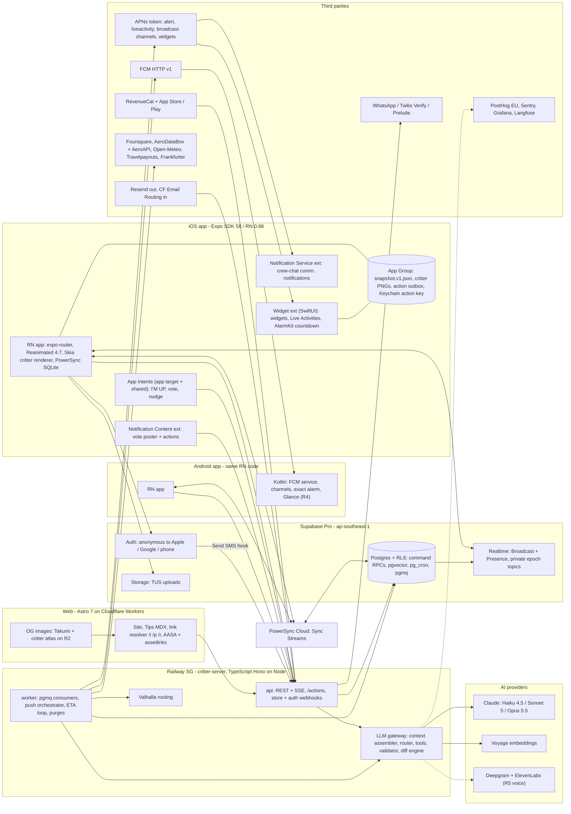
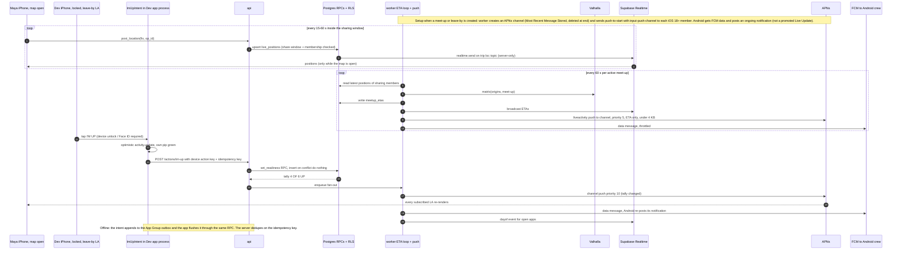
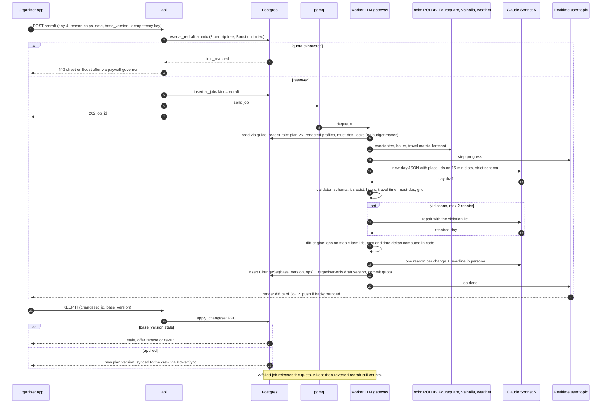
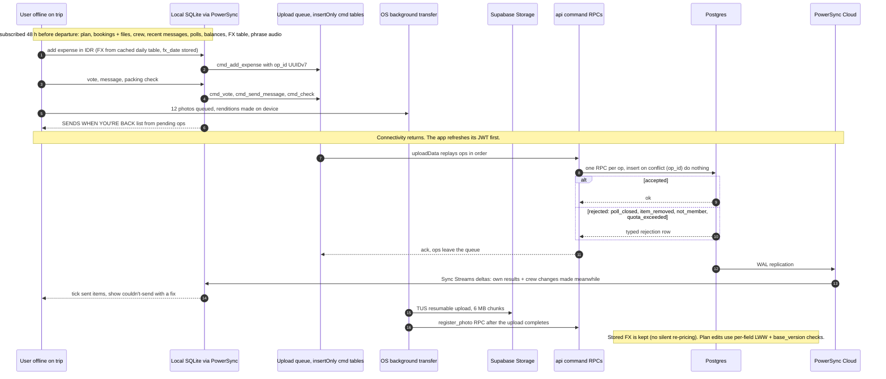

# Critterpass: Tech-Stack Decision Brief

Date 2026-09-26 · Audience: product owner (PO) · Status: recommendation for sign-off; nothing is built yet (design only).
Inputs: 5 researcher reports and 5 fact-checks (`researcher-/fact-check-260926-1143-*`), plus the master design synthesis and 5 design slices (`design-analysis-260926-1143-*`). **Where a fact-check conflicts with a researcher report, the fact-check wins** (see §6). Model facts were re-checked against the bundled Claude API docs.
Legend: confidence **H** = verified by sources + low reversal cost; **M** = verified but spike-dependent, or a vendor risk; **L** = partly unverified or a judgment call. R0–R6 = release slices from master §12 (MVP = R0–R3). FC = fact-check correction. "Est." = our estimate, not benchmarked.

---

## 0. TL;DR

1. **Stack:**
   - App: Expo SDK 58 (React Native 0.88, New Architecture) + TypeScript.
   - iOS extensions: hand-written SwiftUI (widgets, Live Activities, AlarmKit, notification extensions, App Intents). Android: Kotlin for notifications, alarms and Glance.
   - Critter art: one TypeScript core drawn on Skia in the app and Canvas2D on the web, plus baked bitmaps for every OS surface.
   - Backend: Supabase Pro (Singapore) + PowerSync (offline) + one TypeScript server (Hono) on Railway Singapore.
   - AI: Claude only, in 3 tiers, orchestrated in our own code.
   - Web: Astro on Cloudflare. Billing: RevenueCat. Builds and releases: EAS.
2. **The architecture is not the risk; unit economics and scope are.**
   - The research AI model gives ≈$7 AI per crew-trip at MVP scope ($8.3 with voice). A Boost nets $10.20.
   - At the research usage level, AI cost is **about 2× net revenue** at every scale (§4).
   - Break-even needs AI ≲ **$2.8 per crew-trip**. That puts the free-limit decision (D-8) and a Haiku-class default on the critical path, and metering must exist from R1.
3. **Four fact-check corrections change the plan:**
   - Reanimated 4.7 / Worklets 0.13 are **mandatory** on RN 0.88.
   - The toolchain is **Xcode 27 + UIScene**.
   - **apple-targets 5.0 is not validated on SDK 58**: fork it or write an in-repo config plugin, and make it a spike gate.
   - **Android Live Updates are ineligible** for most of the 5a designs.
4. **Platform physics already decided parts of the design:**
   - No continuous motion on Live Activities (LAs) or widgets: at most one ≤2 s built-in transition per update on iOS 17+.
   - The iOS alarm UI is drawn by the system.
   - LAs need push-to-start, and crew fan-out goes through APNs broadcast channels (iOS 18+).
   - Minimum **iOS 26** is recommended.
5. **Recommended launch:**
   - iOS-led, with Android in-app parity at public launch (R3). Android extras come in R4.
   - MVP = R0–R3, with 5–6 engineers plus a content/ops lead. Public launch ≈ Q3 2027 (±2 months; est.).
   - Start with a 2–3 week R0 spike (§3.4) with explicit gates.
6. **Decide now (§5):**
   - platform order, MVP slice, team, framework, backend and region, AI strategy, monetisation;
   - **free guide limit**, minimum iOS, offline depth, legal entity and data residency (Vietnam PDPL), real-world-agency stance.

---

## 1. Executive recommendation

| # | Layer | Choice | Why (one line) | Conf. |
|---|---|---|---|---|
| 1 | Mobile framework | **Expo SDK 58 (RN 0.88, New Arch, Hermes V1) + TS strict** | ~86% of the 140 KB critter renderer reused verbatim; one TS codebase for app, web and server; EAS OTA | H (framework) / M (SDK 58 GA timing) |
| 2 | iOS extensions | **SwiftUI targets:** widget ext (widgets + LA + AlarmKit UI), NSE, NCE, App Intents. Managed via a **pinned apple-targets fork or an in-repo config plugin**; exit = bare workflow | No framework removes ~4.5–7k LOC of Swift. The only choice is plumbing | M |
| 3 | Android surfaces | **Kotlin:** FCM service, channels/MessagingStyle, user-granted exact alarm + full-screen intent (FSI) with degrade path, Glance widgets (R4). Live Updates only for user-started tracking | Play policy bars Live Updates for alerts, upcoming events, ambient info and others' activities | M |
| 4 | Min OS | **iOS 26**; Android target API 36 (Play-required), feature-gated 36+/37 | AlarmKit, scheduled LA start and widget push are all 26+; 79% of iPhones were on 26 in Jun-2026, before iOS 27 | M |
| 5 | Critter renderer + assets | **`critter-art` TS core** → backends: Canvas2D (web/Node) and RN Skia (app, cached SkImage) + **baked bitmap pipeline** (`@napi-rs/canvas`) | Node output measured pixel-equivalent to Chromium; extensions can't run JS | H |
| 6 | Motion/gesture | **Reanimated 4.7 + Worklets 0.13 + RNGH 3.x + RN Skia 2.13**; custom teleport overlay for shared-element; JS-drawn nav chrome | Mandatory pins on RN 0.88; shared-element transition (SET) is still experimental | M |
| 7 | Local data / offline | **PowerSync Cloud (Sync Streams) over Supabase Postgres + idempotent command-RPC outbox** | Live queries on local SQLite across ~20 live screens; the outbox contract survives dropping PowerSync | M |
| 8 | Backend | **Supabase Pro ap-southeast-1** (Postgres/RLS, Auth, Realtime, Storage, pg_cron, pgmq, pgvector) + **one TS server (Hono/Node), `api` + `worker` on Railway SG** | Relational money/plan integrity + RLS privacy + cheap; same SQL is the exit path | M-H |
| 9 | Realtime | **Supabase Realtime Broadcast** (private, RLS, epoch topics) + low-rate Presence; location server-only; **APNs broadcast channels** for LAs; FCM for Android | No second auth system; Postgres Changes avoided for scale | M |
| 10 | Auth | **Supabase Auth:** anonymous-first → link Apple/Google/phone; Send-SMS hook → router (WhatsApp first → Twilio Verify/Prelude); device **action keys** for extensions | Pass exists before the account; the refresh-token race with extensions is solved by scoped keys | M |
| 11 | AI | **Claude-only, 3 tiers:** `claude-haiku-4-5` (chat default; re-evaluate Haiku 5.5), `claude-sonnet-5` (workhorse), `claude-opus-5-5` (draft skeleton only). Own orchestration (SDK tool runner + pgmq jobs); proposal-only writes | Best persona/tool/citation fit; one vendor, one eval set | M-H |
| 12 | Voice (R5) | **Cascaded:** on-device/Deepgram STT → Claude → ElevenLabs Flash (live) + v3/Gemini TTS (pre-render); owned actor voices | Only route with multilingual custom critter voices | M-L |
| 13 | Vision/OCR | **On-device OCR** (Apple Vision / ML Kit) for boxes + **Sonnet 5 structured output** | Exact overlay boxes; ~$0.017/receipt; no $500/mo vendor minimum | M-H |
| 14 | Places/maps/data | Curated POI DB (FSQ OS + Overture + editorial) + **Foursquare** live; **MapLibre** + self-hosted OSM vector tiles; **Valhalla** ETAs (+ Mapbox traffic); **Open-Meteo**; **AeroDataBox + AeroAPI**; **Travelpayouts**; **Frankfurter v2**; BestTime later | Google ToS bans text-to-speech (TTS) and LLM content from its data; open data allows offline and caching | M (L for tiles) |
| 15 | Payments/IAP | **StoreKit 2 / Play Billing via RevenueCat** + own entitlement service; Pass+ subs, Boost consumable, Offer Codes; IOUs ledger-only | Cross-platform crew entitlements; compliant with 3.1.1 / 3.2.1(vii) | M-H |
| 16 | Notifications/scheduling | **Direct APNs** (token; alert / liveactivity / broadcast / widgets) + **FCM v1** from the worker; own router with ping ledger; **pg_cron → pgmq** | LA channels and budgets aren't served by FCM or push SaaS | M-H |
| 17 | Deep linking | **First-party:** UL/App Links on `critterpass.app` + `go.` host; Play Install Referrer; iOS `detectPatterns` → UIPasteControl; 6-char code; phone-hash match. App Clip v1.1 if needed | Vendors use the same iOS clipboard trick; Airbridge free tier is gone | M |
| 18 | Web/CMS | **Astro 7 on Cloudflare Workers + R2**; MDX in repo; **Takumi** OG from the critter atlas (Satori-compatible templates as hedge) | ~90% static + 3 SSR link routes; free static egress | M-H |
| 19 | Analytics/crash/flags | **PostHog Cloud EU** (analytics, flags, experiments, surveys) + **Sentry** + OTel → Grafana; Langfuse for LLM; paywall tests in RevenueCat | One SDK and one DPA; Statsig churn avoided | M |
| 20 | CI/CD | **EAS Build/Submit/Update + EAS Workflows (Maestro)**; GitHub Actions for TS/backend/web; pnpm 12 + Turborepo 2.11; fingerprint runtime; OTA = fixes only | Native extensions via config plugins; staged OTA | H |
| 21 | Testing | Vitest · Jest+RNTL · **Maestro** (+`assertScreenshot`, motion-freeze) · renderer golden tests · Playwright · Testcontainers/PGlite · **permission contract tests** (RLS + Sync Streams + topics + prompts) · **promptfoo** eval gate | The privacy promises and money math are the product | H |
| 22 | Localisation | **Lingui 6** (ICU/PO) + **Tolgee**; en at launch; generated `.xcstrings`/`strings.xml` for extensions; CJK font fallback in Skia | One catalogue for app, web and email; ICU plurals | M-H |

---

## 2. Per-decision analysis

Scores run 1–5 against Critterpass-specific criteria. Where a researcher matrix exists its numbers are reused (fact-check adjusted); otherwise the score is marked "(brief)".

### D1. Mobile framework

Criteria and weights (from research): renderer reuse 15 · 120 fps motion 15 · extension integration 15 · device capabilities 10 · offline DB 5 · i18n 5 · OTA/velocity 10 · web code share 10 · hiring/velocity 10 · size/startup 5.

| Option | Weighted /5 | Best at | Deal-breaker for Critterpass |
|---|---|---|---|
| **Expo SDK 58 / RN 0.88 + TS** | **4.33** (4.40 − FC: apple-targets lag) | Renderer ~86% verbatim; TS across app, site and server; EAS Update | SET experimental; Link.AppleZoom alpha; motion discipline needed on low-end Android; 4 SDKs/yr upgrade tax |
| Flutter 3.47 | 3.65 | Custom paint + motion (Impeller, Hero) | Renderer ported or baked to Dart and the JS copy kept for web; Flutter web unfit for the SEO site; Shorebird paid; Supabase binary broadcast unsupported in Dart |
| Native SwiftUI (+ Compose later) | 3.55, at ~1.8× UI effort | Extension and motion fidelity | Two UIs for ~150 screens; no OTA; Android late or double cost |
| KMP + Compose Multiplatform | 2.80 | Shared Kotlin | Swift export Alpha; iOS polish; no OTA |

- **Recommend: Expo.**
  - Start on `expo@next` (58.0.0-preview.x) for the spike.
  - Ship on SDK 58 GA. GA is gated on RN 0.88 stable; rc.2 was out on 2026-09-21, and GA is expected mid-to-late Oct.
- **Pins:**
  - react-native-reanimated 4.7.x + react-native-worklets 0.13.x (**mandatory**; 4.6 doesn't support RN 0.88).
  - react-native-gesture-handler 3.x.
  - @shopify/react-native-skia 2.13 (New Arch only; fine).
  - expo-router with a **custom JS tab bar**: the raised guide FAB and bespoke chrome also sidestep the Liquid Glass tab clash.
  - Toolchain: **Xcode 27, iOS 27 SDK, UIScene lifecycle**.
- **Adaptive layout from R0.**
  - Why: iOS 27 makes iPhone apps resizable; iPhone Duo ships 2026-10-23; API 36+ ignores orientation locks on sw≥600dp.
  - How: flow layouts, not the design's absolute 390×844, and resize-aware Skia canvases.
  - Decide the iPad/Duo policy (Q-02).
- **Flip if:**
  - an iOS-only launch for ≥6–9 months **and** ≥2 senior SwiftUI engineers → native;
  - spikes S1/S2 miss thresholds on mid Android **and** the S3 overlay feels non-native after 3 days → Flutter;
  - the core team is Dart-heavy → Flutter.
- **Cost:**
  - EAS: Free → Starter $19 → Production $199 (50k update MAU), then $0.005/MAU and $0.10/GiB bandwidth past 1 TiB, so ≈$449+ at 100k MAU.
  - Upgrade tax: 1–2 engineer-weeks per SDK (est.). Upgrade within 6–8 weeks of each GA.

### D2. Native extension strategy (iOS + Android)

| Option | SDK 58 / Xcode 27 readiness | Bus factor | Coverage (LA, AlarmKit, NSE, NCE, intents) | Upgrade cost | Score (brief) |
|---|---|---|---|---|---|
| **A. `@bacons/apple-targets`, pinned fork** | ✗ 5.0.0 = SDK-55 line; 6.0 (SDK 57) unmerged; open bugs #201/#202 | 1 maintainer (388 vs ≤8 commits) | full | low if upstream catches up | 3.5 |
| **B. In-repo Expo config plugin** (adds targets and build settings; est. a few hundred LOC) | ours to validate | us | full | medium | 3.5 |
| C. `expo-widgets` + `expo-app-intents` (alpha) | first-party | Expo | widgets/LA only; no AlarmKit UI, NSE or NCE; JS runtime inside a ~30 MB extension; no hooks/imports | low | 2.5 |
| D. Bare workflow (commit `ios/`) | Xcode-native | – | full | high (no Continuous Native Generation (CNG)) | 3 |

- **Recommend A→B:** try the pinned fork in spike S4, and if it fails on SDK 58 + Xcode 27 + UIScene, write B. D is the exit.
- **iOS rules:**
  - All surfaces in pure SwiftUI. Extensions never run JS.
  - The app writes an App Group `snapshot.v1.json` (types generated from TS) plus critter PNGs, then calls `WidgetCenter.reloadTimelines`.
  - **App Intent types live in the app target** (Apple extracts metadata from the app target) and are shared into the extension.
  - Extensions authenticate with a Keychain-group **action key**.
- **iOS platform facts to design against:**
  - LA: 8 h + 4 h cap; state ≤4 KB. **iOS 17+ built-in transitions ≤2 s per update, no looping motion** (FC).
  - Push-to-start needs an alert; broadcast can't start an LA; the push-to-start budget is undocumented. Always pair it with a Time Sensitive fallback.
  - AlarmKit: system alert UI; the secondary intent runs only **after first unlock** (FC).
  - Communication notifications for **crew-chat messages only**. An AI persona as sender is unvalidated.
  - Widget refresh budget ~40–70/day. No API opens the add-widget sheet.
  - LPSE (the location push service extension) **likely needs an Apple entitlement request** (FC): plan lead time for R4.
- **Android mapping (FC rewrite):**
  - Live Updates only for user-initiated active tracking (ride/pickup, flight day after tap).
  - Crew converging, storm, leave-by (upcoming event) and critter nearby (ambient) → ongoing or heads-up notifications + Glance.
  - Exact alarm = user-granted `SCHEDULE_EXACT_ALARM`. FSI needs consent. Android 17 hardening: no alarm audio from the background without grants.
  - Target API 36 is mandatory (extension to 2026-11-01). API 37 caps the RemoteViews bitmap size, so pre-size critter bitmaps.
- **Effort (est.):**
  - Swift 4.5–7k LOC; iOS extensions 8–12 engineer-weeks.
  - Push/LA orchestrator 4–6 engineer-weeks.
  - Kotlin 2.5–3.5k LOC; Android parity 6–10 engineer-weeks (mostly R4).
- **Flip if:** apple-targets 6.x ships with SDK 58 validation → use upstream unforked. S4 signing or UIScene failures → D.

### D3. Critter renderer port and asset pipeline

| Option | Fidelity | Mid-Android perf | Extensions | Web + pipeline reuse | Effort (person-days) |
|---|---|---|---|---|---|
| **(a) TS core → display list → Canvas2D + RN Skia backends** | identical (Skia everywhere; measured) | cached SkImage blits; ≤2 hero draw-ons | needs baked images | same code | 33–46 |
| (b) Native rewrite (Dart/Swift/Kotlin) | near; golden-tests needed; Android `PorterDuff.MULTIPLY` trap | best for animation | Swift can draw in widgets | JS copy still required; 2–3 impls drift | 30–55 + upkeep |
| **(c) Pre-rendered sprites** | identical per size bucket | best | ✓ | pipeline needs a renderer anyway | 8–12 (loses draw-on and dynamic forms) |
| (d) WebView | identical | worst (CPU raster, 30–60 MB/WebView) | ✗ | web only | 2–4, not production |

- **Recommend (a) + (c)** (confidence H).
- **Package split:**
  - `packages/critter-art`: geometry + data, IIFEs converted to ES modules; Float32Array points.
  - `packages/critter-paint`: Canvas2D painter verbatim; Skia `Canvas2DLike` adapter, ~150–250 LOC.
  - `tools/critter-render`: Node + `@napi-rs/canvas` 1.0.9 running the **original** scripts. Parity 0.06–0.42/255.
- **Runtime rules:**
  - Record SkPicture → cache SkImage per (spec, size bucket). Blink = swap 2 images.
  - Draw-on = a precomputed ribbon prefix slice, **≤2 at a time**. Everything pauses off-screen.
  - Multiply blend is layer-isolated. Render **per size bucket**: line weight depends on size, so don't downscale one master.
  - One canonical seed per critter.
- **Asset tiers:**
  - A: bundled, ~6–10 MB (guides × forms × poses, 150 silhouettes, notification avatars, icon sets).
  - B: on-device cache, ~60 MB disk.
  - C: CDN (web, OG, store/social).
  - A full prerender is ≈55 MB WebP, so it is CDN-only.
- **Web** uses the Canvas2D painter, never CanvasKit (2.9 MB, 16 WebGL contexts per page).
- **Critical path is content, not code:** ~590 forms are undefined, and 10 of 15 archetypes can't "add a pose". The MVP set is 6 guides × 4 forms + 144 commons.
- **Flip if:** a Flutter or native app → port only the runtime backend and keep the TS core for web and the pipeline.

### D4. Animation and gesture libraries

| Option | 120 fps UI-thread motion | Shared-element "grow" | Critter/Skia integration | Maturity | Score (brief) |
|---|---|---|---|---|---|
| **Reanimated 4.7 + Worklets 0.13 + RNGH 3 + Skia** + react-native-teleport overlay | 4 | custom overlay (3) | 5 | stable (SET experimental) | **4.2** |
| + Expo Router `Link.AppleZoom` | – | iOS 18+ only, alpha, ~1 s dismissal delay, Stack only | – | alpha | use later |
| + Reanimated SET flag | – | experimental | – | experimental | feature-flag only |
| RN Animated + New Animation Backend | 3 | ✗ | 2 | experimental opt-in | 2.5 |

- **Recommend row 1.**
- **Motion tokens:** compile the `tg-motion` DSL to keyframe JSON, then to Reanimated CSS animations. A global-clock phase comes from a negative delay.
- **Springs:** snappy k420/c26, bouncy k350/c21, gentle k240/c21, soft k195/c21.
- **Effects:**
  - Confetti: a Skia overlay, dt-normalised.
  - Page curl: optional Skia RuntimeEffect.
- **Budget:**
  - ≤30 simultaneously animated views on low-tier Android (Software Mansion guidance is ≤100 components).
  - A device-tier probe at first launch.
  - Reduce-motion policy + an in-app motion setting.
- **Haptics:** expo-haptics + a Core Haptics inline module, **or the Pulsar SDK** (recommended by Expo docs; FC).
- **Audio:** expo-audio; react-native-audio-api 0.13 (pre-1.0) for layered SFX.
- **Flip if:** SET goes stable → drop the teleport overlay. S3 fails on both platforms after 3 days → reconsider Flutter (D1).

### D5. Local data and offline sync

| Option | Offline writes | Native SDK GA | Fits Postgres/RLS | Extra permission layer | Cost @100k | Vendor risk |
|---|---|---|---|---|---|---|
| **PowerSync Cloud (Sync Streams) + command RPCs** | ✓ ordered upload queue | RN 2.3.0 GA | first-class Supabase integration (WAL, JWKS) | yes: Streams (reads) + RLS (writes) | ~$340/mo + hosted data >10 GB at $1/GB | M (self-host Open Edition) |
| Hand-rolled "trip pack" RPC + SQLite + outbox table | ✓ (we build it) | n/a | ✓ | no | $0 | low |
| Firestore offline | ✓ | ✓ | ✗ (document model) | rules per document | – | high lock-in |
| Zero / Electric / Legend v3 / WatermelonDB / Triplit / Replicache | ✗ / read-only / beta / slow / dead / maintenance | – | – | – | – | eliminated |

- **Recommend PowerSync** (M).
  - Use **Sync Streams from day 1**: new Cloud instances are Streams-only from 2027-03-15, and Sync Rules sunset 2027-12-15.
  - Private tables are never in any stream; a CI test asserts it.
  - Per-user limit is 1,000 buckets.
  - Auto-subscribe a trip 48 h before departure.
- **All writes are command RPCs keyed by `op_id` (UUIDv7)**, so the hand-rolled fallback is a drop-in.
- Extensions use the App Group outbox via a shared idempotent action client.
- **KV/flags:** react-native-mmkv.
- **Server calls outside sync:** TanStack Query (brief's suggestion; not researched).
- **Flip if:**
  - the PO narrows offline to "today's pack + 4 commands" → hand-rolled;
  - spike S10 shows chat replication >1 s → chat stays Broadcast + DB write, and PowerSync handles history only.

### D6. Backend platform

| Option | Research score /100 | Why not / why |
|---|---|---|
| **Supabase + TS server + PowerSync** | **85** | Postgres integrity for money, plan versions and settlement; RLS for privacy; Realtime/Auth/Storage included; low–medium lock-in |
| Supabase + hand-rolled offline | 83 | Same, more client work |
| Custom (Postgres + Hono + Better Auth + pg-boss + WebSockets/Durable Objects + R2) | 77–79 | Same schema; **+6–10 build weeks** (auth linking, realtime auth, presence, admin) |
| Firebase | 72 | Document model fights balances; per-document rules; lock-in |
| Convex | 71 | No first-party offline (Curvilinear archived); Convex Auth beta; native clients pre-1.0 |
| InstantDB | excluded | Team joined OpenAI (announced **2026-08-19**, FC); cloud shuts down 2027-08-31 |

- **Recommend Supabase Pro, ap-southeast-1.**
- **Deviation from research: one TypeScript server codebase** (Hono on Node) deployed as `api` (REST, SSE guide streaming, `/actions`, RevenueCat/store/auth webhooks, Send-SMS hook) and `worker` (pgmq consumers, LLM jobs, push/LA orchestrator, ETA loop, purges, FX fetch).
  - Both run on Railway SG ("Southeast Asia Metal").
  - **No Supabase Edge Functions in v1:** they cap CPU at 2 s and run on Deno, which diverges from Node. One runtime also shares the LLM gateway and tests.
- **Fact-check musts:**
  - raise the Auth SMS limit (30/h project default);
  - capture the SIWA `authorizationCode` for token revocation on deletion;
  - build the Play web deletion page;
  - add a GC job for APNs channels (10k per environment);
  - own the JWT refresh in the app process (Realtime disconnects clients whose JWT expires);
  - budget SMS and egress at 1.5–2× the research figures;
  - run a **Vietnam PDPL review before fixing region and entity** (D-11).
- **Cost:** ~$95 / $200–320 / $1.6–1.85k per month at 1k / 10k / 100k MAU (§4).
- **Flip if:**
  - counsel requires VN-local hosting → custom stack on a VN cloud; the same SQL applies;
  - Supabase limits or price bite at scale → custom.

### D7. Realtime (chat, presence, cursors, location)

| Option | Auth reuse | Scale fit | Cost @100k | Build effort | Score (brief) |
|---|---|---|---|---|---|
| **Supabase Realtime** (Broadcast + DB broadcast + Presence) | ✓ same JWT/RLS | 10k connections with cap off; Postgres Changes single-threaded → avoid | ~$238 msgs + $45 connections | low | **4** |
| Ably | ✗ second auth | strong delivery/SLA | $29 + $2.50/M + connection-minutes | low–med | 3.5 |
| Cloudflare Durable Objects / PartyServer | ✗ | cheapest fan-out | $0.15/M requests, WebSocket 20:1 | high | 3 |
| Liveblocks | ✗ | 10 connections/room, web-doc oriented | $30+ | – | 1.5 |

- **Recommend Supabase Realtime** with these rules:
  - Private channels, authorised by RLS on `realtime.messages`.
  - **Epoch topics** (bumped on member removal) + JWT ~15 min.
  - Durable data arrives via PowerSync. Realtime carries only ephemeral traffic plus nudges.
  - **Location topic is server-only** (the `post_location` RPC checks the share window). Cursors on Broadcast ≤5 Hz, not Presence (50 presence msg/s with the cap on).
  - Turn the spend cap off at ~5k MAU (500 connections).
  - Payloads are **JSON**: binary broadcast isn't supported on Dart/Kotlin clients (FC). It is irrelevant for RN, but keeps options open.
- **Guide streaming:** SSE from `api` to the asker. The crew sees typing + the final message, ≈10× fewer billable messages (PO sub-decision).
- **Off-app fan-out:** APNs broadcast channel per LeaveBy/MeetUp/Vote; FCM data for Android.
- **Volume:** ≈1,000 billable messages per MAU per month.
- **Flip if:** >10k concurrent connections or location fan-out dominates cost → Durable Objects for location only. A delivery SLA is needed → Ably.

### D8. Auth

| Option | Anonymous → link | Phone/SMS routing | SEA SMS cost | Lock-in | Score (brief) |
|---|---|---|---|---|---|
| **Supabase Auth** | `signInAnonymously` → `linkIdentity` (native Apple/Google ID tokens) / `updateUser(phone)`; **manual linking beta** | Send-SMS hook to our router (WhatsApp, failover) | via Twilio/Prelude | API-level; users exportable | **4** |
| Firebase Auth as Supabase third-party auth | most mature `link(with:)`; anonymous auto-cleanup; MAU free <50k | built-in | lower (VN $0.13 vs Twilio ~$0.335) | high; needs a role claim via blocking functions | 3.5 |
| Better Auth (self-host) | anonymous plugin `onLinkAccount` | plugin | ours | none | 3 (exit path) |

- **Recommend Supabase Auth.**
- **Account flows:**
  - A merge-ticket fallback when the identity already exists.
  - Add an "I already have a pass" entry on the splash (undesigned).
  - A daily anonymous-user GC job.
- **Attestation:** gate sign-ups via the **Before User Created hook** + App Attest / Play Integrity. Spike S12 must confirm it fires for anonymous sign-in; `@expo/app-integrity` is alpha, so wrap it.
- **Extensions:** device action keys scoped to {vote, im_up, running_late, nudge, snooze}.
- **SMS:** WhatsApp OTP first where available, then Twilio Verify, with Prelude A/B. Add a country allowlist and velocity limits. **Start Vietnam brandname registration now** (~5 weeks; business registration certificate).
- **Flip if:** phone becomes the primary SEA sign-in → Firebase Auth as third-party auth (cheaper per SMS).

### D9. AI models and orchestration

| Vendor strategy | Persona | Tools/structured output | Latency | Grounding/citations | Cost | Safety | Ops simplicity |
|---|---|---|---|---|---|---|---|
| **A. Claude only, 3 tiers** | 5 | 5 | 4 | 5 | 3 | 5 | 5 |
| B. Claude + cheap bulk model (gpt-6-luna $0.10/$0.50) | 4 | 5 | 4 | 5 | 5 | 4 | 3 |
| C. OpenAI only | 4 | 4 | 4 | 3 | 4 | 4 | 4 |
| D. Gemini only (3.8 Flash $0.75/$3.75, **doubles 2027-01-01**) | 3 | 4 | 5 | 4 | 5 | 4 | 4 |

**Recommend A**, routed per task, with model IDs in config:

| Route | Model |
|---|---|
| Guide chat, voice brain, parsing, roundups | `claude-haiku-4-5`, $1/$5. Re-evaluate Haiku 5.5 when it ships. 4.5 retirement has ≥60-day notice and none has been issued |
| Pitch, day fan-out, redraft, proposals, briefing, receipts/menus, escalations | `claude-sonnet-5`, $2/$10 |
| Itinerary skeleton only | `claude-opus-5-5`, $4/$20 |
| Quests, notification templates | Batch (−50%) |

**API rules that shape the code:**
- **Sonnet 5 runs adaptive thinking when `thinking` is omitted.** Set thinking/effort explicitly per route (`disabled` or `low` on latency routes) and measure TTFT (spike S14).
- **Opus 5.5:** thinking can't be disabled; default effort is `medium`; forced `tool_choice` returns 400, so use `auto` + `strict: true` or `output_config.format`.
- Citations are incompatible with `output_config.format`: use `source_ids` in schemas and `search_result` blocks for prose.
- **Caches are model-scoped.** Haiku's minimum cacheable prefix is 4096 tokens. Prefix order: tools → global rules → persona → destination pack → trip context. No mid-conversation system messages on Sonnet 5, so the chattiness knob goes in user-turn text.

**Orchestration:** own code. Anthropic SDK tool runner for chat (hooks for quota, logging, approval) + durable pgmq jobs for draft/redraft/briefing/recap. **Not** the Claude Agent SDK (a coding harness). **Not** Managed Agents in v1 ($0.08/session-hour, no Batch discount).

**Guardrails:**
- Proposal-only writes; the validator and diff engine live in code; numbers come from code.
- C3 data (budget maxes, private threads, calendar, payouts) is never in prompts: context is read through the `guide_reader` Postgres role.
- The LLM is never on the SOS path.

**Evals and observability:**
- Evals: promptfoo in CI + Langfuse (Core $29/mo) datasets. Golden sets per destination: 30 crews, 200 questions, 50 receipts, 50 menus, 50 emails, 20 redrafts.
- Embeddings: Voyage-4-lite ($0.02/M; 200M tokens free) + pgvector.

**Retention (FC):** Opus 5.5, Sonnet 5 and Haiku 4.5 are **not** Covered Models, so ZDR is available if the org is eligible. `inference_geo:"us"` costs 1.1× (4.6+ models only; Haiku 4.5 returns 400). There is no first-party EU-only option: use Bedrock or Vertex regional endpoints if required.

**Cost per task:** chat $0.0125 (Haiku) / $0.025 (Sonnet) · draft $0.32 · redraft $0.022 · pitch $0.008 · receipt $0.017 · crew-trip ≈$8.3 (≈$7 at MVP scope).

**Flip if:**
- persona evals put Haiku below bar → Sonnet 5 (low effort) default + a tighter free limit;
- AI cost dominates and 2 vendors are acceptable → B for classification and briefings;
- EU residency becomes mandatory → Bedrock/Vertex EU.

### D10. Voice (R5; no production dependency in MVP)

| Option | Custom multilingual critter voice | Same brain and tools | Latency | $/voice question | Score |
|---|---|---|---|---|---|
| **A. Cascaded STT → Claude Haiku → TTS** | ✓ (clone owned actor recordings) | ✓ | ~1.2–1.5 s to first audio (est.) | ~$0.027 | **4.4** |
| B. OpenAI GPT-Live-1 + delegation to Claude | ✗ custom voices for eligible customers only, **English accents only on gpt-live-1** (FC) | ✓ via delegation | best (full duplex) | ~$0.035–0.04 | 3.8 |
| C. gpt-realtime-2.1-mini | ✗ | ✗ (persona drift) | good | ~$0.01–0.015 | 3.2 |
| D. Gemini 3.8 Live | replicated voices for select customers | ✗ | good | ~$0.01 | 3.2 |

- **Recommend A, R5:**
  - **STT:**
    - iOS: `SpeechAnalyzer`/`SpeechTranscriber` (iOS 26, **hardware-gated**; fallback to cloud).
    - Android and fallback: Deepgram Nova-3 Multilingual at **$0.0092/min regular** ($0.0058 is a promo; FC), or **Flux Multilingual $0.0078/min**.
  - **TTS:**
    - Live: ElevenLabs Flash v2.5 ($0.05/1K chars; 32 languages, no Icelandic).
    - Pre-render: v3 (74 languages incl. Icelandic), or Gemini 3.8 Flash TTS (130+ languages; ~$0.0135/min until 2026-12-31, then 2×).
    - Run a bake-off.
- **Fixed cost (FC):** 6 Professional Voice Clones need ElevenLabs **Business $990/mo** (10 PVC slots), slot add-ons, or Instant clones.
- Commission 6 voice actors with AI-cloning consent that is portable across vendors.
- **MVP:** pre-rendered phrase cards and settings samples only; batch TTS cost is trivial.
- **Flip if:** interruptible phone-call voice becomes a requirement → B, losing critter voices.

### D11. Vision / OCR

| Option | Overlay accuracy | Reasoning (dietary, split) | Cost | Offline | Score (brief) |
|---|---|---|---|---|---|
| **On-device OCR (Vision `RecognizeDocumentsRequest` iOS 26 / ML Kit Text v2) + Sonnet 5 structured output keyed by OCR line id** | exact boxes | strong | $0.017/receipt ($0.006 Haiku) · $0.018/menu | partial | **4.5** |
| Claude vision only | coordinates "approximate" | strong | same | ✗ | 3 |
| Veryfi | n/a | receipts only | $0.08 + **$500/mo minimum** | ✗ | 2 |
| Apple Foundation Models (iOS 27, on-device vision) | exact | weak/unknown | $0 | ✓ | later, Apple-only |

- **Recommend row 1.**
- **MVP receipts:** total + even split. Code checks that items + tax equal the total, else the 3i-4 path. Itemised receipts come post-MVP.
- **Scanning:** booking/doc scan via VisionKit / `expo-camera scanDocumentAsync` (SDK 58); BCBP barcodes decoded on device.
- **Menu point-and-ask:** R5, with allergy copy marked advisory. VisionCamera 5 only for live overlays.
- **Flip if:** crumpled-receipt eval accuracy is below target → Veryfi for receipts only.

### D12. Places, maps, routing, weather, flights, crowds

| Need | Pick | Runner-up | Rejected, and why |
|---|---|---|---|
| Map SDK + style | **MapLibre RN 11.4** + custom hand-drawn style | react-native-maps (least styling) | `expo-maps` alpha |
| Tiles | **Self-hosted OSM vector tiles** (e.g. Protomaps PMTiles on R2; ODbL attribution) **[needs spike S13: PMTiles + offline packs]** | managed MapTiler/Stadia (pricing unverified) or Mapbox (25k mobile MAU free) | Google: offline and ToS limits |
| POI / places | **Curated per-city DB** (FSQ OS Places Apache-2.0 + Overture CDLA + editorial; 300–800 POIs × 6 cities, monthly refresh) + **Foursquare Places** live ($15/1K after 500 free; premium $18.75) | Mapbox Search Box | **Google Places:** ToS bans TTS, LLM-derived content (except Grounding Lite) and caching (place_id only; lat/lng 30 d) on non-Google maps (FC omission) |
| Routing / ETAs | **Self-hosted Valhalla 3.9** (per-minute crew ETAs) + **Mapbox Directions** for traffic-aware leave-by (100K free, then $2/1K; TTS clause unverified) | OSRM | Google Routes: ToS bans synthesising spoken driving times |
| Weather / marine | **Open-Meteo** commercial Standard (~$29/mo, price unverified; **excludes climate/seasonal → Professional or editorial normals**, FC) | Apple WeatherKit REST (500K calls/mo with the Apple developer program) | free tier is non-commercial |
| Flight status | **AeroDataBox** Growth $99 (400K units, **hard stop, no overage**, FC) + **FlightAware AeroAPI** alerts ($100 min, $0.005/status, $0.02/alert) | Cirium/OAG (enterprise) | Amadeus Self-Service shut 2026-07-17 |
| Fares (month prices per crew airport) | **Travelpayouts Data API** (free, affiliate; 48 h search cache → gaps; partner conversion minimums) + "no recent price" state | Skyscanner (partner-only) | Kiwi invite-only; Duffel is booking-oriented |
| Crowds | **Editorial month curves** at MVP; **BestTime** ($99/mo min) when hourly charts ship (R6) | – | – |
| FX | **Frankfurter v2** (free, commercial OK, 166 currencies incl. VND/IDR/PEN/MAD, self-hostable; FC) | OXR $12 as fallback | – |
| Local signals / events | curated feed list + Claude `web_search` ($10/1K; Sonnet 5 only for `web_search_20260209`) | – | – |
| Emergency numbers / facilities | **curated table with `verified_at`**; never LLM-generated | – | – |

- **Recommend as tabled.** Tile hosting is the least-verified pick (L).
- **Cost:** data APIs $50–65 / $190–280 / $1.2–2.6k; Valhalla + tiles $20–40 / $50–80 / $100–150 per month.
- **Flip if:** design accepts the Google map look → Google Maps SDK + Places. Voice and LLM paths still need curated or Foursquare data under Google's ToS.

### D13. Payments / IAP

| Criterion | **RevenueCat** | Adapty | Superwall | Direct StoreKit 2 + Play Billing |
|---|---|---|---|---|
| Store plumbing (validation, ASSN v2, RTDN) | 5 | 5 | 4 | 2 |
| Cross-platform + server-granted, time-boxed entitlement | 5 / 4 | 5 / 4 | 4 / 2 (unverified) | 3 / 5 |
| Boost credit ledger | **4** (now has In-App Currency, a server-side ledger; FC) | 3 | 3 | 3 |
| Web checkout later | 4 | 3 | 4 | 2 |
| Cost | free to $2.5k MTR, then 1% | free to $5k, then 1% | infra free, paywalls 1% over $10k | 0% + 4–8 eng-weeks |

**Recommend RevenueCat + our own entitlement service** (the authority for trip- and crew-scoped perks: Boost, FTF, gifts).

**Products:**
- Pass+ auto-renew group (monthly/yearly). Crew Year = a higher tier in that group (R4).
- **Boost = consumable**, bound server-side to a trip. Use `appAccountToken` = user UUID and `SKIncludeConsumableInAppPurchaseHistory`.
- Gifts = IAP consumable (R4). Partner codes = Offer Codes / Play promo codes.

**Rules:**
- IOUs are ledger-only; perks never depend on settlement.
- Grace period is server-side (configure Apple 16 d; dynamic copy). Pause is emulated.
- **Opt out of Group Purchases and Family Sharing for v1.** Multiseat is pitched for "collaborative groups" but is iOS-only.
- The postcard is decoupled from IAP (3.1.3(e)).
- No US web checkout at launch (the 0% commission is provisional; SCOTUS cert granted).
- **EU alternative payments are allowed from 2026-10-01** (FC): revisit after launch.
- Apple "monthly with 12-month commitment" is now worldwide: a Crew Year variant (FC).

**Net per unit** (SBP 15% / Play 10% + 5% billing): Pass+ $3.99 → $3.39 · $29.99 → $25.49 · Boost $12 → $10.20.

**Flip if:** MTR >~$100k/mo → negotiate, or go direct. The $2.5–5k MTR band matters → Adapty.

### D14. Notifications and scheduling

| Option | LA push, broadcast channels, widget push | Ping budget / roundup control | Android | Cost | Score (brief) |
|---|---|---|---|---|---|
| **Direct APNs HTTP/2 (token) + FCM v1 from the worker + own router** | ✓ all push types | full | ✓ | free (not re-verified) | **4.5** |
| FCM for both | LA start/update/end yes; **broadcast channels not documented** | full | ✓ | free | 3 |
| Notification SaaS (OneSignal/Knock-type) | not researched; LA channels unlikely | partial | ✓ | $$ | 2 (not researched) |
| Expo push service | standard alerts only (brief's understanding) | – | ✓ | free | 2 |

**Recommend direct APNs + FCM**, built as three pieces:
- **Router:** classes `always / budgeted / roundup / silent / local`. Ping ledger per user-local day. Roundup builder per timezone bucket. Dedupe/collapse/expiry. Marketing opt-in (4.5.4). Time Sensitive is never used for marketing.
- **LA orchestrator:**
  - push-to-start tokens per type; channel lifecycle + GC;
  - T−15/T−10/T0/end transitions; priority 5 routine, 10 for thresholds;
  - one LA per meet-up (8 h cap); flight LA = end + restart after landing.
- **Widget push** (iOS 26, budgeted).

**Alarms:** AlarmKit, scheduled locally at plan sync. A background push reschedules them (best-effort), they reconcile on launch, and a server "crew knock" is the fallback.

**Scheduling:** pg_cron every minute runs `enqueue_due()` (`FOR UPDATE SKIP LOCKED`) into the pgmq queues `push | ai | eta | maint`. Trigger.dev only if multi-step orchestration grows.

**Flip if:** standard-notification volume or complexity grows → a SaaS for plain alerts only; LAs stay in-house.

### D15. Deep linking

| Option | iOS not-installed deferral | Android | Privacy/ATT | Cost | Score |
|---|---|---|---|---|---|
| **First-party** (UL/App Links + Install Referrer + `detectPatterns` → UIPasteControl + 6-char code + phone-hash match) | clipboard (no paste prompt) + code + phone match | deterministic | none | $0 | **4** |
| Branch | same clipboard trick (NativeLink, premium); SDK triggers the iOS 16+ paste prompt | ✓ | privacy manifest | custom | 3 |
| AppsFlyer / Adjust (MMP) | vendor | ✓ | ATT if IDFA | AppsFlyer Zero: 12k conversions **first year only**, no deferred DL (FC) | 2.5 |
| Airbridge | ✓ | ✓ | – | **free <10K MAU tier gone; Core $40+/mo** (FC) | 3 |
| App Clip | deterministic | n/a (Play Instant retired) | – | extra target; 15 MB cap if QR-invoked | 3.5 (v1.1) |

- **Recommend first-party at v1.**
- **`go.critterpass.app`:** needs its own AASA, an entitlement entry and an Android manifest host (Dynamic App Links can't add hosts; FC).
- **Codes and tokens:** CSPRNG codes in an ambiguity-safe alphabet; seat tokens ≥128-bit, single-claim; preview bots never count as opens.
- **One resolver schema** (zod `link-contract`) shared by web, app and OG.
- **Measure `install_attributed.via`.** Add the App Clip if iOS deferral is <60% of Android.
- **MMP** only when paid acquisition exceeds $5–10k/mo.

### D16. Web / CMS

| Option | Content/SEO | Per-link SSR + OG | Motion/perf | i18n | TCO / host freedom | Score |
|---|---|---|---|---|---|---|
| **Astro 7.3 on Cloudflare Workers + R2** | 5 | 4 | 5 (zero-JS default, islands) | 5 | 5 (MIT; CF-owned but portable) | **4.8** |
| Next.js 16.3 on Vercel Pro ($20/seat; Hobby non-commercial) | 4 | 5 (`next/og`) | 3 | 3 | 3 | 3.6 |
| Expo Router web static export | 3 | 3 | 3 | 4 | 4 | 3.4 |
| SvelteKit / TanStack Start | 3 | 4 | 4 | 3 | 4 | 3.5 |

- **Recommend Astro.**
  - Tips as MDX in the repo; add Keystatic if a non-dev writer joins.
  - OG images: a build-time critter atlas + **Takumi 2.14** (WASM 1.62 MB gz). Keep templates **Satori-compatible** as a hedge: one maintainer wrote ~88% of the commits (FC).
  - Cookieless PostHog.
- **Required pages:** `/account/delete` (Play), `/help`, versioned `/legal/*`.
- **Cost:** $5–10 → $20–40/mo.
- **Flip if:** the team wants one React meta-framework for web plus a future web app → Next.js.

### D17. Analytics, crash, flags

| Option | Coverage | Free tier | 100k MAU cost | Risk | Score (brief) |
|---|---|---|---|---|---|
| **PostHog Cloud EU** (analytics + flags + experiments + surveys + replay) | one SDK and one DPA | 1M events, 1M flag requests | **$650–2,000** (identified events cost up to 4× anonymous; FC) | cost growth | **4** |
| Amplitude | analytics + flags | 2M events | quote | Statsig assets absorbed; churn | 3.5 |
| Mixpanel | analytics + flags | 1M events | calculator | – | 3.5 |
| Crash: **Sentry** vs Crashlytics (no official RN) | app + backend + web | 5k errors | $80–300 | – | Sentry |

- **Recommend PostHog EU + Sentry + OTel → Grafana Cloud (free tier) + Langfuse.**
- **PostHog settings:**
  - `person_profiles: 'identified_only'` and server-side anonymous events;
  - a typed event taxonomy; no touch autocapture;
  - replay sampled on onboarding/paywall only, with masks.
- **Sentry:** `@sentry/react-native` 8.28; `@sentry/node` **10.x** until 11.0.x patches land (11.0.0 is 3 days old; FC).
- **Paywall tests:** RevenueCat Experiments.
- **Age signals must never reach analytics** (Play ToS; FC).
- **Flip if:** the PostHog re-quote exceeds ~$2k/mo → Amplitude or self-hosted PostHog.

### D18. CI/CD and release

| Option | Native extensions | OTA | E2E | Small-team cost | Score |
|---|---|---|---|---|---|
| **EAS Build/Submit/Update + Workflows + GitHub Actions (non-mobile)** | config plugins, managed credentials | EAS Update (fingerprint runtime, staged) | `maestro` job | Starter $19 → Production $199 | **4.5** |
| fastlane + GitHub Actions macOS ($0.062/min) + hot-updater | ✓ | self-host on R2 | self-run | cheap minutes, costly upkeep | 3.5 |
| Codemagic | ✓ | CodePush $1/2,500 installs | ✓ | 500 free M2 min | 3.5 |
| Xcode Cloud | iOS only | ✗ | XCTest | 25 h/mo included | 2 |

**Recommend EAS** with these settings:
- **Pinning:**
  - `runtimeVersion: fingerprint`.
  - **Pin pnpm and the Maestro CLI:** EAS SDK-57 images ship pnpm 11.9 and Maestro 2.6.1 (FC).
  - Use Xcode 27 images.
- **Rollout:**
  - Staged OTA 5% → 25% → 100%, gated on Sentry crash-free sessions.
  - **OTA carries only fixes, copy and tuning** (DPLA §3.3.1(B), App Review 2.5.2); PR label `ota-safe`.
  - Separate bundle IDs for dev, preview and prod.
- **Pipelines:**
  - PR: GitHub Actions (lint/types/unit) + an EAS Android build + Maestro smoke.
  - Nightly: iOS simulator build + full Maestro + screenshot suite.
  - `main`: EAS Submit to TestFlight and Play internal.
- **Monorepo:** pnpm 12 + Turborepo 2.11.
- **Flip if:** EAS Update MAU fees at ≥100–200k MAU → hot-updater self-host.

### D19. Testing

| Layer | Pick | Alternatives | Gate |
|---|---|---|---|
| Pure TS (critter geometry determinism, money/rounding, link contract, ICU) | **Vitest 5** | – | PR |
| Renderer golden (Node vs Chromium refs from untouched design scripts; device Skia snapshots) | custom harness | – | mean abs <0.5/255; >8/255 px <1% |
| RN components | **Jest 30 + jest-expo + RNTL 14** | – | PR |
| E2E (onboarding, invite UL, code join, paywall via StoreKit config, offline outbox, deletion) | **Maestro 2.10 on EAS** | Detox (grey-box, lowest flake) | nightly + release |
| Motion visual regression (~30 hero moments) | Maestro `assertScreenshot` + **motion-freeze build** (injected global clock, seeded confetti) | Sentry Snapshots (beta) | nightly |
| Web, OG, AASA/assetlinks, WhatsApp OG budget | **Playwright 1.63** | – | PR |
| Backend RPCs, seat-claim and quota races, deletion cascade | **Testcontainers 12 / PGlite** | – | PR |
| **Permission contract** (outsider, ex-member, organiser, member × RLS, Sync Streams, realtime topics, LLM prompt assembly) | custom fixtures | – | PR, **blocking** |
| AI (persona, local words, must-dos, redraft diffs, budget privacy) | **promptfoo** + Langfuse datasets | Braintrust ($249) | on prompt/model change; regression vs baseline |
| Perf | Reassure + Sentry profiling | – | weekly |

- **Device lab:** mid Android (Pixel 7a / Galaxy A5x), a low-end Android, iPhone 13 on iOS 26, a current iPhone on iOS 27, and iPhone Duo when available.

### D20. Localisation

| Option | ICU plurals/select | Shared app + web + email | Extension strings | TMS cost for 16 languages | Score |
|---|---|---|---|---|---|
| **Lingui 6 + Tolgee Cloud** | ✓ (PO catalogues) | ✓ (metro transformer) | generator → `.xcstrings` / `strings.xml` | Free 30k words → €58 / €133 per month | **4.5** |
| i18next + Localazy | ✓ / ICU in Localazy unverified | ✓ | same | $89 for 3.5k keys, unlimited languages | 4 |
| Crowdin / Lokalise | ✓ | ✓ | same | word-based, pricier | 3 |

- **Recommend Lingui + Tolgee.**
- **Launch locales:** en only is the recommendation (PO, Q-03). The framework is live from R0.
- **Copy rules:**
  - Source strings in sentence case; uppercase at render with locale rules.
  - Per-script line-height tokens: vi/th ≥1.0, CJK ≥1.15.
  - Critter names are never translated. Local words come from vetted tables with TTS markup.
  - LLM output language = app locale.
- **Fonts:** explicit Skia font-manager fallback (e.g. a Noto Sans JP subset).
- **QA:** pseudo-locale `en-XA` (+35%) in Maestro screenshots.
- **Flip if:** ≥8 launch locales and Localazy ICU is verified → Localazy.

---

## 3. Architecture sketch

### 3.1 Components



**Invariants:**
1. Every mutation is an idempotent command RPC keyed by `op_id`, whatever the source (app, widget, notification action, LA intent, outbox).
2. The DB is the source of truth. Realtime is ephemeral plus nudges.
3. Extensions never run JS or hold refresh tokens.
4. The LLM reads through `guide_reader` (no C3 grants) and writes only Proposals/ChangeSets.
5. Lock-screen payloads carry ETAs, never coordinates.
6. The SOS fan-out is deterministic, with no LLM on it.

### 3.2 Repo shape (pnpm + Turborepo monorepo)

```
apps/mobile        Expo app; targets/ (Swift extensions via fork or in-repo plugin); modules/ (Swift/Kotlin inline modules)
apps/server        Hono on Node: src/api, src/worker, src/llm (gateway, tools, validators, diff engine), src/push (APNs/FCM/LA)
apps/web           Astro site + link resolver + OG routes
db/                SQL migrations, RLS policies, RPCs, Sync Streams definitions, permission contract tests
packages/critter-art  critter-paint  motion  tokens (DTCG → TS/Swift/Kotlin/CSS)  i18n  contracts (zod + JSON Schema → Swift/Kotlin)  link-contract  analytics-events
tools/critter-render  Node + @napi-rs/canvas asset CLI (xcassets, Android res, web WebP, OG atlas, golden refs)
evals/             promptfoo suites + golden sets per destination
```

### 3.3 Hardest flows

**(a) Live crew map + group Live Activity + "I'M UP" from the lock screen.** Crew map and crew LA are R4 (Boost); leave-by LA + I'M UP are R3.



Constraints behind the flow:
- A locked device requires authentication before intents run.
- Priority 5 isn't budgeted but can burst. `NSSupportsLiveActivitiesFrequentUpdates` is user-revocable.
- A push-to-start token exists only after the first launch.
- Channel storage policy is immutable. GC channels after the event (10k cap).
- 16-member crews must fit in 4 KB (initials, progress, ETA minutes).

**(b) Guide redraft → reviewable diff** (R2).



- The same pipeline serves the full draft (3c-8): code prefetch → Opus 5.5 skeleton → 8 parallel Sonnet 5 days streamed as cards → validate → repair.
- Parallel fan-out is what makes "about 20 s" possible: serial generation would take ~90 s.
- The ChangeSet component is reused by 5 flows (3e-3, 3j-1, 3k-5, 3f-7, 3c-12).

**(c) Offline outbox during the trip, then reconciliation** (R3).



Offline behaviour of other modules:
- **Guide:** cached briefing + phrase cards; questions are queued as messages. No offline LLM in v1.
- **SOS:** needs a network. Emergency dialling goes through the OS; an SMS fallback is a PO decision (Q-54).
- **Critters:** the encounter is evaluated on device; signed evidence is queued, and the server may revoke it later.

### 3.4 R0 validation spikes (2–3 weeks, pass/fail before committing)

| # | Spike | Pass threshold |
|---|---|---|
| S1 | `critter-art` + Skia painter; Tokek draw-on + blink; golden diff vs Node | ≤2% pixel diff; 120 fps iPhone 13+; ≥55 fps mid Android |
| S2 | Critterdex grid 150×4 + 6 idle critters | 120 fps scroll on iOS; <2% dropped frames on mid Android |
| S3 | "Grow into page": teleport overlay vs Link.AppleZoom vs SET | interruptible, no flicker, p95 frame ≤16 ms, both OSes |
| S4 | **apple-targets fork or in-repo plugin on SDK 58 + Xcode 27 + UIScene** (FC): vote widget intent, leave-by LA + I'M UP, AlarmKit, App Group snapshot | EAS signs all targets; widget <20 MB peak; intent round-trip <2 s |
| S5 | NSE communication notification (crew chat) + NCE vote poster | vote works locked + app killed |
| S6 | Background dwell ring updating the LA while locked | ring advances; battery drain <3%/h |
| S7 | 15-min snap drag + slide-to-board | 120 fps; snap latency <1 frame |
| S8 | Cold start + size | ≤1.2 s mid Android; ≤40 MB iOS download before content |
| S9 | Adaptive layout (iOS 27 resize, Duo sizes, Android sw600dp) | no clipped heroes; Skia canvases resize |
| S10 | PowerSync on Supabase: chat round-trip, offline replay, Streams permissions | p95 replication <1 s; contract tests green |
| S11 | Push-to-start with `input-push-channel` + priority-5 ETA cadence | ≥95% starts delivered; 60 s updates without throttling over 2 h |
| S12 | Before User Created hook on `signInAnonymously` + App Attest pre-check | hook fires; attested sign-up only |
| S13 | MapLibre + self-hosted PMTiles + offline region pack | offline pan/zoom in a trip city; style matches the design |
| S14 | Sonnet 5 / Haiku 4.5 TTFT per route (thinking disabled / low effort) + Haiku persona eval | Haiku TTFT <1 s; Sonnet <1.5 s; persona score ≥ bar |

---

## 4. Cost model (monthly, USD; 2026-09-26 list prices)

### 4.1 Assumptions

| # | Assumption | Source |
|---|---|---|
| A1 | 15% of MAU on a trip in a month, crew of 5 → **crew-trips/month = 0.03 × MAU** (30 / 300 / 3,000) | backend report |
| A2 | AI per crew-trip at MVP scope **$7.0 base** (research $8.33 minus voice $0.88, menus $0.18, quests and disruption agents). Low $3.5 (half the question volume), high $12 (all-Sonnet chat or broken cache) | AI report model (`ai-cost-model.py`), 5 questions/person/trip-day, 70/30 Haiku/Sonnet |
| A3 | AI per non-trip MAU: $0.08 base ($0.03 low / $0.12 high): pitches + occasional chat | brief's estimate |
| A4 | SMS: 20% of MAU new per month × 30% phone × 1.2 SMS; Twilio Verify $0.05 + SEA SMS $0.20–0.30 | backend fact-check (research $0.15 was low) |
| A5 | Revenue (a **PO target placeholder**, not research): Pass+ payers 3% of MAU (40% monthly / 60% annual → $3.10 gross per payer-month); Boost on 25% of non-first-trip crew-trips (60% of trips) | brief's placeholder |
| A6 | Store fees 15% (Apple SBP / Play 10% + 5% billing, <$1M); RevenueCat 1% of MTR above $2.5k | fact-checked |
| A7 | Excludes salaries, content ops (critter art, POI curation), counsel, voice actors, marketing | – |

### 4.2 Monthly cost by tier (base AI)

| Line | 1k MAU | 10k MAU | 100k MAU | Notes |
|---|---|---|---|---|
| **AI (LLM + embeddings + web search)** | **~$280** (low $130 / high $460) | **~$2.8k** ($1.3k / $4.6k) | **~$27.8k** ($13k / $46k) | A2 + A3. Caching, Batch, Haiku default already assumed |
| Backend platform | $95–110 | $200–320 | $1.6–1.85k | Supabase ($25 → ~$890 + egress + PITR $100) + Railway api/worker ($20 → ~$200) + PowerSync ($49 → ~$340 + hosted data) |
| Routing + tiles | $20–40 | $50–80 | $100–150 | Valhalla container; PMTiles on R2 (unverified ops) |
| Web | $5–10 | $5–10 | $20–40 | CF Workers paid + R2 |
| Ops tooling | $200–290 | $500–800 | $1.7–3.8k | EAS ($95 → ~$500 incl. update MAU and bandwidth), CI minutes, PostHog ($0 → $650–2k), Sentry ($26 → $80–300), Langfuse ($29 → ~$100–300 sampled), Grafana, Resend ($20 → $125), Tolgee (€0 → €133) |
| Data APIs | $50–65 | $190–280 | $1.2–2.6k | AeroDataBox ($19 → $99 → Scale $499) + AeroAPI alerts, Foursquare (~$0.2–0.5 per crew-trip with the curated DB), Open-Meteo $29+, BestTime $99 once hourly crowds ship |
| SMS OTP | $17–25 | $175–245 | $1.74–2.46k | A4; lower with WhatsApp-first and Apple/Google primary |
| Store fees + RevenueCat | ~$22 | ~$220 | ~$2.35k | A5/A6, on gross revenue |
| **Total** | **~$690–840** | **~$4.1–4.7k** | **~$36.5–41k** | |
| Gross revenue at A5 | ~$150 | ~$1.5k | ~$14.7k | Early tiers are mostly FTF trips (≈$0 revenue) |
| Later fixed (R5+) | – | – | – | ElevenLabs Business $990/mo (6 PVCs); voice extras ~$0.014/turn |

One-offs and annual:
- Apple Developer $99/yr; Play $25.
- Vietnam SMS brandname registration (fees unverified).
- Counsel: privacy, Terms, Vietnam PDPL, EU AI Act Art. 50.
- Gmail CASA $500–4.5k/yr (uncertain) **only if** mailbox scan ships (R4+).

### 4.3 Unit economics: what the numbers say

1. **AI is ~75% of variable cost.** At research usage levels it is **≈2× net revenue** at every tier.
   - A Boosted crew-trip nets $10.20 vs ~$7 AI: +$3.
   - Every FTF or unboosted free trip is −$7.
2. **Break-even at 100k MAU**, with an optimistic 4% Pass+ and 40% Boost attach:
   - net revenue ≈ $17.7k and non-AI costs ≈ $6.7k, which leaves ≈ **$0.11/MAU for AI**;
   - at $0.03 idle per non-trip MAU, that is ≈ **$2.80 per crew-trip**, a ~60% cut from the MVP base.
3. **Levers, in order:**
   - (a) free limit 30/trip + 5/day on trip, instead of 30/day (D-8);
   - (b) Haiku-class chat default, moving to Haiku 5.5;
   - (c) byte-stable cached prefixes, with the cache-hit rate monitored (a broken cache is ~2×);
   - (d) template notifications + Batch for quests;
   - (e) rules-first watchers;
   - (f) hidden fair-use on "∞" (e.g. 100/person/day, then degrade to shorter Haiku answers);
   - (g) guide streams to the asker only;
   - (h) FTF defined per crew, with member-overlap abuse checks.
4. **Real usage is unknown.** Instrument `llm_call` cost per user, crew and trip from R1 and re-baseline A2 at the R2 beta before pricing is locked.
5. **Platform choice barely matters to cost:** Supabase vs custom vs Firebase differ by <$1k/mo at 100k. Pick on fit and velocity.

---

## 5. Decisions the product owner must make now

**D-1. Platform order**
- Options:
  - (a) iOS-only launch, Android at +6–9 months.
  - **(b) iOS-led:** iOS + Android in-app parity at public launch (R3); iOS-first off-app surfaces; Android widgets and Live-Update extras in R4.
  - (c) Full parity including Android extensions at R3.
  - (d) Android-first.
- Trade-offs:
  - (a) saves 6–10 Android engineer-weeks but breaks the crew-invite loop: one Android friend blocks a crew. SEA home markets are likely Android-heavy (verify).
  - (c) adds 6–10 weeks before launch for surfaces Play policy mostly disallows anyway.
- **Recommend (b).** The R1 closed alpha may be iOS TestFlight only, but the Android build must be green in CI from R0, and Android joins the open beta at R2.

**D-2. MVP scope / first release slice**
- Options:
  - **(a) Master R0–R3 as MVP** (~138 features): closed alpha at R1, open beta at R2, public launch at R3.
  - (b) Public launch at R2 ("plan it": vote → draft → proposal + guide chat, Boost/FTF on sale), with trip-day features ~3 months later.
  - (c) Trim R3 by deferring critters (hatch, foreground encounters, recap).
  - (d) Trip companion first, with no AI drafting.
- Trade-offs:
  - (b) gets a revenue signal ~3 months earlier, but the trip itself (money, offline, leave-by, SOS) fails at the moment of truth.
  - (c) removes the differentiator.
  - (d) drops the core AI value.
- **Recommend (a)**, with a pre-agreed cut list if R3 slips:
  - receipt scan → manual entry;
  - widgets → vote only;
  - leave-by LA → AlarmKit only;
  - recap → 3 cards.

**D-3. Team composition and timeline (assumption to confirm)**
- Options:
  - (a) Lean: 3 engineers + contractors → MVP ≈ Q1–Q2 2028.
  - **(b) Core:** 2 RN product engineers, 1 RN motion/Skia engineer (renderer owner), 1 iOS extensions engineer (Swift) + a 0.5 Kotlin contractor from R2, 1 backend/AI engineer (TS, Postgres, evals), 1 product designer, 1 content/ops lead (critter forms, POI curation for 6 cities, persona packs, emergency data, native-speaker reviewers), part-time QA and counsel.
  - (c) Native split teams (8–10 engineers): only if native is chosen.
- Timeline for (b) (est., ±2 months):
  - R0 + spikes: Oct–mid-Dec 2026.
  - R1 closed alpha: ~Mar 2027.
  - R2 open beta: ~Jun 2027.
  - R3 public launch: ~Sep 2027.
  - Basis: ~200–260 engineer-weeks for the MVP.
- Trade-offs: (a) roughly doubles time-to-learn; (c) costs ~1.8× for the same date.
- **Recommend (b).** Content/ops is on the critical path: the ~590 undefined forms block the Critterdex beyond the MVP set.

**D-4. Mobile framework**
- Options: **(a) Expo RN** (4.33); (b) Flutter (3.65); (c) native SwiftUI (+ Compose later) (3.55, ~1.8× UI effort).
- **Recommend (a).** It flips to (c) only if D-1 = iOS-only and senior SwiftUI engineers are on hand (see D1).

**D-5. Backend platform and region**
- Options:
  - **(a) Supabase Pro Singapore + PowerSync + TS server on Railway SG.**
  - (b) Custom Postgres stack (+6–10 weeks; lowest lock-in).
  - (c) Firebase.
  - (d) Convex.
- Region: Singapore (best for SEA; 150–250 ms from EU/US) vs US/EU.
- **Recommend (a) in Singapore**, subject to D-11.

**D-6. AI provider strategy**
- Options:
  - **(a) Claude-only, 3 tiers** (Haiku 4.5 → 5.5 / Sonnet 5 / Opus 5.5), own orchestration.
  - (b) Claude + a cheap second vendor for bulk classification and briefings.
  - (c) Gemini-only: cheapest now, price doubles 2027-01-01, weaker persona/citation fit.
  - (d) OpenAI-only.
- Trade-offs: (b) saves little at our volumes and adds a second eval surface and persona drift.
- **Recommend (a).**
  - Commission voice actors in R4 for R5 voice.
  - Request ZDR eligibility if the privacy posture needs it.
  - Revisit (b) only if AI stays above the $2.8 per crew-trip target after the D-8 levers.

**D-7. Monetisation at launch (R3)**
- Options:
  - **(a) Pass+ + Boost + FTF on sale**, with server-driven perk lists showing only shipped perks (C48).
  - (b) Boost + FTF only; Pass+ at R4/R5 once voice, camera and email perks exist.
  - (c) Free until R4.
- Trade-offs:
  - (a) is the earliest revenue, but Pass+ is thin at R3 (unlimited guide + icon styles) and unlimited guide is the cost exposure.
  - (b) is simpler and trip-aligned (split $2/person), but a Pass+ signal is lost.
  - (c) gives no pricing signal.
- **Recommend (a)**, with hidden fair-use caps, Crew Year and gifts deferred to R4, FTF defined per crew, and no US or EU web checkout at launch.

**D-8. Free guide limit and fair use** (blocks the entitlement engine and the economics)
- Options:
  - (a) 30/day as designed (up to ~$3.9 of AI per free user per trip).
  - **(b) 30 per trip + 5/day on trip.**
  - (c) 30/day with voice and camera counting 2×.
- Also decide: the group-chat charge rule (asker vs any Pass+ member present) and the reset timezone.
- **Recommend (b)**, plus a soft fair-use cap on unlimited tiers and "unmetered" system jobs (pitch, draft, briefing, SOS).

**D-9. Minimum OS**
- Options: **(a) iOS 26**; (b) iOS 18 with fallbacks (Time Sensitive instead of AlarmKit; push-to-start instead of scheduled start); (c) iOS 17.2 (no broadcast channels).
- Android: target 36, with Live Updates 36+ and MetricStyle 37+.
- **Recommend (a).** Flip to (b) if target-market data shows >15–20% of users below 26 at launch.

**D-10. Offline depth**
- Options:
  - **(a) PowerSync local-first** for all crew/trip data (+$49–340/mo).
  - (b) Today's trip pack + a 4-command outbox, hand-rolled.
  - (c) Online-only v1 (contradicts 3k-4).
- **Recommend (a).** Either way the RPC contract stays identical.

**D-11. Legal entity, data residency, AI retention**
- Options:
  - **(a) Non-VN controller entity (e.g. Singapore) + Supabase SG.**
  - (b) VN entity + SG hosting: Law 91/2025 requires a Transfer Impact Assessment filed with A05/MPS within 60 days, and Decree 147 localisation may apply to group chat.
  - (c) EU hosting.
- Also decide: EU-only AI inference (requires Bedrock/Vertex) or not.
- **Recommend (a)** pending counsel in R0. Decide before the region is locked.

**Product questions that block architecture** (answer during R0):

**D-12. Real-world agency** (holds, "I booked it", lottery, vendor WhatsApps, clinic calls)
- Options:
  - **(a) Drafts + deep links;** copy never claims "I booked it".
  - (b) Partner APIs for selected categories (Klook/GetYourGuide, Duffel).
  - (c) A human concierge desk.
- **Recommend (a)**, with (c) piloted in R4. This shapes the GuideAction/compensation model and liability.

**D-13. Map look and places vendor**
- Options: **(a) custom MapLibre style + Foursquare/curated POI data**; (b) Google Maps SDK + Places (ToS: no TTS or LLM content from its data); (c) Mapbox.
- **Recommend (a).**

**D-14. Phone OTP scope**
- Options: (a) Apple/Google only at launch; **(b) phone with WhatsApp first, in allow-listed countries**; (c) SMS everywhere.
- **Recommend (b).** Start the VN brandname registration now.

**D-15. Sign off master contradictions C8–C13, C23, C26 and C36**
- Covers: Boost scope, crew pips free, Pass+ voice perk, redraft quota semantics, icon gating, **seat cap = per-trip seats**, and the crew-visibility matrix.
- They drive the entitlement engine and the data model. **Recommend the master's proposed resolutions.**

**D-16. Location model**
- Options: **(a) trip-day When-In-Use session by default + optional Always upgrade**, encounters in the foreground at MVP; (b) ask for Always up front; (c) foreground-only.
- Retention: no raw trails; POI-level visits, opt-in, with a TTL.
- Plan the LPSE entitlement request and the Play background-location declaration video for R4.
- **Recommend (a).**

---

## 6. Fact-check corrections applied

| # | Researcher claim | Correction (fact-check wins) | Applied in |
|---|---|---|---|
| 1 | Reanimated 4.7 optional ("take 4.7 if GA pins it") | 4.6 doesn't support RN 0.88. **4.7.x + Worklets 0.13.x mandatory** | D1, D4 pins |
| 2 | `@bacons/apple-targets` 5.0.x is the SDK 58 route | 5.0.0 = SDK-55 line; 6.0.0 (SDK 57) unmerged; no SDK 58/Xcode 27/UIScene validation; bugs #201/#202; single maintainer | D2 (fork or in-repo plugin; bare exit); S4 gate |
| 3 | Xcode 26.4+ is sufficient | SDK 58 targets the iOS 27 SDK: **UIScene mandatory**; Xcode 27 (Device Hub replaces Simulator) | D1, D18 |
| 4 | Expo ships 3 SDKs/yr | **4 in 2026** (55/56/57/58), ~1 yr support each; more frequent SDKs being explored | D1 cost/upgrade tax; risks |
| 5 | Only chat/ads disallowed for Live Updates | Also alerts, upcoming events, quick access, ambient info, others' activities → crew converging, storm, leave-by and critter nearby ineligible | D2 Android mapping; flow (a) |
| 6 | InstantDB announcement 2026-08-22 | **2026-08-19**; elimination unchanged | D6 |
| 7 | Opus 5.5 is a Covered Model (30-day retention) | Covered = Fable 5.1, Mythos 5.1, Fable 5, Mythos 5 only; **Opus 5.5 / Sonnet 5 / Haiku 4.5 are not** | D9 retention; D-11 |
| 8 | Deepgram Nova-3 $0.0058/min; Flux English only | $0.0058 is a promo (**$0.0092 regular**); **Flux Multilingual $0.0078** | D10 |
| 9 | Frankfurter lacks PEN/MAD/VND | v1 only. **v2: 166+ currencies, 98 central banks, free commercial, self-hostable** | D12 FX pick (OXR demoted to fallback) |
| 10 | LAs ignore animation modifiers | iOS ≤16 only. **iOS 17+: built-in transitions/animations ≤2 s per update**; no continuous motion | D2; §0 |
| 11 | RevenueCat consumables need an own ledger | **RevenueCat In-App Currency** = server-side balance ledger | D13 (Boost credits) |
| 12 | Airbridge free <10K MAU incl. deferred DL | Pricing now **Core $40+/mo** + Growth (custom); free tier only in an old blog | D15 (insurance option re-priced) |
| 13 | PostGrid local print incl. EU; intl "from $0.82" | Confirmed US $0.902, CA $2.12, 245+ countries. **No EU local print or $0.82 intl**; international = contact sales | Postcard perk stays R5; vendor TBD; not in MVP cost |

Other fact-check additions adopted:
- **Mobile:** iPhone Duo / resizable apps / Android sw600dp (S9); Liquid Glass mandatory (secondary source; decide on JS chrome); Android exact-alarm/FSI policy and Android 17 background audio; `expo-app-intents` alpha, with intent types in the app target; communication notifications with an AI persona unvalidated; Pulsar haptics; EAS bandwidth $0.10/GiB; App Store iOS 27 SDK deadline April 2027 (secondary).
- **Backend:** Supabase Auth SMS 30/h project limit; SIWA token revocation; Play web deletion URL; APNs 10k channel cap + GC; Vietnam PDPL/Decree 147; binary broadcast unsupported on Dart/Kotlin clients; PowerSync hosted-data overage + Sync Rules sunset 2027-12-15; JWT expiry disconnects; SMS/egress budgets ×1.5–2.
- **AI:** Google Maps ToS (TTS, LLM content, caching) → Foursquare/curated; Sonnet 5 adaptive-thinking default; model-scoped caches and no mid-conversation system messages on Sonnet 5/Haiku 4.5; ElevenLabs PVC slots (Business $990); Open-Meteo Standard excludes climate/seasonal; AeroDataBox hard quota; Travelpayouts coverage gaps and partner minimums; SpeechTranscriber hardware-gated; Haiku 4.5 retirement not imminent; `web_search_20260209` not on Haiku 4.5; Cloudflare Email Workers free-plan CPU limits.
- **Native/monetisation:** EU alternative payments 2026-10-01; Apple social-media age rating + Time Allowances (community feed); guideline 5.1.5 (no "emergency service" framing for SOS); LPSE entitlement request; AlarmKit secondary intent only after first unlock; 12-month-commitment monthly subscriptions; Group Purchases aimed at "collaborative groups"; Play fee corrections.
- **Web/ops:** PostHog identified-event premium; EAS image pnpm 11.9 / Maestro 2.6.1; Takumi bus factor; `@sentry/node` 11 is fresh; AppsFlyer Zero is first-year only; EU AI Act Art. 50(2) marking may apply to generated voice/images; Play Age Signals barred from analytics.

---

## 7. Unresolved questions

1. **SDK 58 timing.** When does RN 0.88 go stable (gates SDK 58 GA)? When will apple-targets 6.x ship, and will it cover SDK 58 / Xcode 27 / UIScene, or do we fork now?
2. **Real usage.** Guide questions per person per trip-day, and the SEA iOS/Android split and phone sign-up country mix. These drive AI (A2) and SMS (A4). Instrument from R1.
3. **Monetisation targets.** Pass+ conversion and Boost attach (A5 placeholders). Is the PO comfortable with the break-even implying AI ≤ ~$2.8 per crew-trip?
4. **Supabase billing and hooks.** Do anonymous users count as MAU? Does the 30 SMS/h limit apply with the Send-SMS hook, and what is the maximum? Does the Before User Created hook fire on anonymous sign-in?
5. **Unmeasured platform behaviour.**
   - Push-to-start reliability and budget (incl. after a force-quit).
   - The concurrent-LA limit.
   - Can AlarmKit `stopIntent` run before unlock?
   - LPSE approval criteria and turnaround.
6. **App Review stance.** An AI persona as a communication-notification sender; a physical postcard bundled with an IAP subscription; whether the community feed counts as "social media" for age rating.
7. **Map tiles.** Do MapLibre Native PMTiles and offline packs work in RN 11.4? Managed tile pricing (MapTiler/Stadia) was not researched.
8. **Vendor terms and prices.** Mapbox ToS for spoken ETAs; Open-Meteo plan prices; whether Foursquare hours are Pro or Premium fields; legal read on voicing curated data derived from open sources.
9. **Vietnam law.** Which entity is the controller? Is a TIA filing needed for Singapore hosting? Does Decree 147 localisation apply to crew chat? Does the VN SMS brandname need a local entity?
10. **Liquid Glass.** Opt-out removal in the iOS 27 SDK (secondary sources only). Impact on system sheets vs the bespoke passport look.
11. **iPhone Duo.** LA, Dynamic Island, widget and StandBy behaviour across the two displays. iPad/tablet scope (Q-02).
12. **Vendor re-quotes.** PostHog at 100k with identified events; RevenueCat In-App Currency pricing and cross-platform grants; EU alternative-payment commission rates.
13. **Content ops.** Who authors the ~590 critter forms, 6 persona packs, the POI curation for 6 cities, and emergency/insurance data, on what budget and calendar?
14. **Voice.** Voice actor rights (AI cloning across vendors), and the ElevenLabs vs Gemini TTS bake-off, before R5.
15. **Sonnet 5 TTFT.** Does it stay <1.5 s with thinking disabled or low effort on chat-escalation and pitch routes (S14)?
